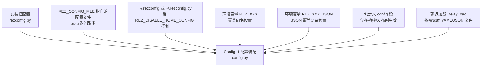
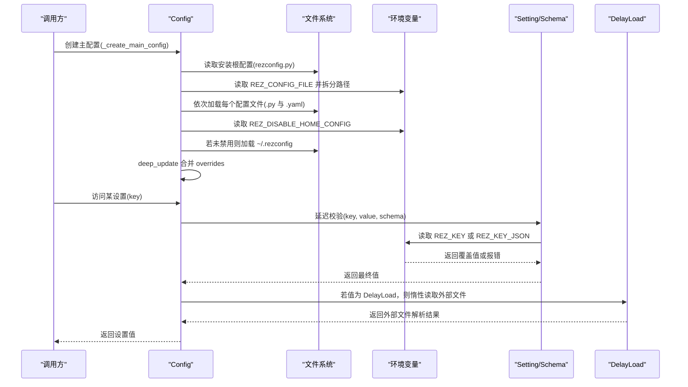
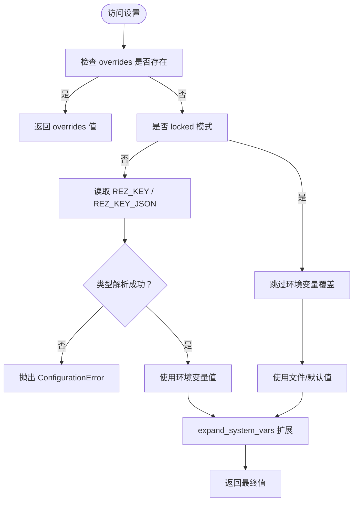
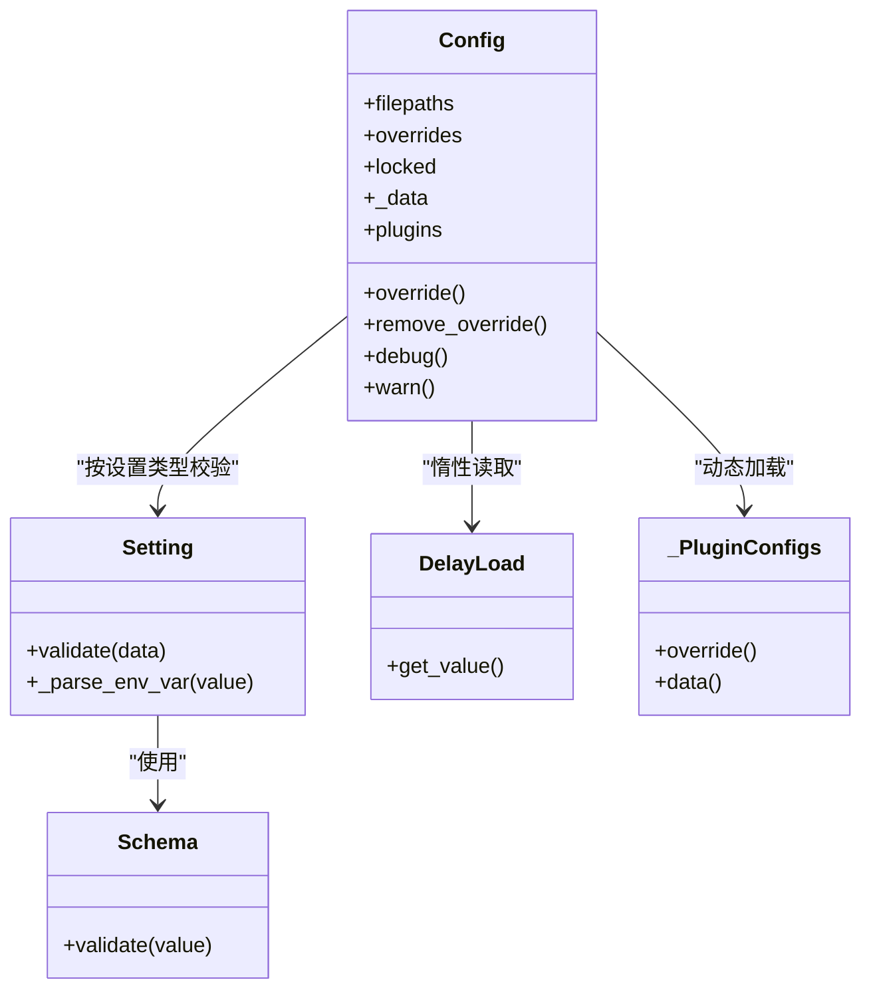

# 配置加载与优先级

<cite>
**本文引用的文件列表**
- [rezconfig.py](file://rez-3.3.0/src/rez/rezconfig.py)
- [config.py](file://rez-3.3.0/src/rez/config.py)
- [data_utils.py](file://rez-3.3.0/src/rez/utils/data_utils.py)
- [environment.rst](file://rez-3.3.0/docs/source/environment.rst)
- [configuring_rez.rst](file://rez-3.3.0/docs/source/configuring_rez.rst)
- [test_config.py](file://rez-3.3.0/src/rez/tests/test_config.py)
</cite>

## 目录
1. [简介](#简介)
2. [项目结构与定位](#项目结构与定位)
3. [核心组件与职责](#核心组件与职责)
4. [架构总览](#架构总览)
5. [详细组件分析](#详细组件分析)
6. [依赖关系分析](#依赖关系分析)
7. [性能与可维护性考量](#性能与可维护性考量)
8. [故障排查与调试策略](#故障排查与调试策略)
9. [结论](#结论)

## 简介
本文件围绕 Rez 的配置加载与优先级展开，系统阐述默认配置、外部配置文件、用户主目录配置、环境变量与 JSON 覆盖、以及构建/发布时的包定义覆盖等机制。重点解释 Config 类如何通过延迟加载（DelayLoad）与缓存属性（cached_property）实现高效、可扩展的配置合并，并给出调试配置问题的策略与最佳实践。

## 项目结构与定位
- 默认配置：位于安装根目录的 rezconfig.py，定义所有可用设置的默认值与文档化注释。
- 运行时配置装配：由 config.py 中的 Config 类负责，按固定优先级顺序合并多源配置。
- 延迟加载：通过 data_utils.py 提供的 DelayLoad，将大型或不常用配置延后到首次访问时才加载。
- 文档与测试：docs/source 下的配置文档与 tests/test_config.py 提供行为验证与用例参考。

图表来源
- [config.py](file://rez-3.3.0/src/rez/config.py#L753-L768)
- [config.py](file://rez-3.3.0/src/rez/config.py#L944-L1031)
- [data_utils.py](file://rez-3.3.0/src/rez/utils/data_utils.py#L40-L90)
- [rezconfig.py](file://rez-3.3.0/src/rez/rezconfig.py#L5-L29)

章节来源
- [configuring_rez.rst](file://rez-3.3.0/docs/source/configuring_rez.rst#L1-L28)
- [environment.rst](file://rez-3.3.0/docs/source/environment.rst#L206-L234)

## 核心组件与职责
- Config：配置装配与访问入口，负责按优先级合并数据、应用覆盖、延迟校验与缓存。
- Setting/Schema：对每个设置进行类型校验、环境变量解析与系统变量扩展。
- DelayLoad：延迟加载外部 YAML/JSON 文件，避免不必要的 IO。
- _load_config_from_filepaths：按扩展名顺序尝试加载 .py 与 .yaml/.yml，逐个文件深合并。
- _create_main_config：组装主配置文件路径序列（默认根配置 + 可选 REZ_CONFIG_FILE + 可选 ~/.rezconfig）。

章节来源
- [config.py](file://rez-3.3.0/src/rez/config.py#L540-L775)
- [config.py](file://rez-3.3.0/src/rez/config.py#L753-L768)
- [config.py](file://rez-3.3.0/src/rez/config.py#L944-L1031)
- [data_utils.py](file://rez-3.3.0/src/rez/utils/data_utils.py#L40-L90)

## 架构总览
下图展示了配置加载的总体流程与优先级顺序，以及各组件之间的交互。

图表来源
- [config.py](file://rez-3.3.0/src/rez/config.py#L753-L768)
- [config.py](file://rez-3.3.0/src/rez/config.py#L944-L1031)
- [config.py](file://rez-3.3.0/src/rez/config.py#L540-L775)
- [data_utils.py](file://rez-3.3.0/src/rez/utils/data_utils.py#L40-L90)

## 详细组件分析

### 配置优先级与加载顺序
- 优先级从低到高：
  1) 安装根配置（默认值）
  2) REZ_CONFIG_FILE 指向的一个或多个配置文件（按顺序深合并）
  3) 用户主目录配置（除非 REZ_DISABLE_HOME_CONFIG=1）
  4) 环境变量 REZ_XXX（键名大写，列表/字典有特定格式）
  5) 环境变量 REZ_XXX_JSON（JSON 字符串）
  6) 包定义中的 config 段（仅在构建/发布时覆盖其他设置）
- 插件设置（plugins.*）不参与 REZ_XXX/REZ_XXX_JSON 的覆盖。

章节来源
- [rezconfig.py](file://rez-3.3.0/src/rez/rezconfig.py#L5-L29)
- [environment.rst](file://rez-3.3.0/docs/source/environment.rst#L206-L234)
- [configuring_rez.rst](file://rez-3.3.0/docs/source/configuring_rez.rst#L1-L28)

### Config 初始化与装配流程
- 主配置装配：_create_main_config 会按顺序收集文件路径，然后交由 _load_config_from_filepaths 加载并深合并。
- 文件加载顺序：先尝试 .py，再尝试 .yaml/.yml；若某路径不存在对应扩展名文件则跳过。
- 深合并：使用 deep_update 将后续文件的设置递归合并到已有数据上，支持 ModifyList 的追加/前置。
- overrides：在最终数据上再次深合并 overrides，确保 API 层面的覆盖优先于文件与环境变量。

章节来源
- [config.py](file://rez-3.3.0/src/rez/config.py#L753-L768)
- [config.py](file://rez-3.3.0/src/rez/config.py#L994-L1031)
- [data_utils.py](file://rez-3.3.0/src/rez/utils/data_utils.py#L98-L135)

### Setting/Schema 与环境变量覆盖机制
- Setting 抽象：为每种设置类型提供解析器（如字符串、整数、布尔、列表、字典、路径列表），并在非锁定模式下读取 REZ_XXX/REZ_XXX_JSON。
- Schema 校验：在 Setting.validate 中执行 schema 校验与 expand_system_vars 扩展。
- 错误处理：当环境变量值不符合类型要求时抛出 ConfigurationError；JSON 解析失败也抛出相应错误。
- 覆盖优先级：overrides 优先于 Setting 解析结果；locked 模式下忽略环境变量覆盖。

章节来源
- [config.py](file://rez-3.3.0/src/rez/config.py#L51-L135)
- [config.py](file://rez-3.3.0/src/rez/config.py#L727-L737)

### 延迟加载与配置合并（DelayLoad 与 cached_property）
- DelayLoad：当设置值为 DelayLoad 实例时，在首次访问该设置时才读取外部 YAML/JSON 文件，支持错误提示与格式校验。
- cached_property：Config 的关键属性（如 _data、plugins）采用缓存属性，避免重复计算；当 overrides 或缓存失效时，通过 _uncache 清理缓存。
- deep_update：在 overrides 与文件数据之间进行深合并，支持 ModifyList 的追加/前置语义。

图表来源
- [config.py](file://rez-3.3.0/src/rez/config.py#L51-L135)
- [config.py](file://rez-3.3.0/src/rez/config.py#L727-L737)
- [data_utils.py](file://rez-3.3.0/src/rez/utils/data_utils.py#L40-L90)

章节来源
- [config.py](file://rez-3.3.0/src/rez/config.py#L704-L720)
- [config.py](file://rez-3.3.0/src/rez/config.py#L738-L751)
- [data_utils.py](file://rez-3.3.0/src/rez/utils/data_utils.py#L98-L135)

### 包定义 config 段覆盖（构建/发布时）
- 在包定义文件中添加 config 段时，其设置会在构建/发布阶段覆盖所有其他来源（包括环境变量与主配置），但不会影响运行时环境。
- 测试用例验证了包定义覆盖对普通设置与插件设置的影响，以及系统变量与环境变量扩展在包定义覆盖中的生效。

章节来源
- [test_config.py](file://rez-3.3.0/src/rez/tests/test_config.py#L143-L174)

## 依赖关系分析
- Config 依赖 Setting/Schema 对设置进行类型校验与系统变量扩展。
- _load_config_from_filepaths 依赖 _load_config_py/_load_config_yaml 读取不同格式配置。
- DelayLoad 依赖外部文件（YAML/JSON）与异常处理。
- 插件配置通过 _PluginConfigs 动态加载，遵循与主配置相同的深合并与校验流程。

图表来源
- [config.py](file://rez-3.3.0/src/rez/config.py#L51-L135)
- [config.py](file://rez-3.3.0/src/rez/config.py#L540-L775)
- [config.py](file://rez-3.3.0/src/rez/config.py#L807-L891)
- [data_utils.py](file://rez-3.3.0/src/rez/utils/data_utils.py#L40-L90)

章节来源
- [config.py](file://rez-3.3.0/src/rez/config.py#L540-L891)
- [data_utils.py](file://rez-3.3.0/src/rez/utils/data_utils.py#L1-L135)

## 性能与可维护性考量
- 缓存策略：cached_property 减少重复计算；LRU 缓存用于文件加载（_load_config_py/_load_config_yaml）。
- 惰性加载：DelayLoad 仅在访问时读取外部文件，降低启动开销。
- 深合并与 ModifyList：支持增量修改列表型设置，避免覆盖全量列表。
- 可扩展性：Setting 子类体系便于新增设置类型与解析逻辑；Schema 统一校验入口。

章节来源
- [config.py](file://rez-3.3.0/src/rez/config.py#L704-L720)
- [config.py](file://rez-3.3.0/src/rez/config.py#L944-L1031)
- [data_utils.py](file://rez-3.3.0/src/rez/utils/data_utils.py#L98-L135)

## 故障排查与调试策略
- 常见错误与定位
  - 配置文件格式错误：YAML/JSON 解析失败会抛出 ConfigurationError，检查文件格式与编码。
  - 环境变量类型不匹配：REZ_XXX/REZ_XXX_JSON 值不符合预期类型时抛出错误，核对类型与格式。
  - 设置缺失：Schema 校验失败会抛出错误，确认键名大小写与拼写。
- 调试开关
  - debug_* 与 warn_* 设置：通过配置启用更详细的调试输出与警告。
  - debug_printer：根据键生成合适的调试打印器，便于在代码中输出调试信息。
- 排查步骤建议
  - 使用命令行工具查看当前生效配置，确认优先级链路是否符合预期。
  - 临时禁用 ~/.rezconfig：设置 REZ_DISABLE_HOME_CONFIG=1，排除用户主目录配置干扰。
  - 临时移除 REZ_CONFIG_FILE：确认仅使用安装根配置时的行为。
  - 逐步清理环境变量覆盖：逐一移除 REZ_XXX/REZ_XXX_JSON，定位具体覆盖来源。
  - 查看 sourced_filepaths：确认哪些文件被实际加载。

章节来源
- [config.py](file://rez-3.3.0/src/rez/config.py#L612-L630)
- [config.py](file://rez-3.3.0/src/rez/config.py#L631-L646)
- [environment.rst](file://rez-3.3.0/docs/source/environment.rst#L206-L234)
- [test_config.py](file://rez-3.3.0/src/rez/tests/test_config.py#L1-L200)

## 结论
Rez 的配置系统通过“安装根配置 + 外部配置文件 + 用户主目录 + 环境变量 + 包定义覆盖”的多层优先级，实现了灵活且可控的配置装配。Config 类借助 Setting/Schema、DelayLoad、cached_property 与 deep_update，既保证了类型安全与性能，又提供了强大的扩展能力。理解并正确运用这些机制，能够有效提升配置管理的可维护性与可调试性。