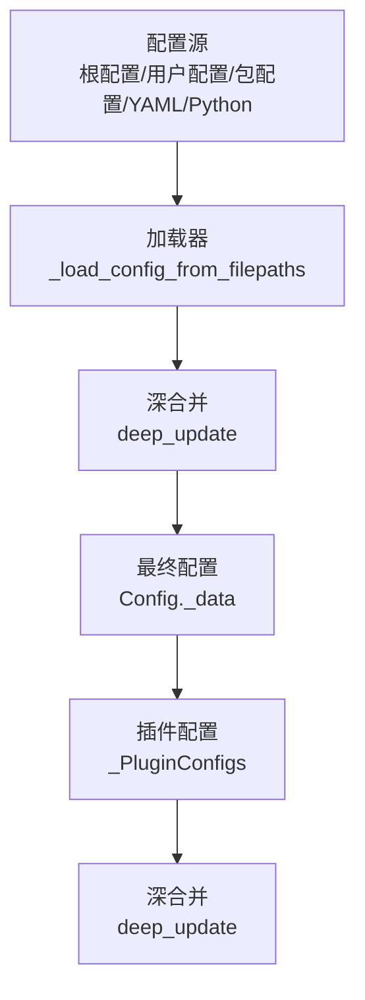
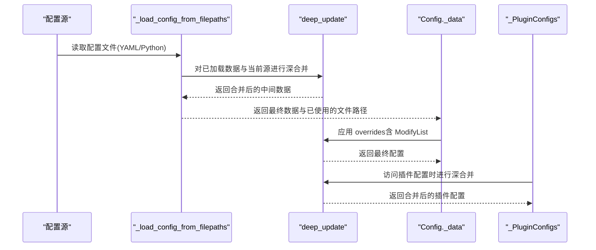
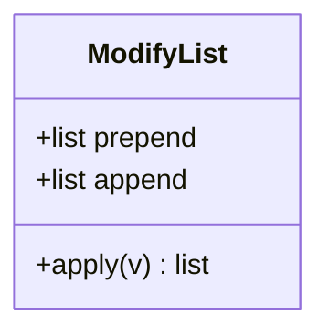
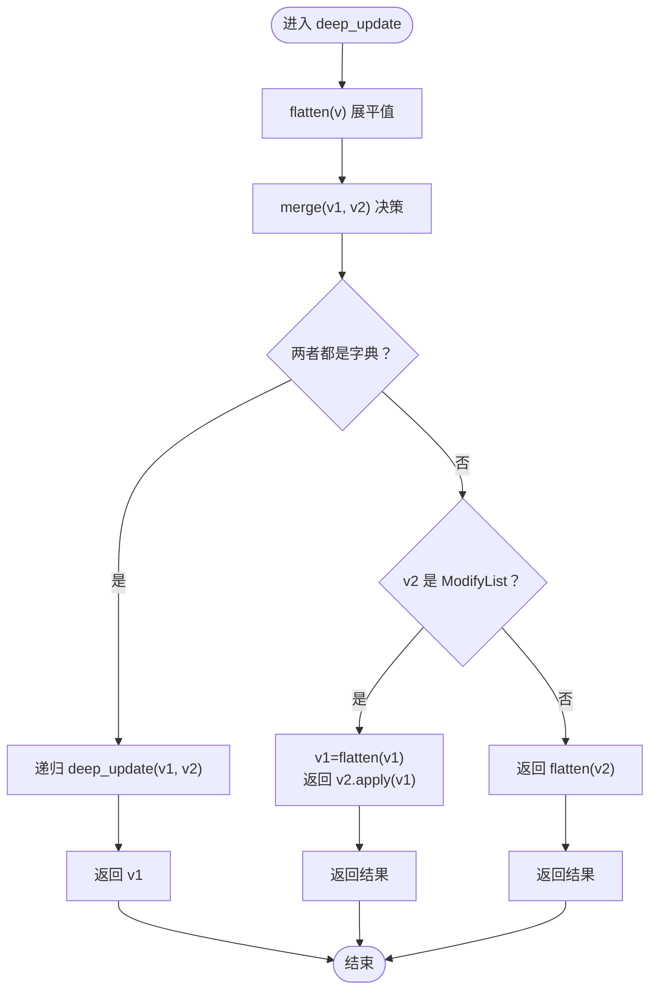
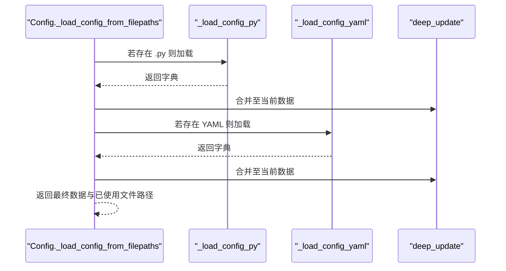
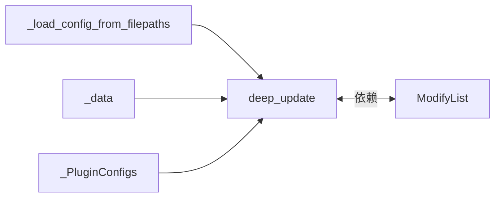

# 配置合并规则

<cite>
**本文引用的文件**
- [data_utils.py](file://rez-3.3.0/src/rez/utils/data_utils.py)
- [config.py](file://rez-3.3.0/src/rez/config.py)
- [configuring_rez.rst](file://rez-3.3.0/docs/source/configuring_rez.rst)
- [package.py](file://rez-3.3.0/src/rez/data/tests/config/package.py)
- [test1.yaml](file://rez-3.3.0/src/rez/data/tests/config/test1.yaml)
- [test_config.py](file://rez-3.3.0/src/rez/tests/test_config.py)
</cite>

## 目录
1. [简介](#简介)
2. [项目结构与定位](#项目结构与定位)
3. [核心组件](#核心组件)
4. [架构总览](#架构总览)
5. [详细组件分析](#详细组件分析)
6. [依赖关系分析](#依赖关系分析)
7. [性能考量](#性能考量)
8. [故障排查指南](#故障排查指南)
9. [结论](#结论)
10. [附录：边界情况与最佳实践](#附录边界情况与最佳实践)

## 简介
本文件系统化阐述 Rez 配置合并规则，聚焦于不同配置源的合并策略、标量值覆盖规则、列表值的智能合并（含 ModifyList 的追加与前置操作）、嵌套字典的深度合并，以及 _config_merge（通过 deep_update 实现）在多源配置加载时的调用流程。文档同时结合 configuring_rez.rst 中的官方规则说明，并给出面向高级用户的自定义合并逻辑指导与最佳实践。

## 项目结构与定位
- 配置合并的核心实现位于工具模块中：
  - ModifyList 类：用于声明式地对列表进行追加或前置。
  - deep_update 函数：实现字典的深度合并，支持 ModifyList 的应用。
- 配置装配与加载位于配置模块：
  - Config._load_config_from_filepaths：按顺序从多个来源加载配置并逐个合并。
  - Config._data：在基础数据上叠加 overrides，确保 ModifyList 被正确展开。
  - 插件配置的动态加载与合并：_PluginConfigs 在访问插件配置时进行 deep_update 合并。

图表来源
- [config.py](file://rez-3.3.0/src/rez/config.py#L994-L1031)
- [data_utils.py](file://rez-3.3.0/src/rez/utils/data_utils.py#L98-L135)

章节来源
- [config.py](file://rez-3.3.0/src/rez/config.py#L994-L1031)
- [data_utils.py](file://rez-3.3.0/src/rez/utils/data_utils.py#L98-L135)

## 核心组件
- ModifyList：声明式列表修改器，支持 append 与 prepend，内部通过 apply 将其应用于现有列表，实现“追加”和“前置”的语义。
- deep_update：深度合并函数，支持 ModifyList 的应用；对字典执行递归合并，对非字典采用覆盖策略；对 ModifyList 则将其作用于目标列表。
- Config 加载链路：按顺序加载各配置源，逐个调用 deep_update 合并；在最终配置生成阶段再叠加 overrides，确保 ModifyList 展开。

章节来源
- [data_utils.py](file://rez-3.3.0/src/rez/utils/data_utils.py#L16-L38)
- [data_utils.py](file://rez-3.3.0/src/rez/utils/data_utils.py#L98-L135)
- [config.py](file://rez-3.3.0/src/rez/config.py#L740-L751)
- [config.py](file://rez-3.3.0/src/rez/config.py#L820-L844)
- [config.py](file://rez-3.3.0/src/rez/config.py#L994-L1031)

## 架构总览
下图展示了配置合并的端到端流程：从多源配置文件加载，到逐源深合并，再到最终配置对象的生成与插件配置的动态合并。

图表来源
- [config.py](file://rez-3.3.0/src/rez/config.py#L994-L1031)
- [config.py](file://rez-3.3.0/src/rez/config.py#L740-L751)
- [config.py](file://rez-3.3.0/src/rez/config.py#L820-L844)
- [data_utils.py](file://rez-3.3.0/src/rez/utils/data_utils.py#L98-L135)

## 详细组件分析

### ModifyList 类与列表合并语义
- 作用：在配置中以声明方式对列表进行追加（+=）与前置（+<），避免直接覆盖整个列表。
- 行为要点：
  - 构造参数 append 与 prepend 均需为列表类型，否则抛出错误。
  - apply(v) 将前置列表 + 原列表 + 追加列表拼接；若 v 为空则视为空列表；若 v 非列表则抛错。
- 使用场景：在包级配置或用户配置中，通过 ModifyList 对 release_hooks、插件 recipients 等列表进行增量扩展。

图表来源
- [data_utils.py](file://rez-3.3.0/src/rez/utils/data_utils.py#L16-L38)

章节来源
- [data_utils.py](file://rez-3.3.0/src/rez/utils/data_utils.py#L16-L38)

### deep_update 深合并算法
- 输入：两个字典 dict1 与 dict2。
- 输出：将 dict2 深度合并入 dict1，返回 dict1。
- 关键逻辑：
  - flatten：遇到 ModifyList 则调用其 apply([]) 展开；遇到字典则递归 flatten；其他类型保持不变。
  - merge：若两者皆为字典，则递归 deep_update；若后者为 ModifyList，则先将前者 flatten，再用 ModifyList.apply；否则仅 flatten 后者。
  - 遍历 dict1 与 dict2 的键，按上述规则合并。
- 复杂度：时间复杂度 O(N)，N 为键值对总数；空间复杂度与嵌套深度相关。

图表来源
- [data_utils.py](file://rez-3.3.0/src/rez/utils/data_utils.py#L98-L135)

章节来源
- [data_utils.py](file://rez-3.3.0/src/rez/utils/data_utils.py#L98-L135)

### 配置加载与合并流程（Config）
- 多源加载：按顺序遍历文件路径，尝试 .py 与 YAML 加载器，逐个调用 deep_update 合并。
- 最终配置：在基础数据上叠加 overrides，确保 ModifyList 被正确展开。
- 插件配置：访问插件配置时，先深拷贝插件默认配置，再与当前源的插件配置进行 deep_update 合并。

图表来源
- [config.py](file://rez-3.3.0/src/rez/config.py#L994-L1031)

章节来源
- [config.py](file://rez-3.3.0/src/rez/config.py#L740-L751)
- [config.py](file://rez-3.3.0/src/rez/config.py#L820-L844)
- [config.py](file://rez-3.3.0/src/rez/config.py#L994-L1031)

### 官方规则与示例对照
- 官方规则要点：
  - 字典递归合并；非字典覆盖前值。
  - 可通过 ModifyList 对列表进行追加或前置。
- 测试与示例：
  - 包配置中使用 ModifyList 追加 release_hooks。
  - 包配置中对插件 emailer.recipients 使用 ModifyList 追加。
  - 用户 YAML 配置对插件设置进行覆盖。

章节来源
- [configuring_rez.rst](file://rez-3.3.0/docs/source/configuring_rez.rst#L24-L62)
- [package.py](file://rez-3.3.0/src/rez/data/tests/config/package.py#L21-L38)
- [test1.yaml](file://rez-3.3.0/src/rez/data/tests/config/test1.yaml#L1-L9)
- [test_config.py](file://rez-3.3.0/src/rez/tests/test_config.py#L143-L174)

## 依赖关系分析
- data_utils.deep_update 依赖 ModifyList.apply。
- config.Config._load_config_from_filepaths 依赖 data_utils.deep_update。
- config.Config._data 依赖 data_utils.deep_update。
- config._PluginConfigs 在访问插件配置时依赖 data_utils.deep_update。

图表来源
- [data_utils.py](file://rez-3.3.0/src/rez/utils/data_utils.py#L98-L135)
- [config.py](file://rez-3.3.0/src/rez/config.py#L740-L751)
- [config.py](file://rez-3.3.0/src/rez/config.py#L994-L1031)
- [config.py](file://rez-3.3.0/src/rez/config.py#L820-L844)

章节来源
- [data_utils.py](file://rez-3.3.0/src/rez/utils/data_utils.py#L98-L135)
- [config.py](file://rez-3.3.0/src/rez/config.py#L740-L751)
- [config.py](file://rez-3.3.0/src/rez/config.py#L820-L844)
- [config.py](file://rez-3.3.0/src/rez/config.py#L994-L1031)

## 性能考量
- deep_update 时间复杂度近似 O(N)，N 为键值对数量；空间复杂度与嵌套深度成正比。
- 列表合并通过 ModifyList.apply 执行线性拼接，整体仍为线性复杂度。
- 插件配置的动态加载与合并发生在首次访问时，具备惰性特性，避免不必要的计算。

[本节为通用性能讨论，不直接分析具体文件]

## 故障排查指南
- ModifyList 参数类型错误：当 append 或 prepend 非列表时会抛出异常。请确认传入的是列表。
- 对非列表应用 ModifyList：apply 会对非列表值抛错。请确保目标配置项为列表。
- 配置覆盖顺序问题：后加载的配置源会覆盖先前值；如需列表增量，请使用 ModifyList。
- 插件配置合并失败：检查插件类型与键路径是否正确，确保 deep_update 合并成功。
- 字符串扩展与环境变量：确认字符串中的系统属性与环境变量扩展生效，避免因未展开导致的配置差异。

章节来源
- [data_utils.py](file://rez-3.3.0/src/rez/utils/data_utils.py#L22-L38)
- [config.py](file://rez-3.3.0/src/rez/config.py#L820-L844)
- [config.py](file://rez-3.3.0/src/rez/config.py#L994-L1031)

## 结论
Rez 的配置合并体系以 deep_update 为核心，结合 ModifyList 提供了灵活而可控的列表增量合并能力。通过多源配置的顺序加载与深度合并，既保证了默认行为的可预测性（字典递归、非字典覆盖），又允许高级用户以声明方式对列表进行追加与前置。插件配置的动态合并进一步完善了整体配置生态。遵循官方规则与本文提供的边界情况与最佳实践，可有效提升配置的可维护性与一致性。

[本节为总结性内容，不直接分析具体文件]

## 附录：边界情况与最佳实践

### 边界情况
- 空列表与 None：ModifyList.apply 对 None 视为空列表处理；对非列表值会抛错。
- 键不存在：deep_update 会在 dict2 中缺失键时保留 dict1 的对应值（flatten 后写回）。
- 嵌套字典与列表混合：deep_update 递归处理字典，列表由 ModifyList.apply 合并。
- 插件配置键路径：_PluginConfigs 在访问插件配置时，会按插件类型构建嵌套字典并进行 deep_update。

章节来源
- [data_utils.py](file://rez-3.3.0/src/rez/utils/data_utils.py#L98-L135)
- [data_utils.py](file://rez-3.3.0/src/rez/utils/data_utils.py#L16-L38)
- [config.py](file://rez-3.3.0/src/rez/config.py#L820-L844)

### 最佳实践
- 列表增量优先使用 ModifyList：避免直接覆盖整个列表，减少冲突与遗漏。
- 明确覆盖顺序：将全局默认放在前面，用户覆盖与包覆盖放在后面，必要时使用 ModifyList 进行增量。
- 插件配置分层管理：将插件通用配置与实例配置分离，利用 _PluginConfigs 的动态合并。
- 文档与示例对照：参考 configuring_rez.rst 的规则与测试用例，确保行为一致。

章节来源
- [configuring_rez.rst](file://rez-3.3.0/docs/source/configuring_rez.rst#L24-L62)
- [test_config.py](file://rez-3.3.0/src/rez/tests/test_config.py#L143-L174)
- [package.py](file://rez-3.3.0/src/rez/data/tests/config/package.py#L21-L38)
- [test1.yaml](file://rez-3.3.0/src/rez/data/tests/config/test1.yaml#L1-L9)