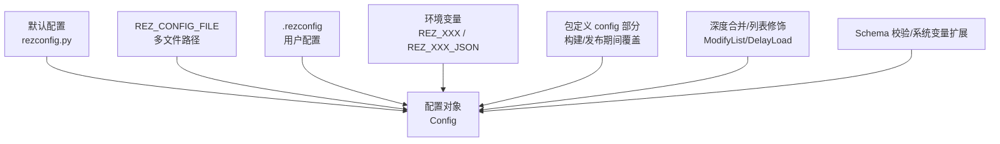
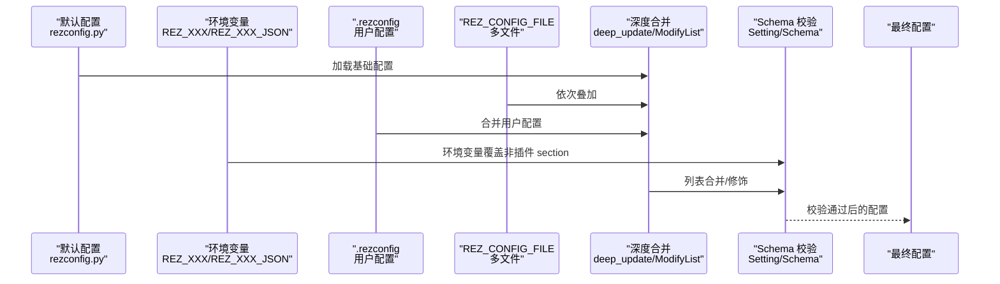
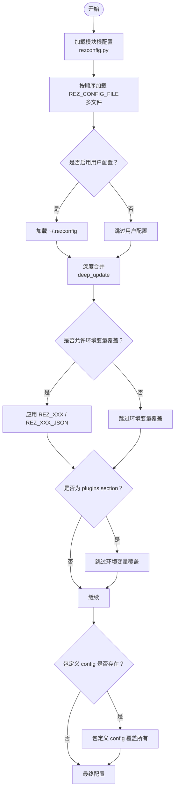
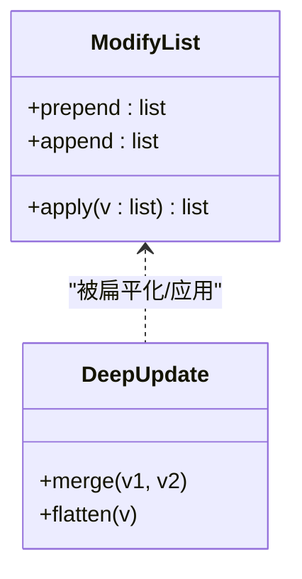
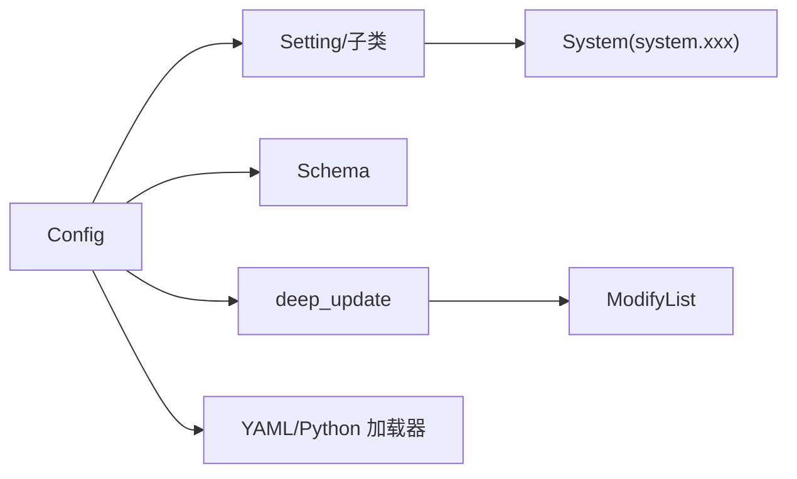

# 配置机制

<cite>
**本文引用的文件**
- [config.py](file://rez-3.3.0/src/rez/config.py)
- [rezconfig.py](file://rez-3.3.0/src/rez/rezconfig.py)
- [data_utils.py](file://rez-3.3.0/src/rez/utils/data_utils.py)
- [system.py](file://rez-3.3.0/src/rez/system.py)
- [test_config.py](file://rez-3.3.0/src/rez/tests/test_config.py)
- [package.py](file://rez-3.3.0/src/rez/data/tests/config/package.py)
- [configuring_rez.rst](file://rez-3.3.0/docs/source/guides/configuring_rez.rst)
</cite>

## 目录
1. [简介](#简介)
2. [项目结构](#项目结构)
3. [核心组件](#核心组件)
4. [架构总览](#架构总览)
5. [详细组件分析](#详细组件分析)
6. [依赖关系分析](#依赖关系分析)
7. [性能考量](#性能考量)
8. [故障排查指南](#故障排查指南)
9. [结论](#结论)
10. [附录](#附录)

## 简介
本文件系统化梳理 Rez 的配置机制，围绕“配置加载、合并与优先级”展开，重点覆盖：
- 配置来源与优先级：默认值、REZ_CONFIG_FILE 指向的配置文件、用户主目录下的 .rezconfig、环境变量 REZ_XXX 与 REZ_XXX_JSON、以及包定义文件中的 config 部分在构建/发布期间的特殊覆盖。
- 配置继承与动态加载：深度合并、ModifyList 列表追加/前置、DelayLoad 延迟加载。
- 配置验证流程：Schema 校验、系统变量扩展、环境变量扩展。
- 配置作用域：全局配置与包级配置的交互。
- 调试策略：如何定位配置加载问题。

## 项目结构
Rez 的配置核心位于以下模块：
- 配置加载与合并：config.py
- 默认配置与优先级说明：rezconfig.py
- 数据工具与合并算法：data_utils.py
- 系统信息与变量扩展：system.py
- 行为验证与用例：tests/test_config.py
- 包定义中的配置覆盖示例：data/tests/config/package.py
- 文档：docs/source/guides/configuring_rez.rst

图表来源
- [config.py](file://rez-3.3.0/src/rez/config.py#L754-L767)
- [rezconfig.py](file://rez-3.3.0/src/rez/rezconfig.py#L1-L45)
- [data_utils.py](file://rez-3.3.0/src/rez/utils/data_utils.py#L17-L38)
- [system.py](file://rez-3.3.0/src/rez/system.py#L16-L61)

章节来源
- [config.py](file://rez-3.3.0/src/rez/config.py#L754-L767)
- [rezconfig.py](file://rez-3.3.0/src/rez/rezconfig.py#L1-L45)

## 核心组件
- Config 类：负责配置加载、合并、校验与访问；支持 overrides、locked、延迟插件加载等。
- Setting/Setting 子类：对单个配置项进行类型解析与校验，支持环境变量覆盖与 JSON 覆盖。
- ModifyList：用于列表型配置的追加/前置，配合 deep_update 实现深度合并。
- DelayLoad：延迟从外部文件（yaml/json）加载配置值。
- Schema 校验：统一的键级校验与错误处理。
- 系统变量扩展：支持 {system.xxx} 变量替换。

章节来源
- [config.py](file://rez-3.3.0/src/rez/config.py#L51-L135)
- [config.py](file://rez-3.3.0/src/rez/config.py#L364-L513)
- [config.py](file://rez-3.3.0/src/rez/config.py#L727-L751)
- [data_utils.py](file://rez-3.3.0/src/rez/utils/data_utils.py#L17-L38)
- [data_utils.py](file://rez-3.3.0/src/rez/utils/data_utils.py#L98-L141)
- [system.py](file://rez-3.3.0/src/rez/system.py#L16-L61)

## 架构总览
Rez 配置加载与合并遵循如下流程：
1) 从模块根配置文件加载基础配置；
2) 若设置 REZ_CONFIG_FILE，则按 os.pathsep 分割的多个文件依次叠加；
3) 若未禁用用户配置，加载 ~/.rezconfig；
4) 应用环境变量 REZ_XXX 与 REZ_XXX_JSON（插件 section 不适用）；
5) 在包定义文件中，config 部分在构建/发布期间覆盖上述所有配置；
6) 对列表型配置使用 ModifyList 进行追加/前置；
7) 使用 Schema 校验与系统变量扩展完成最终配置。

图表来源
- [config.py](file://rez-3.3.0/src/rez/config.py#L754-L767)
- [config.py](file://rez-3.3.0/src/rez/config.py#L994-L1031)
- [config.py](file://rez-3.3.0/src/rez/config.py#L727-L751)
- [data_utils.py](file://rez-3.3.0/src/rez/utils/data_utils.py#L98-L141)
- [rezconfig.py](file://rez-3.3.0/src/rez/rezconfig.py#L1-L45)

## 详细组件分析

### 配置来源与优先级
- 默认值：来自模块根配置文件（rezconfig.py），作为最低优先级的基础配置。
- 多文件叠加：REZ_CONFIG_FILE 支持多个文件路径，按顺序叠加。
- 用户配置：~/.rezconfig（可通过 REZ_DISABLE_HOME_CONFIG 禁用）。
- 环境变量覆盖：REZ_XXX（字符串/整数/布尔等）与 REZ_XXX_JSON（JSON 字符串）。
- 插件 section 特例：环境变量覆盖不适用于 plugins。
- 包定义覆盖：在构建/发布期间，包定义文件中的 config 部分会覆盖前述所有配置。

章节来源
- [rezconfig.py](file://rez-3.3.0/src/rez/rezconfig.py#L1-L45)
- [config.py](file://rez-3.3.0/src/rez/config.py#L754-L767)
- [config.py](file://rez-3.3.0/src/rez/config.py#L80-L135)
- [test_config.py](file://rez-3.3.0/src/rez/tests/test_config.py#L143-L174)

### 配置加载与合并
- 文件加载：按扩展名优先尝试 .py，否则使用 YAML；仅选择存在的文件并记录已加载路径。
- 深度合并：使用 deep_update 将后加载的配置字典合并到前一个字典上；支持 ModifyList 的前置/追加。
- 动态加载：DelayLoad 支持从 .yaml/.yml 或 .json 延迟加载配置片段。

图表来源
- [config.py](file://rez-3.3.0/src/rez/config.py#L994-L1031)
- [config.py](file://rez-3.3.0/src/rez/config.py#L743-L751)
- [data_utils.py](file://rez-3.3.0/src/rez/utils/data_utils.py#L98-L141)
- [rezconfig.py](file://rez-3.3.0/src/rez/rezconfig.py#L1-L45)

章节来源
- [config.py](file://rez-3.3.0/src/rez/config.py#L994-L1031)
- [data_utils.py](file://rez-3.3.0/src/rez/utils/data_utils.py#L98-L141)

### 动态加载机制（DelayLoad）
- 用途：将配置值延迟从外部文件（yaml/yml/json）加载，避免在配置初始化时即刻读取。
- 支持格式：.yaml/.yml 与 .json；不支持的格式会报错。
- 触发时机：在 Setting.validate 中遇到 DelayLoad 时调用其 get_value 获取真实值。

章节来源
- [data_utils.py](file://rez-3.3.0/src/rez/utils/data_utils.py#L40-L91)
- [config.py](file://rez-3.3.0/src/rez/config.py#L727-L737)

### 列表配置的追加与前置（ModifyList）
- 语义：通过 ModifyList(prepend=[...], append=[...]) 对列表型配置进行前置与追加，而非直接覆盖。
- 合并与应用：deep_update 在遇到 ModifyList 时先将其扁平化为前置+原列表+追加，再与后续配置合并。
- 典型场景：release_hooks、parent_variables 等列表配置的增量修改。

图表来源
- [data_utils.py](file://rez-3.3.0/src/rez/utils/data_utils.py#L17-L38)
- [data_utils.py](file://rez-3.3.0/src/rez/utils/data_utils.py#L98-L141)

章节来源
- [data_utils.py](file://rez-3.3.0/src/rez/utils/data_utils.py#L17-L38)
- [data_utils.py](file://rez-3.3.0/src/rez/utils/data_utils.py#L98-L141)
- [test_config.py](file://rez-3.3.0/src/rez/tests/test_config.py#L143-L174)
- [package.py](file://rez-3.3.0/src/rez/data/tests/config/package.py#L13-L38)

### 环境变量覆盖与 JSON 覆盖
- REZ_XXX：根据 Setting 子类解析为对应类型（字符串、整数、浮点、布尔、字典、路径列表等）。
- REZ_XXX_JSON：以 JSON 字符串形式提供复杂结构或列表。
- 插件 section 特例：不适用上述两类覆盖。
- 系统变量扩展：Setting.validate 最终会将 {system.xxx} 扩展为系统属性值。

章节来源
- [config.py](file://rez-3.3.0/src/rez/config.py#L80-L135)
- [config.py](file://rez-3.3.0/src/rez/config.py#L727-L737)
- [system.py](file://rez-3.3.0/src/rez/system.py#L16-L61)
- [test_config.py](file://rez-3.3.0/src/rez/tests/test_config.py#L118-L174)

### 包定义文件中的 config 部分（构建/发布期间覆盖）
- 在包定义文件中使用 scope("config") 定义的配置项，会在构建/发布阶段覆盖全局配置。
- 示例：在 config 中设置 build_directory、parent_variables、release_hooks、plugins 等，并可使用 ModifyList 追加列表项。
- 环境变量 REZ_XXX 在此阶段不会覆盖包定义中的 config。

章节来源
- [test_config.py](file://rez-3.3.0/src/rez/tests/test_config.py#L143-L174)
- [package.py](file://rez-3.3.0/src/rez/data/tests/config/package.py#L13-L38)

### 配置验证流程
- 键级校验：Config.schema 为整体 Schema；每个键由对应的 Setting 子类进行类型解析与校验。
- 值级校验：Setting.validate 先走 Setting._validate（含环境变量/JSON覆盖逻辑），再通过 Schema 校验，最后进行系统变量扩展。
- 错误处理：SchemaError 统一包装为 ConfigurationError 抛出。

章节来源
- [config.py](file://rez-3.3.0/src/rez/config.py#L364-L513)
- [config.py](file://rez-3.3.0/src/rez/config.py#L727-L737)
- [test_config.py](file://rez-3.3.0/src/rez/tests/test_config.py#L175-L204)

### 配置作用域与继承
- 全局配置：由模块根配置、REZ_CONFIG_FILE、~/.rezconfig、环境变量共同决定。
- 包级配置：在构建/发布期间，包定义中的 config 部分覆盖全局配置，体现“包内优先”的作用域。
- 插件配置：plugins 下的键不受 REZ_XXX/REZ_XXX_JSON 覆盖，需通过文件或 overrides 设置。

章节来源
- [rezconfig.py](file://rez-3.3.0/src/rez/rezconfig.py#L1-L45)
- [config.py](file://rez-3.3.0/src/rez/config.py#L80-L135)
- [test_config.py](file://rez-3.3.0/src/rez/tests/test_config.py#L118-L174)

## 依赖关系分析
- Config 依赖 Setting/Setting 子类进行键级校验，依赖 Schema 进行值级校验。
- deep_update 依赖 ModifyList 实现列表合并。
- Setting.validate 依赖 system 对象进行 {system.xxx} 扩展。
- _load_config_from_filepaths 依赖 YAML/Python 加载器，按扩展名选择加载方式。

图表来源
- [config.py](file://rez-3.3.0/src/rez/config.py#L364-L513)
- [config.py](file://rez-3.3.0/src/rez/config.py#L727-L751)
- [data_utils.py](file://rez-3.3.0/src/rez/utils/data_utils.py#L98-L141)
- [system.py](file://rez-3.3.0/src/rez/system.py#L16-L61)

章节来源
- [config.py](file://rez-3.3.0/src/rez/config.py#L364-L513)
- [data_utils.py](file://rez-3.3.0/src/rez/utils/data_utils.py#L98-L141)

## 性能考量
- 缓存策略：Config 使用 cached_property 缓存 _data 与 plugins，减少重复计算与文件读取。
- 深度合并成本：deep_update 对嵌套字典递归合并，列表型配置通过 ModifyList 减少不必要的覆盖。
- 延迟加载：DelayLoad 将昂贵的外部文件读取推迟到真正需要时，降低启动开销。
- 环境变量覆盖：Setting._validate 在未锁定状态下才检查环境变量，避免不必要的 IO。

章节来源
- [config.py](file://rez-3.3.0/src/rez/config.py#L718-L751)
- [data_utils.py](file://rez-3.3.0/src/rez/utils/data_utils.py#L98-L141)
- [data_utils.py](file://rez-3.3.0/src/rez/utils/data_utils.py#L40-L91)

## 故障排查指南
- 验证配置：使用 Config.validate_data() 或在测试中通过抛出 ConfigurationError 定位问题。
- 环境变量覆盖无效：确认 Config.locked 是否为 False；确认未设置 REZ_DISABLE_HOME_CONFIG 导致用户配置未生效。
- 插件 section 不受 REZ_XXX 影响：这是设计特性，需通过文件或 overrides 设置。
- 包定义覆盖优先级：在构建/发布期间，包定义 config 会覆盖全局配置，若发现异常，检查包定义中的 config 部分。
- JSON 覆盖格式错误：REZ_XXX_JSON 必须为合法 JSON 字符串，否则会抛出 ConfigurationError。
- 列表合并不符合预期：确认使用 ModifyList(prepend/append) 而非直接覆盖；检查 deep_update 的合并顺序。

章节来源
- [test_config.py](file://rez-3.3.0/src/rez/tests/test_config.py#L175-L204)
- [test_config.py](file://rez-3.3.0/src/rez/tests/test_config.py#L203-L248)
- [test_config.py](file://rez-3.3.0/src/rez/tests/test_config.py#L287-L298)
- [config.py](file://rez-3.3.0/src/rez/config.py#L80-L135)

## 结论
Rez 的配置机制通过“文件叠加 + 环境变量 + 包定义覆盖”的多层优先级，结合 Schema 校验与系统变量扩展，实现了灵活且可控的配置体系。ModifyList 与 DelayLoad 提供了强大的列表修饰与延迟加载能力。理解并正确使用这些机制，有助于在不同环境下稳定地管理 Rez 的行为。

## 附录
- 配置合并规则（来自文档与代码注释）：
  - 默认配置（rezconfig.py）优先级最低；
  - REZ_CONFIG_FILE 指向的多个文件按顺序叠加；
  - ~/.rezconfig（可禁用）进一步叠加；
  - 环境变量 REZ_XXX/REZ_XXX_JSON 覆盖（插件 section 不适用）；
  - 包定义文件中的 config 部分在构建/发布期间覆盖所有前述配置；
  - 列表型配置使用 ModifyList 进行前置/追加，避免完全覆盖。

章节来源
- [rezconfig.py](file://rez-3.3.0/src/rez/rezconfig.py#L1-L45)
- [config.py](file://rez-3.3.0/src/rez/config.py#L754-L767)
- [config.py](file://rez-3.3.0/src/rez/config.py#L80-L135)
- [test_config.py](file://rez-3.3.0/src/rez/tests/test_config.py#L143-L174)