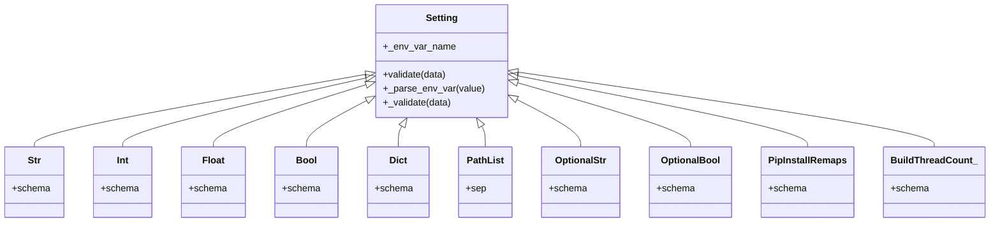

# 配置

<cite>
**本文引用的文件**
- [config.py](file://rez-3.3.0/src/rez/config.py)
- [rezconfig.py](file://rez-3.3.0/src/rez/rezconfig.py)
- [config.py（CLI）](file://rez-3.3.0/src/rez/cli/config.py)
- [test_config.py](file://rez-3.3.0/src/rez/tests/test_config.py)
- [pyvenv.cfg](file://pyvenv.cfg)
- [configuring_rez.rst](file://rez-3.3.0/docs/source/guides/configuring_rez.rst)
- [logging_.py](file://rez-3.3.0/src/rez/utils/logging_.py)
</cite>

## 目录
1. [简介](#简介)
2. [项目结构与入口](#项目结构与入口)
3. [核心组件](#核心组件)
4. [架构总览](#架构总览)
5. [详细组件分析](#详细组件分析)
6. [依赖关系分析](#依赖关系分析)
7. [性能考量](#性能考量)
8. [故障排查指南](#故障排查指南)
9. [结论](#结论)
10. [附录：配置项清单与最佳实践](#附录配置项清单与最佳实践)

## 简介
本篇文档系统化梳理 Rez 的配置体系，围绕以下目标展开：
- 解释如何通过 config.py 与 rezconfig.py 自定义 Rez 行为；
- 基于 configuring_rez.rst 文档化所有可用配置项；
- 说明配置优先级、继承与覆盖机制；
- 提供配置验证与调试技巧；
- 给出安全、性能与团队协作的最佳实践建议；
- 涵盖 Python 虚拟环境配置（pyvenv.cfg）在 Rez 场景下的注意事项。

## 项目结构与入口
- Rez 的主配置由模块根配置文件提供，用户可叠加本地配置与环境变量覆盖；
- CLI 提供查询当前生效配置的能力，便于调试与验证；
- 测试用例覆盖了优先级、覆盖、类型校验、插件配置等关键路径。

图表来源
- [config.py](file://rez-3.3.0/src/rez/config.py#L754-L768)
- [config.py](file://rez-3.3.0/src/rez/config.py#L80-L135)
- [config.py（CLI）](file://rez-3.3.0/src/rez/cli/config.py#L1-L66)

章节来源
- [config.py](file://rez-3.3.0/src/rez/config.py#L754-L768)
- [config.py（CLI）](file://rez-3.3.0/src/rez/cli/config.py#L1-L66)

## 核心组件
- Setting 与派生类：封装每项配置的解析、类型校验与默认值策略；
- Config：负责多源配置合并、覆盖、缓存与惰性加载插件配置；
- 插件配置容器：_PluginConfigs，按需加载并校验插件配置；
- 主配置装配：_create_main_config，确定配置文件搜索顺序与来源；
- CLI 配置查询：支持输出 JSON、列出搜索/已来源文件、按字段取值。

章节来源
- [config.py](file://rez-3.3.0/src/rez/config.py#L51-L135)
- [config.py](file://rez-3.3.0/src/rez/config.py#L549-L879)
- [config.py](file://rez-3.3.0/src/rez/config.py#L807-L879)
- [config.py（CLI）](file://rez-3.3.0/src/rez/cli/config.py#L1-L66)

## 架构总览
Rez 配置系统采用“多源合并 + 环境变量覆盖”的分层设计，确保灵活性与可控性。

图表来源
- [config.py](file://rez-3.3.0/src/rez/config.py#L754-L768)
- [config.py](file://rez-3.3.0/src/rez/config.py#L994-L1031)
- [config.py](file://rez-3.3.0/src/rez/config.py#L80-L135)
- [config.py（CLI）](file://rez-3.3.0/src/rez/cli/config.py#L1-L66)

## 详细组件分析

### Setting 与类型系统
- Setting 抽象：统一处理 overrides、环境变量、JSON 编码、默认值与系统变量扩展；
- 派生类型：字符串、整数、浮点、布尔、字典、路径列表、可选类型、线程数等；
- 环境变量解析：REZ_XXX 与 REZ_XXX_JSON，错误时抛出配置异常；
- 系统变量扩展：支持 {system.*} 与 ${ENV_VAR} 形式。

图表来源
- [config.py](file://rez-3.3.0/src/rez/config.py#L51-L135)
- [config.py](file://rez-3.3.0/src/rez/config.py#L137-L362)

章节来源
- [config.py](file://rez-3.3.0/src/rez/config.py#L51-L135)
- [config.py](file://rez-3.3.0/src/rez/config.py#L137-L362)

### Config：配置合并与覆盖
- 多源合并：模块根配置 + 可选的 REZ_CONFIG_FILE 列表 + 用户家目录配置；
- 覆盖顺序：overrides > 环境变量 > 文件配置 > 默认值；
- 惰性加载：插件配置延迟加载，避免不必要的开销；
- 动态默认值：部分设置根据平台/系统属性动态计算；
- 警告与调试开关：统一通过 warn()/debug() 控制。

图表来源
- [config.py](file://rez-3.3.0/src/rez/config.py#L549-L800)
- [config.py](file://rez-3.3.0/src/rez/config.py#L738-L751)
- [config.py](file://rez-3.3.0/src/rez/config.py#L80-L135)

章节来源
- [config.py](file://rez-3.3.0/src/rez/config.py#L549-L800)
- [config.py](file://rez-3.3.0/src/rez/config.py#L738-L751)

### 插件配置容器：_PluginConfigs
- 按需加载：访问 plugins.<type> 时才加载对应插件配置；
- 合并与校验：先取插件默认配置，再与用户配置合并并通过插件自身 Schema 校验；
- 只读约束：直接修改属性会抛出异常，保证配置一致性。

章节来源
- [config.py](file://rez-3.3.0/src/rez/config.py#L807-L879)

### 主配置装配：_create_main_config
- 搜索顺序：模块根配置 → REZ_CONFIG_FILE 列表 → 家目录配置（受 REZ_DISABLE_HOME_CONFIG 控制）；
- 作用：构建 Config 实例，作为后续 Setting.validate() 的输入源。

章节来源
- [config.py](file://rez-3.3.0/src/rez/config.py#L754-L768)

### CLI 配置查询：config 命令
- 支持输出 JSON（便于设置 REZ_XXX_JSON）；
- 支持列出搜索到的文件与实际来源文件；
- 支持按字段路径取值（如 plugins.release_hook.emailer.sender）。

章节来源
- [config.py（CLI）](file://rez-3.3.0/src/rez/cli/config.py#L1-L66)

## 依赖关系分析
- Setting 依赖 Schema 校验器与系统变量扩展；
- Config 依赖文件加载器（.py/.yaml）与环境变量；
- CLI 依赖 Config 单例与 YAML/JSON 序列化工具；
- 插件配置依赖插件管理器提供的 Schema 与默认配置。

图表来源
- [config.py](file://rez-3.3.0/src/rez/config.py#L51-L135)
- [config.py](file://rez-3.3.0/src/rez/config.py#L994-L1031)
- [config.py](file://rez-3.3.0/src/rez/config.py#L807-L879)
- [config.py（CLI）](file://rez-3.3.0/src/rez/cli/config.py#L1-L66)

## 性能考量
- 资源缓存上限：resource_caching_maxsize 控制包族/包/变体的本地缓存条目数量；
- 包缓存：read_package_cache/write_package_cache 控制是否复用本地缓存；
- 异步缓存：package_cache_async 在构建/上下文创建时异步写入；
- 空间阈值与缓冲：package_cache_used_threshold 与 package_cache_space_buffer 保护磁盘空间；
- 线程数：build_thread_count 支持物理/逻辑核心数自动推断；
- 解析缓存：resolve_caching、cache_package_files、cache_listdir 与 memcached 配置影响解析与 IO 性能。

章节来源
- [rezconfig.py](file://rez-3.3.0/src/rez/rezconfig.py#L144-L184)
- [rezconfig.py](file://rez-3.3.0/src/rez/rezconfig.py#L222-L328)
- [rezconfig.py](file://rez-3.3.0/src/rez/rezconfig.py#L767-L800)

## 故障排查指南
- 使用 CLI 查看来源文件与当前生效配置：
  - 列出搜索到的配置文件与实际来源文件；
  - 按字段路径取值，必要时以 JSON 输出以便设置 REZ_XXX_JSON；
- 验证与报错定位：
  - 类型不匹配或缺失键会触发配置异常；
  - 插件配置错误会在 _PluginConfigs 中被捕获并抛出带上下文的异常；
  - 环境变量覆盖不会生效时检查 locked 状态；
- 调试开关：
  - debug_* 与 warn_* 开关控制日志级别；
  - 可结合日志查看器查看日志文件。

章节来源
- [config.py（CLI）](file://rez-3.3.0/src/rez/cli/config.py#L1-L66)
- [test_config.py](file://rez-3.3.0/src/rez/tests/test_config.py#L175-L201)
- [config.py](file://rez-3.3.0/src/rez/config.py#L549-L630)
- [logging_.py](file://rez-3.3.0/src/rez/utils/logging_.py#L1-L129)

## 结论
Rez 的配置系统以 Setting/Config 为核心，通过“文件合并 + 环境变量覆盖 + 插件 Schema 校验”实现灵活且可控的行为定制。配合 CLI 查询与测试用例覆盖，能够高效地完成配置验证与问题定位。在团队协作中，建议统一基线配置、明确覆盖边界，并利用 JSON 环境变量进行跨环境传递。

## 附录：配置项清单与最佳实践

### 配置优先级与覆盖机制
- 优先级（从高到低）：
  1) 模块根配置（rezconfig.py）；
  2) REZ_CONFIG_FILE 指向的其他配置文件（可多文件，以路径分隔符分隔）；
  3) 用户家目录配置（~/.rezconfig，除非 REZ_DISABLE_HOME_CONFIG=1）；
  4) 环境变量 REZ_XXX（覆盖普通值）；
  5) 环境变量 REZ_XXX_JSON（覆盖 JSON 值）；
  6) 包定义中的 config 段（仅对包构建/发布时生效）。
- 特殊规则：
  - 插件配置（plugins.*）不受 REZ_XXX/REZ_XXX_JSON 覆盖；
  - overrides 参数始终优先于上述来源；
  - locked=True 时忽略环境变量覆盖。

章节来源
- [rezconfig.py](file://rez-3.3.0/src/rez/rezconfig.py#L5-L31)
- [config.py](file://rez-3.3.0/src/rez/config.py#L80-L135)
- [config.py](file://rez-3.3.0/src/rez/config.py#L549-L630)

### 关键配置项（节选）
- 路径与存储
  - packages_path、local_packages_path、release_packages_path、tmpdir、context_tmpdir、package_definition_build_python_paths、package_definition_python_path
- 插件与绑定
  - plugin_path、bind_module_path
- 缓存与包缓存
  - resolve_caching、cache_package_files、cache_listdir、resource_caching_maxsize、memcached_uri、memcached_*_min_compress_len
  - default_relocatable、default_relocatable_per_package、default_relocatable_per_repository
  - default_cachable、default_cachable_per_package、default_cachable_per_repository、cache_packages_path、read_package_cache、write_package_cache、package_cache_*、package_cache_async、package_cache_local、package_cache_same_device
- 包解析与过滤
  - implicit_packages、platform_map、prune_failed_graph、variant_select_mode、package_filter、package_orderers、allow_unversioned_packages、error_on_missing_variant_requires
- 环境与工具链
  - parent_variables、all_parent_variables、resetting_variables、all_resetting_variables、default_shell、terminal_emulator_command、new_session_popen_args、env_var_separators、pathed_env_vars、suite_visibility、rez_tools_visibility、package_commands_sourced_first、standard_system_paths
- 预处理与命令
  - package_preprocess_function、package_preprocess_mode
- 上下文追踪
  - context_tracking_host、context_tracking_amqp、context_tracking_context_fields、context_tracking_extra_fields
- 调试与警告
  - warn_shell_startup、warn_untimestamped、warn_all、warn_none、debug_file_loads、debug_plugins、debug_package_release、debug_bind_modules、debug_resources、debug_package_exclusions、debug_resolve_memcache、debug_memcache、debug_context_tracking、debug_all、debug_none、catch_rex_errors、shell_error_truncate_cap
- 构建与发布
  - build_directory、build_thread_count、release_hooks、prompt_release_message、make_package_temporarily_writable

章节来源
- [rezconfig.py](file://rez-3.3.0/src/rez/rezconfig.py#L57-L84)
- [rezconfig.py](file://rez-3.3.0/src/rez/rezconfig.py#L144-L184)
- [rezconfig.py](file://rez-3.3.0/src/rez/rezconfig.py#L190-L221)
- [rezconfig.py](file://rez-3.3.0/src/rez/rezconfig.py#L222-L328)
- [rezconfig.py](file://rez-3.3.0/src/rez/rezconfig.py#L333-L473)
- [rezconfig.py](file://rez-3.3.0/src/rez/rezconfig.py#L478-L570)
- [rezconfig.py](file://rez-3.3.0/src/rez/rezconfig.py#L570-L633)
- [rezconfig.py](file://rez-3.3.0/src/rez/rezconfig.py#L635-L696)
- [rezconfig.py](file://rez-3.3.0/src/rez/rezconfig.py#L698-L763)
- [rezconfig.py](file://rez-3.3.0/src/rez/rezconfig.py#L767-L800)

### Python 虚拟环境配置（pyvenv.cfg）
- pyvenv.cfg 描述虚拟环境的 home、是否包含系统站点包、版本等信息；
- Rez 安装脚本会创建独立的生产环境并在其中安装 Rez；
- 在 Rez 环境中，若需要使用特定 Python 解释器，可通过 venv 或 virtualenv 创建隔离环境，并在 Rez 中激活；
- 注意：pyvenv.cfg 不属于 Rez 配置文件，但会影响 Rez 的运行时 Python 解释器选择。

章节来源
- [pyvenv.cfg](file://pyvenv.cfg#L1-L4)
- [install.py](file://rez-3.3.0/install.py#L37-L94)

### 最佳实践
- 安全
  - 严格控制包仓库与插件来源，避免执行不可信代码；
  - 使用只读仓库或临时可写策略（make_package_temporarily_writable）；
  - 限制网络访问（memcached/amqp）仅在必要时启用。
- 性能
  - 启用资源缓存与包缓存，合理设置缓存上限与空间阈值；
  - 使用异步缓存减少阻塞；
  - 适当调整 build_thread_count 以匹配硬件能力。
- 团队协作
  - 将通用配置放入模块根配置，个人/项目差异通过 REZ_CONFIG_FILE 或家目录配置覆盖；
  - 使用 REZ_XXX_JSON 传递复杂结构（如 dict/list），避免手工拼接字符串；
  - 通过 CLI 验证配置生效，避免误配导致的解析失败。

章节来源
- [config.py（CLI）](file://rez-3.3.0/src/rez/cli/config.py#L1-L66)
- [test_config.py](file://rez-3.3.0/src/rez/tests/test_config.py#L250-L299)
- [rezconfig.py](file://rez-3.3.0/src/rez/rezconfig.py#L144-L184)
- [rezconfig.py](file://rez-3.3.0/src/rez/rezconfig.py#L222-L328)
- [rezconfig.py](file://rez-3.3.0/src/rez/rezconfig.py#L767-L800)