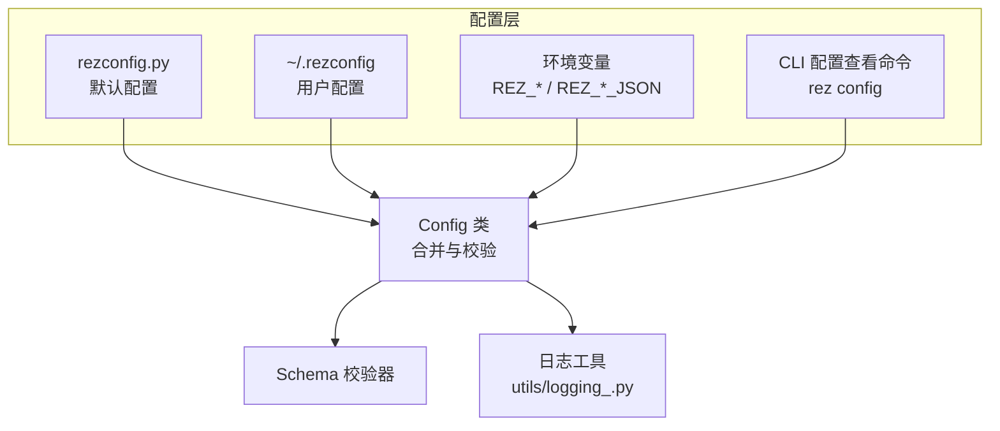
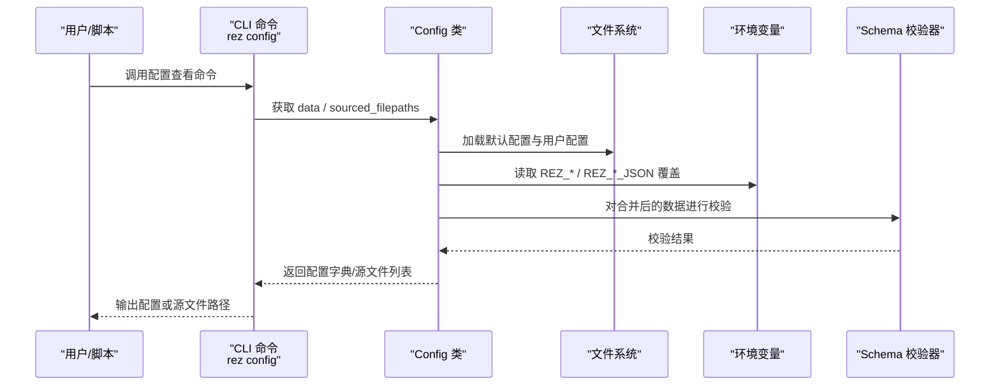
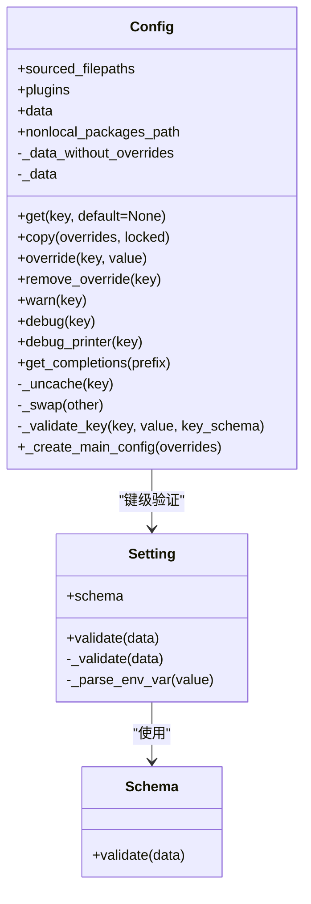
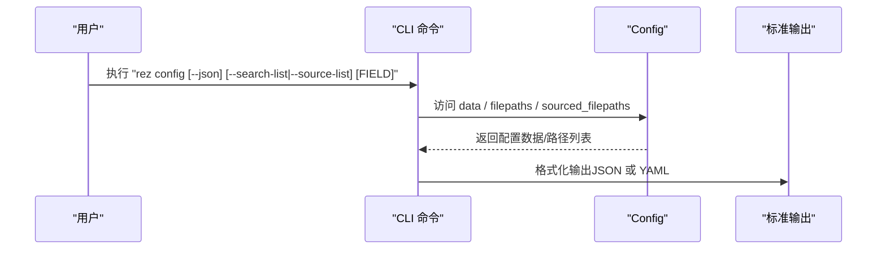
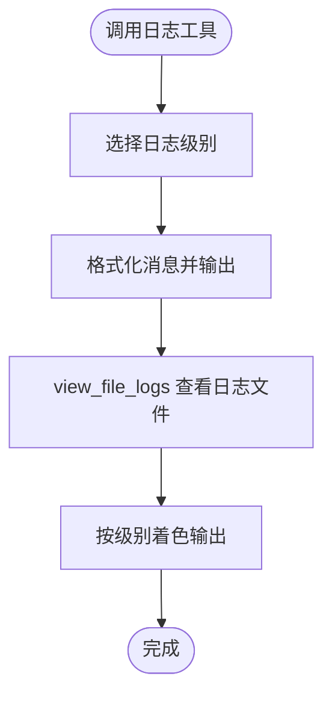
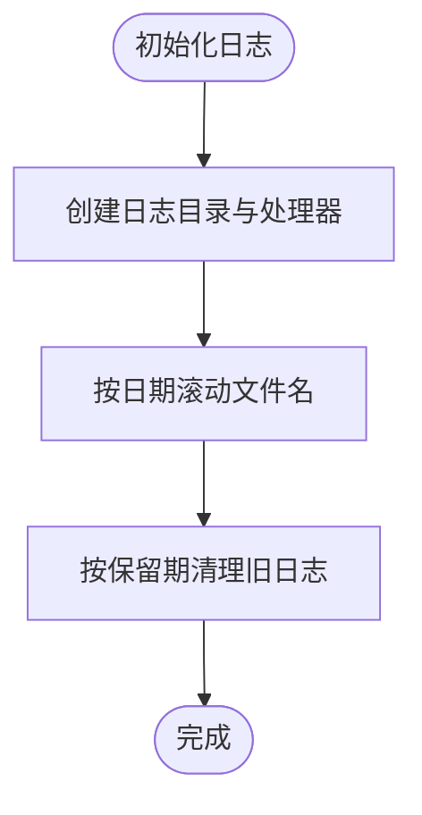
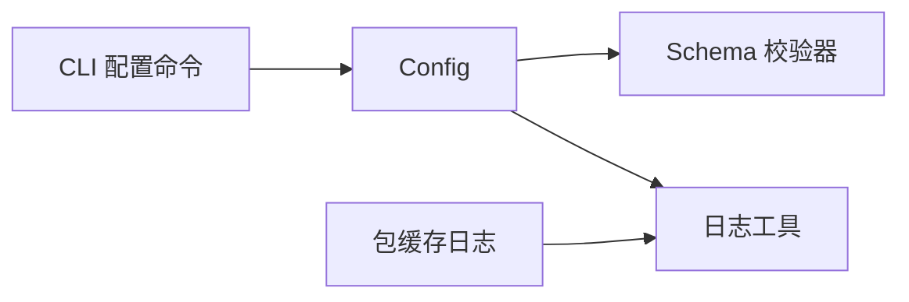

# 审计日志与变更追踪

<cite>
**本文引用的文件列表**
- [config.py](file://rez-3.3.0/src/rez/config.py)
- [cli/config.py](file://rez-3.3.0/src/rez/cli/config.py)
- [utils/logging_.py](file://rez-3.3.0/src/rez/utils/logging_.py)
- [package_cache.py](file://rez-3.3.0/src/rez/package_cache.py)
- [rezconfig.py](file://rez-3.3.0/src/rez/rezconfig.py)
- [SECURITY.md](file://rez-3.3.0/SECURITY.md)
</cite>

## 目录
1. [简介](#简介)
2. [项目结构](#项目结构)
3. [核心组件](#核心组件)
4. [架构总览](#架构总览)
5. [详细组件分析](#详细组件分析)
6. [依赖关系分析](#依赖关系分析)
7. [性能考量](#性能考量)
8. [故障排查指南](#故障排查指南)
9. [结论](#结论)
10. [附录](#附录)

## 简介
本文件围绕 Rez 的配置加载与解析流程，设计面向“配置变更”的审计日志机制，确保对配置读取、修改与应用过程具备可追溯性。重点覆盖以下方面：
- 日志条目关键字段：时间戳、操作用户、变更内容、源 IP 地址、变更前/后值、变更原因（可选）、影响范围等
- 与系统日志服务（如 syslog 或 Windows Event Log）的集成思路
- 日志文件保护策略：防篡改与防删除
- 异常变更告警规则建议：非工作时间变更、批量敏感项变更、权限提升类变更等
- 日志保留周期与合规性匹配方案

## 项目结构
Rez 的配置体系由多处配置文件合并而成，最终形成全局配置对象；CLI 提供查看当前配置的能力；底层日志工具提供通用打印与视图能力；包缓存模块展示了本地日志文件的组织与清理策略。

图表来源
- [config.py](file://rez-3.3.0/src/rez/config.py#L536-L1046)
- [cli/config.py](file://rez-3.3.0/src/rez/cli/config.py#L1-L66)
- [utils/logging_.py](file://rez-3.3.0/src/rez/utils/logging_.py#L1-L129)
- [rezconfig.py](file://rez-3.3.0/src/rez/rezconfig.py)

章节来源
- [config.py](file://rez-3.3.0/src/rez/config.py#L536-L1046)
- [cli/config.py](file://rez-3.3.0/src/rez/cli/config.py#L1-L66)

## 核心组件
- 配置加载与合并：Config 类负责从多个来源加载配置并进行深度合并与校验，支持环境变量覆盖、JSON 编码覆盖、动态默认值等。
- CLI 配置查看：通过命令行输出当前生效配置，便于审计与排障。
- 日志工具：提供统一的日志打印接口与日志文件查看工具，支持颜色化输出与按级别着色。
- 包缓存日志：展示本地日志目录结构与按天滚动、按保留期清理的策略，为审计日志落地提供参考。

章节来源
- [config.py](file://rez-3.3.0/src/rez/config.py#L536-L1046)
- [cli/config.py](file://rez-3.3.0/src/rez/cli/config.py#L1-L66)
- [utils/logging_.py](file://rez-3.3.0/src/rez/utils/logging_.py#L1-L129)
- [package_cache.py](file://rez-3.3.0/src/rez/package_cache.py#L930-L1008)

## 架构总览
Rez 配置加载的关键路径如下：
- 默认配置文件位于模块根目录
- 用户配置位于用户主目录
- 可通过环境变量覆盖特定键值
- 合并后经 Schema 校验，生成只读配置视图
- CLI 命令可输出当前生效配置，便于审计

图表来源
- [config.py](file://rez-3.3.0/src/rez/config.py#L536-L1046)
- [cli/config.py](file://rez-3.3.0/src/rez/cli/config.py#L1-L66)

## 详细组件分析

### 组件A：配置加载与解析（Config）
- 多源合并：默认配置 + 用户配置 + 环境变量覆盖
- 动态默认值：部分键在运行时根据平台等动态计算
- 深度更新：支持嵌套字典的递归合并
- 校验：使用 Schema 对键值进行类型与约束校验
- 只读访问：通过延迟属性与缓存机制保证一致性

图表来源
- [config.py](file://rez-3.3.0/src/rez/config.py#L536-L1046)

章节来源
- [config.py](file://rez-3.3.0/src/rez/config.py#L536-L1046)

### 组件B：CLI 配置查看（rez config）
- 支持输出当前生效配置、搜索配置文件列表、显示已来源文件列表
- 支持 JSON 输出，便于将复杂字段写入环境变量（REZ_*_JSON）

图表来源
- [cli/config.py](file://rez-3.3.0/src/rez/cli/config.py#L1-L66)
- [config.py](file://rez-3.3.0/src/rez/config.py#L536-L1046)

章节来源
- [cli/config.py](file://rez-3.3.0/src/rez/cli/config.py#L1-L66)
- [config.py](file://rez-3.3.0/src/rez/config.py#L536-L1046)

### 组件C：日志工具（utils/logging_.py）
- 提供统一的日志打印接口（debug/info/warning/error/critical）
- 提供日志文件查看工具，支持按级别颜色化输出
- 可作为审计日志的通用输出通道

图表来源
- [utils/logging_.py](file://rez-3.3.0/src/rez/utils/logging_.py#L1-L129)

章节来源
- [utils/logging_.py](file://rez-3.3.0/src/rez/utils/logging_.py#L1-L129)

### 组件D：包缓存日志（package_cache.py）
- 展示了本地日志目录结构（.sys/log），按日期滚动文件
- 展示了基于保留期的自动清理逻辑（按天）
- 可作为审计日志落盘与轮转的参考实现

图表来源
- [package_cache.py](file://rez-3.3.0/src/rez/package_cache.py#L930-L1008)

章节来源
- [package_cache.py](file://rez-3.3.0/src/rez/package_cache.py#L930-L1008)

## 依赖关系分析
- Config 依赖 Schema 校验器与 YAML 解析库，确保配置键值合法
- CLI 依赖 Config，用于输出当前配置状态
- 日志工具独立于配置层，但可被审计流程复用
- 包缓存模块展示了本地日志的组织方式，可借鉴到审计日志

图表来源
- [config.py](file://rez-3.3.0/src/rez/config.py#L536-L1046)
- [cli/config.py](file://rez-3.3.0/src/rez/cli/config.py#L1-L66)
- [utils/logging_.py](file://rez-3.3.0/src/rez/utils/logging_.py#L1-L129)
- [package_cache.py](file://rez-3.3.0/src/rez/package_cache.py#L930-L1008)

章节来源
- [config.py](file://rez-3.3.0/src/rez/config.py#L536-L1046)
- [cli/config.py](file://rez-3.3.0/src/rez/cli/config.py#L1-L66)
- [utils/logging_.py](file://rez-3.3.0/src/rez/utils/logging_.py#L1-L129)
- [package_cache.py](file://rez-3.3.0/src/rez/package_cache.py#L930-L1008)

## 性能考量
- 配置加载采用缓存与延迟属性，避免重复解析与校验
- CLI 输出支持 JSON，便于在自动化场景中处理复杂字段
- 日志文件按天滚动与清理，避免单文件过大导致 IO 压力

章节来源
- [config.py](file://rez-3.3.0/src/rez/config.py#L536-L1046)
- [utils/logging_.py](file://rez-3.3.0/src/rez/utils/logging_.py#L1-L129)
- [package_cache.py](file://rez-3.3.0/src/rez/package_cache.py#L930-L1008)

## 故障排查指南
- 使用 CLI 查看当前生效配置与已来源文件列表，定位配置冲突与覆盖来源
- 通过日志工具查看日志文件，结合级别颜色快速定位问题
- 若出现配置加载错误，检查 Schema 校验失败的具体键值与类型

章节来源
- [cli/config.py](file://rez-3.3.0/src/rez/cli/config.py#L1-L66)
- [utils/logging_.py](file://rez-3.3.0/src/rez/utils/logging_.py#L1-L129)
- [config.py](file://rez-3.3.0/src/rez/config.py#L536-L1046)

## 结论
Rez 的配置体系提供了完善的配置加载、合并与校验能力，CLI 与日志工具为审计与排障提供了基础支撑。基于现有组件，可扩展出面向“配置变更”的审计日志机制，覆盖变更读取、修改与应用全过程，并与系统日志服务对接，实现合规与安全要求。

## 附录

### 审计日志设计方案（面向 Rez 配置变更）
- 日志条目关键字段
  - 时间戳：精确到秒或毫秒
  - 操作用户：执行者身份（如用户名、进程属主）
  - 源 IP 地址：若通过远程接口触发，记录客户端 IP
  - 操作类型：读取、修改、应用
  - 变更内容：受影响的配置键、变更前值、变更后值、变更原因（可选）
  - 影响范围：影响的上下文（如全局、某插件类型、某用户）
  - 结果：成功/失败、错误信息
- 采集与存储
  - 本地文件：按日期滚动，按保留期清理
  - 远程集中：Syslog/Windows Event Log/Journalctl
- 保护策略
  - 文件权限最小化、只追加写入
  - 事件日志不可删除/覆盖（仅允许归档）
  - 传输加密与完整性校验（如哈希签名）
- 告警规则建议
  - 非工作时间变更
  - 批量敏感项变更（如路径、缓存、网络相关）
  - 权限提升类变更（如启用调试、禁用校验）
- 保留周期与合规
  - 依据法规与内部政策设定保留期（如 90/180/365 天）
  - 与审计周期对齐，定期归档与离线备份

章节来源
- [utils/logging_.py](file://rez-3.3.0/src/rez/utils/logging_.py#L1-L129)
- [package_cache.py](file://rez-3.3.0/src/rez/package_cache.py#L930-L1008)
- [SECURITY.md](file://rez-3.3.0/SECURITY.md#L1-L34)