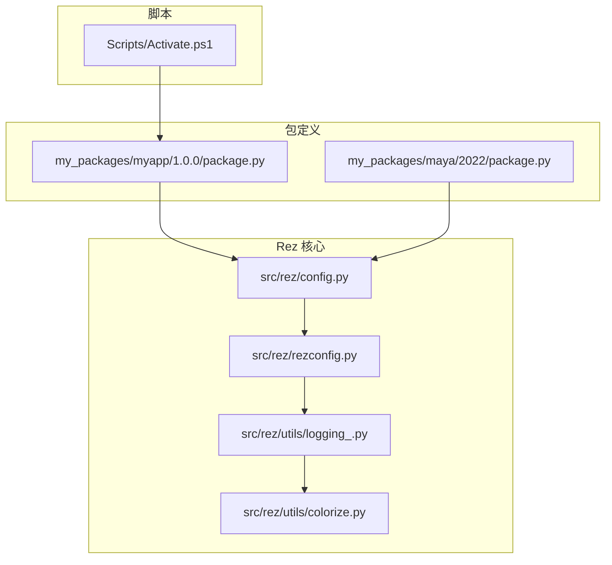
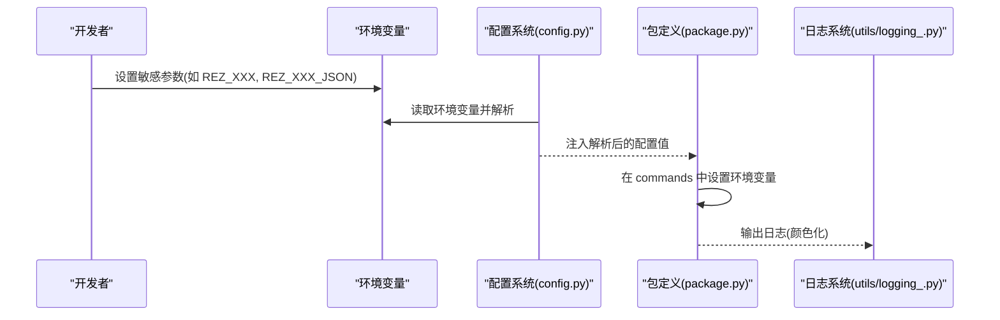
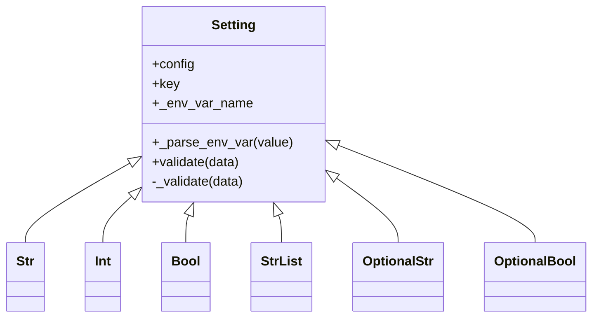
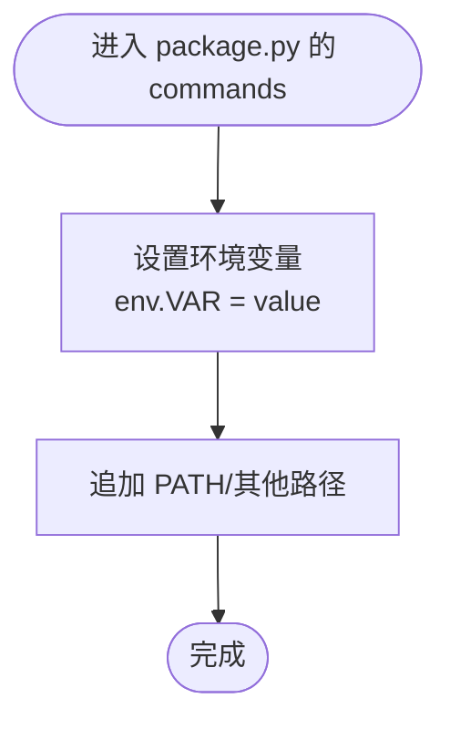
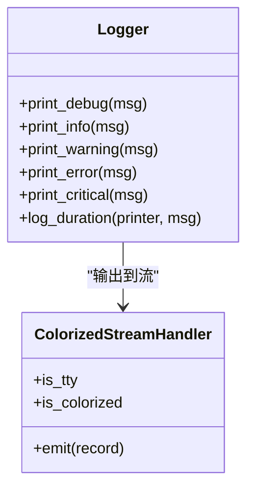

# 敏感数据保护

<cite>
**本文引用的文件**
- [my_packages/myapp/1.0.0/package.py](file://my_packages/myapp/1.0.0/package.py)
- [my_packages/maya/2022/package.py](file://my_packages/maya/2022/package.py)
- [rez-3.3.0/src/rez/config.py](file://rez-3.3.0/src/rez/config.py)
- [rez-3.3.0/src/rez/rezconfig.py](file://rez-3.3.0/src/rez/rezconfig.py)
- [rez-3.3.0/src/rez/utils/logging_.py](file://rez-3.3.0/src/rez/utils/logging_.py)
- [rez-3.3.0/src/rez/utils/colorize.py](file://rez-3.3.0/src/rez/utils/colorize.py)
- [Scripts/Activate.ps1](file://Scripts/Activate.ps1)
</cite>

## 目录
1. [简介](#简介)
2. [项目结构](#项目结构)
3. [核心组件](#核心组件)
4. [架构总览](#架构总览)
5. [详细组件分析](#详细组件分析)
6. [依赖关系分析](#依赖关系分析)
7. [性能考量](#性能考量)
8. [故障排查指南](#故障排查指南)
9. [结论](#结论)
10. [附录](#附录)

## 简介
本文件围绕 Rez 包定义与配置中的敏感数据保护展开，目标是帮助你在 package.py 中避免硬编码敏感信息（如密钥、密码、令牌等），通过环境变量注入机制与配置加载流程实现安全参数的动态获取；同时提供与外部密钥管理系统的集成思路（如 HashiCorp Vault 或 AWS KMS），并阐述配置解析过程中的加密传输与内存保护策略，以及防止配置信息泄露的日志脱敏方法。

## 项目结构
- 包定义位于 my_packages 下的各版本 package.py 文件，负责声明包名、版本、依赖、变体与运行时命令。
- Rez 核心配置与加载逻辑位于 rez-3.3.0/src/rez 下，包括配置类、设置解析、环境变量注入、日志与颜色化输出等。
- 脚本目录包含激活脚本，可能涉及敏感内容的注入与处理。

图表来源
- [my_packages/myapp/1.0.0/package.py](file://my_packages/myapp/1.0.0/package.py#L1-L33)
- [my_packages/maya/2022/package.py](file://my_packages/maya/2022/package.py#L1-L9)
- [rez-3.3.0/src/rez/config.py](file://rez-3.3.0/src/rez/config.py#L1-L200)
- [rez-3.3.0/src/rez/rezconfig.py](file://rez-3.3.0/src/rez/rezconfig.py#L1-L120)
- [rez-3.3.0/src/rez/utils/logging_.py](file://rez-3.3.0/src/rez/utils/logging_.py#L1-L129)
- [rez-3.3.0/src/rez/utils/colorize.py](file://rez-3.3.0/src/rez/utils/colorize.py#L247-L300)
- [Scripts/Activate.ps1](file://Scripts/Activate.ps1#L281-L415)

章节来源
- [my_packages/myapp/1.0.0/package.py](file://my_packages/myapp/1.0.0/package.py#L1-L33)
- [my_packages/maya/2022/package.py](file://my_packages/maya/2022/package.py#L1-L9)
- [rez-3.3.0/src/rez/config.py](file://rez-3.3.0/src/rez/config.py#L1-L200)
- [rez-3.3.0/src/rez/rezconfig.py](file://rez-3.3.0/src/rez/rezconfig.py#L1-L120)
- [Scripts/Activate.ps1](file://Scripts/Activate.ps1#L281-L415)

## 核心组件
- 配置设置与环境变量注入：Setting 基类及其派生类型负责从环境变量读取配置值，支持 JSON 编码的复杂结构，优先级遵循“覆盖文件 → 主配置 → 环境变量 → 默认值”。
- 包定义命令：在 package.py 的 commands 函数中设置环境变量，避免直接写入敏感值到包定义文件。
- 日志与颜色化：日志输出由 utils/logging_.py 提供，颜色化由 utils/colorize.py 控制，便于在终端中区分日志级别。
- 激活脚本：Scripts/Activate.ps1 可能参与环境注入，需注意其中是否包含敏感内容。

章节来源
- [rez-3.3.0/src/rez/config.py](file://rez-3.3.0/src/rez/config.py#L51-L135)
- [rez-3.3.0/src/rez/rezconfig.py](file://rez-3.3.0/src/rez/rezconfig.py#L1-L120)
- [rez-3.3.0/src/rez/utils/logging_.py](file://rez-3.3.0/src/rez/utils/logging_.py#L1-L129)
- [rez-3.3.0/src/rez/utils/colorize.py](file://rez-3.3.0/src/rez/utils/colorize.py#L247-L300)
- [Scripts/Activate.ps1](file://Scripts/Activate.ps1#L281-L415)

## 架构总览
下图展示了 Rez 在配置加载与包定义阶段如何利用环境变量注入敏感参数，并在日志输出中进行颜色化控制。

图表来源
- [rez-3.3.0/src/rez/config.py](file://rez-3.3.0/src/rez/config.py#L80-L135)
- [rez-3.3.0/src/rez/rezconfig.py](file://rez-3.3.0/src/rez/rezconfig.py#L1-L120)
- [my_packages/myapp/1.0.0/package.py](file://my_packages/myapp/1.0.0/package.py#L16-L23)
- [rez-3.3.0/src/rez/utils/logging_.py](file://rez-3.3.0/src/rez/utils/logging_.py#L1-L129)

## 详细组件分析

### 组件A：配置加载与环境变量注入
- Setting 基类提供统一的解析流程：先检查 overrides，再读取环境变量 REZ_<KEY>，其次尝试 REZ_<KEY>_JSON，最后回退到默认值。
- 支持多种类型（字符串、整数、布尔、列表等），并在解析前进行系统变量扩展。
- 该机制为敏感参数的安全注入提供了基础：敏感值不进入包定义文件，而是通过环境变量传入。

图表来源
- [rez-3.3.0/src/rez/config.py](file://rez-3.3.0/src/rez/config.py#L51-L243)

章节来源
- [rez-3.3.0/src/rez/config.py](file://rez-3.3.0/src/rez/config.py#L51-L135)

### 组件B：包定义中的命令与环境变量
- 在 package.py 的 commands 函数中设置环境变量，避免在包定义中直接写入敏感值。
- 变体（variants）与工具（tools）等字段可用于描述包的变体与工具入口，不承载敏感信息。

图表来源
- [my_packages/myapp/1.0.0/package.py](file://my_packages/myapp/1.0.0/package.py#L16-L23)

章节来源
- [my_packages/myapp/1.0.0/package.py](file://my_packages/myapp/1.0.0/package.py#L16-L23)
- [my_packages/maya/2022/package.py](file://my_packages/maya/2022/package.py#L1-L9)

### 组件C：日志与颜色化输出
- 日志模块提供统一的打印接口，颜色化模块根据配置决定是否启用颜色输出。
- 在终端中区分日志级别有助于快速定位问题，但应避免在日志中输出敏感信息。

图表来源
- [rez-3.3.0/src/rez/utils/logging_.py](file://rez-3.3.0/src/rez/utils/logging_.py#L1-L129)
- [rez-3.3.0/src/rez/utils/colorize.py](file://rez-3.3.0/src/rez/utils/colorize.py#L247-L300)

章节来源
- [rez-3.3.0/src/rez/utils/logging_.py](file://rez-3.3.0/src/rez/utils/logging_.py#L1-L129)
- [rez-3.3.0/src/rez/utils/colorize.py](file://rez-3.3.0/src/rez/utils/colorize.py#L247-L300)

### 组件D：激活脚本与敏感内容
- 激活脚本可能参与环境注入，需确保其中不包含明文敏感信息；建议通过环境变量或外部密钥管理系统在运行时注入。

章节来源
- [Scripts/Activate.ps1](file://Scripts/Activate.ps1#L281-L415)

## 依赖关系分析
- 包定义依赖配置系统提供的环境变量注入能力，从而在不修改包定义文件的前提下传递敏感参数。
- 日志系统依赖颜色化模块，便于在终端中直观识别日志级别。
- Rez 配置文件对环境变量有明确的优先级规则，保证敏感参数不会被错误覆盖。

图表来源
- [rez-3.3.0/src/rez/config.py](file://rez-3.3.0/src/rez/config.py#L80-L135)
- [my_packages/myapp/1.0.0/package.py](file://my_packages/myapp/1.0.0/package.py#L16-L23)
- [rez-3.3.0/src/rez/utils/logging_.py](file://rez-3.3.0/src/rez/utils/logging_.py#L1-L129)
- [rez-3.3.0/src/rez/utils/colorize.py](file://rez-3.3.0/src/rez/utils/colorize.py#L247-L300)

章节来源
- [rez-3.3.0/src/rez/config.py](file://rez-3.3.0/src/rez/config.py#L80-L135)
- [rez-3.3.0/src/rez/rezconfig.py](file://rez-3.3.0/src/rez/rezconfig.py#L1-L120)
- [my_packages/myapp/1.0.0/package.py](file://my_packages/myapp/1.0.0/package.py#L16-L23)

## 性能考量
- 环境变量读取与解析发生在配置加载阶段，通常开销较小；但在大量复杂结构（如 JSON）解析时，建议避免不必要的重复解析。
- 日志输出的颜色化与格式化会增加少量 CPU 开销，建议在 CI 或非交互场景关闭颜色化以减少开销。

## 故障排查指南
- 环境变量未生效
  - 检查环境变量命名是否符合 REZ_<SETTING>. 若为复杂结构，使用 REZ_<SETTING>_JSON 并确保 JSON 合法。
  - 确认配置文件中未对相应设置进行覆盖，导致环境变量被忽略。
- 日志中出现敏感信息
  - 使用日志过滤与脱敏策略，避免在日志中输出敏感字段；必要时在应用层对日志内容进行脱敏处理。
- 激活脚本异常
  - 检查激活脚本中是否包含明文敏感信息；建议通过外部密钥管理系统在运行时注入。

章节来源
- [rez-3.3.0/src/rez/config.py](file://rez-3.3.0/src/rez/config.py#L80-L135)
- [rez-3.3.0/src/rez/utils/logging_.py](file://rez-3.3.0/src/rez/utils/logging_.py#L1-L129)
- [Scripts/Activate.ps1](file://Scripts/Activate.ps1#L281-L415)

## 结论
通过 Rez 的环境变量注入机制与配置系统，可以在不修改包定义文件的情况下安全地传递敏感参数；配合日志脱敏与颜色化输出，可以有效降低敏感信息泄露风险。对于更复杂的密钥管理需求，建议结合外部密钥管理系统（如 HashiCorp Vault 或 AWS KMS）在运行时动态注入密钥与凭据。

## 附录

### 最佳实践清单
- 在 package.py 中避免硬编码任何敏感信息，改用环境变量注入。
- 使用 REZ_<SETTING> 或 REZ_<SETTING>_JSON 注入敏感参数，确保 JSON 结构合法。
- 在日志输出中对敏感字段进行脱敏处理，避免在日志中打印明文敏感信息。
- 对激活脚本与构建脚本进行审查，确保不包含明文敏感内容。
- 在 CI/CD 流程中通过受控方式注入密钥，避免将其存储在仓库中。

### 外部密钥管理系统集成思路
- HashiCorp Vault
  - 在运行时通过 Vault API 获取密钥与凭据，注入到环境变量后由 Rez 加载。
  - 建议使用 AppRole 或 Token 方式进行认证，避免在代码中存储凭据。
- AWS KMS
  - 使用 AWS SDK 在启动时解密密文，注入到环境变量后由 Rez 加载。
  - 建议使用 IAM 角色或临时凭证，避免长期凭据暴露。

[本节为概念性指导，不直接分析具体源文件，故不附带章节来源]