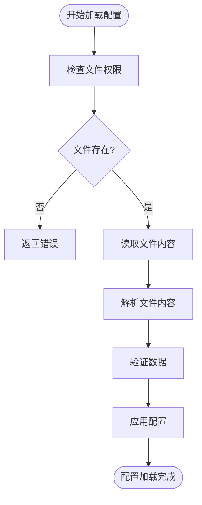
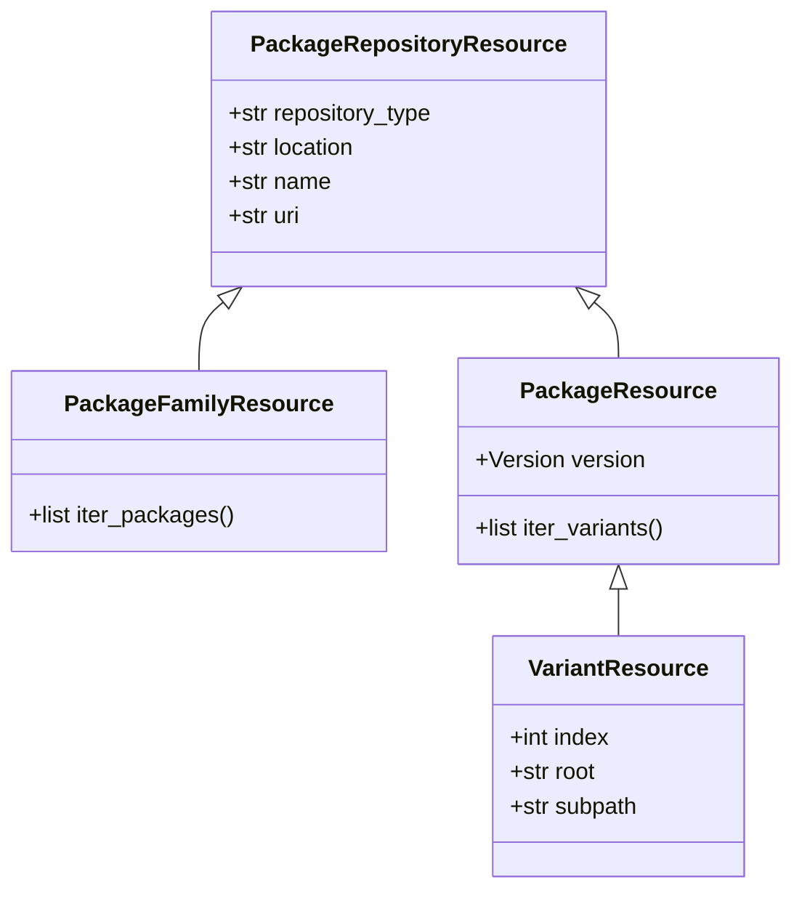
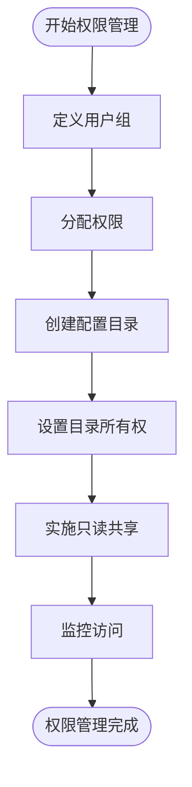
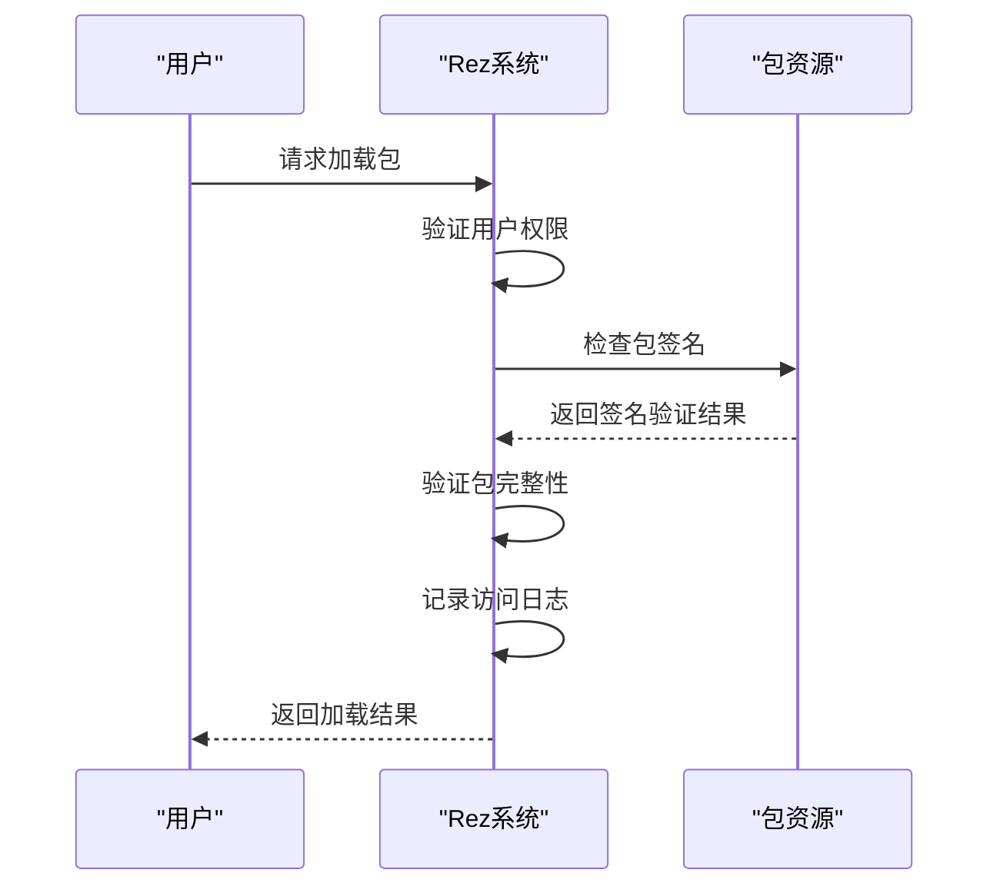
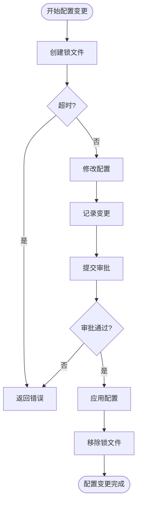

# 访问控制与权限管理

<cite>
**本文档引用的文件**   
- [config.py](file://rez-3.3.0\src\rez\config.py)
- [package.py](file://my_packages\maya\2022\package.py)
- [filesystem.py](file://rez-3.3.0\src\rezplugins\package_repository\filesystem.py)
- [package_resources.py](file://rez-3.3.0\src\rez\package_resources.py)
- [serialise.py](file://rez-3.3.0\src\rez\serialise.py)
- [filesystem.py](file://rez-3.3.0\src\rez\utils\filesystem.py)
- [rezconfig.py](file://rez-3.3.0\src\rezplugins\package_repository\rezconfig.py)
</cite>

## 目录
1. [简介](#简介)
2. [Rez配置加载与权限控制](#rez配置加载与权限控制)
3. [包资源访问控制](#包资源访问控制)
4. [多用户环境下的最小权限原则](#多用户环境下的最小权限原则)
5. [防止恶意包篡改的措施](#防止恶意包篡改的措施)
6. [配置文件锁定与变更审批](#配置文件锁定与变更审批)
7. [总结](#总结)

## 简介
本文档详细阐述了Rez系统的访问控制机制，重点分析了基于`config.py`的配置加载逻辑和包资源的权限管理体系。通过文件系统权限、用户组划分和配置目录所有权管理，实现对关键配置文件的读写访问限制。同时，结合`package.py`的加载过程，讨论了防止恶意包篡改的访问控制措施，并提供了配置文件锁定和变更审批流程的实践建议。

## Rez配置加载与权限控制

Rez系统通过`config.py`文件实现配置加载和权限控制。配置文件支持多种格式，包括Python脚本和YAML文件，系统会根据文件扩展名自动选择相应的加载器。配置加载过程中，系统会检查文件的权限，确保只有授权用户才能修改配置。

**图表来源**
- [config.py](file://rez-3.3.0\src\rez\config.py#L944-L1031)

**章节来源**
- [config.py](file://rez-3.3.0\src\rez\config.py#L944-L1031)

## 包资源访问控制

包资源的访问控制通过`package_resources.py`文件实现。系统定义了包资源的基类`PackageRepositoryResource`，并在此基础上派生出`PackageFamilyResource`、`PackageResource`和`VariantResource`等具体资源类。每个资源类都实现了相应的访问控制逻辑，确保只有授权用户才能访问和修改包资源。

**图表来源**
- [package_resources.py](file://rez-3.3.0\src\rez\package_resources.py#L267-L521)

**章节来源**
- [package_resources.py](file://rez-3.3.0\src\rez\package_resources.py#L267-L521)

## 多用户环境下的最小权限原则

在多用户环境中，实施最小权限原则是确保系统安全的关键。Rez系统通过用户组划分、配置目录所有权管理和只读共享策略来实现这一原则。系统管理员可以为不同用户组分配不同的权限，确保每个用户只能访问和修改其所需的资源。

**图表来源**
- [filesystem.py](file://rez-3.3.0\src\rez\utils\filesystem.py#L88-L119)

**章节来源**
- [filesystem.py](file://rez-3.3.0\src\rez\utils\filesystem.py#L88-L119)

## 防止恶意包篡改的措施

为了防止恶意包篡改，Rez系统在`package.py`的加载过程中实施了严格的访问控制措施。系统会验证包的签名，确保包的完整性和来源可靠性。此外，系统还支持包的版本控制和变更记录，便于追踪和审计包的修改历史。

**图表来源**
- [package.py](file://my_packages\maya\2022\package.py#L1-L9)
- [serialise.py](file://rez-3.3.0\src\rez\serialise.py#L107-L161)

**章节来源**
- [package.py](file://my_packages\maya\2022\package.py#L1-L9)
- [serialise.py](file://rez-3.3.0\src\rez\serialise.py#L107-L161)

## 配置文件锁定与变更审批

为了确保配置文件的稳定性和安全性，Rez系统支持配置文件锁定和变更审批流程。通过`rezconfig.py`文件中的`file_lock_type`和`file_lock_timeout`设置，系统可以在配置文件被修改时创建锁文件，防止多个用户同时修改同一文件。变更审批流程则通过记录每次配置变更的详细信息，确保所有变更都经过授权和审核。

**图表来源**
- [rezconfig.py](file://rez-3.3.0\src\rezplugins\package_repository\rezconfig.py#L5-L28)
- [filesystem.py](file://rez-3.3.0\src\rezplugins\package_repository\filesystem.py#L832-L850)

**章节来源**
- [rezconfig.py](file://rez-3.3.0\src\rezplugins\package_repository\rezconfig.py#L5-L28)
- [filesystem.py](file://rez-3.3.0\src\rezplugins\package_repository\filesystem.py#L832-L850)

## 总结
Rez系统通过多层次的访问控制机制，确保了配置文件和包资源的安全性。从配置加载到包资源管理，再到多用户环境下的权限控制，系统都提供了完善的解决方案。通过实施最小权限原则、防止恶意包篡改和配置文件锁定与变更审批，Rez系统能够有效保护关键资源，确保系统的稳定运行。