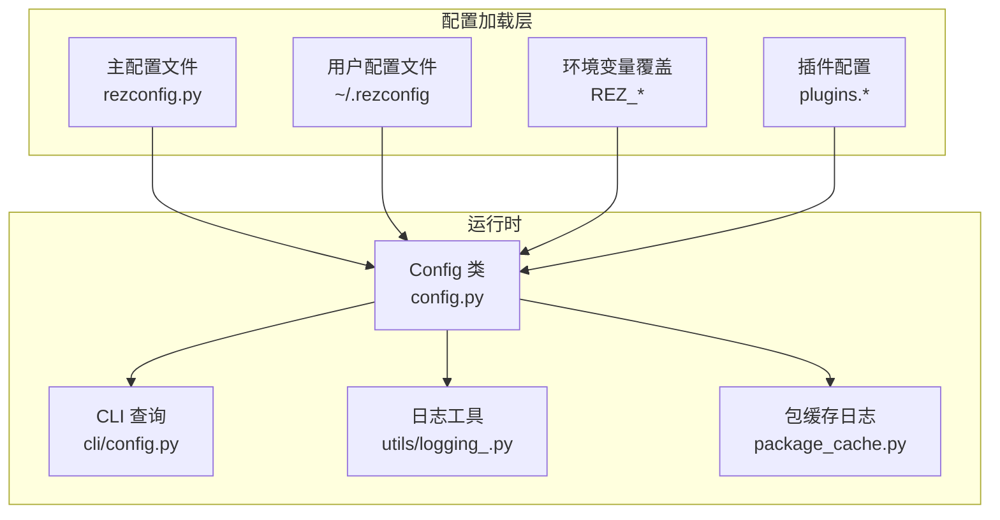
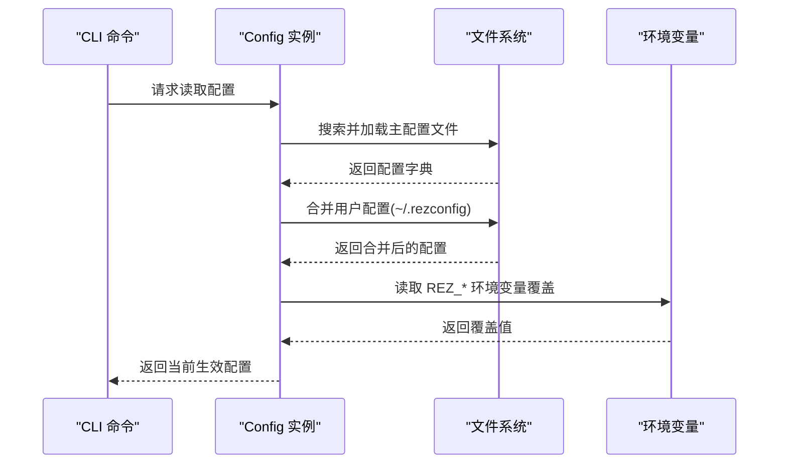
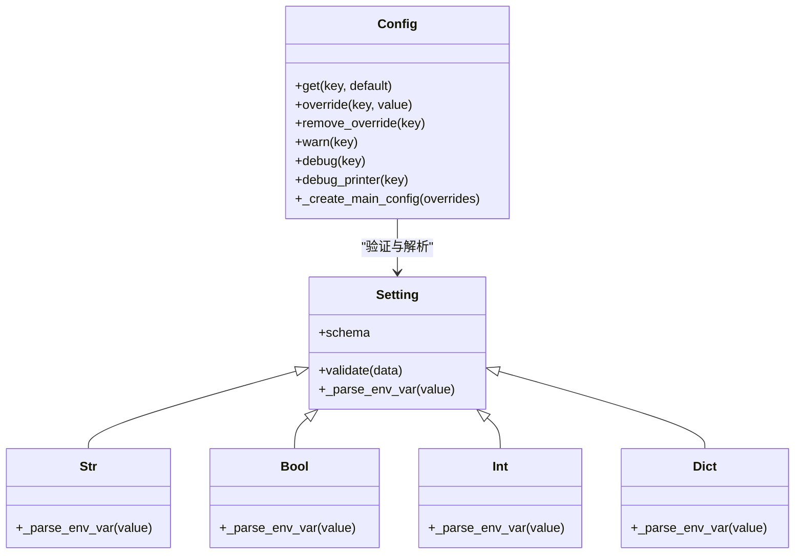
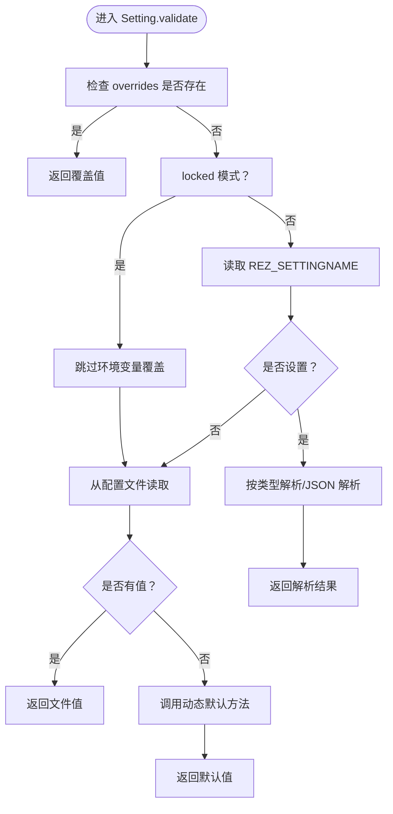
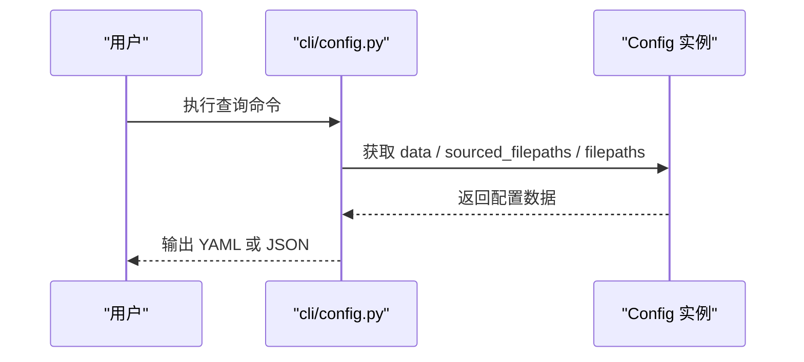
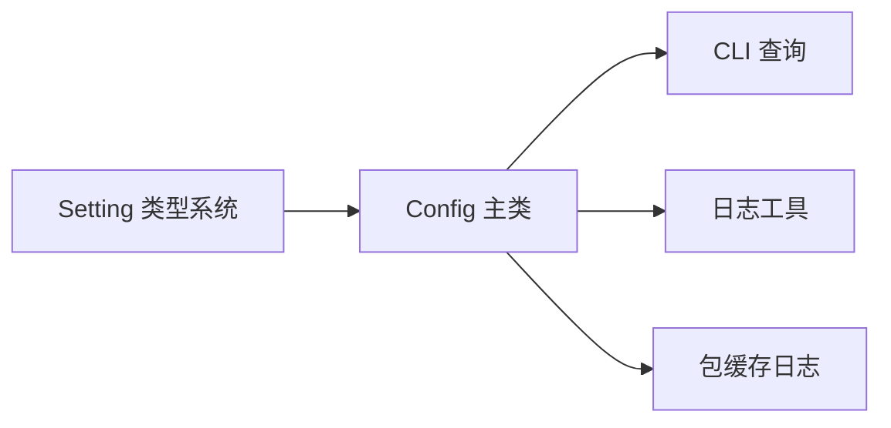

# 配置安全与权限控制

<cite>
**本文引用的文件**
- [config.py](file://rez-3.3.0/src/rez/config.py)
- [cli/config.py](file://rez-3.3.0/src/rez/cli/config.py)
- [logging_.py](file://rez-3.3.0/src/rez/utils/logging_.py)
- [package_cache.py](file://rez-3.3.0/src/rez/package_cache.py)
- [filesystem.py](file://rez-3.3.0/src/rezplugins/package_repository/filesystem.py)
- [package_definition.rst](file://rez-3.3.0/docs/source/package_definition.rst)
- [package.py（myapp）](file://my_packages/myapp/1.0.0/package.py)
- [package.py（maya）](file://my_packages/maya/2022/package.py)
- [package.py（python）](file://my_packages/python/3.10.0/package.py)
</cite>

## 目录
1. [引言](#引言)
2. [项目结构](#项目结构)
3. [核心组件](#核心组件)
4. [架构总览](#架构总览)
5. [详细组件分析](#详细组件分析)
6. [依赖关系分析](#依赖关系分析)
7. [性能考量](#性能考量)
8. [故障排查指南](#故障排查指南)
9. [结论](#结论)
10. [附录](#附录)

## 引言
本文件围绕“配置安全与权限控制”主题，聚焦以下目标：
- 在包定义文件中避免硬编码敏感信息，推荐通过环境变量或外部密钥管理系统进行安全注入。
- 制定配置文件的权限管理策略，防止未授权修改。
- 结合配置加载机制，解释如何通过环境变量覆盖、JSON 编码注入与锁定配置，保障配置来源可信与一致性。
- 提供审计日志记录配置变更的实现方案，并讨论在多用户环境中实施最小权限原则的最佳实践。

## 项目结构
Rez 的配置体系由“主配置 + 插件配置 + 环境变量覆盖 + 文件系统加载”构成。包定义文件（如 myapp/1.0.0/package.py）不直接承载敏感配置，但可通过环境变量与命令函数注入运行期所需参数；全局配置通过 config.py 加载并支持多源合并与覆盖。

图表来源
- [config.py](file://rez-3.3.0/src/rez/config.py#L918-L1046)
- [cli/config.py](file://rez-3.3.0/src/rez/cli/config.py#L1-L66)
- [logging_.py](file://rez-3.3.0/src/rez/utils/logging_.py#L1-L129)
- [package_cache.py](file://rez-3.3.0/src/rez/package_cache.py#L967-L977)

章节来源
- [config.py](file://rez-3.3.0/src/rez/config.py#L918-L1046)
- [cli/config.py](file://rez-3.3.0/src/rez/cli/config.py#L1-L66)

## 核心组件
- 配置加载与合并：Config 类负责从多个来源加载配置，应用覆盖与校验，支持“锁定配置”忽略环境变量覆盖。
- 环境变量注入：Setting 子类将 REZ_SETTINGNAME 映射到对应配置键，支持字符串、布尔、整数、字典等类型解析，以及 JSON 编码注入。
- CLI 查询：cli/config.py 支持打印当前配置、列出搜索与来源文件列表，便于审计与排障。
- 日志与审计：utils/logging_.py 提供统一日志接口；package_cache.py 展示了系统级日志目录与清理逻辑，可用于审计配置相关事件。
- 包定义与环境变量：包定义文件通过命令函数读取环境变量，实现最小化敏感信息暴露。

章节来源
- [config.py](file://rez-3.3.0/src/rez/config.py#L51-L135)
- [config.py](file://rez-3.3.0/src/rez/config.py#L918-L1046)
- [cli/config.py](file://rez-3.3.0/src/rez/cli/config.py#L1-L66)
- [logging_.py](file://rez-3.3.0/src/rez/utils/logging_.py#L1-L129)
- [package_cache.py](file://rez-3.3.0/src/rez/package_cache.py#L967-L977)
- [package_definition.rst](file://rez-3.3.0/docs/source/package_definition.rst#L208-L244)

## 架构总览
Rez 配置加载流程如下：优先加载模块根配置，再按顺序合并用户配置与环境变量覆盖，最终生成只读视图。CLI 工具可查询当前生效配置，便于审计与排障。

图表来源
- [config.py](file://rez-3.3.0/src/rez/config.py#L918-L1046)
- [cli/config.py](file://rez-3.3.0/src/rez/cli/config.py#L1-L66)

## 详细组件分析

### 组件A：配置加载与覆盖（Config）
- 多源加载：主配置文件、用户配置文件、插件配置按顺序合并，支持深度更新。
- 环境变量覆盖：Setting._parse_env_var 将 REZ_SETTINGNAME 映射为具体键值，支持 JSON 编码注入（REZ_SETTINGNAME_JSON），并进行类型校验。
- 锁定配置：_create_locked_config 创建仅读取主配置、忽略用户配置与环境变量的配置实例，用于安全场景。
- 警告与调试：Config.warn/debug/debug_printer 控制输出级别，便于审计与排障。

图表来源
- [config.py](file://rez-3.3.0/src/rez/config.py#L51-L135)
- [config.py](file://rez-3.3.0/src/rez/config.py#L137-L284)
- [config.py](file://rez-3.3.0/src/rez/config.py#L539-L806)

章节来源
- [config.py](file://rez-3.3.0/src/rez/config.py#L51-L135)
- [config.py](file://rez-3.3.0/src/rez/config.py#L539-L806)
- [config.py](file://rez-3.3.0/src/rez/config.py#L918-L1046)

### 组件B：环境变量注入与类型解析
- 字符串/整数/浮点/布尔/字典等类型解析，错误时抛出配置异常。
- JSON 注入：REZ_SETTINGNAME_JSON 支持复杂结构注入，失败时抛出配置异常。
- 兼容性与默认值：若未设置环境变量，则回退到配置文件或动态默认值。

图表来源
- [config.py](file://rez-3.3.0/src/rez/config.py#L70-L135)
- [config.py](file://rez-3.3.0/src/rez/config.py#L137-L284)

章节来源
- [config.py](file://rez-3.3.0/src/rez/config.py#L70-L135)
- [config.py](file://rez-3.3.0/src/rez/config.py#L137-L284)

### 组件C：CLI 查询与审计
- 支持打印当前配置、列出搜索路径与来源文件，便于审计配置来源与生效情况。
- 支持 JSON 输出，便于将复杂结构注入环境变量（REZ_*_JSON）。

图表来源
- [cli/config.py](file://rez-3.3.0/src/rez/cli/config.py#L1-L66)
- [config.py](file://rez-3.3.0/src/rez/config.py#L631-L670)

章节来源
- [cli/config.py](file://rez-3.3.0/src/rez/cli/config.py#L1-L66)
- [config.py](file://rez-3.3.0/src/rez/config.py#L631-L670)

### 组件D：日志与审计（包缓存）
- 包缓存模块维护系统日志目录，定期清理旧日志，便于审计配置相关事件与运行轨迹。
- 可扩展至配置变更审计：建议在配置加载前后记录关键事件（来源文件、覆盖键、生效值摘要）。

章节来源
- [package_cache.py](file://rez-3.3.0/src/rez/package_cache.py#L967-L977)

### 组件E：包定义中的敏感信息处理
- 包定义文件不应包含敏感信息；如需注入，应通过命令函数读取环境变量，避免硬编码。
- 文档示例展示了基于环境变量的条件工具集过滤，体现最小暴露原则。

章节来源
- [package_definition.rst](file://rez-3.3.0/docs/source/package_definition.rst#L208-L244)
- [package.py（myapp）](file://my_packages/myapp/1.0.0/package.py#L1-L33)
- [package.py（maya）](file://my_packages/maya/2022/package.py#L1-L9)
- [package.py（python）](file://my_packages/python/3.10.0/package.py#L1-L8)

## 依赖关系分析
- Config 依赖 Setting 类型系统与 schema 校验，保证配置类型正确与来源可控。
- CLI 依赖 Config 的 data/sourced_filepaths/filepaths 属性，形成“查询—审计”闭环。
- 日志工具与包缓存模块共同支撑审计能力，建议在配置加载关键节点增加审计日志。

图表来源
- [config.py](file://rez-3.3.0/src/rez/config.py#L51-L135)
- [config.py](file://rez-3.3.0/src/rez/config.py#L539-L806)
- [cli/config.py](file://rez-3.3.0/src/rez/cli/config.py#L1-L66)
- [logging_.py](file://rez-3.3.0/src/rez/utils/logging_.py#L1-L129)
- [package_cache.py](file://rez-3.3.0/src/rez/package_cache.py#L967-L977)

章节来源
- [config.py](file://rez-3.3.0/src/rez/config.py#L51-L135)
- [config.py](file://rez-3.3.0/src/rez/config.py#L539-L806)
- [cli/config.py](file://rez-3.3.0/src/rez/cli/config.py#L1-L66)
- [logging_.py](file://rez-3.3.0/src/rez/utils/logging_.py#L1-L129)
- [package_cache.py](file://rez-3.3.0/src/rez/package_cache.py#L967-L977)

## 性能考量
- 配置加载采用缓存与延迟属性，避免重复解析与合并。
- 环境变量覆盖仅在非锁定模式下生效，减少不必要的 IO 与解析。
- CLI 查询支持 JSON 输出，便于在自动化场景中高效消费配置。

章节来源
- [config.py](file://rez-3.3.0/src/rez/config.py#L631-L704)
- [config.py](file://rez-3.3.0/src/rez/config.py#L918-L1046)
- [cli/config.py](file://rez-3.3.0/src/rez/cli/config.py#L1-L66)

## 故障排查指南
- 使用 CLI 列出搜索与来源文件，确认配置来源与覆盖链路。
- 当 JSON 注入失败时，检查 REZ_*_JSON 的格式与类型匹配。
- 若配置未按预期生效，检查是否处于锁定配置模式或 overrides 是否被覆盖。
- 审计日志：启用 debug/warn 级别输出，结合包缓存日志定位问题。

章节来源
- [cli/config.py](file://rez-3.3.0/src/rez/cli/config.py#L1-L66)
- [config.py](file://rez-3.3.0/src/rez/config.py#L70-L135)
- [config.py](file://rez-3.3.0/src/rez/config.py#L918-L1046)
- [logging_.py](file://rez-3.3.0/src/rez/utils/logging_.py#L1-L129)

## 结论
- 避免在包定义与配置文件中硬编码敏感信息，通过环境变量与外部密钥管理系统注入。
- 通过“锁定配置”与“来源文件审计”，确保配置来源可信与一致性。
- 借助 CLI 查询与日志工具，建立配置变更的审计闭环。
- 在多用户环境中实施最小权限原则：限制配置文件写权限，仅允许受控用户组修改；对敏感键使用锁定配置与只读视图。

## 附录

### 最佳实践清单
- 敏感信息注入
  - 使用 REZ_SETTINGNAME 或 REZ_SETTINGNAME_JSON 注入敏感值。
  - 不在包定义文件中直接写入密钥、令牌或数据库凭据。
- 配置文件权限
  - 仅允许管理员组读取配置文件；禁止普通用户写入。
  - 对 settings.yaml 等本地仓库配置，遵循最小权限原则。
- 完整性与来源控制
  - 使用 _create_locked_config 构建只读配置，避免环境变量覆盖。
  - 通过 CLI 列出 sourced_filepaths，核对生效配置来源。
- 审计与日志
  - 启用 debug/warn 级别输出，记录关键配置事件。
  - 在配置加载前后增加审计日志，保留来源文件、覆盖键与生效值摘要。

章节来源
- [config.py](file://rez-3.3.0/src/rez/config.py#L918-L1046)
- [cli/config.py](file://rez-3.3.0/src/rez/cli/config.py#L1-L66)
- [logging_.py](file://rez-3.3.0/src/rez/utils/logging_.py#L1-L129)
- [filesystem.py](file://rez-3.3.0/src/rezplugins/package_repository/filesystem.py#L475-L482)
- [package_definition.rst](file://rez-3.3.0/docs/source/package_definition.rst#L208-L244)