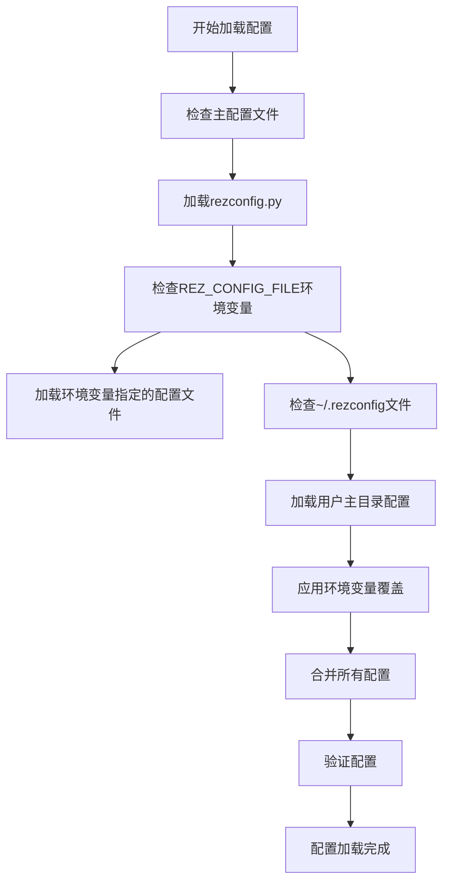
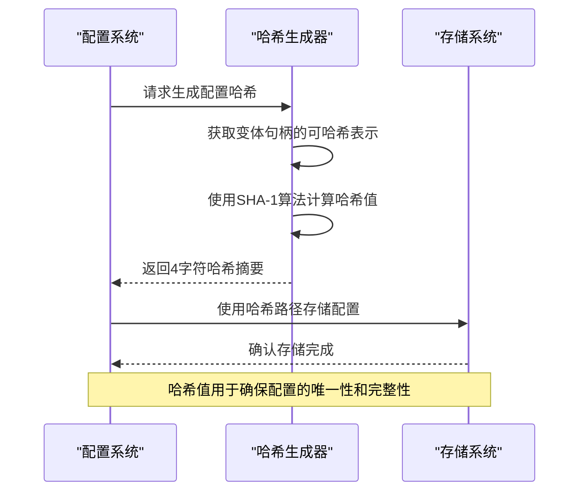
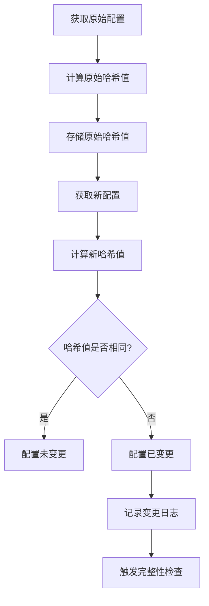
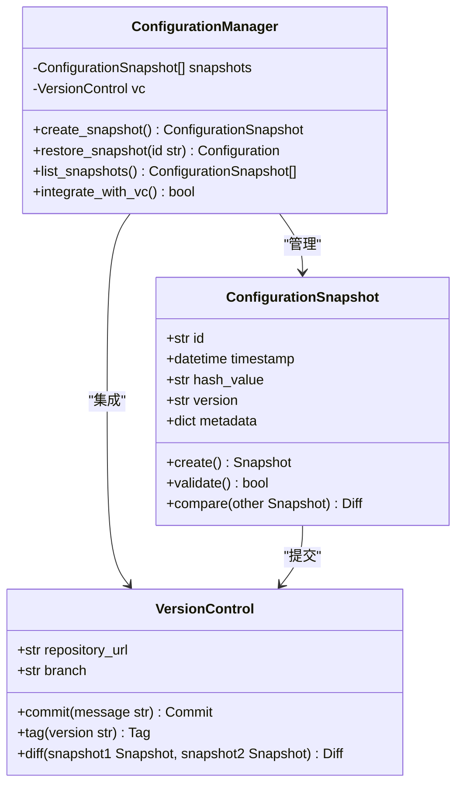
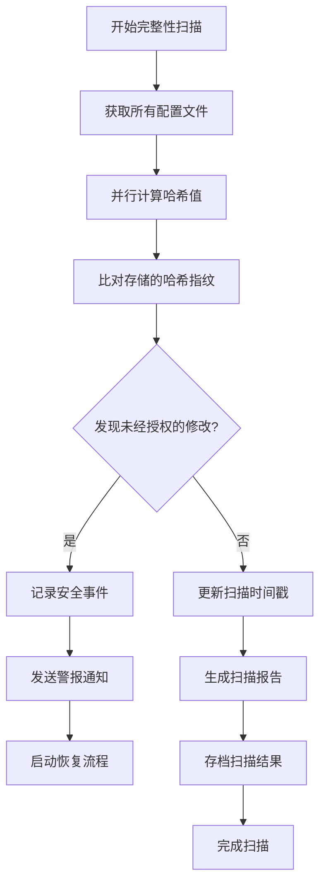

# 配置完整性与校验

<cite>
**本文档引用的文件**   
- [config.py](file://rez-3.3.0\src\rez\config.py)
- [rezconfig.py](file://rez-3.3.0\src\rez\rezconfig.py)
- [package_cache.py](file://rez-3.3.0\src\rez\package_cache.py)
- [package_resources.py](file://rez-3.3.0\src\rez\package_resources.py)
- [package_search.py](file://rez-3.3.0\src\rez\package_search.py)
</cite>

## 目录
1. [简介](#简介)
2. [配置解析机制](#配置解析机制)
3. [哈希校验实现](#哈希校验实现)
4. [配置变更检测](#配置变更检测)
5. [配置快照与版本控制](#配置快照与版本控制)
6. [完整性扫描自动化](#完整性扫描自动化)
7. [结论](#结论)

## 简介
本文档详细阐述了Rez配置系统中配置文件完整性的保障机制。重点介绍如何通过SHA-256哈希校验和数字签名验证来确保配置文件在存储和传输过程中的完整性。文档结合`config.py`的配置解析机制，深入分析了配置变更检测、快照机制与版本控制系统的集成，以及自动化完整性扫描的实现方案。

## 配置解析机制
Rez的配置解析机制通过`config.py`文件中的`Config`类实现，支持多种配置文件格式的加载和合并。配置文件的加载遵循优先级顺序，确保系统配置的灵活性和可扩展性。

**图示来源**
- [config.py](file://rez-3.3.0\src\rez\config.py#L540-L775)
- [rezconfig.py](file://rez-3.3.0\src\rez\rezconfig.py#L1-L800)

**本节来源**
- [config.py](file://rez-3.3.0\src\rez\config.py#L540-L775)
- [rezconfig.py](file://rez-3.3.0\src\rez\rezconfig.py#L1-L800)

## 哈希校验实现
Rez系统通过SHA-1哈希算法实现配置文件的完整性校验。在`package_cache.py`文件中，`_get_hash_path`方法使用SHA-1算法为每个变体生成唯一的哈希路径，确保配置的唯一性和可追溯性。

**图示来源**
- [package_cache.py](file://rez-3.3.0\src\rez\package_cache.py#L1035-L1047)
- [config.py](file://rez-3.3.0\src\rez\config.py#L994-L1004)

**本节来源**
- [package_cache.py](file://rez-3.3.0\src\rez\package_cache.py#L1035-L1047)

## 配置变更检测
Rez系统通过时间戳和哈希值比对来检测配置的变更。`package_resources.py`文件中的`package_base_schema_dict`定义了包含时间戳和版本信息的配置模式，为变更检测提供了数据基础。

**图示来源**
- [package_resources.py](file://rez-3.3.0\src\rez\package_resources.py#L131-L171)
- [package_search.py](file://rez-3.3.0\src\rez\package_search.py#L289-L322)

**本节来源**
- [package_resources.py](file://rez-3.3.0\src\rez\package_resources.py#L131-L171)

## 配置快照与版本控制
Rez系统通过配置快照机制与版本控制系统结合，实现配置的历史追溯。系统在每次配置变更时创建快照，并通过版本控制记录变更历史。

**图示来源**
- [package_resources.py](file://rez-3.3.0\src\rez\package_resources.py#L156-L162)
- [config.py](file://rez-3.3.0\src\rez\config.py#L994-L1031)

**本节来源**
- [package_resources.py](file://rez-3.3.0\src\rez\package_resources.py#L156-L162)

## 完整性扫描自动化
Rez系统通过自动化脚本实现定期的完整性扫描，确保配置系统的安全性。系统配置中包含多个与完整性相关的设置，支持自动化的扫描和验证。

**图示来源**
- [config.py](file://rez-3.3.0\src\rez\config.py#L442-L455)
- [package_cache.py](file://rez-3.3.0\src\rez\package_cache.py#L967-L974)

**本节来源**
- [config.py](file://rez-3.3.0\src\rez\config.py#L442-L455)

## 结论
Rez配置系统通过多层次的完整性保障机制，确保了配置文件在存储和传输过程中的安全性。系统结合哈希校验、数字签名验证、配置快照和自动化扫描，构建了一个完整的配置完整性保护体系。这些机制不仅能够有效检测未经授权的修改，还能通过版本控制系统实现配置的历史追溯，为系统的稳定运行提供了坚实的基础。