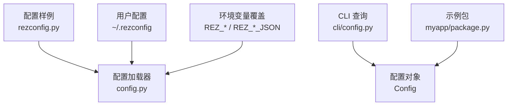
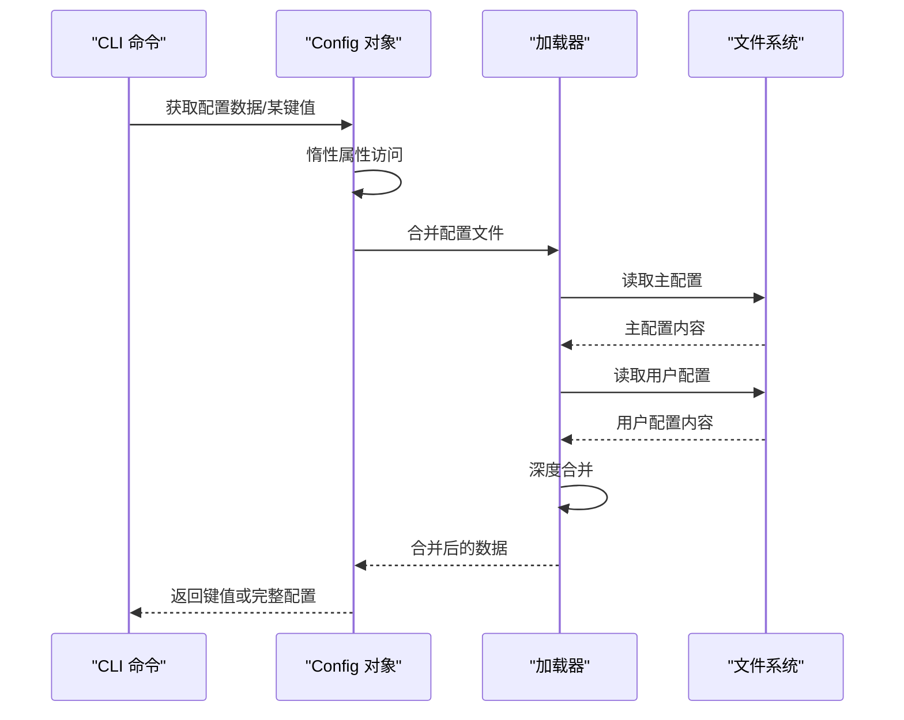
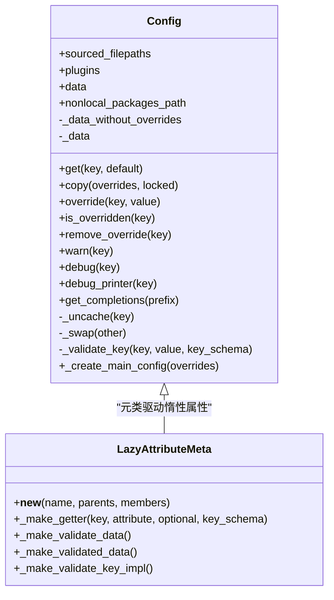
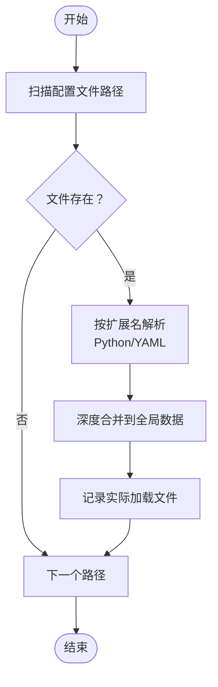
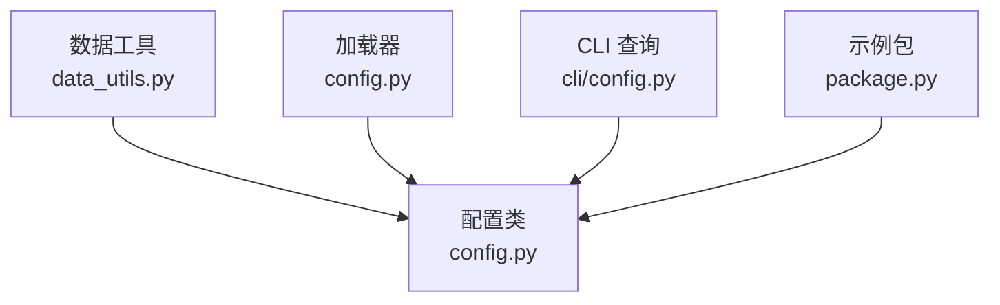

# 配置加载优化

<cite>
**本文引用的文件**
- [config.py](file://rez-3.3.0/src/rez/config.py)
- [rezconfig.py](file://rez-3.3.0/src/rez/rezconfig.py)
- [data_utils.py](file://rez-3.3.0/src/rez/utils/data_utils.py)
- [cli/config.py](file://rez-3.3.0/src/rez/cli/config.py)
- [package.py](file://my_packages/myapp/1.0.0/package.py)
</cite>

## 目录
1. [简介](#简介)
2. [项目结构](#项目结构)
3. [核心组件](#核心组件)
4. [架构总览](#架构总览)
5. [详细组件分析](#详细组件分析)
6. [依赖关系分析](#依赖关系分析)
7. [性能考量](#性能考量)
8. [故障排查指南](#故障排查指南)
9. [结论](#结论)
10. [附录](#附录)

## 简介
本指南聚焦于大型项目中配置文件读取与合并的性能瓶颈，结合仓库中的配置管理实现，系统讲解惰性加载、配置预编译与增量加载等优化技术，并给出模块化配置设计、条件加载策略与配置压缩技巧，帮助在复杂场景下仍能保持快速启动性能。

## 项目结构
- 配置主入口与核心逻辑位于配置模块，负责从多源配置文件合并为最终配置对象。
- 配置样例文件提供了默认配置与注释说明，便于理解优先级与覆盖规则。
- CLI 提供查看当前生效配置的能力，辅助定位性能问题与验证优化效果。
- 示例包展示了如何在包定义中使用配置生成环境变量与工具路径，体现配置对运行期的影响。

图表来源
- [config.py](file://rez-3.3.0/src/rez/config.py#L738-L769)
- [rezconfig.py](file://rez-3.3.0/src/rez/rezconfig.py#L1-L60)
- [cli/config.py](file://rez-3.3.0/src/rez/cli/config.py#L31-L66)
- [package.py](file://my_packages/myapp/1.0.0/package.py#L1-L33)

章节来源
- [config.py](file://rez-3.3.0/src/rez/config.py#L738-L769)
- [rezconfig.py](file://rez-3.3.0/src/rez/rezconfig.py#L1-L60)
- [cli/config.py](file://rez-3.3.0/src/rez/cli/config.py#L31-L66)
- [package.py](file://my_packages/myapp/1.0.0/package.py#L1-L33)

## 核心组件
- 配置类与元类：通过惰性属性与缓存机制，仅在访问时解析并校验对应键值；支持按需加载插件配置。
- 加载器：按优先级顺序扫描配置文件，合并字典，支持延迟加载与列表修改语法。
- 数据工具：深度合并、延迟加载、缓存装饰器、惰性属性元类等，是性能优化的关键支撑。

章节来源
- [config.py](file://rez-3.3.0/src/rez/config.py#L540-L769)
- [data_utils.py](file://rez-3.3.0/src/rez/utils/data_utils.py#L40-L90)
- [data_utils.py](file://rez-3.3.0/src/rez/utils/data_utils.py#L216-L261)
- [data_utils.py](file://rez-3.3.0/src/rez/utils/data_utils.py#L565-L676)

## 架构总览
配置加载流程遵循“主配置优先，再叠加用户配置与环境变量覆盖”的原则。Config 类以惰性属性与缓存为核心，避免一次性解析全部配置；加载器按扩展名选择解析器，合并字典并记录实际加载的文件列表；CLI 提供查询能力，便于定位性能热点。

图表来源
- [config.py](file://rez-3.3.0/src/rez/config.py#L738-L769)
- [config.py](file://rez-3.3.0/src/rez/config.py#L994-L1031)
- [cli/config.py](file://rez-3.3.0/src/rez/cli/config.py#L31-L66)

## 详细组件分析

### 组件A：Config 类与惰性加载
- 关键点
  - 使用惰性属性元类在首次访问时才解析并校验对应键值，避免全量解析。
  - 使用缓存属性缓存已解析的数据，降低重复访问成本。
  - 插件配置按需加载，避免在不需要时加载插件模块。
  - 支持覆盖与去重：先深合并用户配置，再应用覆盖，最后扁平化 ModifyList。
- 性能影响
  - 大型配置树中，仅访问部分键不会触发其他键的解析，显著降低启动时间。
  - 缓存命中后，重复访问同一键无需再次解析与校验。

图表来源
- [config.py](file://rez-3.3.0/src/rez/config.py#L540-L769)
- [data_utils.py](file://rez-3.3.0/src/rez/utils/data_utils.py#L565-L676)

章节来源
- [config.py](file://rez-3.3.0/src/rez/config.py#L540-L769)
- [data_utils.py](file://rez-3.3.0/src/rez/utils/data_utils.py#L565-L676)

### 组件B：加载器与合并策略
- 关键点
  - 优先级：模块根配置 → 环境指定配置列表 → 用户配置 → 环境变量覆盖 → 包内配置（构建/发布阶段）。
  - 解析器：支持 Python 配置文件与 YAML 文件，按扩展名选择解析器。
  - 合并：深度合并字典，支持 ModifyList 的前置/后置追加，扁平化处理。
  - 延迟加载：支持从外部文件延迟加载复杂数据结构，减少主配置体积。
- 性能影响
  - 仅加载实际存在的文件，避免无效 IO。
  - 深度合并与 ModifyList 扁平化在构造阶段完成，后续访问无需重复合并。

图表来源
- [config.py](file://rez-3.3.0/src/rez/config.py#L994-L1031)
- [data_utils.py](file://rez-3.3.0/src/rez/utils/data_utils.py#L98-L135)
- [data_utils.py](file://rez-3.3.0/src/rez/utils/data_utils.py#L40-L90)

章节来源
- [config.py](file://rez-3.3.0/src/rez/config.py#L994-L1031)
- [data_utils.py](file://rez-3.3.0/src/rez/utils/data_utils.py#L98-L135)
- [data_utils.py](file://rez-3.3.0/src/rez/utils/data_utils.py#L40-L90)

### 组件C：CLI 查询与调试
- 关键点
  - 支持打印特定键值、输出完整配置、列出搜索与来源文件列表。
  - 结合 JSON 输出与 YAML 输出，便于设置环境变量覆盖。
- 性能影响
  - 通过“来源文件列表”定位耗时配置文件，指导进一步优化。

章节来源
- [cli/config.py](file://rez-3.3.0/src/rez/cli/config.py#L31-L66)

### 组件D：示例包中的配置使用
- 关键点
  - 在包定义中设置环境变量与工具路径，展示配置对运行期环境的影响。
- 性能影响
  - 避免在包定义中进行昂贵计算，将复杂逻辑移至配置或插件。

章节来源
- [package.py](file://my_packages/myapp/1.0.0/package.py#L1-L33)

## 依赖关系分析
- 配置类依赖数据工具提供的缓存、惰性属性与深度合并能力。
- 加载器依赖 YAML 解析器与文件系统接口，按扩展名选择解析器。
- CLI 依赖配置对象暴露的查询接口。

图表来源
- [config.py](file://rez-3.3.0/src/rez/config.py#L540-L769)
- [data_utils.py](file://rez-3.3.0/src/rez/utils/data_utils.py#L216-L261)
- [cli/config.py](file://rez-3.3.0/src/rez/cli/config.py#L31-L66)
- [package.py](file://my_packages/myapp/1.0.0/package.py#L1-L33)

章节来源
- [config.py](file://rez-3.3.0/src/rez/config.py#L540-L769)
- [data_utils.py](file://rez-3.3.0/src/rez/utils/data_utils.py#L216-L261)
- [cli/config.py](file://rez-3.3.0/src/rez/cli/config.py#L31-L66)
- [package.py](file://my_packages/myapp/1.0.0/package.py#L1-L33)

## 性能考量
- 惰性加载与缓存
  - 仅在访问时解析键值，避免全量初始化；缓存命中后直接返回。
  - 插件配置按需加载，减少无关模块导入。
- 合并策略优化
  - 仅加载存在的文件，避免无效 IO。
  - 深度合并与 ModifyList 扁平化在构造阶段完成，后续访问无需重复合并。
- 延迟加载复杂数据
  - 使用延迟加载对象从外部文件按需读取，降低主配置体积与解析成本。
- 环境变量覆盖
  - 通过环境变量覆盖实现“按需覆盖”，避免在主配置中冗余定义。
- 配置压缩与分层
  - 将大型配置拆分为多个文件，利用合并策略减少重复。
  - 使用列表修改语法（前置/后置）替代大字典覆盖，提升可维护性与性能。

章节来源
- [config.py](file://rez-3.3.0/src/rez/config.py#L738-L769)
- [config.py](file://rez-3.3.0/src/rez/config.py#L994-L1031)
- [data_utils.py](file://rez-3.3.0/src/rez/utils/data_utils.py#L40-L90)
- [data_utils.py](file://rez-3.3.0/src/rez/utils/data_utils.py#L98-L135)

## 故障排查指南
- 如何定位耗时配置文件
  - 使用 CLI 列出“来源文件列表”，识别实际加载的配置文件集合。
- 如何验证覆盖是否生效
  - 使用 CLI 打印特定键值，确认环境变量覆盖与用户配置是否正确叠加。
- 常见问题
  - 键缺失：检查必需键是否存在于主配置或用户配置。
  - 覆盖冲突：确认环境变量覆盖与用户配置的优先级顺序。
  - 解析错误：检查 YAML/Python 配置文件格式与键类型。

章节来源
- [cli/config.py](file://rez-3.3.0/src/rez/cli/config.py#L31-L66)
- [config.py](file://rez-3.3.0/src/rez/config.py#L738-L769)

## 结论
通过惰性加载、缓存、延迟加载与深度合并等技术，配置系统在大型项目中实现了高效的启动与运行时访问。建议在实际工程中：
- 将大型配置拆分为多个文件，按功能模块化组织；
- 使用环境变量覆盖关键参数，避免在主配置中冗余；
- 对复杂数据采用延迟加载，减少主配置体积；
- 利用 ModifyList 进行列表增量修改，提升可维护性；
- 使用 CLI 定位耗时配置文件，持续优化加载路径。

## 附录
- 配置样例与优先级说明可参考配置样例文件中的注释与默认值。
- CLI 查询能力可用于日常调试与性能验证。

章节来源
- [rezconfig.py](file://rez-3.3.0/src/rez/rezconfig.py#L1-L60)
- [cli/config.py](file://rez-3.3.0/src/rez/cli/config.py#L31-L66)