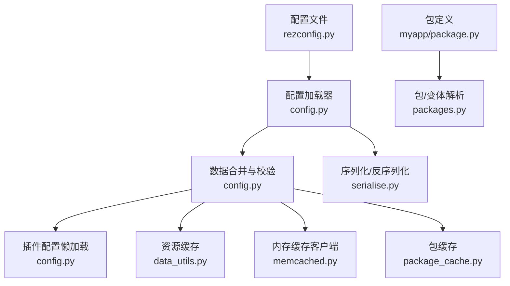
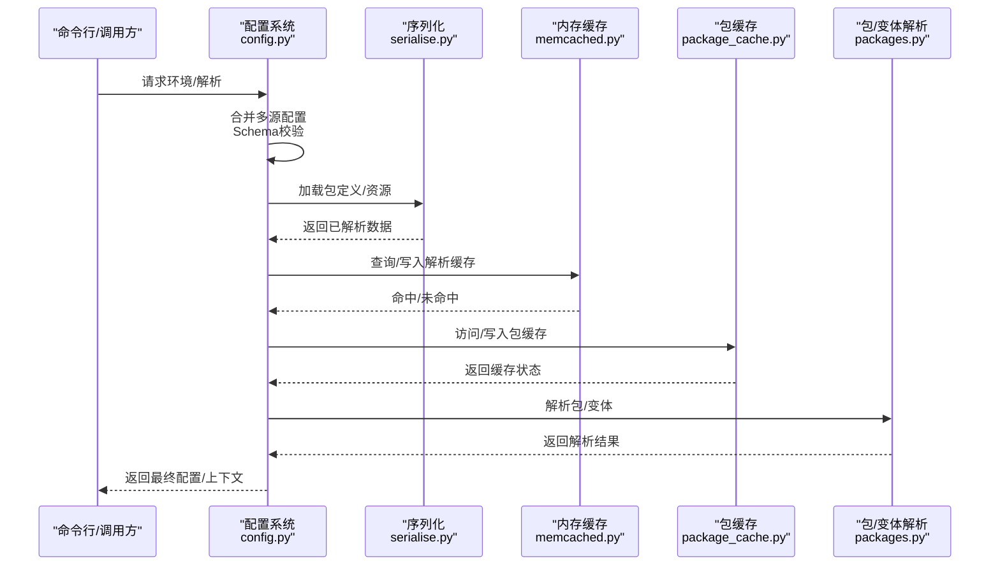
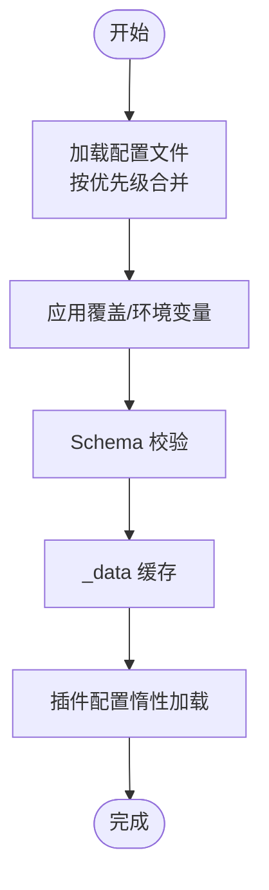
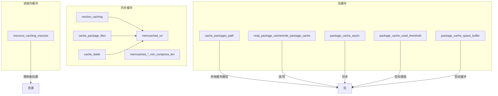
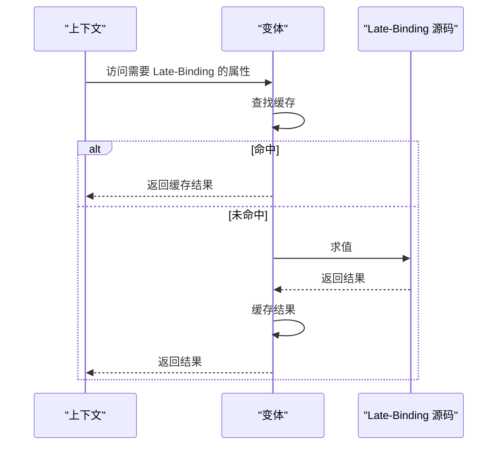
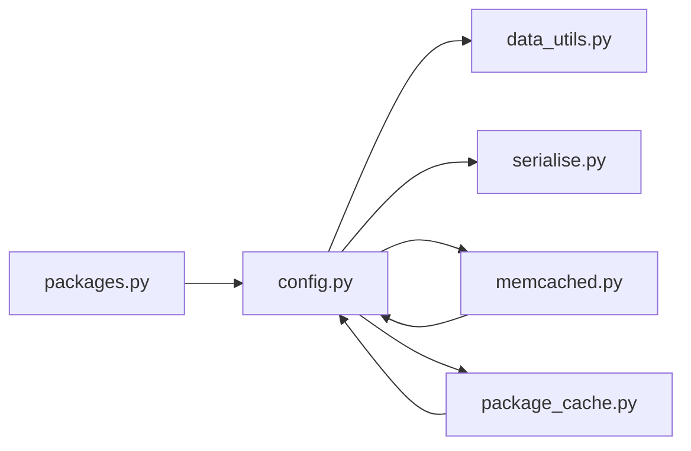

# 配置性能优化

<cite>
**本文引用的文件**
- [caching.rst](file://rez-3.3.0/docs/source/guides/caching.rst)
- [config.py](file://rez-3.3.0/src/rez/config.py)
- [rezconfig.py](file://rez-3.3.0/src/rez/rezconfig.py)
- [data_utils.py](file://rez-3.3.0/src/rez/utils/data_utils.py)
- [memcached.py](file://rez-3.3.0/src/rez/utils/memcached.py)
- [serialise.py](file://rez-3.3.0/src/rez/serialise.py)
- [package_cache.py](file://rez-3.3.0/src/rez/package_cache.py)
- [packages.py](file://rez-3.3.0/src/rez/packages.py)
- [package.py](file://my_packages/myapp/1.0.0/package.py)
</cite>

## 目录
1. [简介](#简介)
2. [项目结构](#项目结构)
3. [核心组件](#核心组件)
4. [架构总览](#架构总览)
5. [详细组件分析](#详细组件分析)
6. [依赖关系分析](#依赖关系分析)
7. [性能考量](#性能考量)
8. [故障排查指南](#故障排查指南)
9. [结论](#结论)
10. [附录](#附录)

## 简介
本指南围绕配置加载与解析的性能优化展开，目标是降低配置加载延迟、解析开销与资源占用。文档基于仓库中的缓存机制与配置系统实现，给出启用与配置缓存、惰性加载、配置预编译等策略，并结合 myapp 示例包说明如何减少冗余计算、避免循环依赖与优化钩子执行顺序。同时提供性能监控指标与调优工具的使用方法，帮助定位与解决配置相关的性能问题。

## 项目结构
- 文档与配置：
  - 缓存指南：caching.rst
  - 默认配置模板：rezconfig.py
  - 配置读取与合并：config.py
  - 数据与缓存工具：data_utils.py、memcached.py、serialise.py、package_cache.py
  - 包与变体解析：packages.py
  - 示例包：myapp 的 package.py

图表来源
- [config.py](file://rez-3.3.0/src/rez/config.py#L536-L752)
- [rezconfig.py](file://rez-3.3.0/src/rez/rezconfig.py#L140-L184)
- [serialise.py](file://rez-3.3.0/src/rez/serialise.py#L156-L204)
- [data_utils.py](file://rez-3.3.0/src/rez/utils/data_utils.py#L216-L261)
- [memcached.py](file://rez-3.3.0/src/rez/utils/memcached.py#L1-L120)
- [package_cache.py](file://rez-3.3.0/src/rez/package_cache.py#L1-L120)
- [packages.py](file://rez-3.3.0/src/rez/packages.py#L142-L182)
- [package.py](file://my_packages/myapp/1.0.0/package.py#L1-L33)

章节来源
- [config.py](file://rez-3.3.0/src/rez/config.py#L536-L752)
- [rezconfig.py](file://rez-3.3.0/src/rez/rezconfig.py#L140-L184)

## 核心组件
- 配置加载与合并
  - 多源配置文件按优先级合并，支持覆盖与环境变量注入，最终通过 Schema 校验。
  - 使用缓存属性与惰性加载减少重复计算。
- 缓存体系
  - 解析缓存：memcached 存储求解结果，显著降低重复解析时间。
  - 资源缓存：进程内 LRU 缓存资源对象，控制条目数量。
  - 包缓存：本地磁盘缓存变体载荷，减少共享存储访问。
- 惰性加载与预编译
  - 插件配置与部分设置采用惰性加载；Late-Binding 函数在上下文构建时按需求值。
  - 支持延迟加载外部文件（DelayLoad）与深度合并（deep_update）。

章节来源
- [config.py](file://rez-3.3.0/src/rez/config.py#L536-L752)
- [rezconfig.py](file://rez-3.3.0/src/rez/rezconfig.py#L140-L184)
- [data_utils.py](file://rez-3.3.0/src/rez/utils/data_utils.py#L216-L261)
- [packages.py](file://rez-3.3.0/src/rez/packages.py#L142-L182)

## 架构总览
下图展示了配置加载到解析缓存的关键流程，以及与资源缓存、包缓存的交互。

图表来源
- [config.py](file://rez-3.3.0/src/rez/config.py#L994-L1046)
- [serialise.py](file://rez-3.3.0/src/rez/serialise.py#L156-L204)
- [memcached.py](file://rez-3.3.0/src/rez/utils/memcached.py#L226-L265)
- [package_cache.py](file://rez-3.3.0/src/rez/package_cache.py#L1-L120)
- [packages.py](file://rez-3.3.0/src/rez/packages.py#L142-L182)

## 详细组件分析

### 配置加载与合并（config.py）
- 多源文件合并
  - 从模块根配置、环境变量指定的配置文件列表、用户主目录配置文件逐层叠加。
  - 使用深度合并（deep_update）处理列表与嵌套字典，支持 ModifyList 追加/前置。
- 惰性加载与缓存
  - 使用 cached_property 缓存 _data 与派生属性，避免重复解析。
  - 插件配置通过 plugins 属性惰性加载，仅在访问时初始化。
- 环境变量与覆盖
  - 支持 REZ_XXX 与 REZ_XXX_JSON 注入覆盖，优先级高于文件配置。
- Schema 校验与动态默认
  - 通过 Schema 对配置进行强类型校验；对平台相关默认值在运行时动态生成。

图表来源
- [config.py](file://rez-3.3.0/src/rez/config.py#L536-L752)
- [config.py](file://rez-3.3.0/src/rez/config.py#L994-L1046)

章节来源
- [config.py](file://rez-3.3.0/src/rez/config.py#L536-L752)
- [config.py](file://rez-3.3.0/src/rez/config.py#L994-L1046)

### 缓存机制（caching.rst、rezconfig.py、memcached.py、package_cache.py）
- 解析缓存（memcached）
  - 将求解信息、包时间戳、变体状态等缓存至 memcached，命中后直接返回，显著降低重复解析成本。
  - 可通过配置项开启/关闭，并设置压缩阈值与调试开关。
- 资源缓存（进程内）
  - 通过 resource_caching_maxsize 控制资源缓存大小，0 表示禁用，-1 表示不限制。
- 包缓存（本地磁盘）
  - 将变体载荷复制到本地缓存路径，命中后重映射根目录，减少共享存储访问。
  - 提供清理策略、空间阈值与异步缓存选项。

图表来源
- [caching.rst](file://rez-3.3.0/docs/source/guides/caching.rst#L1-L29)
- [rezconfig.py](file://rez-3.3.0/src/rez/rezconfig.py#L140-L184)
- [rezconfig.py](file://rez-3.3.0/src/rez/rezconfig.py#L222-L328)
- [memcached.py](file://rez-3.3.0/src/rez/utils/memcached.py#L1-L120)
- [package_cache.py](file://rez-3.3.0/src/rez/package_cache.py#L1-L120)

章节来源
- [caching.rst](file://rez-3.3.0/docs/source/guides/caching.rst#L1-L29)
- [rezconfig.py](file://rez-3.3.0/src/rez/rezconfig.py#L140-L184)
- [rezconfig.py](file://rez-3.3.0/src/rez/rezconfig.py#L222-L328)
- [memcached.py](file://rez-3.3.0/src/rez/utils/memcached.py#L1-L120)
- [package_cache.py](file://rez-3.3.0/src/rez/package_cache.py#L1-L120)

### 惰性加载与预编译（packages.py、data_utils.py、config.py）
- Late-Binding 函数
  - 在上下文构建阶段按需求值，结果缓存在变体实例中，避免重复计算。
- 深度合并与延迟加载
  - deep_update 支持 ModifyList 与嵌套字典合并；DelayLoad 支持从 YAML/JSON 延迟加载外部配置片段。
- 插件配置惰性加载
  - 通过 plugins 属性延迟初始化，仅在访问时加载，降低启动成本。

图表来源
- [packages.py](file://rez-3.3.0/src/rez/packages.py#L142-L182)
- [data_utils.py](file://rez-3.3.0/src/rez/utils/data_utils.py#L1-L90)
- [config.py](file://rez-3.3.0/src/rez/config.py#L647-L653)

章节来源
- [packages.py](file://rez-3.3.0/src/rez/packages.py#L142-L182)
- [data_utils.py](file://rez-3.3.0/src/rez/utils/data_utils.py#L1-L90)
- [config.py](file://rez-3.3.0/src/rez/config.py#L647-L653)

### myapp 示例包的配置优化要点
- 减少冗余配置计算
  - 将复杂计算放入 Late-Binding 函数或仅在需要时求值，避免在包定义阶段做昂贵操作。
- 避免循环依赖
  - 合理拆分 commands/variants，避免相互引用导致多次解析。
- 优化钩子执行顺序
  - 通过配置项控制命令注入顺序与工具可见性，确保环境初始化顺序稳定。

章节来源
- [package.py](file://my_packages/myapp/1.0.0/package.py#L1-L33)

## 依赖关系分析
- 配置系统依赖
  - config.py 依赖 data_utils（缓存属性、深度合并）、serialise（文件加载）、memcached（缓存接口）、package_cache（包缓存）。
- 包解析依赖
  - packages.py 依赖 Late-Binding 缓存与上下文绑定，减少重复求值。
- 缓存依赖
  - memcached.py 依赖配置项与日志；package_cache.py 依赖系统磁盘 API 与配置项。

图表来源
- [config.py](file://rez-3.3.0/src/rez/config.py#L536-L752)
- [serialise.py](file://rez-3.3.0/src/rez/serialise.py#L156-L204)
- [memcached.py](file://rez-3.3.0/src/rez/utils/memcached.py#L226-L265)
- [package_cache.py](file://rez-3.3.0/src/rez/package_cache.py#L1-L120)
- [packages.py](file://rez-3.3.0/src/rez/packages.py#L142-L182)

章节来源
- [config.py](file://rez-3.3.0/src/rez/config.py#L536-L752)
- [serialise.py](file://rez-3.3.0/src/rez/serialise.py#L156-L204)
- [memcached.py](file://rez-3.3.0/src/rez/utils/memcached.py#L226-L265)
- [package_cache.py](file://rez-3.3.0/src/rez/package_cache.py#L1-L120)
- [packages.py](file://rez-3.3.0/src/rez/packages.py#L142-L182)

## 性能考量
- 启用与配置缓存
  - 解析缓存：开启 resolve_caching 并配置 memcached_uri，合理设置压缩阈值。
  - 资源缓存：根据场景调整 resource_caching_maxsize。
  - 包缓存：启用 write_package_cache/read_package_cache，设置 package_cache_async 与空间阈值。
- 惰性加载与预编译
  - 利用 cached_property 与 plugins 惰性加载，减少不必要的初始化。
  - 将昂贵逻辑放入 Late-Binding，并利用 packages.py 的缓存机制。
- 配置读取与合并优化
  - 合理组织配置文件层次，减少覆盖层级；使用 ModifyList 精准追加而非全量替换。
  - 避免在配置文件中执行昂贵操作，将动态默认值放在运行时生成。
- 监控与调优
  - 使用 memcached 统计输出与 debug_memcache 开关观察缓存命中率与键冲突。
  - 关注 debug_file_loads、debug_plugins 等调试开关，定位解析瓶颈。

章节来源
- [rezconfig.py](file://rez-3.3.0/src/rez/rezconfig.py#L140-L184)
- [rezconfig.py](file://rez-3.3.0/src/rez/rezconfig.py#L222-L328)
- [memcached.py](file://rez-3.3.0/src/rez/utils/memcached.py#L1-L120)
- [config.py](file://rez-3.3.0/src/rez/config.py#L647-L653)
- [packages.py](file://rez-3.3.0/src/rez/packages.py#L142-L182)

## 故障排查指南
- 缓存不可用或命中率低
  - 检查 memcached_uri 是否正确，服务器是否响应；使用 memcached 客户端统计输出查看命中率与内存使用。
  - 若 debug_memcache 打开，注意键可读性会增加冲突风险。
- 解析缓慢
  - 启用 debug_resolve_memcache 或 debug_resources 观察具体瓶颈；检查包定义中是否存在昂贵的 Late-Binding 计算。
- 包缓存异常
  - 检查 package_cache_space_buffer 与 package_cache_used_threshold 设置是否过严；确认磁盘空间充足。
- 配置覆盖不生效
  - 确认环境变量命名格式（REZ_XXX/REZ_XXX_JSON），以及覆盖优先级顺序。

章节来源
- [memcached.py](file://rez-3.3.0/src/rez/utils/memcached.py#L1-L120)
- [package_cache.py](file://rez-3.3.0/src/rez/package_cache.py#L1-L120)
- [config.py](file://rez-3.3.0/src/rez/config.py#L536-L752)

## 结论
通过启用与合理配置解析缓存、资源缓存与包缓存，配合惰性加载与 Late-Binding 预编译策略，可以显著降低配置加载延迟、解析开销与资源占用。结合调试开关与缓存统计，能够有效定位瓶颈并持续优化。示例包 myapp 的设计应遵循“按需计算、避免循环依赖、有序钩子执行”的原则，以获得更稳定的性能表现。

## 附录
- 关键配置项参考
  - 解析缓存：resolve_caching、memcached_uri、memcached_*_min_compress_len
  - 资源缓存：resource_caching_maxsize
  - 包缓存：cache_packages_path、read_package_cache、write_package_cache、package_cache_async、package_cache_used_threshold、package_cache_space_buffer
- 相关实现参考路径
  - 配置加载与合并：[config.py](file://rez-3.3.0/src/rez/config.py#L536-L752)
  - 缓存接口与装饰器：[memcached.py](file://rez-3.3.0/src/rez/utils/memcached.py#L226-L265)
  - 包缓存管理：[package_cache.py](file://rez-3.3.0/src/rez/package_cache.py#L1-L120)
  - 惰性加载与缓存属性：[data_utils.py](file://rez-3.3.0/src/rez/utils/data_utils.py#L216-L261)
  - Late-Binding 缓存：[packages.py](file://rez-3.3.0/src/rez/packages.py#L142-L182)