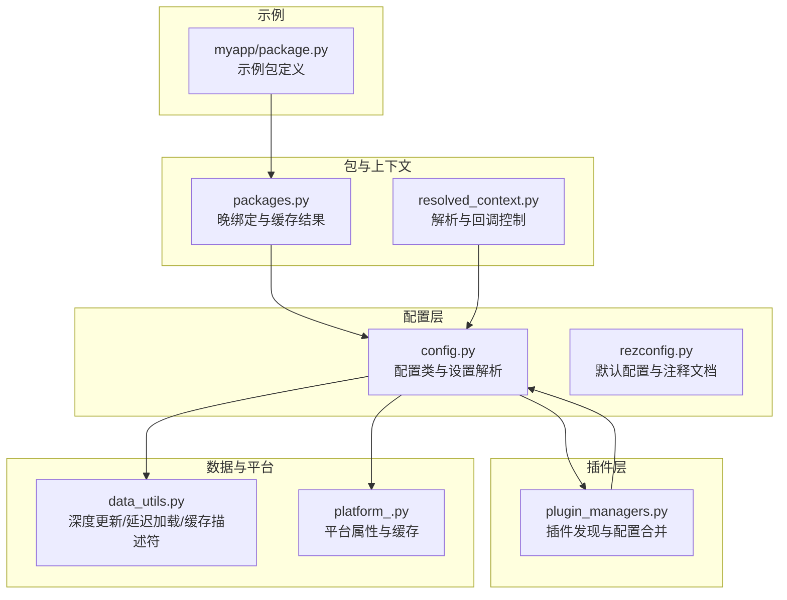
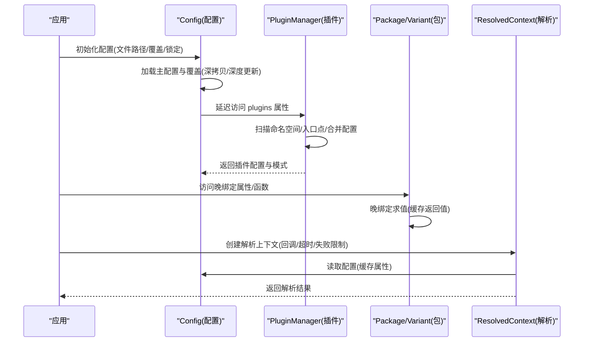
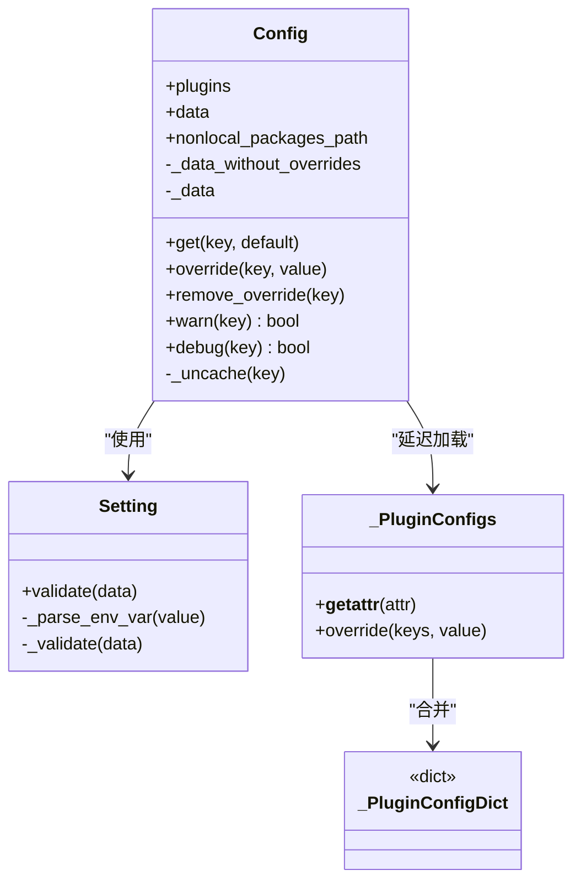
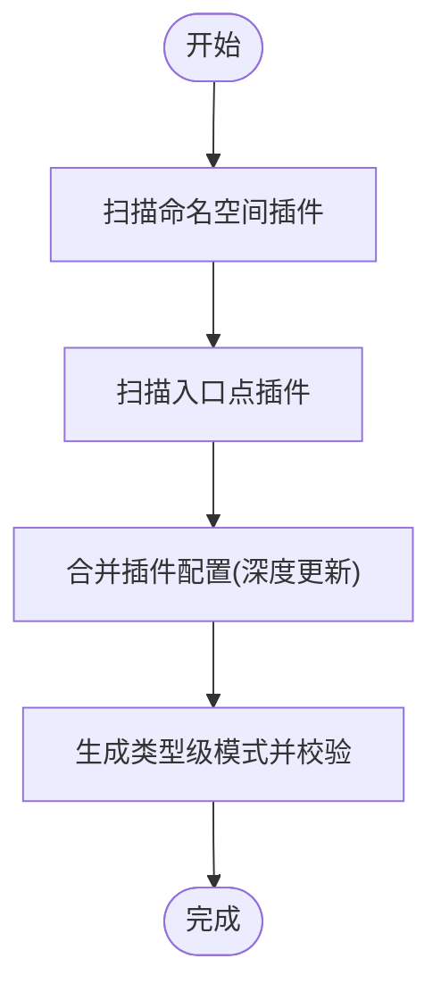
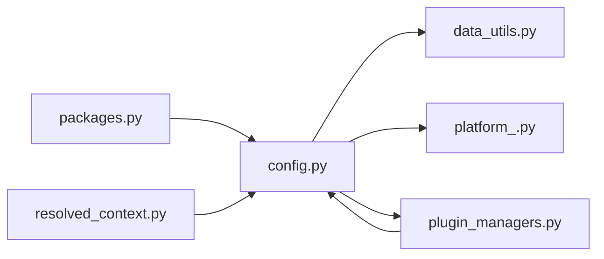

# 配置执行效率优化

<cite>
**本文引用的文件**
- [config.py](file://rez-3.3.0/src/rez/config.py)
- [rezconfig.py](file://rez-3.3.0/src/rez/rezconfig.py)
- [plugin_managers.py](file://rez-3.3.0/src/rez/plugin_managers.py)
- [data_utils.py](file://rez-3.3.0/src/rez/utils/data_utils.py)
- [platform_.py](file://rez-3.3.0/src/rez/utils/platform_.py)
- [packages.py](file://rez-3.3.0/src/rez/packages.py)
- [resolved_context.py](file://rez-3.3.0/src/rez/resolved_context.py)
- [package.py](file://my_packages/myapp/1.0.0/package.py)
</cite>

## 目录
1. [引言](#引言)
2. [项目结构](#项目结构)
3. [核心组件](#核心组件)
4. [架构总览](#架构总览)
5. [详细组件分析](#详细组件分析)
6. [依赖关系分析](#依赖关系分析)
7. [性能考量](#性能考量)
8. [故障排查指南](#故障排查指南)
9. [结论](#结论)
10. [附录](#附录)

## 引言
本指南聚焦于配置执行效率优化，围绕配置钩子、插件与动态计算的运行性能展开。通过对配置加载、验证、延迟求值与插件发现机制的深入分析，识别循环依赖、重复计算与阻塞操作等常见性能瓶颈，并结合 myapp 示例包展示如何优化钩子函数的执行顺序、减少 I/O 操作与合理使用异步处理。同时提供性能剖析工具的使用方法与具体优化建议，确保配置逻辑高效稳定运行。

## 项目结构
本仓库包含 Rez 核心库与示例包。与配置执行效率直接相关的模块包括：
- 配置核心：config.py、rezconfig.py
- 插件管理：plugin_managers.py
- 数据与缓存：data_utils.py
- 平台信息：platform_.py
- 包与动态计算：packages.py、resolved_context.py
- 示例包：myapp 的 package.py

图表来源
- [config.py](file://rez-3.3.0/src/rez/config.py#L536-L1046)
- [rezconfig.py](file://rez-3.3.0/src/rez/rezconfig.py#L1-L200)
- [plugin_managers.py](file://rez-3.3.0/src/rez/plugin_managers.py#L1-L200)
- [data_utils.py](file://rez-3.3.0/src/rez/utils/data_utils.py#L1-L200)
- [platform_.py](file://rez-3.3.0/src/rez/utils/platform_.py#L1-L120)
- [packages.py](file://rez-3.3.0/src/rez/packages.py#L140-L220)
- [resolved_context.py](file://rez-3.3.0/src/rez/resolved_context.py#L1-L120)
- [package.py](file://my_packages/myapp/1.0.0/package.py#L1-L33)

章节来源
- [config.py](file://rez-3.3.0/src/rez/config.py#L536-L1046)
- [rezconfig.py](file://rez-3.3.0/src/rez/rezconfig.py#L1-L200)
- [plugin_managers.py](file://rez-3.3.0/src/rez/plugin_managers.py#L1-L200)
- [data_utils.py](file://rez-3.3.0/src/rez/utils/data_utils.py#L1-L200)
- [platform_.py](file://rez-3.3.0/src/rez/utils/platform_.py#L1-L120)
- [packages.py](file://rez-3.3.0/src/rez/packages.py#L140-L220)
- [resolved_context.py](file://rez-3.3.0/src/rez/resolved_context.py#L1-L120)
- [package.py](file://my_packages/myapp/1.0.0/package.py#L1-L33)

## 核心组件
- 配置类与设置解析：负责从多源配置文件加载、合并、校验与延迟求值；支持环境变量覆盖与 JSON 覆盖；提供动态默认值与缓存属性。
- 插件管理器：按命名空间与入口点扫描插件，合并插件配置并进行模式校验；支持调试输出与失败记录。
- 数据工具：深度合并字典、列表修改器、延迟加载外部文件、缓存描述符与懒加载单例。
- 平台抽象：封装系统属性（如临时目录、编辑器、核心数）并以缓存属性避免重复探测。
- 包与动态计算：晚绑定函数在上下文中执行并缓存结果，避免重复计算。
- 解析上下文：控制解析过程的回调、超时与失败上限，支撑长耗时场景下的性能治理。

章节来源
- [config.py](file://rez-3.3.0/src/rez/config.py#L536-L1046)
- [plugin_managers.py](file://rez-3.3.0/src/rez/plugin_managers.py#L1-L200)
- [data_utils.py](file://rez-3.3.0/src/rez/utils/data_utils.py#L1-L200)
- [platform_.py](file://rez-3.3.0/src/rez/utils/platform_.py#L1-L120)
- [packages.py](file://rez-3.3.0/src/rez/packages.py#L140-L220)
- [resolved_context.py](file://rez-3.3.0/src/rez/resolved_context.py#L1-L120)

## 架构总览
配置执行流程自上而下分为“配置加载—插件发现—动态计算—解析执行”四个阶段。配置类负责优先级与覆盖策略，插件管理器负责插件配置合并，包与上下文负责晚绑定与回调控制，平台与数据工具提供缓存与 I/O 优化。

图表来源
- [config.py](file://rez-3.3.0/src/rez/config.py#L743-L840)
- [plugin_managers.py](file://rez-3.3.0/src/rez/plugin_managers.py#L117-L217)
- [packages.py](file://rez-3.3.0/src/rez/packages.py#L140-L220)
- [resolved_context.py](file://rez-3.3.0/src/rez/resolved_context.py#L160-L220)

## 详细组件分析

### 组件A：配置类与设置解析（config.py）
- 关键特性
  - 多源配置合并：模块根配置、环境变量指定文件、用户家目录配置、环境变量覆盖、JSON 覆盖、包定义内配置覆盖。
  - 延迟设置解析：Setting 子类按优先级解析，支持环境变量与 JSON 字符串覆盖，动态默认值通过 _get_xxx 方法提供。
  - 缓存与失效：cached_property 与 _uncache 用于缓存已解析值与触发失效，避免重复计算。
  - 插件配置延迟加载：_PluginConfigs 在首次访问时才合并插件配置并进行模式校验。
  - 文件加载与缓存：lru_cache 用于 YAML 配置文件加载，减少重复 I/O。

- 性能特征与优化点
  - 优先级链路短路：环境变量覆盖与 JSON 覆盖在早期判定，避免后续昂贵操作。
  - 动态默认值仅在缺失时计算：_get_xxx 方法延迟调用，配合平台缓存减少系统探测成本。
  - 深度更新与 ModifyList：deep_update 支持列表追加/前置，避免全量替换带来的重复计算。
  - 插件配置延迟：plugins 属性惰性加载，仅在需要时才扫描与合并插件配置。

图表来源
- [config.py](file://rez-3.3.0/src/rez/config.py#L536-L1046)

章节来源
- [config.py](file://rez-3.3.0/src/rez/config.py#L536-L1046)

### 组件B：插件管理与配置合并（plugin_managers.py）
- 关键特性
  - 插件发现：命名空间扫描与入口点加载，支持调试输出与失败记录。
  - 配置合并：从插件目录加载 rezconfig，使用 deep_update 合并到类型级配置字典。
  - 模式校验：基于插件类 schema_dict 生成类型级模式，统一校验插件配置。
  - 路径扩展：extend_path 将 plugin_path 中的子目录加入包路径，便于分发与定制。

- 性能特征与优化点
  - 懒加载与缓存：RezPluginType 与 RezPluginManager 使用 cached_property 与 LazySingleton，避免重复扫描与实例化。
  - 失败隔离：失败插件记录在 failed_plugins，不影响其他插件加载与配置校验。
  - 调试开关：debug("plugins") 控制日志输出，避免生产环境不必要的 I/O。

图表来源
- [plugin_managers.py](file://rez-3.3.0/src/rez/plugin_managers.py#L117-L217)

章节来源
- [plugin_managers.py](file://rez-3.3.0/src/rez/plugin_managers.py#L1-L200)

### 组件C：数据工具与缓存（data_utils.py）
- 关键特性
  - ModifyList：支持列表追加/前置，避免全量替换。
  - deep_update：递归合并字典，支持 ModifyList 与嵌套结构。
  - DelayLoad：延迟从 YAML/JSON 文件加载，按需读取，减少启动时 I/O。
  - cached_property/cached_class_property：属性与类级缓存，避免重复计算。
  - LazySingleton：线程安全的懒加载单例，减少对象创建开销。

- 性能特征与优化点
  - 深度合并避免重复构造：deep_update 对 ModifyList 先展平再应用，降低内存与 CPU 开销。
  - 延迟加载：DelayLoad 将昂贵的文件读取推迟到首次访问，显著缩短冷启动时间。
  - 类级缓存：cached_class_property 适用于跨实例共享的昂贵计算结果。

章节来源
- [data_utils.py](file://rez-3.3.0/src/rez/utils/data_utils.py#L1-L200)
- [data_utils.py](file://rez-3.3.0/src/rez/utils/data_utils.py#L226-L653)

### 组件D：平台抽象与动态默认值（platform_.py）
- 关键特性
  - 平台属性缓存：arch/os/tmpdir 等通过 cached_property 缓存，避免重复探测。
  - 动态默认值：config 中 _get_xxx 方法调用 platform_ 获取默认值，减少硬编码。
  - 核心数探测：物理/逻辑核心数探测失败时降级为 1，保证稳定性。

- 性能特征与优化点
  - 缓存命中：同一进程内多次访问平台属性无需再次探测。
  - 降级策略：异常时快速返回默认值，避免长时间阻塞。

章节来源
- [platform_.py](file://rez-3.3.0/src/rez/utils/platform_.py#L1-L120)
- [config.py](file://rez-3.3.0/src/rez/config.py#L776-L840)

### 组件E：包与动态计算（packages.py）
- 关键特性
  - 晚绑定：SourceCode.late_binding 的函数在上下文中执行，支持 this、context 等绑定。
  - 结果缓存：_late_binding_returnvalues 缓存晚绑定结果，避免重复执行。
  - 模式校验：可选 schema 校验晚绑定返回值，保证类型安全。

- 性能特征与优化点
  - 缓存优先：已缓存结果直接返回，避免重复执行昂贵逻辑。
  - 上下文绑定：仅在需要时注入上下文变量，减少不必要的全局状态。

章节来源
- [packages.py](file://rez-3.3.0/src/rez/packages.py#L140-L220)

### 组件F：解析上下文与回调控制（resolved_context.py）
- 关键特性
  - 回调控制：Callback 类根据失败次数与时间限制决定是否终止解析。
  - 超时与失败上限：支持 time_limit 与 max_fails，防止长时间阻塞。
  - 缓存与 I/O：结合配置缓存选项与平台缓存，减少重复 I/O。

- 性能特征与优化点
  - 主动早停：达到失败上限或超时立即终止，避免资源浪费。
  - 线程局部存储：local/threading.Lock 保障并发安全与状态隔离。

章节来源
- [resolved_context.py](file://rez-3.3.0/src/rez/resolved_context.py#L140-L220)

### 示例：myapp 包的命令与动态计算
- 特性
  - commands 函数在环境中加载时执行，设置 PATH/PYTHONPATH 等。
  - 变体列表定义不同 Python 版本组合，解析时按请求选择最优变体。

- 优化建议
  - 将复杂逻辑移至晚绑定函数或插件钩子，避免在 commands 中执行昂贵操作。
  - 利用缓存与延迟加载减少重复 I/O 与系统探测。

章节来源
- [package.py](file://my_packages/myapp/1.0.0/package.py#L1-L33)

## 依赖关系分析
- 配置类依赖数据工具（deep_update、cached_property）、平台抽象（动态默认值）、插件管理器（插件配置合并）。
- 插件管理器依赖配置类（读取 plugin_path、debug 开关）与数据工具（深度更新）。
- 包与上下文依赖配置类（读取缓存与默认值）与平台抽象（系统属性）。

图表来源
- [config.py](file://rez-3.3.0/src/rez/config.py#L536-L1046)
- [plugin_managers.py](file://rez-3.3.0/src/rez/plugin_managers.py#L1-L200)
- [data_utils.py](file://rez-3.3.0/src/rez/utils/data_utils.py#L1-L200)
- [platform_.py](file://rez-3.3.0/src/rez/utils/platform_.py#L1-L120)
- [packages.py](file://rez-3.3.0/src/rez/packages.py#L140-L220)
- [resolved_context.py](file://rez-3.3.0/src/rez/resolved_context.py#L1-L120)

章节来源
- [config.py](file://rez-3.3.0/src/rez/config.py#L536-L1046)
- [plugin_managers.py](file://rez-3.3.0/src/rez/plugin_managers.py#L1-L200)
- [data_utils.py](file://rez-3.3.0/src/rez/utils/data_utils.py#L1-L200)
- [platform_.py](file://rez-3.3.0/src/rez/utils/platform_.py#L1-L120)
- [packages.py](file://rez-3.3.0/src/rez/packages.py#L140-L220)
- [resolved_context.py](file://rez-3.3.0/src/rez/resolved_context.py#L1-L120)

## 性能考量
- 避免循环依赖
  - 配置类与插件管理器之间采用单向依赖：Config 依赖 PluginManager 的配置数据，但不反向依赖 Config，防止初始化环路。
  - 插件配置合并通过 _PluginConfigs 延迟访问，避免在 Config 构造期间触发插件扫描。

- 减少重复计算
  - 使用 cached_property/cached_class_property 缓存昂贵计算（平台属性、配置项）。
  - 使用 _uncache 在覆盖变更时主动失效缓存，确保一致性。

- 降低阻塞操作
  - DelayLoad 将文件读取延迟到首次访问，减少启动时 I/O。
  - 深度更新使用 ModifyList 与浅层展平，避免大对象全量复制。

- 优化插件加载
  - 命名空间与入口点双通道扫描，失败插件记录在 failed_plugins，不影响主流程。
  - 调试开关 debug("plugins") 控制日志输出，避免生产环境冗余 I/O。

- 解析阶段的性能治理
  - 回调控制：max_fails 与 time_limit 主动早停，避免长时间阻塞。
  - 缓存策略：结合 resolve_caching、cache_package_files、cache_listdir 等配置，减少重复读取。

[本节为通用指导，不直接分析具体文件]

## 故障排查指南
- 配置加载错误
  - 现象：配置文件加载失败或模式校验错误。
  - 排查：检查配置文件优先级链路与环境变量覆盖；启用 debug("config") 或相关 debug_* 设置查看详细日志。
  - 参考路径：配置加载与校验逻辑、lru_cache 的 YAML 加载。

- 插件加载失败
  - 现象：插件未加载或报错。
  - 排查：查看 failed_plugins 列表与调试输出；确认 plugin_path 与入口点配置正确。
  - 参考路径：插件扫描与错误打印逻辑。

- 晚绑定函数性能问题
  - 现象：commands 或晚绑定函数执行缓慢。
  - 排查：检查是否重复执行昂贵逻辑；利用缓存结果；将复杂逻辑迁移到插件钩子或预处理函数。
  - 参考路径：晚绑定执行与缓存逻辑。

- 解析超时或失败过多
  - 现象：解析长时间卡住或频繁失败。
  - 排查：调整 max_fails 与 time_limit；检查 package_filter 与 package_orderers；开启 debug_resolve_memcache 观察缓存命中情况。
  - 参考路径：回调控制与解析上下文。

章节来源
- [config.py](file://rez-3.3.0/src/rez/config.py#L743-L840)
- [plugin_managers.py](file://rez-3.3.0/src/rez/plugin_managers.py#L200-L260)
- [packages.py](file://rez-3.3.0/src/rez/packages.py#L140-L220)
- [resolved_context.py](file://rez-3.3.0/src/rez/resolved_context.py#L140-L220)

## 结论
通过合理运用缓存、延迟加载、深度合并与回调控制，可在不牺牲功能的前提下显著提升配置执行效率。建议优先：
- 使用 cached_property 缓存昂贵计算；
- 将 I/O 与系统探测延迟到首次访问；
- 利用深度更新与 ModifyList 避免全量替换；
- 在插件与包的晚绑定逻辑中复用缓存结果；
- 在解析阶段启用早停与缓存策略，防止长时间阻塞。

[本节为总结，不直接分析具体文件]

## 附录
- 性能剖析工具使用建议
  - Python 内置：cProfile/line_profiler 分析热点函数；memory_profiler 监控内存增长。
  - Rez 自带：启用 debug_* 与 debug("plugins") 输出，观察加载与校验路径；使用 catch_rex_errors 控制错误显示。
  - 外部缓存：结合 memcached_uri 与压缩阈值配置，评估网络与磁盘 I/O 影响。

- 代码优化建议清单
  - 将昂贵逻辑放入晚绑定函数并缓存结果；
  - 使用 ModifyList 进行增量配置更新；
  - 在插件中使用入口点而非仅命名空间扫描；
  - 合理设置 time_limit/max_fails，避免长时间阻塞；
  - 使用平台缓存属性减少系统探测。

[本节为通用指导，不直接分析具体文件]