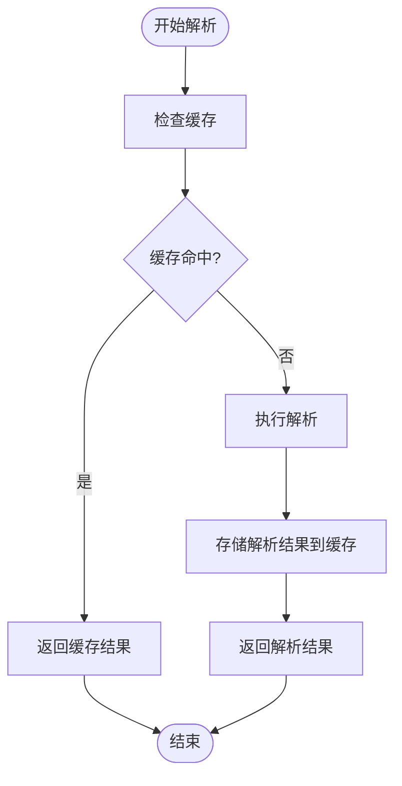
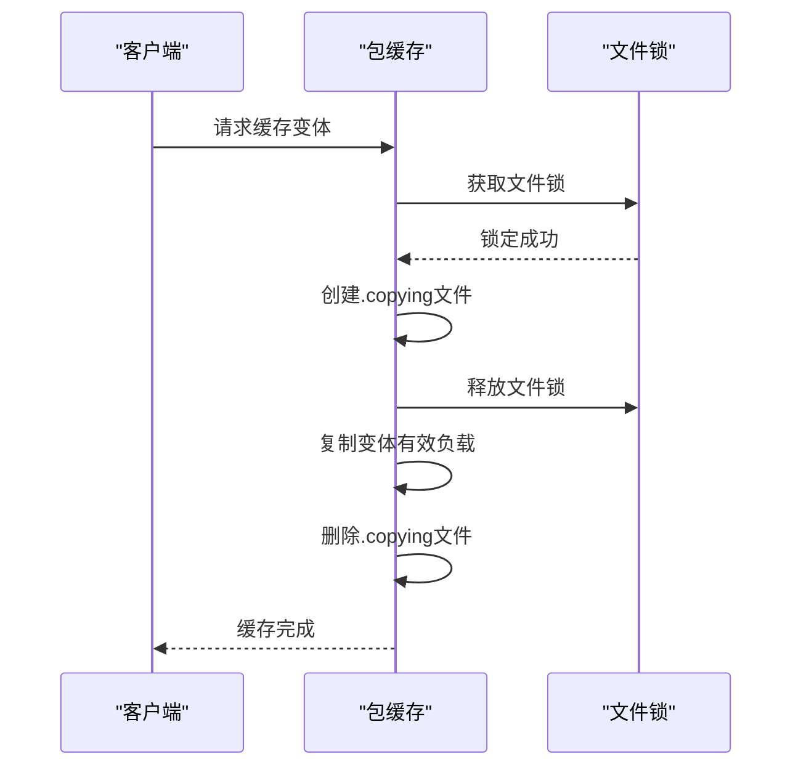

# 配置缓存机制

<cite>
**本文档引用的文件**   
- [caching.rst](file://rez-3.3.0\docs\source\caching.rst)
- [config.py](file://rez-3.3.0\src\rez\config.py)
- [package_cache.py](file://rez-3.3.0\src\rez\package_cache.py)
- [rezconfig.py](file://rez-3.3.0\src\rez\rezconfig.py)
- [pkg-cache.py](file://rez-3.3.0\src\rez\cli\pkg-cache.py)
- [myapp/package.py](file://my_packages\myapp\1.0.0\package.py)
</cite>

## 目录
1. [缓存机制概述](#缓存机制概述)
2. [配置缓存系统](#配置缓存系统)
3. [缓存键生成与失效机制](#缓存键生成与失效机制)
4. [并发控制与线程安全](#并发控制与线程安全)
5. [myapp示例包的缓存配置](#myapp示例包的缓存配置)
6. [缓存性能监控与基准测试](#缓存性能监控与基准测试)
7. [常见缓存问题排查](#常见缓存问题排查)
8. [总结](#总结)

## 缓存机制概述

Rez的配置缓存系统包含两个主要部分：解析缓存（Resolve Caching）和包缓存（Package Caching）。解析缓存使用memcached数据库来存储解析结果，而包缓存则将包的有效负载复制到本地磁盘以加速运行时环境。

解析缓存通过将解析结果存储在memcached中，使得在多台机器的环境中，执行已缓存解析的机器可以直接接收缓存结果，而不是重新进行解析。这可以显著减少解析环境所需的时间。包缓存则是将包的有效负载复制到本地磁盘，避免通过网络从共享存储加载文件，从而提高运行时性能。

**Section sources**
- [caching.rst](file://rez-3.3.0\docs\source\caching.rst#L1-L273)

## 配置缓存系统

要启用Rez的缓存功能，需要在配置文件中设置相应的参数。主要的配置参数包括`memcached_uri`用于启用解析缓存，以及`cache_packages_path`用于启用包缓存。

在`rezconfig.py`文件中，可以通过设置`memcached_uri`来指定memcached服务器的地址。例如，如果memcached运行在本地主机的默认端口上，可以设置如下：

```python
memcached_uri = ["127.0.0.1:11211"]
```

对于包缓存，需要设置`cache_packages_path`来指定缓存目录的路径。此外，还可以通过`default_cachable`、`default_cachable_per_package`和`default_cachable_per_repository`等参数来控制哪些包可以被缓存。

**Section sources**
- [rezconfig.py](file://rez-3.3.0\src\rez\rezconfig.py#L1-L1189)
- [config.py](file://rez-3.3.0\src\rez\config.py#L1-L1046)

## 缓存键生成与失效机制

Rez的缓存系统使用复杂的键生成策略来确保缓存的一致性和有效性。在解析缓存中，缓存键是基于请求的包、时间戳和其他相关因素生成的。当有新的包版本发布时，缓存会自动失效，以确保解析结果的正确性。

在包缓存中，每个变体（variant）的缓存键是基于其唯一标识符（"handle"）的部分哈希值生成的。这种设计避免了哈希冲突，并且通过增量命名的子目录（'a', 'b', ..., 'aa', 'ab', ...）来进一步区分不同的变体。缓存条目在以下情况下会被删除：
- 当包发生变化时；
- 当解析结果不再适用时。



**Diagram sources **
- [resolver.py](file://rez-3.3.0\src\rez\resolver.py#L203-L238)
- [package_cache.py](file://rez-3.3.0\src\rez\package_cache.py#L348-L631)

**Section sources**
- [resolver.py](file://rez-3.3.0\src\rez\resolver.py#L203-L238)
- [package_cache.py](file://rez-3.3.0\src\rez\package_cache.py#L348-L631)

## 并发控制与线程安全

Rez的缓存系统设计为线程和多进程安全的。它使用文件锁来控制对缓存的访问，确保在多线程或多进程环境下不会发生数据竞争。

在包缓存中，当一个变体正在被复制到缓存时，会创建一个`.copying-a`（或-b, -c等）文件，以告知其他进程该变体正在被复制且不能使用。一旦复制完成，这个文件就会被删除。这种机制确保了即使在多个进程同时尝试缓存同一个变体时，也不会出现数据损坏或不一致的情况。



**Diagram sources **
- [package_cache.py](file://rez-3.3.0\src\rez\package_cache.py#L216-L226)
- [utils/memcached.py](file://rez-3.3.0\src\rez\utils\memcached.py#L164-L210)

**Section sources**
- [package_cache.py](file://rez-3.3.0\src\rez\package_cache.py#L216-L226)
- [utils/memcached.py](file://rez-3.3.0\src\rez\utils\memcached.py#L164-L210)

## myapp示例包的缓存配置

以`myapp`示例包为例，展示如何通过合理配置缓存来显著减少环境解析时间。首先，确保`myapp`包的`cachable`属性设置为`True`，以便它可以被缓存。

在`myapp`包的`package.py`文件中，可以添加如下配置：

```python
cachable = True
```

然后，在全局配置文件中设置`cache_packages_path`指向一个本地磁盘路径，例如：

```python
cache_packages_path = "/local/cache/rez"
```

这样，当使用`myapp`包时，其有效负载会被复制到本地缓存目录中，从而加快后续的环境解析速度。

**Section sources**
- [myapp/package.py](file://my_packages\myapp\1.0.0\package.py#L1-L33)
- [rezconfig.py](file://rez-3.3.0\src\rez\rezconfig.py#L232-L265)

## 缓存性能监控与基准测试

为了监控缓存的性能，可以使用`rez-memcache`命令行工具来查看缓存的命中率和统计信息。例如，运行以下命令可以显示缓存服务器的命中率和内存使用情况：

```bash
$ rez-memcache
```

此外，还可以通过设置`debug_memcache`配置参数来打印与memcached使用相关的调试信息。这对于验证缓存操作是否按预期工作非常有用。

对于包缓存，可以使用`rez-pkg-cache`工具来查看缓存的状态、清理未使用的变体以及执行其他维护操作。例如，运行以下命令可以查看当前缓存中的变体状态：

```bash
$ rez-pkg-cache
```

**Section sources**
- [caching.rst](file://rez-3.3.0\docs\source\caching.rst#L64-L78)
- [pkg-cache.py](file://rez-3.3.0\src\rez\cli\pkg-cache.py#L1-L226)

## 常见缓存问题排查

在使用Rez缓存系统时，可能会遇到一些常见问题。以下是几个典型问题及其解决方案：

1. **缓存未命中**：如果发现缓存命中率很低，可能是因为缓存键生成策略导致的。检查是否有频繁变化的时间戳或其他动态因素影响了缓存键的稳定性。

2. **缓存空间不足**：如果缓存目录的空间不足，可以调整`package_cache_space_buffer`和`package_cache_used_threshold`参数来控制磁盘使用量。定期运行`rez-pkg-cache --clean`命令来清理未使用的变体。

3. **缓存条目停滞**：如果某个变体的复制过程停滞，可以在日志中查找相关信息。运行`rez-pkg-cache --logs`命令查看详细的日志输出，找出问题所在。

4. **并发访问冲突**：虽然Rez的缓存系统设计为线程和多进程安全的，但在极端情况下仍可能出现并发访问冲突。确保正确使用文件锁机制，并检查是否有其他进程干扰了缓存操作。

**Section sources**
- [caching.rst](file://rez-3.3.0\docs\source\caching.rst#L246-L273)
- [test_package_cache.py](file://rez-3.3.0\src\rez\tests\test_package_cache.py#L1-L343)

## 总结

Rez的配置缓存系统通过解析缓存和包缓存两种机制，显著提高了环境解析和运行时性能。通过合理配置缓存参数、理解缓存键生成策略和失效机制，以及有效监控和维护缓存，用户可以最大化利用缓存提升系统响应速度。结合`myapp`示例包的实际应用，展示了如何通过配置缓存来优化工作流程。遵循本文提供的指南，可以帮助用户更好地管理和优化Rez环境中的缓存使用。