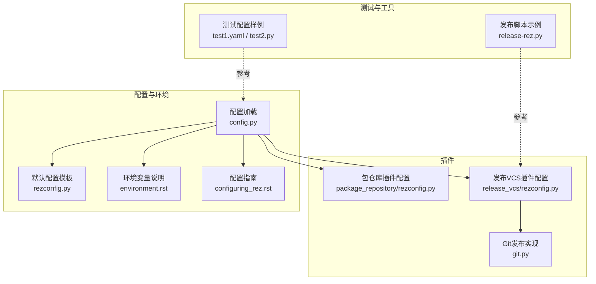
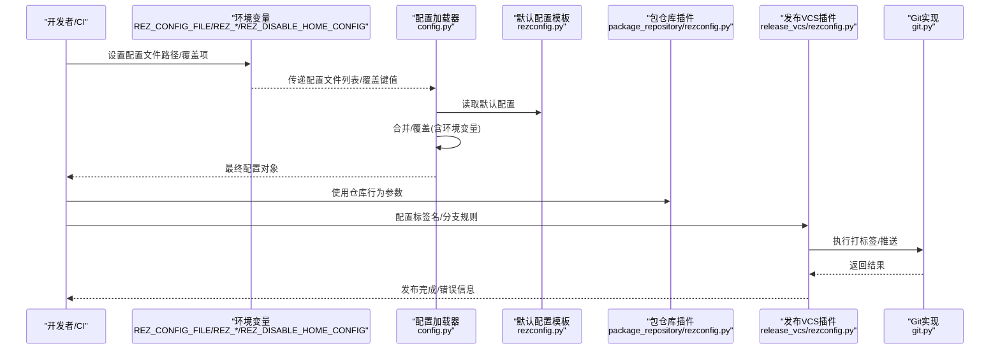
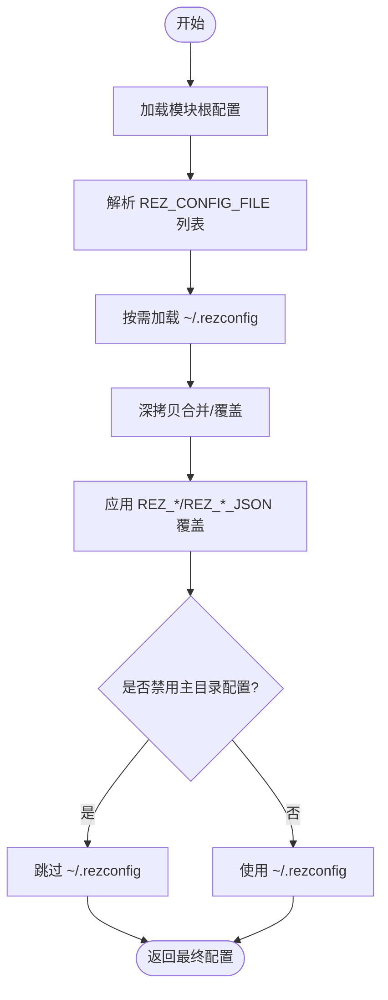
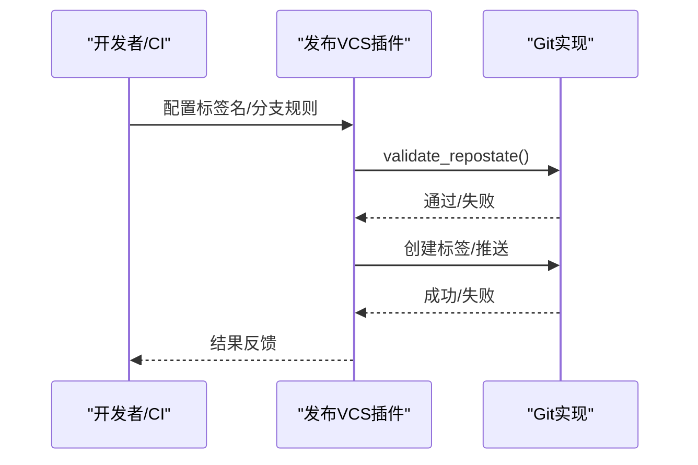
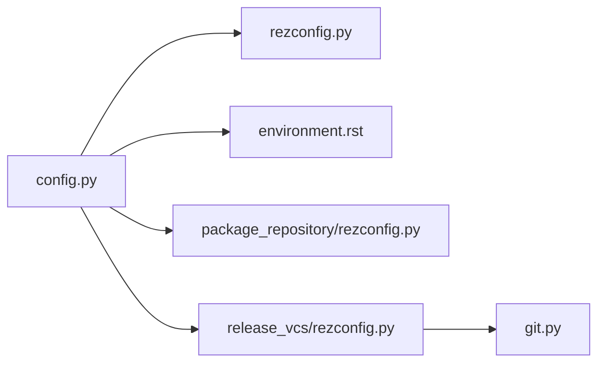
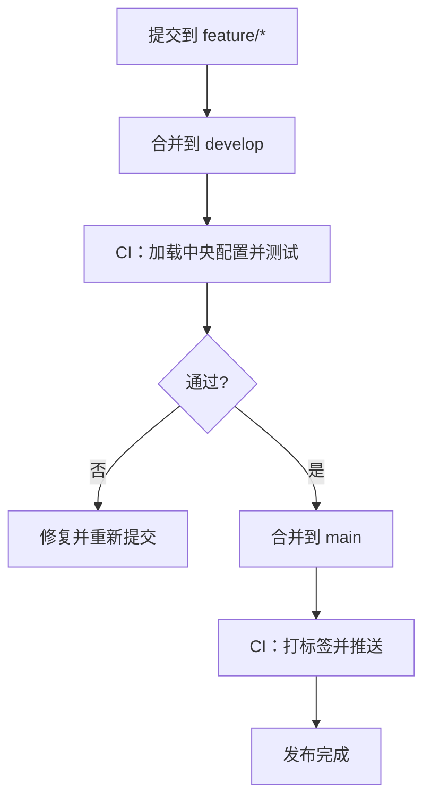

# 中央配置仓库与版本控制

<cite>
**本文引用的文件**
- [config.py](file://rez-3.3.0/src/rez/config.py)
- [rezconfig.py](file://rez-3.3.0/src/rez/rezconfig.py)
- [package_repository/rezconfig.py](file://rez-3.3.0/src/rezplugins/package_repository/rezconfig.py)
- [release_vcs/rezconfig.py](file://rez-3.3.0/src/rezplugins/release_vcs/rezconfig.py)
- [git.py](file://rez-3.3.0/src/rezplugins/release_vcs/git.py)
- [environment.rst](file://rez-3.3.0/docs/source/environment.rst)
- [configuring_rez.rst](file://rez-3.3.0/docs/source/guides/configuring_rez.rst)
- [test1.yaml](file://rez-3.3.0/src/rez/data/tests/config/test1.yaml)
- [test2.py](file://rez-3.3.0/src/rez/data/tests/config/test2.py)
- [release-rez.py](file://rez-3.3.0/release-rez.py)
</cite>

## 目录
1. [引言](#引言)
2. [项目结构](#项目结构)
3. [核心组件](#核心组件)
4. [架构总览](#架构总览)
5. [详细组件分析](#详细组件分析)
6. [依赖关系分析](#依赖关系分析)
7. [性能考量](#性能考量)
8. [故障排查指南](#故障排查指南)
9. [结论](#结论)
10. [附录](#附录)

## 引言
本指南围绕“中央配置仓库与版本控制”主题，系统阐述如何通过专用包仓库集中管理团队配置策略，并结合 Rez 的配置搜索路径机制，将配置仓库作为统一来源，配合版本化配置包（例如 config-core-1.0.0）实现变更追踪与回滚。文档重点解释 REZ_CONFIG_PATH 等关键环境变量在多环境同步中的作用，并给出基于 Git 的配置仓库工作流示例，包括分支策略、CI 验证与发布流程，确保生产环境配置的一致性与可审计性。

## 项目结构
本仓库包含 Rez 核心源码、插件与文档。与本指南直接相关的关键位置如下：
- 配置加载与优先级：核心配置文件与环境变量覆盖逻辑位于配置模块
- 包仓库插件配置：定义文件锁、校验等仓库行为
- 发布与版本控制：发布 VCS 插件与 Git 行为
- 文档：环境变量与配置指南

图表来源
- [config.py](file://rez-3.3.0/src/rez/config.py#L549-L775)
- [rezconfig.py](file://rez-3.3.0/src/rez/rezconfig.py#L1-L120)
- [package_repository/rezconfig.py](file://rez-3.3.0/src/rezplugins/package_repository/rezconfig.py#L1-L49)
- [release_vcs/rezconfig.py](file://rez-3.3.0/src/rezplugins/release_vcs/rezconfig.py#L1-L47)
- [git.py](file://rez-3.3.0/src/rezplugins/release_vcs/git.py#L83-L241)
- [environment.rst](file://rez-3.3.0/docs/source/environment.rst#L206-L243)
- [configuring_rez.rst](file://rez-3.3.0/docs/source/guides/configuring_rez.rst#L1-L200)
- [test1.yaml](file://rez-3.3.0/src/rez/data/tests/config/test1.yaml#L1-L9)
- [test2.py](file://rez-3.3.0/src/rez/data/tests/config/test2.py#L1-L10)
- [release-rez.py](file://rez-3.3.0/release-rez.py#L87-L128)

章节来源
- [config.py](file://rez-3.3.0/src/rez/config.py#L549-L775)
- [rezconfig.py](file://rez-3.3.0/src/rez/rezconfig.py#L1-L120)

## 核心组件
- 配置加载与优先级
  - 默认配置模板提供全局默认值；支持通过环境变量与多文件叠加覆盖；支持禁用用户主目录配置。
- 包仓库插件
  - 定义文件锁类型、超时、子目录等仓库行为参数，保障并发安装一致性。
- 发布 VCS 插件与 Git 实现
  - 控制标签命名、可发布分支、上游检查、打标签与推送等流程。
- 环境变量与配置指南
  - 明确 REZ_CONFIG_FILE、REZ_XXX、REZ_XXX_JSON、REZ_DISABLE_HOME_CONFIG 等对配置的影响。

章节来源
- [config.py](file://rez-3.3.0/src/rez/config.py#L549-L775)
- [rezconfig.py](file://rez-3.3.0/src/rez/rezconfig.py#L1-L120)
- [package_repository/rezconfig.py](file://rez-3.3.0/src/rezplugins/package_repository/rezconfig.py#L1-L49)
- [release_vcs/rezconfig.py](file://rez-3.3.0/src/rezplugins/release_vcs/rezconfig.py#L1-L47)
- [git.py](file://rez-3.3.0/src/rezplugins/release_vcs/git.py#L83-L241)
- [environment.rst](file://rez-3.3.0/docs/source/environment.rst#L206-L243)

## 架构总览
下图展示配置加载、环境变量覆盖、包仓库与发布 VCS 的交互关系。

图表来源
- [config.py](file://rez-3.3.0/src/rez/config.py#L549-L775)
- [rezconfig.py](file://rez-3.3.0/src/rez/rezconfig.py#L1-L120)
- [package_repository/rezconfig.py](file://rez-3.3.0/src/rezplugins/package_repository/rezconfig.py#L1-L49)
- [release_vcs/rezconfig.py](file://rez-3.3.0/src/rezplugins/release_vcs/rezconfig.py#L1-L47)
- [git.py](file://rez-3.3.0/src/rezplugins/release_vcs/git.py#L83-L241)

## 详细组件分析

### 组件A：配置加载与优先级（config.py）
- 关键点
  - 支持从模块根配置、REZ_CONFIG_FILE 指定的多个文件、用户主目录配置文件加载；
  - 支持通过 REZ_XXX 与 REZ_XXX_JSON 覆盖配置；
  - 支持禁用用户主目录配置；
  - 提供缓存属性与深拷贝合并，保证覆盖顺序与性能。
- 与“中央配置仓库”的关系
  - 将中央配置仓库映射到 REZ_CONFIG_FILE，即可统一注入团队配置；
  - 通过 JSON 覆盖支持复杂结构的动态覆盖。

图表来源
- [config.py](file://rez-3.3.0/src/rez/config.py#L549-L775)
- [environment.rst](file://rez-3.3.0/docs/source/environment.rst#L206-L243)

章节来源
- [config.py](file://rez-3.3.0/src/rez/config.py#L549-L775)
- [environment.rst](file://rez-3.3.0/docs/source/environment.rst#L206-L243)

### 组件B：默认配置模板（rezconfig.py）
- 关键点
  - 定义包搜索路径、本地/发布包路径、缓存、解析、环境变量处理等默认设置；
  - 注释中明确配置优先级与变量扩展规则；
  - 为“中央配置仓库”提供默认值参考与覆盖入口。
- 与“中央配置仓库”的关系
  - 中央仓库可覆盖默认路径与行为，确保团队一致的包搜索与缓存策略。

章节来源
- [rezconfig.py](file://rez-3.3.0/src/rez/rezconfig.py#L1-L120)

### 组件C：包仓库插件配置（package_repository/rezconfig.py）
- 关键点
  - 文件锁类型、超时、子目录等参数，保障并发安装一致性；
  - 可选校验包定义文件，提升稳定性。
- 与“中央配置仓库”的关系
  - 通过统一的仓库行为参数，确保各环境一致的安装与并发控制。

章节来源
- [package_repository/rezconfig.py](file://rez-3.3.0/src/rezplugins/package_repository/rezconfig.py#L1-L49)

### 组件D：发布 VCS 插件与 Git 实现（release_vcs/rezconfig.py, git.py）
- 关键点
  - 标签命名格式、可发布分支正则、是否检查已存在标签；
  - Git 实现校验裸仓库、上游分支、本地分支合法性，执行打标签与推送。
- 与“中央配置仓库”的关系
  - 通过统一的标签命名与分支策略，确保配置包版本化发布与可追溯。

图表来源
- [release_vcs/rezconfig.py](file://rez-3.3.0/src/rezplugins/release_vcs/rezconfig.py#L1-L47)
- [git.py](file://rez-3.3.0/src/rezplugins/release_vcs/git.py#L83-L241)

章节来源
- [release_vcs/rezconfig.py](file://rez-3.3.0/src/rezplugins/release_vcs/rezconfig.py#L1-L47)
- [git.py](file://rez-3.3.0/src/rezplugins/release_vcs/git.py#L83-L241)

### 组件E：环境变量与配置指南（environment.rst, configuring_rez.rst）
- 关键点
  - 明确 REZ_CONFIG_FILE、REZ_XXX、REZ_XXX_JSON、REZ_DISABLE_HOME_CONFIG 的作用；
  - 配置指南说明配置优先级与变量扩展。
- 与“中央配置仓库”的关系
  - 通过 REZ_CONFIG_FILE 指向中央仓库中的配置文件，实现跨环境同步；
  - 通过 REZ_XXX/REZ_XXX_JSON 在运行时微调。

章节来源
- [environment.rst](file://rez-3.3.0/docs/source/environment.rst#L206-L243)
- [configuring_rez.rst](file://rez-3.3.0/docs/source/guides/configuring_rez.rst#L1-L200)

### 组件F：测试配置样例（test1.yaml, test2.py）
- 关键点
  - 展示了插件配置与复杂结构覆盖的写法，便于理解 REZ_XXX_JSON 的使用场景。
- 与“中央配置仓库”的关系
  - 可作为编写中央仓库配置样例的参考。

章节来源
- [test1.yaml](file://rez-3.3.0/src/rez/data/tests/config/test1.yaml#L1-L9)
- [test2.py](file://rez-3.3.0/src/rez/data/tests/config/test2.py#L1-L10)

## 依赖关系分析
- 配置加载依赖于默认模板与环境变量；
- 包仓库与发布 VCS 插件依赖配置加载器提供的最终配置；
- Git 实现依赖发布 VCS 插件的设置。

图表来源
- [config.py](file://rez-3.3.0/src/rez/config.py#L549-L775)
- [rezconfig.py](file://rez-3.3.0/src/rez/rezconfig.py#L1-L120)
- [package_repository/rezconfig.py](file://rez-3.3.0/src/rezplugins/package_repository/rezconfig.py#L1-L49)
- [release_vcs/rezconfig.py](file://rez-3.3.0/src/rezplugins/release_vcs/rezconfig.py#L1-L47)
- [git.py](file://rez-3.3.0/src/rezplugins/release_vcs/git.py#L83-L241)

章节来源
- [config.py](file://rez-3.3.0/src/rez/config.py#L549-L775)
- [release_vcs/rezconfig.py](file://rez-3.3.0/src/rezplugins/release_vcs/rezconfig.py#L1-L47)
- [git.py](file://rez-3.3.0/src/rezplugins/release_vcs/git.py#L83-L241)

## 性能考量
- 配置加载采用缓存属性与深拷贝合并，避免重复解析与覆盖计算；
- 包缓存与资源缓存可减少重复读取与解析成本；
- 并发安装通过文件锁与超时控制，避免竞态与死锁。

章节来源
- [config.py](file://rez-3.3.0/src/rez/config.py#L549-L775)
- [rezconfig.py](file://rez-3.3.0/src/rez/rezconfig.py#L120-L220)
- [package_repository/rezconfig.py](file://rez-3.3.0/src/rezplugins/package_repository/rezconfig.py#L1-L49)

## 故障排查指南
- 常见问题与定位
  - 配置未生效：检查 REZ_CONFIG_FILE 是否正确指向中央仓库配置文件；确认未启用 REZ_DISABLE_HOME_CONFIG 导致被跳过；
  - 复杂结构覆盖失败：使用 REZ_XXX_JSON 提供 JSON 字符串进行覆盖；
  - 发布失败：检查发布 VCS 插件的标签命名与可发布分支配置；确认 Git 实现的上游分支与仓库状态。
- 参考实现
  - 发布脚本示例展示了打标签与推送的基本流程，可用于验证发布链路。

章节来源
- [environment.rst](file://rez-3.3.0/docs/source/environment.rst#L206-L243)
- [release_vcs/rezconfig.py](file://rez-3.3.0/src/rezplugins/release_vcs/rezconfig.py#L1-L47)
- [git.py](file://rez-3.3.0/src/rezplugins/release_vcs/git.py#L83-L241)
- [release-rez.py](file://rez-3.3.0/release-rez.py#L87-L128)

## 结论
通过将“中央配置仓库”映射到 REZ_CONFIG_FILE，并结合 REZ_XXX/REZ_XXX_JSON 的环境变量覆盖，可在多环境中实现统一、可审计的配置管理。配合包仓库插件与发布 VCS 插件，可实现版本化配置包的变更追踪与回滚。建议在团队内推广统一的分支策略与 CI 验证流程，确保生产环境配置的一致性与安全性。

## 附录

### 基于 Git 的配置仓库工作流（示例）
- 分支策略
  - main：稳定发布分支，仅允许通过 CI 合并；
  - develop：集成分支，日常开发提交；
  - feature/*：功能分支，完成后合并至 develop。
- CI 验证
  - 触发条件：push 到 feature/* 或 PR 到 develop/main；
  - 步骤：拉取中央配置仓库、加载配置、运行最小化测试（如解析与基本命令）。
- 发布流程
  - 在 main 上打标签并推送，触发发布 VCS 插件创建标签与推送；
  - 使用统一的标签命名格式，确保版本唯一且可追溯。

图表来源
- [release_vcs/rezconfig.py](file://rez-3.3.0/src/rezplugins/release_vcs/rezconfig.py#L1-L47)
- [git.py](file://rez-3.3.0/src/rezplugins/release_vcs/git.py#L83-L241)
- [release-rez.py](file://rez-3.3.0/release-rez.py#L87-L128)