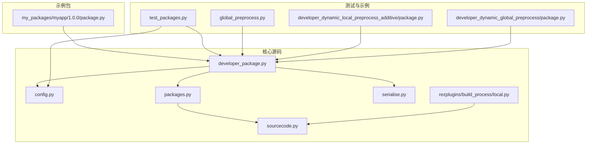
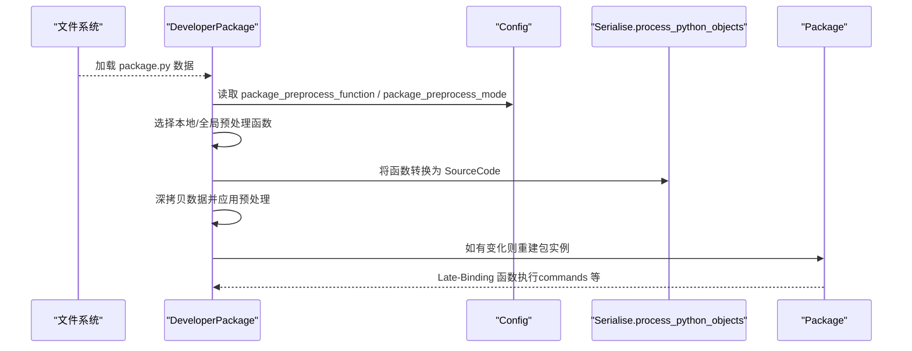
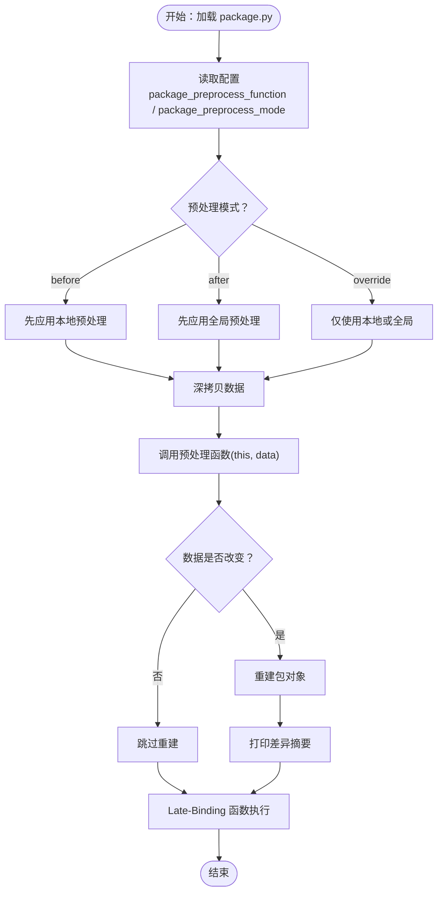
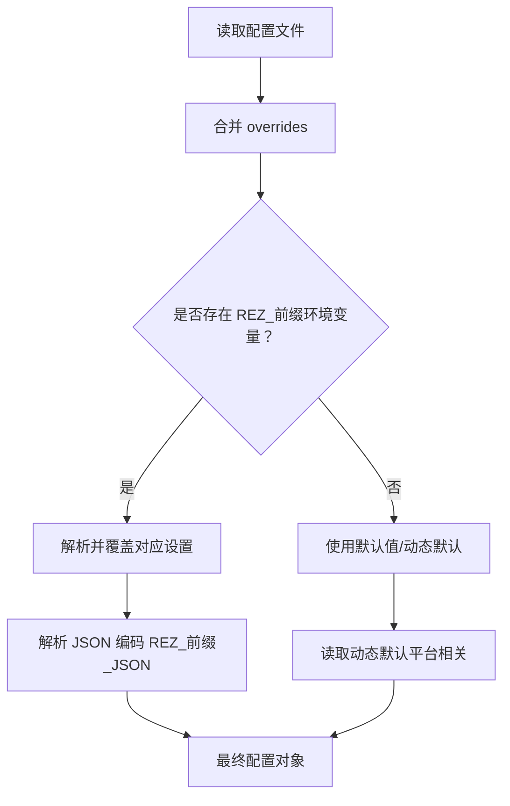
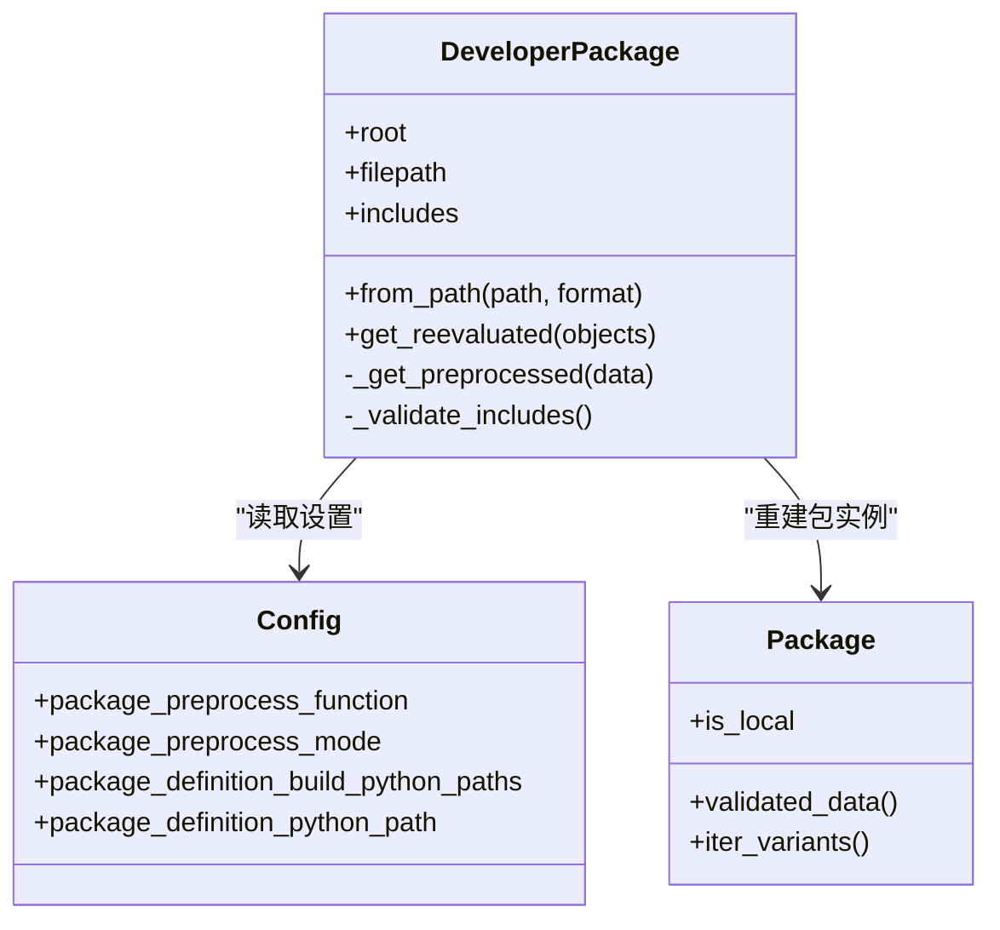
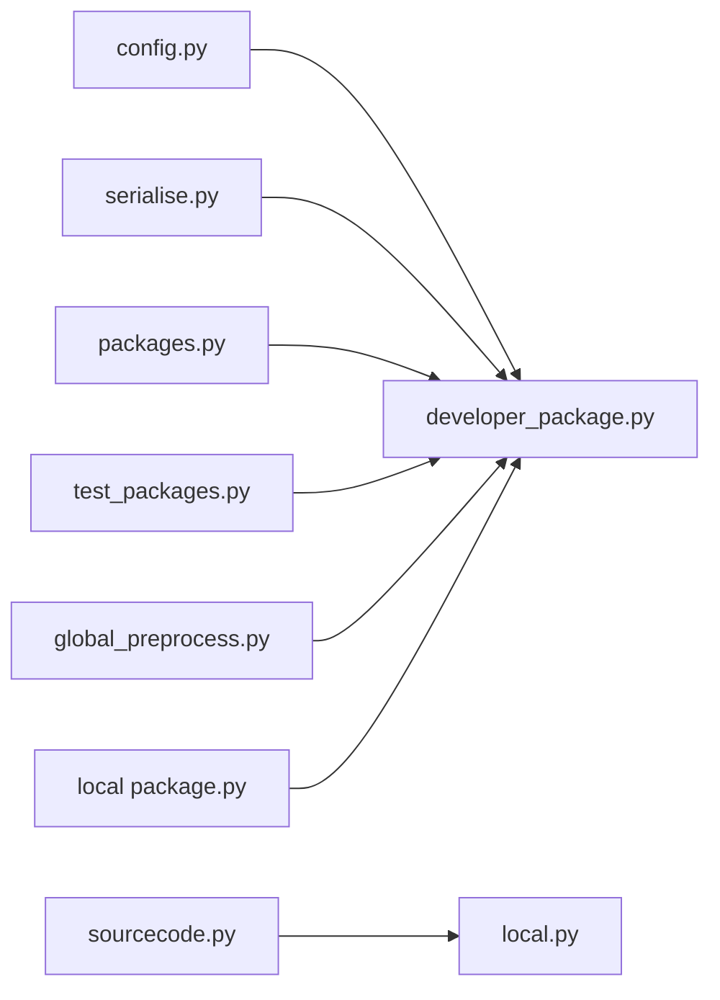

# 动态配置加载与预处理

<cite>
**本文引用的文件**
- [myapp/1.0.0/package.py](file://my_packages/myapp/1.0.0/package.py)
- [developer_package.py](file://rez-3.3.0/src/rez/developer_package.py)
- [config.py](file://rez-3.3.0/src/rez/config.py)
- [packages.py](file://rez-3.3.0/src/rez/packages.py)
- [serialise.py](file://rez-3.3.0/src/rez/serialise.py)
- [sourcecode.py](file://rez-3.3.0/src/rez/utils/sourcecode.py)
- [local.py](file://rez-3.3.0/src/rezplugins/build_process/local.py)
- [test_packages.py](file://rez-3.3.0/src/rez/tests/test_packages.py)
- [global_preprocess.py](file://rez-3.3.0/src/rez/data/tests/python/preprocess/global_preprocess.py)
- [package.py（本地预处理示例）](file://rez-3.3.0/src/rez/data/tests/packages/developer_dynamic_local_preprocess_additive/package.py)
- [package.py（全局预处理示例）](file://rez-3.3.0/src/rez/data/tests/packages/developer_dynamic_global_preprocess/package.py)
</cite>

## 目录
1. [引言](#引言)
2. [项目结构](#项目结构)
3. [核心组件](#核心组件)
4. [架构总览](#架构总览)
5. [详细组件分析](#详细组件分析)
6. [依赖关系分析](#依赖关系分析)
7. [性能考量](#性能考量)
8. [故障排查指南](#故障排查指南)
9. [结论](#结论)
10. [附录](#附录)

## 引言
本文件围绕 Rez 包管理器中的“动态配置加载与预处理”机制展开，重点解释如何在包解析阶段通过开发者包的本地预处理函数与全局预处理函数，对包定义数据进行动态修改，包括但不限于：
- 在包解析早期注入或修改环境变量、依赖项、作者列表等元数据
- 基于配置的执行时序控制（先本地后全局、先全局后本地、仅本地或仅全局）
- 作用域与缓存策略，以及与 Late-Binding/Early-Binding 的交互
- 开发者模式下的本地覆盖与热重载能力
- 常见应用场景：多租户适配、敏感信息注入、平台差异化配置
- 性能影响与调试技巧

## 项目结构
本仓库包含一个示例包 myapp 与 Rez 核心源码。与动态配置预处理直接相关的代码集中在以下模块：
- 开发者包预处理与加载：developer_package.py
- 配置解析与设置：config.py
- 包对象与 Late-Binding 执行：packages.py、sourcecode.py
- 序列化与 Python 对象处理：serialise.py
- 构建过程中的 include 模块安装：local.py
- 测试用例与示例包：test_packages.py、global_preprocess.py、本地/全局预处理示例 package.py

图表来源
- [developer_package.py](file://rez-3.3.0/src/rez/developer_package.py#L1-L120)
- [config.py](file://rez-3.3.0/src/rez/config.py#L360-L520)
- [packages.py](file://rez-3.3.0/src/rez/packages.py#L160-L200)
- [sourcecode.py](file://rez-3.3.0/src/rez/utils/sourcecode.py#L90-L170)
- [serialise.py](file://rez-3.3.0/src/rez/serialise.py#L350-L382)
- [local.py](file://rez-3.3.0/src/rezplugins/build_process/local.py#L283-L319)
- [test_packages.py](file://rez-3.3.0/src/rez/tests/test_packages.py#L231-L352)
- [global_preprocess.py](file://rez-3.3.0/src/rez/data/tests/python/preprocess/global_preprocess.py#L1-L3)
- [package.py（本地预处理示例）](file://rez-3.3.0/src/rez/data/tests/packages/developer_dynamic_local_preprocess_additive/package.py#L1-L22)
- [package.py（全局预处理示例）](file://rez-3.3.0/src/rez/data/tests/packages/developer_dynamic_global_preprocess/package.py#L1-L11)

章节来源
- [developer_package.py](file://rez-3.3.0/src/rez/developer_package.py#L1-L120)
- [config.py](file://rez-3.3.0/src/rez/config.py#L360-L520)

## 核心组件
- 预处理模式枚举与开发者包类
  - 预处理模式：before、after、override
  - 开发者包从路径加载、应用预处理、重建包实例
- 配置系统
  - 设置键：package_preprocess_function、package_preprocess_mode、package_definition_build_python_paths、package_definition_python_path 等
  - 环境变量覆盖、JSON 覆盖、默认值与动态默认
- 包对象与 Late-Binding
  - Late-Binding 函数执行上下文、Schema 校验缓存、Late-Binding 返回值缓存
- 序列化与 Python 对象处理
  - 将函数转换为 SourceCode，保留装饰器信息，特殊处理 preprocess 函数
- 构建与 include 模块
  - 安装 @include 引入的模块到包安装目录，保证包自包含

章节来源
- [developer_package.py](file://rez-3.3.0/src/rez/developer_package.py#L18-L45)
- [config.py](file://rez-3.3.0/src/rez/config.py#L436-L470)
- [packages.py](file://rez-3.3.0/src/rez/packages.py#L160-L200)
- [serialise.py](file://rez-3.3.0/src/rez/serialise.py#L350-L382)
- [local.py](file://rez-3.3.0/src/rezplugins/build_process/local.py#L283-L319)

## 架构总览
动态配置预处理在包加载流程中的位置如下：
- 读取包定义文件（.py 或 .yaml），创建包对象
- 若存在本地预处理函数（package.py 中定义的 preprocess），或配置了全局预处理函数，则按模式顺序应用
- 将 Python 对象转换为 SourceCode，必要时重建包对象
- 后续 Late-Binding 函数（如 commands、@late/@early 绑定函数）在运行时执行，受预处理结果影响

图表来源
- [developer_package.py](file://rez-3.3.0/src/rez/developer_package.py#L243-L295)
- [serialise.py](file://rez-3.3.0/src/rez/serialise.py#L350-L382)
- [packages.py](file://rez-3.3.0/src/rez/packages.py#L160-L200)

## 详细组件分析

### 预处理执行时序与作用域
- 执行时序
  - before：先本地后全局
  - after：先全局后本地
  - override：仅使用本地或全局之一（以配置为准）
- 作用域与缓存
  - 预处理在包对象创建前对原始数据进行深拷贝并应用，避免污染原始数据
  - 若预处理改变了数据，会重建包对象并打印差异摘要
  - Late-Binding 函数在包对象上执行，受预处理后的数据影响
- 与 Late-Binding 的交互
  - preprocess 函数本身被保留为 SourceCode，不立即执行
  - Late-Binding 函数（如 commands）在上下文中注入 this、context 等变量后执行

图表来源
- [developer_package.py](file://rez-3.3.0/src/rez/developer_package.py#L243-L295)
- [packages.py](file://rez-3.3.0/src/rez/packages.py#L160-L200)

章节来源
- [developer_package.py](file://rez-3.3.0/src/rez/developer_package.py#L243-L295)
- [test_packages.py](file://rez-3.3.0/src/rez/tests/test_packages.py#L281-L352)

### 配置解析流程与动态配置
- 配置来源与优先级
  - 默认配置文件、用户家目录配置、环境变量（REZ_前缀）、JSON 编码环境变量（REZ_前缀_JSON）
  - 覆盖机制：overrides 字典优先于上述来源
- 关键设置
  - package_preprocess_function：全局预处理函数（字符串模块名或函数对象）
  - package_preprocess_mode：预处理顺序模式
  - package_definition_build_python_paths：本地预处理可用的构建 Python 路径
  - package_definition_python_path：@include 模块查找路径
- 动态默认与平台相关默认值

图表来源
- [config.py](file://rez-3.3.0/src/rez/config.py#L740-L800)
- [config.py](file://rez-3.3.0/src/rez/config.py#L80-L135)

章节来源
- [config.py](file://rez-3.3.0/src/rez/config.py#L360-L520)
- [config.py](file://rez-3.3.0/src/rez/config.py#L740-L800)

### 开发者包加载与预处理应用
- 从路径加载包定义，支持 .py 与 .yaml
- 读取 data 后调用 _get_preprocessed，按模式顺序应用本地/全局预处理
- 将函数转换为 SourceCode，若数据变化则重建包对象
- 支持 @include 装饰器的模块验证与安装

图表来源
- [developer_package.py](file://rez-3.3.0/src/rez/developer_package.py#L47-L137)
- [developer_package.py](file://rez-3.3.0/src/rez/developer_package.py#L176-L295)
- [config.py](file://rez-3.3.0/src/rez/config.py#L436-L470)
- [packages.py](file://rez-3.3.0/src/rez/packages.py#L186-L200)

章节来源
- [developer_package.py](file://rez-3.3.0/src/rez/developer_package.py#L47-L137)
- [developer_package.py](file://rez-3.3.0/src/rez/developer_package.py#L176-L295)

### Late-Binding 与 Early-Binding 的上下文
- Late-Binding：在包上下文中执行，注入 this、context、request、system 等绑定变量
- Early-Binding：在构建期或特定时机执行，常用于早期属性计算
- preprocess 函数作为特殊函数被保留为 SourceCode，不在序列化时被剥离

章节来源
- [packages.py](file://rez-3.3.0/src/rez/packages.py#L160-L200)
- [serialise.py](file://rez-3.3.0/src/rez/serialise.py#L350-L382)

### 示例：本地与全局预处理
- 全局预处理：通过配置设置 package_preprocess_function，注入额外字段
- 本地预处理：在 package.py 中定义 preprocess，动态修改 authors、requires 等
- 测试用例验证不同模式下数据的最终状态

章节来源
- [global_preprocess.py](file://rez-3.3.0/src/rez/data/tests/python/preprocess/global_preprocess.py#L1-L3)
- [package.py（本地预处理示例）](file://rez-3.3.0/src/rez/data/tests/packages/developer_dynamic_local_preprocess_additive/package.py#L1-L22)
- [test_packages.py](file://rez-3.3.0/src/rez/tests/test_packages.py#L231-L352)

### 示例：@include 与构建期模块安装
- @include 装饰器用于在 Late-Binding 时引入共享模块
- 构建过程中将 @include 模块复制到包安装目录，确保包自包含
- 开发者包在验证 include 时检查配置路径

章节来源
- [sourcecode.py](file://rez-3.3.0/src/rez/utils/sourcecode.py#L90-L170)
- [sourcecode.py](file://rez-3.3.0/src/rez/utils/sourcecode.py#L290-L326)
- [local.py](file://rez-3.3.0/src/rezplugins/build_process/local.py#L283-L319)
- [developer_package.py](file://rez-3.3.0/src/rez/developer_package.py#L155-L175)

## 依赖关系分析
- 预处理链路
  - developer_package.py 依赖 config.py 获取设置
  - serialise.py 将函数转换为 SourceCode，保留 preprocess 特性
  - packages.py 提供 Late-Binding 执行上下文
  - local.py 在构建期安装 @include 模块
- 测试链路
  - test_packages.py 验证不同预处理模式与全局/本地函数的行为

图表来源
- [developer_package.py](file://rez-3.3.0/src/rez/developer_package.py#L243-L295)
- [config.py](file://rez-3.3.0/src/rez/config.py#L436-L470)
- [serialise.py](file://rez-3.3.0/src/rez/serialise.py#L350-L382)
- [packages.py](file://rez-3.3.0/src/rez/packages.py#L160-L200)
- [local.py](file://rez-3.3.0/src/rezplugins/build_process/local.py#L283-L319)
- [test_packages.py](file://rez-3.3.0/src/rez/tests/test_packages.py#L231-L352)
- [global_preprocess.py](file://rez-3.3.0/src/rez/data/tests/python/preprocess/global_preprocess.py#L1-L3)
- [package.py（本地预处理示例）](file://rez-3.3.0/src/rez/data/tests/packages/developer_dynamic_local_preprocess_additive/package.py#L1-L22)

章节来源
- [developer_package.py](file://rez-3.3.0/src/rez/developer_package.py#L243-L295)
- [test_packages.py](file://rez-3.3.0/src/rez/tests/test_packages.py#L231-L352)

## 性能考量
- 预处理开销
  - 深拷贝数据与重建包对象的成本取决于包定义规模与预处理复杂度
  - Late-Binding 函数执行次数与缓存命中率影响整体性能
- 优化建议
  - 尽量减少不必要的数据变更，避免频繁重建包对象
  - 使用 Early-Binding 计算静态属性，减少 Late-Binding 执行成本
  - 合理组织 @include 模块，避免过大或重复模块导致安装与导入开销
- 调试与诊断
  - 启用调试开关观察预处理应用顺序与差异摘要
  - 使用配置覆盖临时禁用预处理以定位问题

[本节为通用指导，无需列出具体文件来源]

## 故障排查指南
- 预处理函数未生效
  - 检查 package_preprocess_mode 与 package_preprocess_function 设置
  - 确认函数签名与参数命名一致（this, data）
- 全局预处理函数加载失败
  - 检查模块路径与函数名格式（模块.函数）
  - 查看错误日志输出
- @include 模块缺失
  - 确认 package_definition_python_path 已配置
  - 检查模块文件是否存在
- Late-Binding 执行异常
  - 检查 Late-Binding 上下文（this、context）是否满足预期
  - 查看 Late-Binding 返回值缓存是否正确

章节来源
- [developer_package.py](file://rez-3.3.0/src/rez/developer_package.py#L211-L272)
- [developer_package.py](file://rez-3.3.0/src/rez/developer_package.py#L155-L175)
- [sourcecode.py](file://rez-3.3.0/src/rez/utils/sourcecode.py#L90-L170)

## 结论
Rez 的动态配置预处理机制通过“本地预处理 + 全局预处理”的组合，在包解析早期对包定义数据进行灵活修改，既保证了包的可移植性与一致性，又提供了强大的扩展能力。配合 Late-Binding、@include 与构建期模块安装，可在多租户、敏感信息注入与平台差异化配置等场景中实现高效、可控的环境定制。合理设置配置与预处理模式，可显著提升开发体验与部署稳定性。

[本节为总结，无需列出具体文件来源]

## 附录

### 常见应用场景与实践要点
- 多租户环境适配
  - 通过全局预处理根据环境变量或主机信息注入租户专属依赖与环境变量
  - 本地预处理在包内补充租户特定配置，避免硬编码
- 敏感信息注入
  - 使用配置覆盖与 Late-Binding 注入密钥或令牌，避免将敏感信息写入版本控制
- 平台差异化配置
  - 在本地预处理中根据系统平台或架构调整 PATH、依赖或编译选项
- 本地覆盖与热重载
  - 开发者包支持重新评估（reevaluate），在对象上下文变化时重新加载包定义
  - 配合调试开关与最小化预处理逻辑，提高迭代效率

章节来源
- [test_packages.py](file://rez-3.3.0/src/rez/tests/test_packages.py#L281-L352)
- [packages.py](file://rez-3.3.0/src/rez/packages.py#L138-L155)

### 代码示例路径（不含具体代码内容）
- 本地预处理函数定义与数据变更
  - [package.py（本地预处理示例）](file://rez-3.3.0/src/rez/data/tests/packages/developer_dynamic_local_preprocess_additive/package.py#L1-L22)
- 全局预处理函数注入
  - [global_preprocess.py](file://rez-3.3.0/src/rez/data/tests/python/preprocess/global_preprocess.py#L1-L3)
- 预处理模式与行为验证
  - [test_packages.py](file://rez-3.3.0/src/rez/tests/test_packages.py#L231-L352)
- Late-Binding 与 Early-Binding 上下文
  - [packages.py](file://rez-3.3.0/src/rez/packages.py#L160-L200)
- @include 模块与构建期安装
  - [sourcecode.py](file://rez-3.3.0/src/rez/utils/sourcecode.py#L90-L170)
  - [local.py](file://rez-3.3.0/src/rezplugins/build_process/local.py#L283-L319)