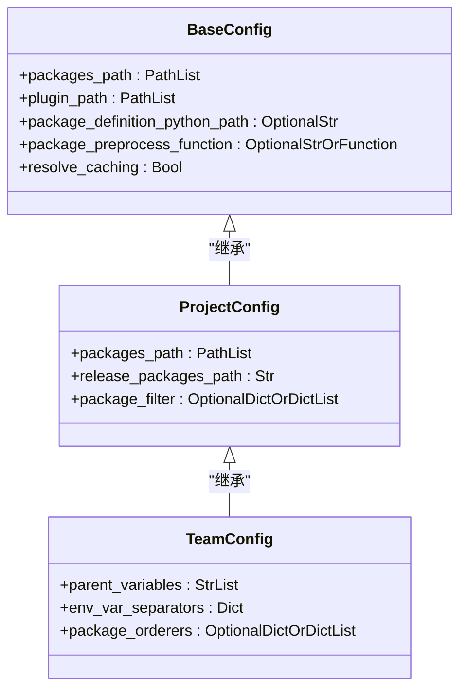
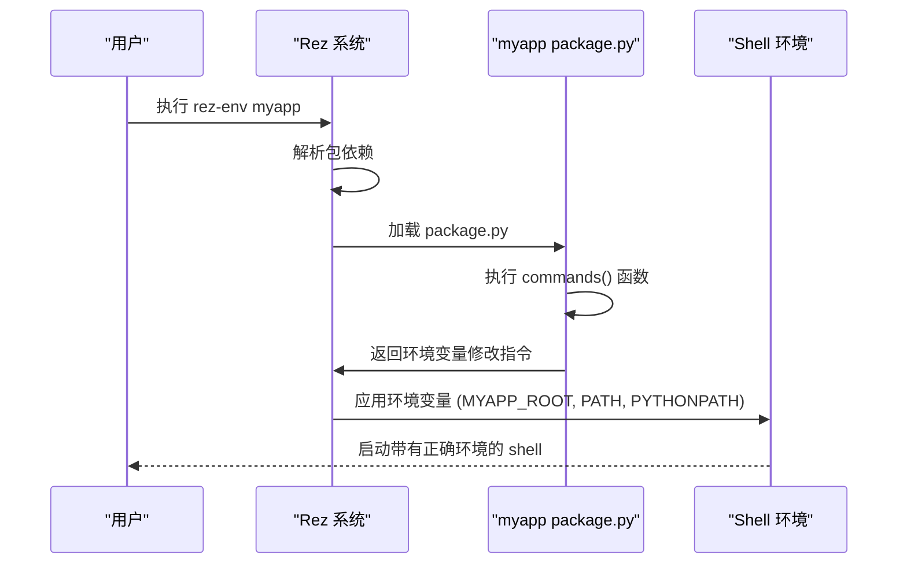

# 配置模板与共享机制

<cite>
**本文档引用的文件**  
- [configuring_rez.rst](file://rez-3.3.0\docs\source\configuring_rez.rst)
- [myapp/1.0.0/package.py](file://my_packages\myapp\1.0.0\package.py)
- [rezconfig.py](file://rez-3.3.0\src\rez\rezconfig.py)
- [config.py](file://rez-3.3.0\src\rez\config.py)
</cite>

## 目录
1. [引言](#引言)
2. [配置模板的定义与继承](#配置模板的定义与继承)
3. [环境初始化逻辑的封装](#环境初始化逻辑的封装)
4. [中央配置仓库与版本化分发](#中央配置仓库与版本化分发)
5. [条件加载策略](#条件加载策略)
6. [模板继承与覆盖优先级](#模板继承与覆盖优先级)
7. [调试方法](#调试方法)
8. [总结](#总结)

## 引言
Rez 是一个强大的软件包管理与环境配置工具，其核心优势之一在于通过标准化的配置模板和共享机制，极大地提升了配置的复用性和一致性。本指南将深入探讨如何利用 `configuring_rez.rst` 中定义的配置项，结合 `myapp/1.0.0/package.py` 的实践，构建一个高效、可维护的配置体系。我们将重点阐述如何将通用配置抽象为模板、如何封装环境初始化逻辑、如何通过中央仓库进行分发，以及如何实现灵活的条件加载。

## 配置模板的定义与继承
Rez 的配置系统允许将通用的配置项（如路径规则、日志级别、缓存策略）抽象为可继承的模板文件，从而避免在每个包定义中重复编写相同的代码。

核心配置文件 `rezconfig.py` 定义了所有全局的默认设置。这些设置构成了所有包配置的“基类”。例如，`packages_path` 定义了包的搜索路径，`package_definition_python_path` 指定了共享代码的存放位置，`package_preprocess_function` 可以定义一个全局的预处理函数，用于对所有包定义文件进行统一的验证或修改。



**图示来源**
- [rezconfig.py](file://rez-3.3.0\src\rez\rezconfig.py)

**配置项来源**
- [configuring_rez.rst](file://rez-3.3.0\docs\source\configuring_rez.rst)

通过在不同层级（如项目级、团队级）创建自己的 `rezconfig.py` 文件，并将其放置在相应的 `packages_path` 中，可以实现配置的继承和覆盖。子级配置会自动继承父级配置的所有设置，并可以有选择地覆盖特定项，从而实现“约定优于配置”的原则。

## 环境初始化逻辑的封装
环境初始化逻辑是确保软件包在加载时能够正确运行的关键。Rez 通过 `pre_commands` 和 `hooks` 机制，将这些逻辑封装在包定义文件中，实现了高度的模块化和可复用性。

在 `myapp/1.0.0/package.py` 文件中，`commands()` 函数定义了当此包被加载时需要执行的环境变量设置。它通过 `env.MYAPP_ROOT = "{root}"` 将包的根目录赋值给环境变量，并通过 `env.PATH.append("{root}/bin")` 和 `env.PYTHONPATH.append("{root}/lib")` 将二进制文件和库文件的路径添加到系统路径中。这种模式可以被抽象为一个通用的模板函数。



**图示来源**
- [myapp/1.0.0/package.py](file://my_packages\myapp\1.0.0\package.py)

**配置项来源**
- [configuring_rez.rst](file://rez-3.3.0\docs\source\configuring_rez.rst)

`hooks` 机制则用于在特定事件（如包发布、环境创建）发生时执行自定义脚本。这可以用于自动化部署、发送通知或执行额外的验证步骤，进一步增强了系统的可扩展性。

## 中央配置仓库与版本化分发
为了实现配置的统一管理和版本化分发，应建立一个中央配置仓库。这个仓库本质上是一个特殊的 Rez 包，其中包含了标准化的 `rezconfig.py` 文件和共享的 Python 模块。

1.  **创建中央配置包**：在中央仓库中创建一个名为 `rez-config` 的包，其 `package.py` 文件中定义 `package_definition_python_path` 指向该包内的 `shared` 目录。
2.  **存放共享代码**：在 `shared` 目录下存放通用的预处理函数、钩子脚本和工具函数。
3.  **版本化发布**：使用 `rez-release` 工具将 `rez-config` 包发布到 `release_packages_path`，并赋予其版本号（如 `1.0.0`）。
4.  **分发与使用**：其他项目或团队只需在自己的 `packages_path` 中包含中央仓库的路径，并在需要时通过 `requires = ["rez-config-1.0.0"]` 来引用特定版本的配置包，即可获得统一的配置和共享代码。

这种机制确保了所有团队都能基于同一套标准进行开发，同时又能通过版本号精确控制配置的变更，避免了因配置不一致导致的“在我机器上能运行”的问题。

## 条件加载策略
尽管有统一的规范，但不同团队仍需要一定的灵活性来定制配置。Rez 支持基于环境变量或项目标识的条件加载策略，以满足这种需求。

例如，可以在 `rezconfig.py` 中使用环境变量来动态调整配置：
```python
# 根据环境变量选择不同的缓存策略
if os.getenv("REZ_ENV") == "production":
    cache_packages_path = "/shared/cache"
    package_cache_clean_limit = 0.5
else:
    cache_packages_path = None  # 开发环境禁用缓存
    package_cache_clean_limit = -1
```

或者，通过在 `package_filter` 或 `package_orderers` 中使用逻辑判断，根据项目标识（如 `PROJECT_ID` 环境变量）来过滤或排序包，从而实现不同项目加载不同软件栈的能力。这确保了在统一规范下，各团队仍能灵活地满足其特定需求。

## 模板继承与覆盖优先级
Rez 配置的继承和覆盖遵循一个明确的优先级顺序，理解这一点对于调试和设计配置至关重要。

配置的优先级从低到高依次为：
1.  **内置默认值**：Rez 源码中定义的硬编码默认值。
2.  **主配置文件**：`rezconfig.py` 中定义的全局设置。
3.  **用户配置文件**：`~/.rezconfig` 中的用户自定义设置。
4.  **环境变量**：以 `REZ_` 为前缀的环境变量（如 `REZ_DEFAULT_SHELL`）。
5.  **包内配置**：在包定义文件的 `config` 部分中定义的设置，仅在构建或发布该包时生效。

当一个配置项在多个层级被定义时，优先级高的层级会覆盖优先级低的层级。例如，如果用户在 `~/.rezconfig` 中设置了 `default_shell = "bash"`，但又通过 `export REZ_DEFAULT_SHELL="zsh"` 设置了环境变量，那么最终生效的将是 `zsh`。

## 调试方法
在配置复杂的模板和共享机制时，调试是必不可少的环节。Rez 提供了多种调试手段：

*   **启用调试日志**：通过设置 `debug_all = True` 或 `debug_config = True` 等配置项，可以输出详细的日志信息，帮助追踪配置的加载过程和生效情况。
*   **检查配置来源**：使用 `rez config --source-list` 命令可以列出所有被实际加载的配置文件，确认你的模板文件是否被正确读取。
*   **查询特定配置**：使用 `rez config FIELD_NAME` 命令可以查询某个配置项的最终值，例如 `rez config packages_path`，以验证继承和覆盖是否按预期工作。
*   **利用 `--verbose` 参数**：在执行 `rez-env` 或 `rez-build` 等命令时添加 `--verbose` 参数，可以获取更详细的执行过程输出。

## 总结
通过建立标准化的配置模板、封装环境初始化逻辑、利用中央仓库进行版本化分发，并辅以灵活的条件加载策略，Rez 能够构建一个既统一又灵活的配置管理体系。理解模板继承的优先级和掌握有效的调试方法，是确保这套机制稳定运行的关键。这不仅提升了配置的复用性和可维护性，也为团队协作和项目规模化提供了坚实的基础。