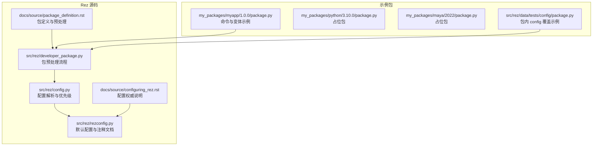
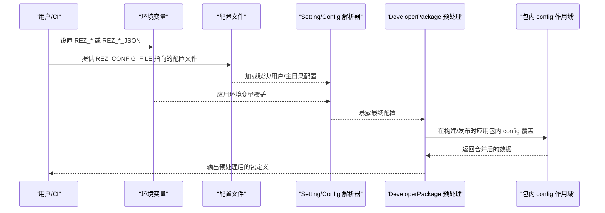
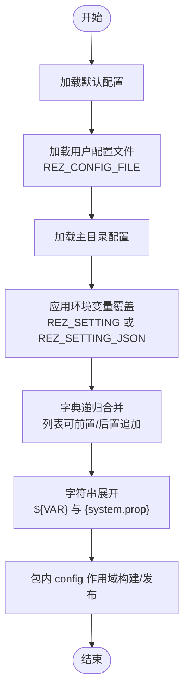
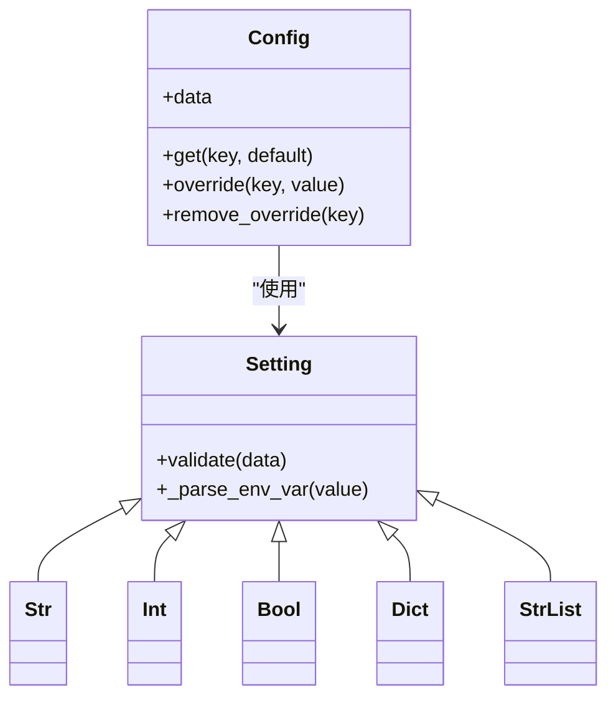
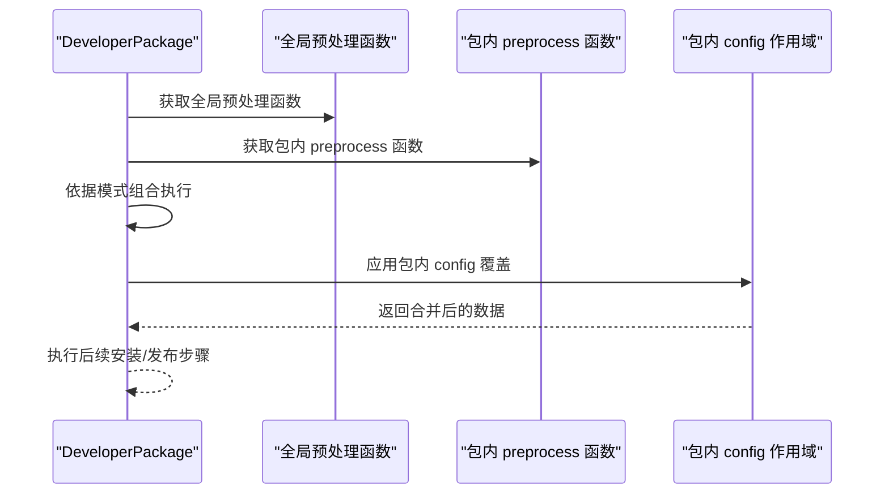
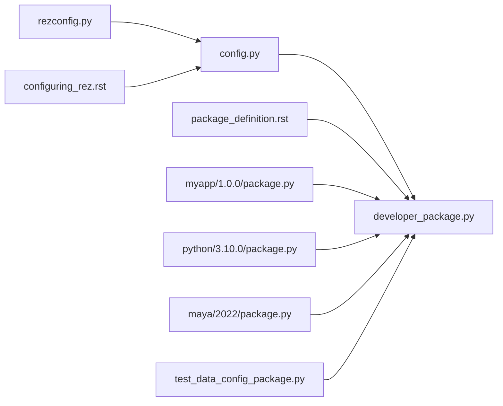

# 配置策略与最佳实践

<cite>
**本文引用的文件**
- [configuring_rez.rst](file://rez-3.3.0/docs/source/configuring_rez.rst)
- [config.py](file://rez-3.3.0/src/rez/config.py)
- [rezconfig.py](file://rez-3.3.0/src/rez/rezconfig.py)
- [developer_package.py](file://rez-3.3.0/src/rez/developer_package.py)
- [package_definition.rst](file://rez-3.3.0/docs/source/package_definition.rst)
- [package.py（myapp/1.0.0）](file://my_packages/myapp/1.0.0/package.py)
- [package.py（python/3.10.0）](file://my_packages/python/3.10.0/package.py)
- [package.py（maya/2022）](file://my_packages/maya/2022/package.py)
- [test_config.py](file://rez-3.3.0/src/rez/tests/test_config.py)
- [test_data_config_package.py](file://rez-3.3.0/src/rez/data/tests/config/package.py)
</cite>

## 目录
1. [引言](#引言)
2. [项目结构](#项目结构)
3. [核心组件](#核心组件)
4. [架构总览](#架构总览)
5. [详细组件分析](#详细组件分析)
6. [依赖关系分析](#依赖关系分析)
7. [性能考量](#性能考量)
8. [故障排查指南](#故障排查指南)
9. [结论](#结论)
10. [附录](#附录)

## 引言
本文件围绕 Rez 的配置体系，系统阐述如何在团队协作与生产环境中设计可复用、可维护的配置方案。结合官方配置文档与源码实现，重点解释：
- 关键配置参数的作用域与继承机制（文件来源、环境变量、JSON 覆盖、包内覆盖）
- 如何通过包定义中的预处理钩子与预处理函数实现环境初始化、依赖注入与动态配置加载
- 配置模板、环境变量覆盖、条件配置等高级模式
- 多项目共享配置的推荐架构与中央配置仓库的版本化管理策略
- 如何确保环境一致性与可追溯性

## 项目结构
该仓库包含 Rez 官方源码与示例包，便于从“配置文件—包定义—测试”三个维度理解配置策略与最佳实践。

图表来源
- [config.py](file://rez-3.3.0/src/rez/config.py#L540-L775)
- [rezconfig.py](file://rez-3.3.0/src/rez/rezconfig.py#L1-L120)
- [developer_package.py](file://rez-3.3.0/src/rez/developer_package.py#L1-L120)
- [configuring_rez.rst](file://rez-3.3.0/docs/source/configuring_rez.rst#L1-L60)
- [package_definition.rst](file://rez-3.3.0/docs/source/package_definition.rst#L459-L496)
- [package.py（myapp/1.0.0）](file://my_packages/myapp/1.0.0/package.py#L1-L33)
- [package.py（python/3.10.0）](file://my_packages/python/3.10.0/package.py#L1-L8)
- [package.py（maya/2022）](file://my_packages/maya/2022/package.py#L1-L9)
- [test_data_config_package.py](file://rez-3.3.0/src/rez/data/tests/config/package.py#L1-L38)

章节来源
- [configuring_rez.rst](file://rez-3.3.0/docs/source/configuring_rez.rst#L1-L60)
- [config.py](file://rez-3.3.0/src/rez/config.py#L540-L775)
- [rezconfig.py](file://rez-3.3.0/src/rez/rezconfig.py#L1-L120)

## 核心组件
- 配置优先级与合并规则：来自默认配置文件、用户配置文件、用户主目录配置、环境变量、JSON 环境变量、包内 config 块等多源合并，且支持列表的前置/后置追加。
- 配置解析器：Setting 子类族负责类型校验与环境变量解析；Config 类统一加载、缓存与暴露配置。
- 包预处理：全局预处理函数与包内 preprocess 函数按模式组合执行，支持在构建/发布阶段动态修改配置。
- 包内配置覆盖：在包定义中使用作用域块临时覆盖配置，仅在构建/发布阶段生效。

章节来源
- [configuring_rez.rst](file://rez-3.3.0/docs/source/configuring_rez.rst#L8-L28)
- [config.py](file://rez-3.3.0/src/rez/config.py#L51-L160)
- [developer_package.py](file://rez-3.3.0/src/rez/developer_package.py#L18-L45)
- [package_definition.rst](file://rez-3.3.0/docs/source/package_definition.rst#L459-L496)

## 架构总览
Rez 配置系统采用“多源合并 + 动态扩展”的架构，既保证默认一致性，又允许站点与项目级定制。

图表来源
- [configuring_rez.rst](file://rez-3.3.0/docs/source/configuring_rez.rst#L8-L28)
- [config.py](file://rez-3.3.0/src/rez/config.py#L540-L775)
- [developer_package.py](file://rez-3.3.0/src/rez/developer_package.py#L176-L272)
- [test_data_config_package.py](file://rez-3.3.0/src/rez/data/tests/config/package.py#L1-L38)

## 详细组件分析

### 配置优先级与继承机制
- 来源顺序（高优先级到低优先级）：
  1) 安装目录默认配置文件
  2) $REZ_CONFIG_FILE 指定的用户配置文件（可多文件）
  3) 用户主目录配置文件
  4) 环境变量 REZ_XXX（字符串或 JSON 编码）
  5) 包内 config 块（仅在构建/发布时生效）
- 合并规则：
  - 字典递归合并
  - 列表可通过 ModifyList 进行前置/后置追加
- 字符串展开：
  - 支持环境变量与 system 对象属性展开

图表来源
- [configuring_rez.rst](file://rez-3.3.0/docs/source/configuring_rez.rst#L8-L28)
- [configuring_rez.rst](file://rez-3.3.0/docs/source/configuring_rez.rst#L39-L58)
- [configuring_rez.rst](file://rez-3.3.0/docs/source/configuring_rez.rst#L87-L96)
- [test_config.py](file://rez-3.3.0/src/rez/tests/test_config.py#L211-L249)

章节来源
- [configuring_rez.rst](file://rez-3.3.0/docs/source/configuring_rez.rst#L8-L28)
- [configuring_rez.rst](file://rez-3.3.0/docs/source/configuring_rez.rst#L39-L58)
- [configuring_rez.rst](file://rez-3.3.0/docs/source/configuring_rez.rst#L87-L96)
- [test_config.py](file://rez-3.3.0/src/rez/tests/test_config.py#L211-L249)

### 配置解析器与环境变量覆盖
- Setting 子类族：
  - Str/Int/Float/Bool/Dict/List 等类型校验
  - 环境变量名约定为 REZ_<SETTING>. 支持 _JSON 形式进行复杂值覆盖
- Config 类：
  - 统一加载多源配置，深拷贝并应用 overrides
  - 提供 override/remove_override 接口
  - 支持动态默认值（如平台相关路径）

图表来源
- [config.py](file://rez-3.3.0/src/rez/config.py#L51-L160)
- [config.py](file://rez-3.3.0/src/rez/config.py#L540-L775)

章节来源
- [config.py](file://rez-3.3.0/src/rez/config.py#L51-L160)
- [config.py](file://rez-3.3.0/src/rez/config.py#L540-L775)

### 包预处理与动态配置加载
- 预处理模式：
  - before：先执行包内 preprocess，再执行全局预处理
  - after：先执行全局预处理，再执行包内 preprocess
  - override：仅执行包内或全局预处理之一
- 全局预处理函数：
  - 可在 rezconfig 中设置，或通过 package_definition_build_python_paths 引入模块
- 包内 preprocess：
  - 在包定义中定义，参与构建/发布流程
- 包内 config 作用域：
  - 在包定义中临时覆盖配置（仅构建/发布阶段有效）

图表来源
- [developer_package.py](file://rez-3.3.0/src/rez/developer_package.py#L18-L45)
- [developer_package.py](file://rez-3.3.0/src/rez/developer_package.py#L176-L272)
- [package_definition.rst](file://rez-3.3.0/docs/source/package_definition.rst#L459-L496)
- [test_data_config_package.py](file://rez-3.3.0/src/rez/data/tests/config/package.py#L1-L38)

章节来源
- [developer_package.py](file://rez-3.3.0/src/rez/developer_package.py#L18-L45)
- [developer_package.py](file://rez-3.3.0/src/rez/developer_package.py#L176-L272)
- [package_definition.rst](file://rez-3.3.0/docs/source/package_definition.rst#L459-L496)
- [test_data_config_package.py](file://rez-3.3.0/src/rez/data/tests/config/package.py#L1-L38)

### 实际示例：myapp 包的命令与变体
- 命令块用于环境初始化（设置根路径、PATH、PYTHONPATH 等）
- 变体数组用于声明不同 Python 版本的变体
- 该示例展示了如何在包定义中直接声明环境变量与变体，配合全局配置实现一致的环境行为

章节来源
- [package.py（myapp/1.0.0）](file://my_packages/myapp/1.0.0/package.py#L1-L33)

### 占位包示例：python 与 maya
- 作为依赖占位，避免平台家族约束导致的解析失败
- 展示了最小化包定义的写法，适合在团队共享的基础包中使用

章节来源
- [package.py（python/3.10.0）](file://my_packages/python/3.10.0/package.py#L1-L8)
- [package.py（maya/2022）](file://my_packages/maya/2022/package.py#L1-L9)

## 依赖关系分析
- 配置层：config.py 依赖系统对象与环境变量，提供 Setting 与 Config 抽象
- 默认配置层：rezconfig.py 提供默认值与注释文档，是配置权威来源
- 包定义层：developer_package.py 依赖配置，执行预处理与包内 config 覆盖
- 文档层：configuring_rez.rst 与 package_definition.rst 提供配置与包定义的权威说明
- 示例层：my_packages 下的包定义展示命令与变体的实际用法

图表来源
- [rezconfig.py](file://rez-3.3.0/src/rez/rezconfig.py#L1-L120)
- [config.py](file://rez-3.3.0/src/rez/config.py#L540-L775)
- [developer_package.py](file://rez-3.3.0/src/rez/developer_package.py#L1-L120)
- [configuring_rez.rst](file://rez-3.3.0/docs/source/configuring_rez.rst#L1-L60)
- [package_definition.rst](file://rez-3.3.0/docs/source/package_definition.rst#L459-L496)
- [package.py（myapp/1.0.0）](file://my_packages/myapp/1.0.0/package.py#L1-L33)
- [package.py（python/3.10.0）](file://my_packages/python/3.10.0/package.py#L1-L8)
- [package.py（maya/2022）](file://my_packages/maya/2022/package.py#L1-L9)
- [test_data_config_package.py](file://rez-3.3.0/src/rez/data/tests/config/package.py#L1-L38)

章节来源
- [config.py](file://rez-3.3.0/src/rez/config.py#L540-L775)
- [developer_package.py](file://rez-3.3.0/src/rez/developer_package.py#L1-L120)

## 性能考量
- 配置缓存：Config 使用缓存属性减少重复解析与合并开销
- 插件延迟加载：插件配置按需加载，避免不必要的启动成本
- 列表合并优化：通过 ModifyList 实现增量追加，避免全量替换
- 环境变量覆盖：REZ_* 与 REZ_*_JSON 提供轻量级覆盖手段，避免频繁修改配置文件

章节来源
- [config.py](file://rez-3.3.0/src/rez/config.py#L540-L775)
- [config.py](file://rez-3.3.0/src/rez/config.py#L1-L80)

## 故障排查指南
- 环境变量覆盖未生效
  - 检查环境变量命名是否为 REZ_<SETTING>（大写）
  - 复杂值请使用 REZ_<SETTING>_JSON 并确保 JSON 格式正确
- 配置合并异常
  - 确认字典是否递归合并，列表是否使用 ModifyList 进行追加
- 包内 config 覆盖无效
  - 确认仅在构建/发布阶段生效，运行时不会影响
- 预处理函数报错
  - 全局预处理函数需满足签名要求；包内 preprocess 仅在构建/发布时执行

章节来源
- [configuring_rez.rst](file://rez-3.3.0/docs/source/configuring_rez.rst#L8-L28)
- [configuring_rez.rst](file://rez-3.3.0/docs/source/configuring_rez.rst#L39-L58)
- [test_config.py](file://rez-3.3.0/src/rez/tests/test_config.py#L211-L249)
- [developer_package.py](file://rez-3.3.0/src/rez/developer_package.py#L176-L272)

## 结论
通过多源合并、严格的优先级与类型校验、以及包内 config 作用域与预处理机制，Rez 提供了可扩展、可维护、可追溯的配置体系。在团队协作与生产环境中，建议：
- 将默认配置置于安装目录默认配置文件，站点级配置通过 REZ_CONFIG_FILE 管理
- 使用环境变量与 JSON 覆盖实现临时或动态配置，避免频繁修改配置文件
- 在包定义中使用预处理与包内 config 作用域实现环境初始化与动态配置
- 建立中央配置仓库，版本化管理配置文件，配合 CI/CD 自动化应用与验证

## 附录
- 配置模板与高级模式
  - 模板：基于默认配置文件生成站点模板，仅覆盖差异项
  - 条件配置：通过包内 config 作用域与预处理函数实现按项目/环境差异化
  - 中央配置仓库：集中管理配置文件，通过版本标签与分支策略控制发布节奏
- 多项目共享配置的推荐架构
  - 分层：基础层（默认）、站点层（REZ_CONFIG_FILE）、项目层（包内 config）
  - 变体与命令：在包定义中声明变体与命令，统一环境初始化
  - 测试：使用单元测试验证配置覆盖与合并逻辑

章节来源
- [configuring_rez.rst](file://rez-3.3.0/docs/source/configuring_rez.rst#L29-L60)
- [package_definition.rst](file://rez-3.3.0/docs/source/package_definition.rst#L459-L496)
- [test_data_config_package.py](file://rez-3.3.0/src/rez/data/tests/config/package.py#L1-L38)