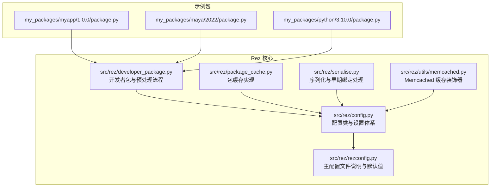
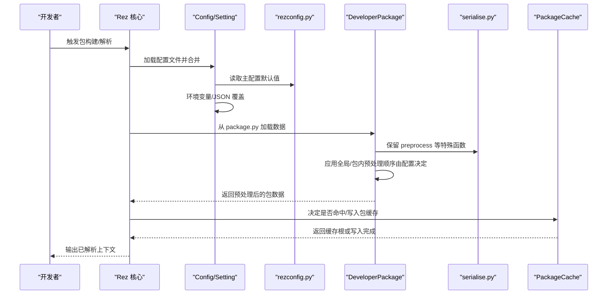
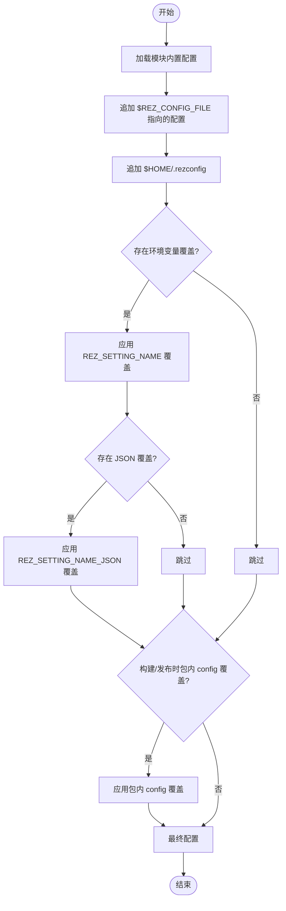
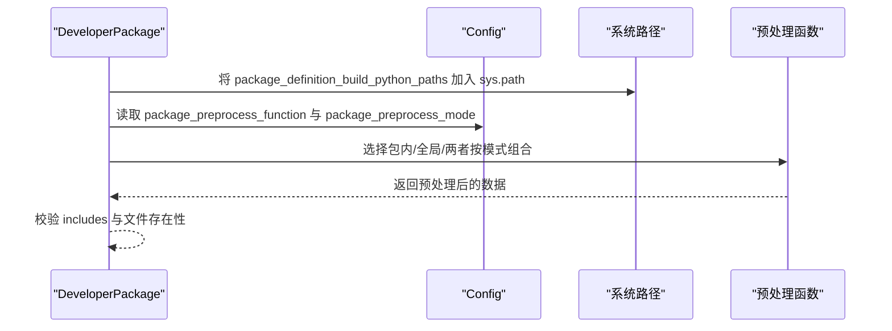
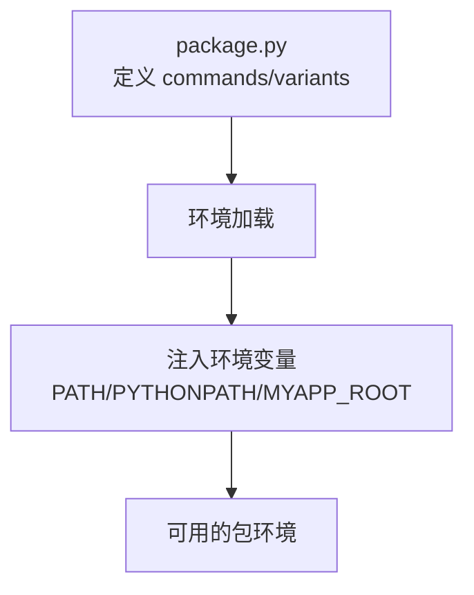
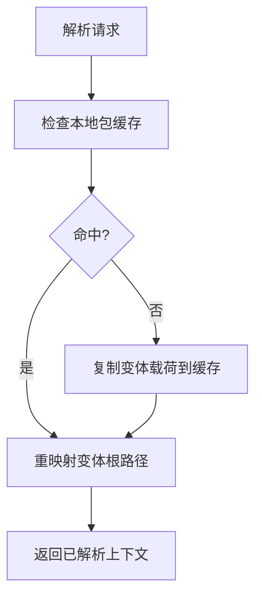
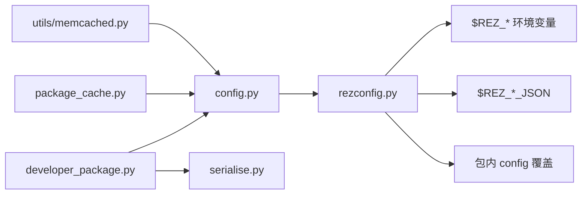

# 配置管理实践

<cite>
**本文引用的文件**
- [myapp 包定义](file://my_packages/myapp/1.0.0/package.py)
- [maya 包定义](file://my_packages/maya/2022/package.py)
- [python 占位包定义](file://my_packages/python/3.10.0/package.py)
- [Rez 配置核心类与设置体系](file://rez-3.3.0/src/rez/config.py)
- [Rez 主配置文件说明与默认值](file://rez-3.3.0/src/rez/rezconfig.py)
- [开发者包与预处理流程](file://rez-3.3.0/src/rez/developer_package.py)
- [包缓存实现](file://rez-3.3.0/src/rez/package_cache.py)
- [序列化与早期绑定处理](file://rez-3.3.0/src/rez/serialise.py)
- [Memcached 缓存装饰器](file://rez-3.3.0/src/rez/utils/memcached.py)
- [安全与审计相关说明](file://rez-3.3.0/SECURITY.md)
- [ASWF 会议记录：云存储与缓存讨论](file://rez-3.3.0/ASWF/TSC/meeting-notes/2023-02-16.md)
- [项目说明文档](file://README.md)
</cite>

## 目录
1. [引言](#引言)
2. [项目结构](#项目结构)
3. [核心组件](#核心组件)
4. [架构总览](#架构总览)
5. [详细组件分析](#详细组件分析)
6. [依赖关系分析](#依赖关系分析)
7. [性能考量](#性能考量)
8. [故障排查指南](#故障排查指南)
9. [结论](#结论)
10. [附录](#附录)

## 引言
本指南围绕团队协作与生产环境中的配置管理展开，聚焦于通过 Rez 的 package.py 配置钩子（hooks）与环境预设（pre-process）实现项目级配置管理。文档将系统讲解：
- 如何利用 package.py 的 commands 与 preprocess 钩子统一注入环境变量与构建逻辑
- 如何通过 Rez 配置体系（主配置、环境变量覆盖、JSON 覆盖）实现集中式配置
- 如何建立版本控制、共享与分发机制（中央配置仓库/环境模板）
- 安全配置原则（敏感信息保护、权限控制、审计日志）
- 性能优化建议（缓存配置、减少配置加载开销）
- 结合 myapp 示例包落地最佳实践，确保配置的一致性与可维护性

## 项目结构
本仓库包含 Rez 源码与示例包，其中 my_packages 下的 myapp、maya、python 等包展示了 package.py 的典型用法；rez-3.3.0/src/rez 下提供了配置、缓存、序列化等核心能力。

图表来源
- [myapp 包定义](file://my_packages/myapp/1.0.0/package.py#L1-L33)
- [maya 包定义](file://my_packages/maya/2022/package.py#L1-L9)
- [python 占位包定义](file://my_packages/python/3.10.0/package.py#L1-L8)
- [Rez 配置核心类与设置体系](file://rez-3.3.0/src/rez/config.py#L540-L775)
- [Rez 主配置文件说明与默认值](file://rez-3.3.0/src/rez/rezconfig.py#L570-L633)
- [开发者包与预处理流程](file://rez-3.3.0/src/rez/developer_package.py#L18-L272)
- [包缓存实现](file://rez-3.3.0/src/rez/package_cache.py#L35-L120)
- [序列化与早期绑定处理](file://rez-3.3.0/src/rez/serialise.py#L351-L382)
- [Memcached 缓存装饰器](file://rez-3.3.0/src/rez/utils/memcached.py#L319-L400)

章节来源
- [项目说明文档](file://README.md#L1-L155)

## 核心组件
- 配置体系（Config 与 Setting）：支持多层级配置合并、环境变量覆盖、JSON 覆盖、动态默认值与缓存属性，满足团队集中配置与按需覆盖的需求。
- 主配置文件（rezconfig.py）：定义默认路径、缓存策略、包解析行为、环境变量处理、上下文跟踪等全局设置，并提供“全局预处理函数”与“预处理顺序”等钩子入口。
- 开发者包与预处理（DeveloperPackage）：在包构建/发布阶段对 package.py 数据进行预处理，支持全局预处理函数与包内 preprocess 函数的组合与优先级控制。
- 包缓存（PackageCache）：将变体载荷复制到本地缓存目录，避免共享存储频繁拉取，显著降低运行时延迟。
- 序列化与早期绑定（serialise.py）：保留 preprocess 等特殊函数，确保在预处理阶段正确评估与裁剪。
- Memcached 缓存装饰器：为高频操作提供进程内/分布式缓存，提升解析与文件读取性能。

章节来源
- [Rez 配置核心类与设置体系](file://rez-3.3.0/src/rez/config.py#L540-L775)
- [Rez 主配置文件说明与默认值](file://rez-3.3.0/src/rez/rezconfig.py#L570-L633)
- [开发者包与预处理流程](file://rez-3.3.0/src/rez/developer_package.py#L18-L272)
- [包缓存实现](file://rez-3.3.0/src/rez/package_cache.py#L35-L120)
- [序列化与早期绑定处理](file://rez-3.3.0/src/rez/serialise.py#L351-L382)
- [Memcached 缓存装饰器](file://rez-3.3.0/src/rez/utils/memcached.py#L319-L400)

## 架构总览
下图展示了配置加载与包预处理的关键交互路径，体现“集中配置 + 层层覆盖 + 预处理钩子”的整体架构。

图表来源
- [Rez 配置核心类与设置体系](file://rez-3.3.0/src/rez/config.py#L540-L775)
- [Rez 主配置文件说明与默认值](file://rez-3.3.0/src/rez/rezconfig.py#L570-L633)
- [开发者包与预处理流程](file://rez-3.3.0/src/rez/developer_package.py#L18-L272)
- [序列化与早期绑定处理](file://rez-3.3.0/src/rez/serialise.py#L351-L382)
- [包缓存实现](file://rez-3.3.0/src/rez/package_cache.py#L108-L134)

## 详细组件分析

### 组件A：配置加载与覆盖（Config/Setting）
- 多源合并：模块内置配置 → $REZ_CONFIG_FILE 指向的额外配置 → $HOME/.rezconfig → 环境变量覆盖 → JSON 覆盖 → 构建/发布时包内 config 覆盖
- 动态默认值：部分设置根据平台/系统对象动态生成
- 缓存属性：大量设置采用缓存属性以减少重复计算
- 环境变量解析：支持字符串、列表、字典、布尔等多种类型解析，JSON 类型通过 _KEY_JSON 环境变量注入

图表来源
- [Rez 配置核心类与设置体系](file://rez-3.3.0/src/rez/config.py#L540-L775)
- [Rez 主配置文件说明与默认值](file://rez-3.3.0/src/rez/rezconfig.py#L1-L45)

章节来源
- [Rez 配置核心类与设置体系](file://rez-3.3.0/src/rez/config.py#L540-L775)
- [Rez 主配置文件说明与默认值](file://rez-3.3.0/src/rez/rezconfig.py#L1-L45)

### 组件B：全局预处理钩子（package_preprocess_function / package_preprocess_mode）
- 全局预处理函数：在未定义包内 preprocess 时，统一执行，便于标准化校验、注入通用字段、环境变量等
- 预处理模式：before/after/override，控制包内与全局预处理的先后顺序
- 预处理时机：在开发者包加载过程中调用，确保在构建/发布前完成

图表来源
- [开发者包与预处理流程](file://rez-3.3.0/src/rez/developer_package.py#L18-L272)
- [Rez 主配置文件说明与默认值](file://rez-3.3.0/src/rez/rezconfig.py#L570-L633)

章节来源
- [开发者包与预处理流程](file://rez-3.3.0/src/rez/developer_package.py#L18-L272)
- [Rez 主配置文件说明与默认值](file://rez-3.3.0/src/rez/rezconfig.py#L570-L633)

### 组件C：包内 commands 与环境预设
- 在 package.py 中定义 commands，在环境加载时执行，统一注入 PATH、PYTHONPATH、MYAPP_ROOT 等变量
- 与 variants 配合，实现不同 Python 版本的差异化环境

图表来源
- [myapp 包定义](file://my_packages/myapp/1.0.0/package.py#L10-L33)

章节来源
- [myapp 包定义](file://my_packages/myapp/1.0.0/package.py#L10-L33)

### 组件D：包缓存与性能优化
- 包缓存将变体载荷复制到本地磁盘，命中时直接重映射根路径，避免共享存储频繁拉取
- 缓存阈值与空间缓冲：根据配置限制缓存大小，避免磁盘空间不足
- 与 Memcached 配合：解析、文件读取、目录遍历等可启用缓存，进一步降低延迟

图表来源
- [包缓存实现](file://rez-3.3.0/src/rez/package_cache.py#L108-L134)
- [Rez 主配置文件说明与默认值](file://rez-3.3.0/src/rez/rezconfig.py#L223-L328)
- [Memcached 缓存装饰器](file://rez-3.3.0/src/rez/utils/memcached.py#L319-L400)

章节来源
- [包缓存实现](file://rez-3.3.0/src/rez/package_cache.py#L108-L134)
- [Rez 主配置文件说明与默认值](file://rez-3.3.0/src/rez/rezconfig.py#L223-L328)
- [Memcached 缓存装饰器](file://rez-3.3.0/src/rez/utils/memcached.py#L319-L400)

### 组件E：安全配置与审计
- 安全边界：Rez 不直接处理登录凭据，上下文跟踪需要的 AMQP 凭据通过配置字典传入
- 代码执行风险：包定义与插件可能执行任意代码，需严格控制仓库与信任来源
- 审计与日志：可通过调试开关与上下文跟踪输出审计信息

章节来源
- [安全与审计相关说明](file://rez-3.3.0/SECURITY.md#L84-L101)
- [Rez 主配置文件说明与默认值](file://rez-3.3.0/src/rez/rezconfig.py#L635-L758)

## 依赖关系分析
- 配置加载链路：config.py（Setting/Config） ← rezconfig.py（默认值与说明） ← 环境变量/JSON/包内 config 覆盖
- 预处理链路：developer_package.py（DeveloperPackage） ← serialise.py（保留 preprocess） ← 配置体系（全局预处理函数/模式）
- 缓存链路：package_cache.py（PackageCache） ← 配置体系（缓存开关/阈值/路径）

图表来源
- [Rez 配置核心类与设置体系](file://rez-3.3.0/src/rez/config.py#L540-L775)
- [Rez 主配置文件说明与默认值](file://rez-3.3.0/src/rez/rezconfig.py#L1-L45)
- [开发者包与预处理流程](file://rez-3.3.0/src/rez/developer_package.py#L18-L272)
- [序列化与早期绑定处理](file://rez-3.3.0/src/rez/serialise.py#L351-L382)
- [包缓存实现](file://rez-3.3.0/src/rez/package_cache.py#L35-L120)
- [Memcached 缓存装饰器](file://rez-3.3.0/src/rez/utils/memcached.py#L319-L400)

章节来源
- [Rez 配置核心类与设置体系](file://rez-3.3.0/src/rez/config.py#L540-L775)
- [开发者包与预处理流程](file://rez-3.3.0/src/rez/developer_package.py#L18-L272)
- [包缓存实现](file://rez-3.3.0/src/rez/package_cache.py#L35-L120)

## 性能考量
- 启用缓存：开启 resolve_caching、cache_package_files、cache_listdir，合理设置 memcached_uri 与压缩阈值
- 包缓存：启用 read_package_cache/write_package_cache，设置 cache_packages_path，控制 package_cache_used_threshold 与 space_buffer
- 预处理优化：将通用校验/注入逻辑放入全局预处理函数，减少包内重复代码
- 配置加载：利用 Setting 的缓存属性与 LRU 缓存（如配置文件加载），避免重复解析

章节来源
- [Rez 主配置文件说明与默认值](file://rez-3.3.0/src/rez/rezconfig.py#L140-L184)
- [Rez 主配置文件说明与默认值](file://rez-3.3.0/src/rez/rezconfig.py#L223-L328)
- [开发者包与预处理流程](file://rez-3.3.0/src/rez/developer_package.py#L18-L272)
- [Rez 配置核心类与设置体系](file://rez-3.3.0/src/rez/config.py#L978-L1004)

## 故障排查指南
- 预处理失败：检查全局预处理函数是否存在、签名是否正确、异常是否抛出 InvalidPackageError 导致构建中断
- 环境变量覆盖无效：确认环境变量命名是否为 REZ_SETTING_NAME 或 REZ_SETTING_NAME_JSON，且格式正确
- 缓存不生效：核对缓存开关、路径与磁盘空间，检查包缓存状态与清理策略
- 上下文跟踪：若启用 context_tracking，检查 host、AMQP 参数与网络连通性

章节来源
- [开发者包与预处理流程](file://rez-3.3.0/src/rez/developer_package.py#L211-L272)
- [Rez 配置核心类与设置体系](file://rez-3.3.0/src/rez/config.py#L80-L123)
- [包缓存实现](file://rez-3.3.0/src/rez/package_cache.py#L178-L200)
- [Rez 主配置文件说明与默认值](file://rez-3.3.0/src/rez/rezconfig.py#L635-L758)

## 结论
通过 Rez 的配置体系与预处理钩子，团队可以在项目级实现统一、可审计、可扩展的配置管理。结合包缓存与 Memcached，可在生产环境中显著降低配置与解析开销。配合版本控制与中央配置仓库/环境模板，可实现跨团队、跨项目的配置共享与一致性。

## 附录

### A. 版本控制、共享与分发机制
- 中央配置仓库：将 rezconfig.py 与团队约定的配置文件纳入版本库，按环境（开发/测试/生产）拆分配置文件并通过 $REZ_CONFIG_FILE 注入
- 环境模板：为不同角色（开发者/CI/渲染农场）提供模板，通过环境变量覆盖实现最小差异配置
- 包内 config：在包内提供 config 字段以微调特定包的行为，但应保持最小化，避免分散配置

章节来源
- [Rez 主配置文件说明与默认值](file://rez-3.3.0/src/rez/rezconfig.py#L1-L45)
- [Rez 配置核心类与设置体系](file://rez-3.3.0/src/rez/config.py#L540-L775)

### B. 安全配置原则
- 敏感信息保护：避免在配置中直接存放密钥；通过环境变量或外部凭据服务注入；上下文跟踪的 AMQP 凭据仅在受控环境下启用
- 权限控制：限制对包仓库与配置文件的写权限；对预处理函数与插件来源进行白名单管理
- 审计日志：开启调试与上下文跟踪，记录解析与环境变更；定期审查日志

章节来源
- [安全与审计相关说明](file://rez-3.3.0/SECURITY.md#L84-L101)
- [Rez 主配置文件说明与默认值](file://rez-3.3.0/src/rez/rezconfig.py#L635-L758)

### C. 结合 myapp 示例包的最佳实践
- commands：在 package.py 中统一注入 PATH、PYTHONPATH、工具根目录等环境变量
- variants：为不同 Python 版本提供变体，确保环境一致性
- 预处理：将通用校验与注入逻辑放入全局预处理函数，包内仅保留差异化配置
- 缓存：在生产环境启用包缓存与解析缓存，结合磁盘空间阈值与清理策略

章节来源
- [myapp 包定义](file://my_packages/myapp/1.0.0/package.py#L10-L33)
- [Rez 主配置文件说明与默认值](file://rez-3.3.0/src/rez/rezconfig.py#L223-L328)
- [开发者包与预处理流程](file://rez-3.3.0/src/rez/developer_package.py#L18-L272)