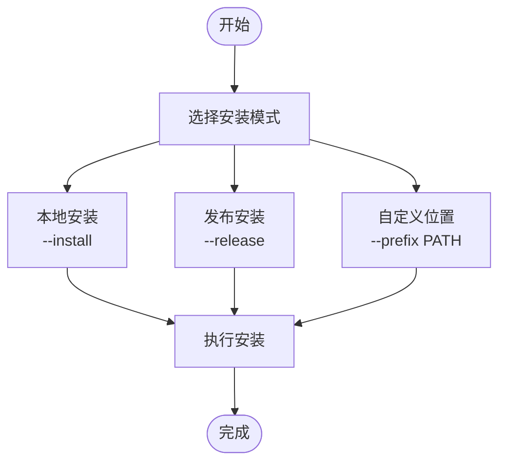
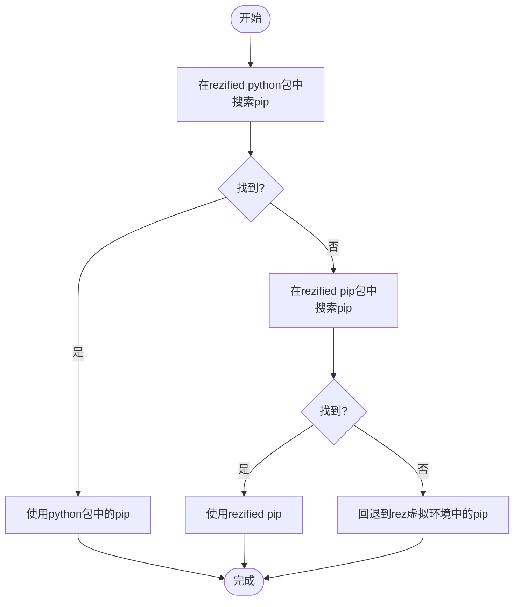
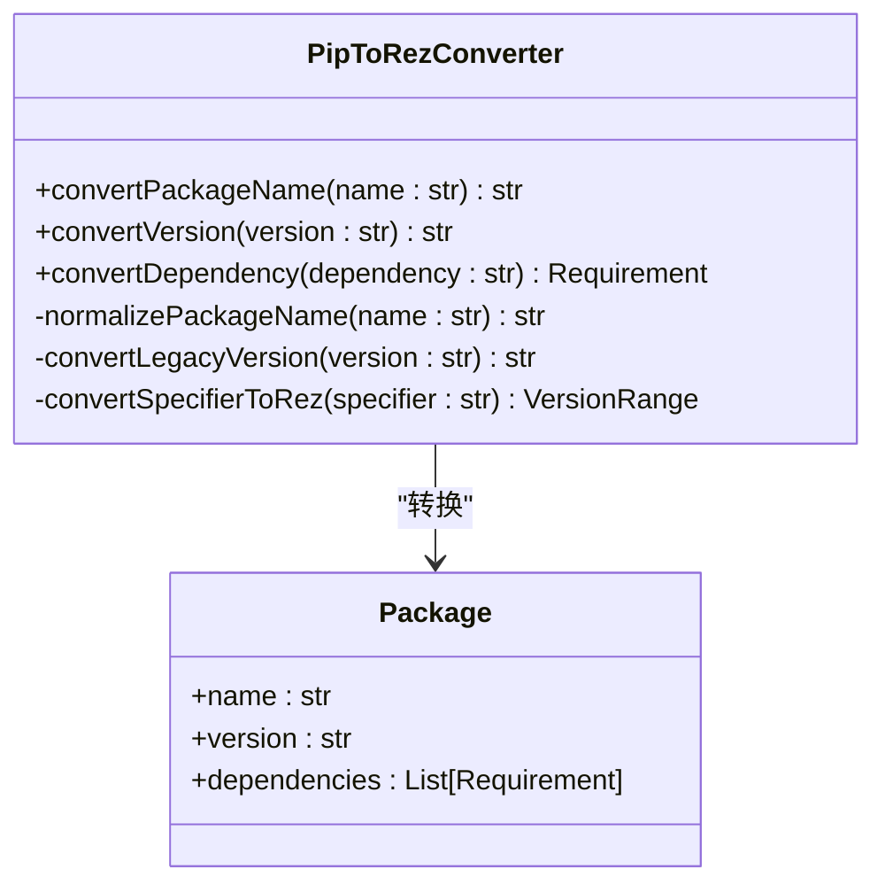

# Python包集成

<cite>
**本文档引用的文件**
- [pip.rst](file://rez-3.3.0\docs\source\pip.rst)
- [pip.py](file://rez-3.3.0\src\rez\pip.py)
- [cli\pip.py](file://rez-3.3.0\src\rez\cli\pip.py)
- [config.py](file://rez-3.3.0\src\rez\config.py)
- [rezconfig.py](file://rez-3.3.0\src\rez\rezconfig.py)
- [test_pip_utils.py](file://rez-3.3.0\src\rez\tests\test_pip_utils.py)
</cite>

## 目录
1. [简介](#简介)
2. [rez-pip命令概述](#rez-pip命令概述)
3. [安装模式](#安装模式)
4. [Python版本和安装位置](#python版本和安装位置)
5. [pip选择机制](#pip选择机制)
6. [pip到rez的转换](#pip到rez的转换)
7. [实际使用示例](#实际使用示例)
8. [已知限制和未来改进](#已知限制和未来改进)

## 简介

Rez是一个语言无关的包管理系统，但考虑到Python在VFX行业及其他领域的广泛应用，Rez提供了将Python pip包转换为rez包的功能。通过`rez-pip`命令，用户可以将PyPI上的pip包及其依赖项安装为rez包，从而在rez环境中使用这些Python包。

## rez-pip命令概述

`rez-pip`命令允许用户执行两个主要操作：安装或发布pip包作为rez包，以及在PyPI上搜索包。该命令通过一个回退机制来确定使用哪个pip来执行命令。

**Section sources**
- [pip.rst](file://rez-3.3.0\docs\source\pip.rst#L1-L144)

## 安装模式

`rez-pip`提供了两种安装模式：本地安装和发布安装。本地安装会将包安装到用户的`local_packages_path`中，而发布安装则会将包安装到`release_packages_path`中。用户还可以使用`--prefix`选项指定自定义的安装位置。



**Diagram sources**
- [pip.rst](file://rez-3.3.0\docs\source\pip.rst#L124-L131)

## Python版本和安装位置

用户可以使用`--python-version`选项来指定要为哪个Python版本安装包。这将使`rez-pip`解析指定版本的`python` rez包，并使用它来运行`pip install`命令。如果pip包不是纯Python包（例如包含`.so`文件），则需要为每个想要安装的Python版本调用`rez-pip`。

**Section sources**
- [pip.rst](file://rez-3.3.0\docs\source\pip.rst#L133-L138)

## pip选择机制

`rez-pip`使用一个回退机制来查找要使用的pip，其逻辑如下：

1. 在指定的`--python-version`的rezified `python`包中搜索pip，如果未指定则使用最新版本；
2. 如果找到，使用它；
3. 如果未找到，在指定的`--pip-version`的rezified `pip`包中搜索pip，如果未指定则使用最新版本；
4. 如果找到rezified `pip`，使用它；
5. 如果未找到，回退到rez自身虚拟环境中的pip。

需要注意的是，`--pip-version`选项已被弃用，未来将被移除。



**Diagram sources**
- [pip.rst](file://rez-3.3.0\docs\source\pip.rst#L64-L74)
- [pip.py](file://rez-3.3.0\src\rez\pip.py#L67-L72)

## pip到rez的转换

`rez-pip`在将pip包转换为rez包时，会进行一系列转换，包括包名、版本和依赖关系的转换。

### 包名转换

由于rez包名中不能包含连字符（会被解释为版本的开始），`rez-pip`会将pip包名中的连字符转换为下划线。例如，pip包`my-pkg`会被转换为rez包`my_pkg`。

### 版本转换

`rez-pip`会将pip版本转换为rez兼容的版本。转换规则包括：
- 移除版本纪元（epoch）前缀`N!`
- 将版本字符串转换为小写
- 将本地版本标识符中的`+`替换为`-`

### 依赖关系转换

`rez-pip`会将pip的依赖关系转换为rez的依赖关系。由于rez和pip在版本范围的语义上存在差异，`rez-pip`会进行相应的转换。例如，pip的`==1`会被转换为rez的`1+<1.1`。



**Diagram sources**
- [pip.py](file://rez-3.3.0\src\rez\pip.py#L28-L143)
- [utils\pip.py](file://rez-3.3.0\src\rez\utils\pip.py#L28-L143)

## 实际使用示例

以下是一些`rez-pip`的实际使用示例：

### 搜索PyPI包

```bash
rez pip --search requests
```

### 安装纯Python包

```bash
rez pip --install --python-version 3.9 requests
```

### 安装包含二进制扩展的包

```bash
rez pip --install --python-version 3.9 numpy
```

### 使用-E和-s参数确保正确安装

```bash
/path/to/python -E -s -m pip install package
```

**Section sources**
- [pip.rst](file://rez-3.3.0\docs\source\pip.rst#L119-L122)

## 已知限制和未来改进

目前的`rez-pip`存在一些限制和痛点，因此计划引入一个新的作为插件实现的`rez-pip`，以克服大多数当前的限制和烦恼。已知的限制包括：

- `--pip-version`选项已被弃用，未来将被移除。
- 需要配置`pip_install_remaps`来处理某些特殊情况下的文件路径映射。
- 对于包含二进制扩展的包，需要为每个Python版本单独安装。

未来改进计划包括将新的`rez-pip`实现为插件，以提供更好的灵活性和可扩展性。

**Section sources**
- [pip.rst](file://rez-3.3.0\docs\source\pip.rst#L13-L15)
- [rezconfig.py](file://rez-3.3.0\src\rez\rezconfig.py#L927-L953)