# CMake 集成

<cite>
**本文档中引用的文件**   
- [cmake.py](file://rez-3.3.0\src\rezplugins\build_system\cmake.py)
- [RezBuild.cmake](file://rez-3.3.0\src\rezplugins\build_system\cmake_files\RezBuild.cmake)
- [RezFindPackages.cmake](file://rez-3.3.0\src\rezplugins\build_system\cmake_files\RezFindPackages.cmake)
- [RezInstallCMake.cmake](file://rez-3.3.0\src\rezplugins\build_system\cmake_files\RezInstallCMake.cmake)
- [package.py](file://rez-3.3.0\example_packages\hello_world\package.py)
- [CMakeLists.txt.example](file://rez-3.3.0\example_packages\hello_world\CMakeLists.txt.example)
- [Utils.cmake](file://rez-3.3.0\src\rezplugins\build_system\cmake_files\Utils.cmake)
- [InstallDirs.cmake](file://rez-3.3.0\src\rezplugins\build_system\cmake_files\InstallDirs.cmake)
- [InstallFiles.cmake](file://rez-3.3.0\src\rezplugins\build_system\cmake_files\InstallFiles.cmake)
</cite>

## 目录
1. [简介](#简介)
2. [CMake集成架构](#cmake集成架构)
3. [核心CMake模块](#核心cmake模块)
4. [package.py配置](#packagepy配置)
5. [构建命令生成](#构建命令生成)
6. [跨平台构建问题](#跨平台构建问题)
7. [性能优化](#性能优化)
8. [最佳实践](#最佳实践)

## 简介

Rez通过cmake.py插件与CMake构建系统实现无缝集成，为开发者提供了一套完整的构建解决方案。该集成允许开发者在Rez管理的环境中使用CMake进行项目构建，自动处理依赖关系、编译器标志和安装目录等配置。通过Rez提供的CMake模块，开发者可以轻松地在不同平台和配置环境下进行构建，同时保持构建过程的一致性和可重复性。

## CMake集成架构

Rez的CMake集成基于插件架构，通过cmake.py插件实现与CMake构建系统的交互。该插件作为Rez构建系统的一部分，负责协调CMake的执行环境和参数传递。

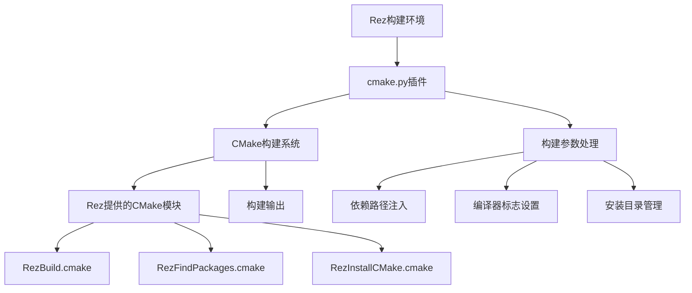

**图表来源**
- [cmake.py](file://rez-3.3.0\src\rezplugins\build_system\cmake.py#L43-L307)
- [RezBuild.cmake](file://rez-3.3.0\src\rezplugins\build_system\cmake_files\RezBuild.cmake#L1-L120)

**本节来源**
- [cmake.py](file://rez-3.3.0\src\rezplugins\build_system\cmake.py#L43-L307)

## 核心CMake模块

Rez提供了一系列CMake模块来增强CMake的构建功能，这些模块在构建过程中自动注入到CMake环境中。

### RezBuild.cmake

RezBuild.cmake是Rez集成的核心模块，它在构建开始时被自动包含，为项目设置必要的构建环境。

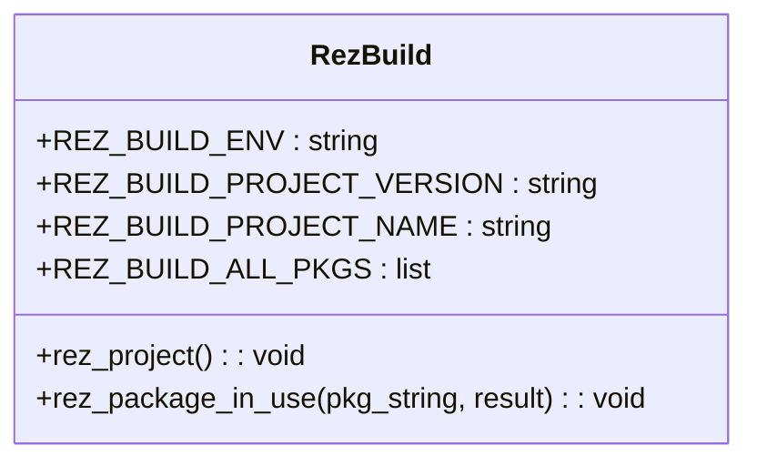

**图表来源**
- [RezBuild.cmake](file://rez-3.3.0\src\rezplugins\build_system\cmake_files\RezBuild.cmake#L1-L120)

**本节来源**
- [RezBuild.cmake](file://rez-3.3.0\src\rezplugins\build_system\cmake_files\RezBuild.cmake#L1-L120)

### RezFindPackages.cmake

RezFindPackages.cmake模块用于查找和配置项目依赖的包，它提供了rez_find_packages宏来简化依赖管理。

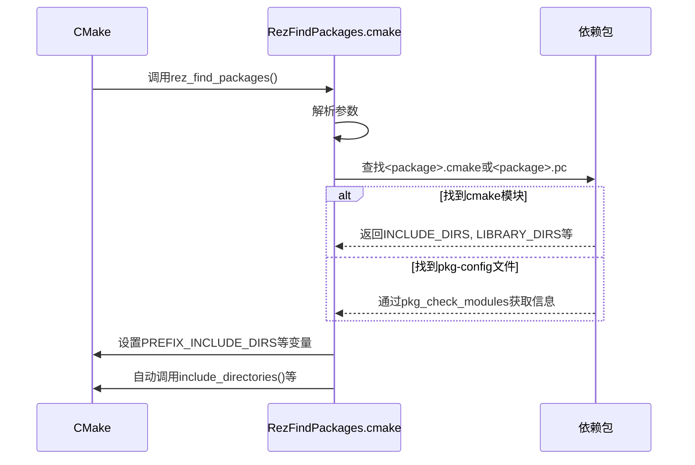

**图表来源**
- [RezFindPackages.cmake](file://rez-3.3.0\src\rezplugins\build_system\cmake_files\RezFindPackages.cmake#L1-L258)

**本节来源**
- [RezFindPackages.cmake](file://rez-3.3.0\src\rezplugins\build_system\cmake_files\RezFindPackages.cmake#L1-L258)

### 其他辅助模块

除了核心模块外，Rez还提供了一系列辅助CMake模块来处理特定的构建任务。

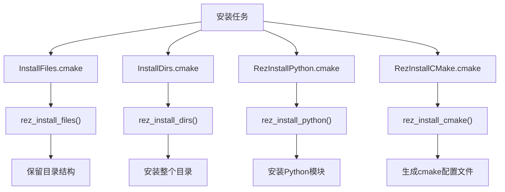

**图表来源**
- [InstallFiles.cmake](file://rez-3.3.0\src\rezplugins\build_system\cmake_files\InstallFiles.cmake#L1-L150)
- [InstallDirs.cmake](file://rez-3.3.0\src\rezplugins\build_system\cmake_files\InstallDirs.cmake#L1-L76)
- [RezInstallCMake.cmake](file://rez-3.3.0\src\rezplugins\build_system\cmake_files\RezInstallCMake.cmake#L1-L35)

**本节来源**
- [InstallFiles.cmake](file://rez-3.3.0\src\rezplugins\build_system\cmake_files\InstallFiles.cmake#L1-L150)
- [InstallDirs.cmake](file://rez-3.3.0\src\rezplugins\build_system\cmake_files\InstallDirs.cmake#L1-L76)

## package.py配置

package.py文件是Rez包定义的核心，它包含了构建配置和依赖信息。

### 基本配置示例

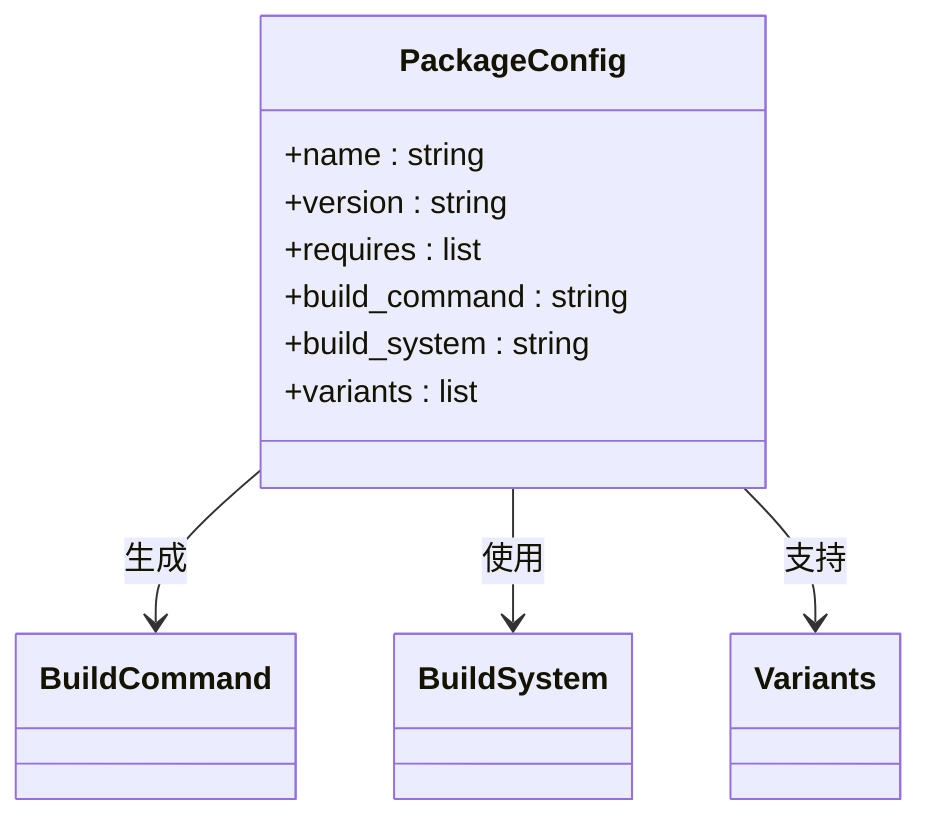

**图表来源**
- [package.py](file://rez-3.3.0\example_packages\hello_world\package.py#L1-L29)

**本节来源**
- [package.py](file://rez-3.3.0\example_packages\hello_world\package.py#L1-L29)

### 完整的package.py示例

```python
name = "my_cpp_library"
version = "1.0.0"

requires = [
    "boost-1.65",
    "tbb-4.3",
    "cmake"
]

build_system = "cmake"

def commands():
    env.CMAKE_MODULE_PATH.append("{root}/cmake")
    env.LD_LIBRARY_PATH.append("{root}/lib")

# 构建命令由Rez根据build_system自动确定
# 不需要显式定义build_command
```

**本节来源**
- [package.py](file://rez-3.3.0\example_packages\hello_world\package.py#L1-L29)

## 构建命令生成

Rez根据package.py中的配置自动生成CMake构建命令，处理多配置环境。

### 命令生成流程

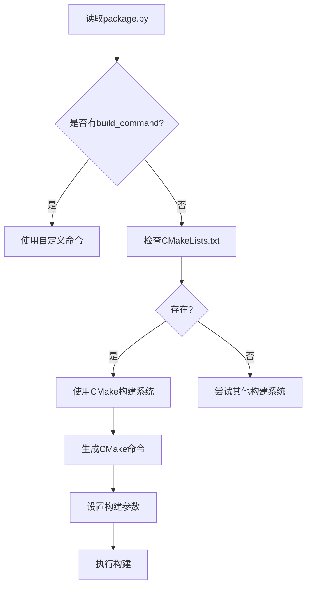

**本节来源**
- [cmake.py](file://rez-3.3.0\src\rezplugins\build_system\cmake.py#L108-L244)

### 多配置环境处理

Rez支持多种构建配置，包括Debug和Release模式。

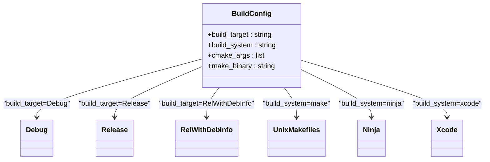

**图表来源**
- [cmake.py](file://rez-3.3.0\src\rezplugins\build_system\cmake.py#L44-L54)

**本节来源**
- [cmake.py](file://rez-3.3.0\src\rezplugins\build_system\cmake.py#L44-L54)

## 跨平台构建问题

Rez的CMake集成解决了跨平台构建中的常见问题。

### 路径和文件处理

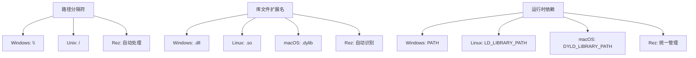

**本节来源**
- [cmake.py](file://rez-3.3.0\src\rezplugins\build_system\cmake.py#L136-L137)
- [Utils.cmake](file://rez-3.3.0\src\rezplugins\build_system\cmake_files\Utils.cmake#L1-L160)

### 平台特定配置

Rez通过环境变量和条件判断处理平台差异。

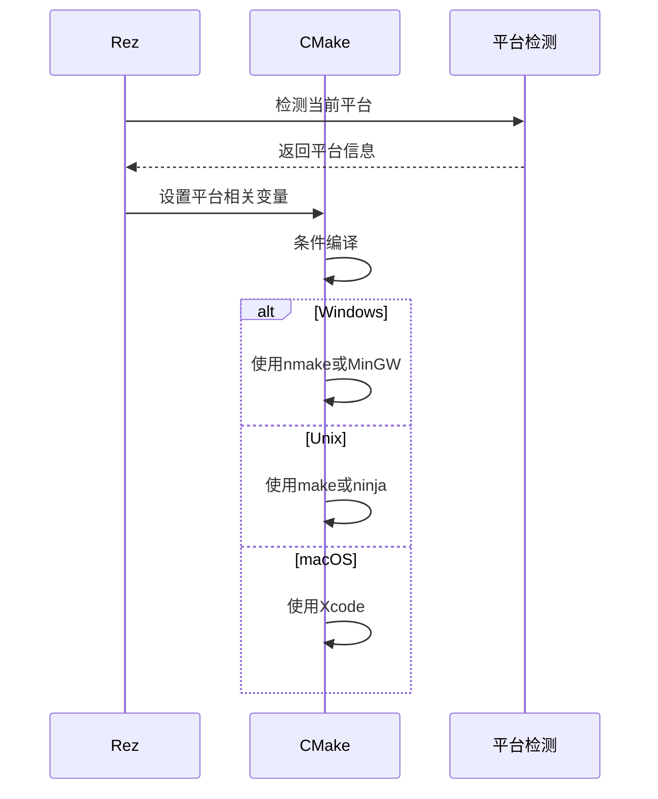

**本节来源**
- [cmake.py](file://rez-3.3.0\src\rezplugins\build_system\cmake.py#L104-L106)

## 性能优化

Rez提供了多种性能优化选项来加速构建过程。

### 并行构建

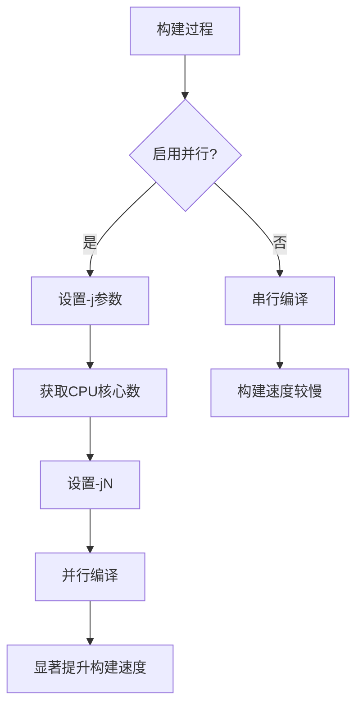

**本节来源**
- [cmake.py](file://rez-3.3.0\src\rezplugins\build_system\cmake.py#L215-L218)

### 缓存配置结果

Rez通过缓存机制避免重复的配置过程。

```mermaid
classDiagram
class BuildCache {
+配置缓存 : bool
+依赖缓存 : bool
+环境缓存 : bool
+缓存路径 : string
}
BuildCache --> CMake : 提供缓存
CMake --> BuildCache : 查询缓存
BuildCache --> Rez : 同步状态
BuildCache --> "加速配置" : 减少重复工作
BuildCache --> "一致性" : 确保构建环境稳定
```

**本节来源**
- [cmake.py](file://rez-3.3.0\src\rezplugins\build_system\cmake.py#L170-L176)

## 最佳实践

遵循以下最佳实践可以最大化Rez CMake集成的效益。

### 推荐的CMakeLists.txt结构

```cmake
# 包含Rez构建模块
include(RezBuild)

# 查找依赖包
rez_find_packages(
    boost tbb
    PREFIX DEPS
    REQUIRED
    AUTO
)

# 配置项目
project(my_project)

# 添加可执行文件或库
add_executable(my_app main.cpp)

# 链接依赖
target_link_libraries(my_app ${DEPS_LIBRARIES})
target_include_directories(my_app PRIVATE ${DEPS_INCLUDE_DIRS})
```

**本节来源**
- [CMakeLists.txt.example](file://rez-3.3.0\example_packages\hello_world\CMakeLists.txt.example#L1-L18)

### 常见问题解决方案

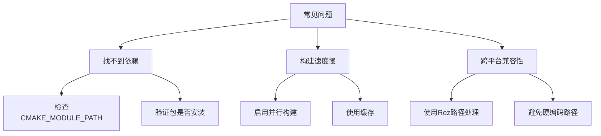

**本节来源**
- [RezFindPackages.cmake](file://rez-3.3.0\src\rezplugins\build_system\cmake_files\RezFindPackages.cmake#L33-L60)
- [cmake.py](file://rez-3.3.0\src\rezplugins\build_system\cmake.py#L136-L137)