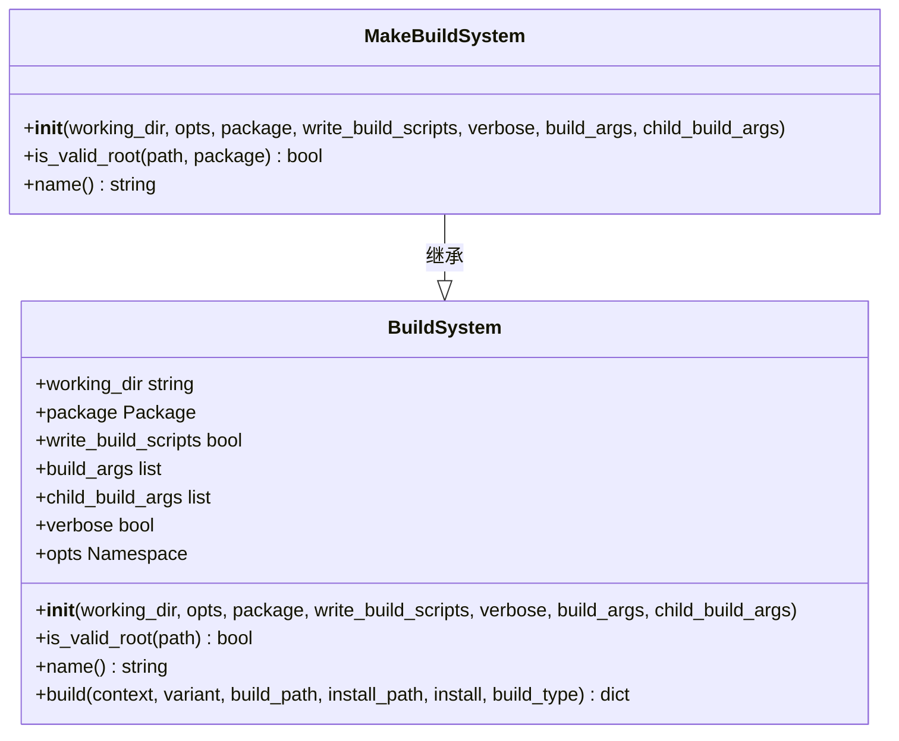
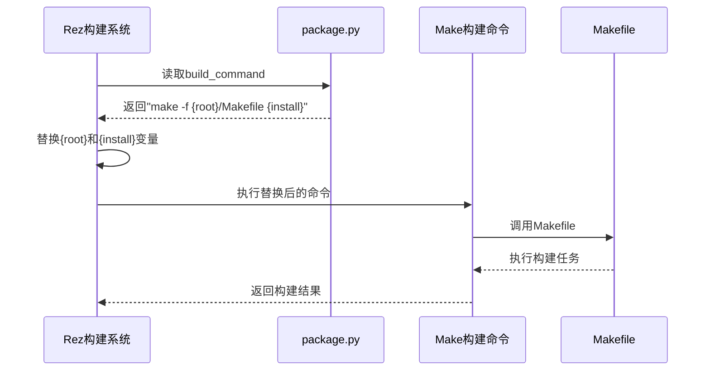
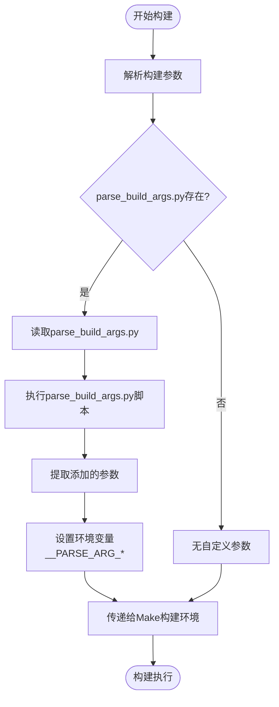
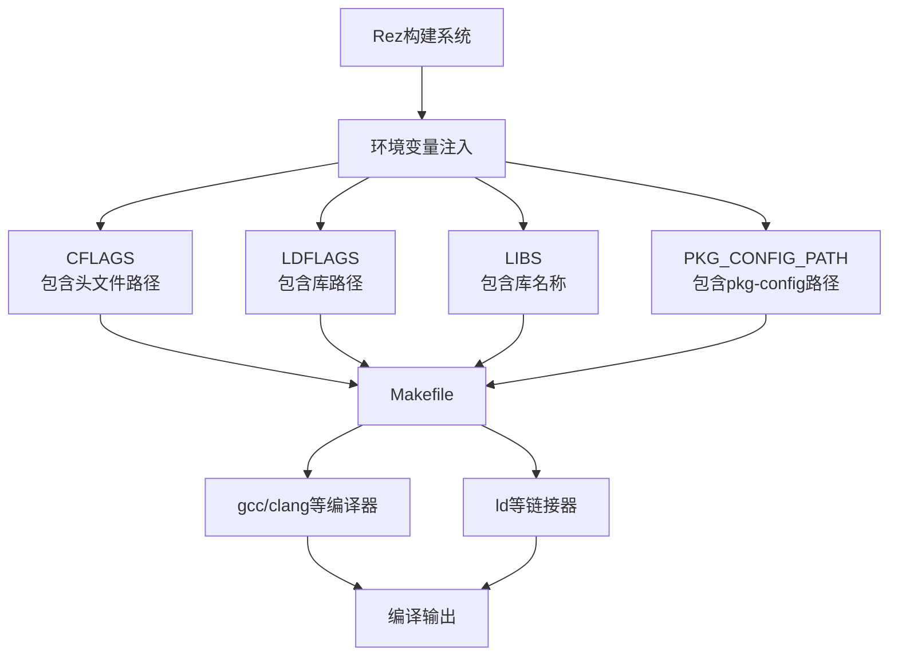
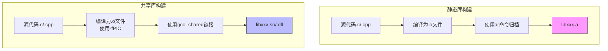
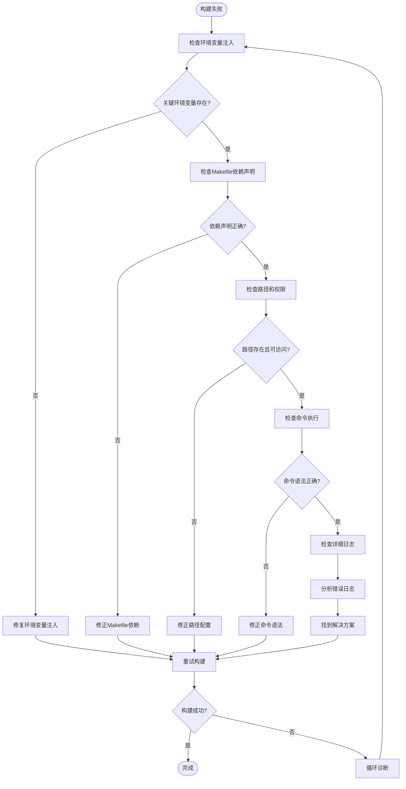

# Make 集成

<cite>
**本文档中引用的文件**  
- [make.py](file://rez-3.3.0\src\rezplugins\build_system\make.py)
- [custom.py](file://rez-3.3.0\src\rezplugins\build_system\custom.py)
- [build_system.py](file://rez-3.3.0\src\rez\build_system.py)
- [building_packages.rst](file://rez-3.3.0\docs\source\building_packages.rst)
- [myapp\1.0.0\package.py](file://my_packages\myapp\1.0.0\package.py)
- [hello\1.0\Makefile](file://rez-3.3.0\src\rez\data\tests\builds\packages\hello\1.0\Makefile)
- [RezFindPackages.cmake](file://rez-3.3.0\src\rezplugins\build_system\cmake_files\RezFindPackages.cmake)
- [RezInstallCMake.cmake](file://rez-3.3.0\src\rezplugins\build_system\cmake_files\RezInstallCMake.cmake)
</cite>

## 目录
1. [简介](#简介)
2. [Make构建系统插件](#make构建系统插件)
3. [配置build_command](#配置build_command)
4. [构建参数解析](#构建参数解析)
5. [环境变量注入](#环境变量注入)
6. [Makefile编写示例](#makefile编写示例)
7. [静态库与共享库构建](#静态库与共享库构建)
8. [平台特定语法处理](#平台特定语法处理)
9. [构建失败诊断](#构建失败诊断)
10. [结论](#结论)

## 简介
Rez是一个强大的包管理系统，支持多种构建系统，包括GNU Make。本文档详细阐述了Rez如何通过make.py插件支持GNU Make构建流程，以及如何在package.py中配置build_command来调用make命令。我们将深入探讨构建参数的解析、环境变量的注入机制，并提供实际示例来展示如何编写兼容Rez的Makefile。

**Section sources**
- [building_packages.rst](file://rez-3.3.0\docs\source\building_packages.rst)

## Make构建系统插件
Rez通过`make.py`插件实现对GNU Make构建系统的支持。该插件定义了一个`MakeBuildSystem`类，继承自`BuildSystem`基类。插件的主要功能是检测项目根目录是否存在Makefile文件，并提供相应的构建接口。



**Diagram sources**
- [make.py](file://rez-3.3.0\src\rezplugins\build_system\make.py)
- [build_system.py](file://rez-3.3.0\src\rez\build_system.py)

**Section sources**
- [make.py](file://rez-3.3.0\src\rezplugins\build_system\make.py)

## 配置build_command
在Rez中，可以通过在`package.py`文件中设置`build_command`属性来指定使用Make进行构建。`build_command`可以是一个字符串或列表，其中可以包含Rez提供的变量占位符。

```python
# 在package.py中
name = "myapp"
version = "1.0.0"
requires = ["gcc-9"]
build_command = "make -f {root}/Makefile {install}"
```

当Rez执行构建时，它会将`{root}`替换为包的根目录路径，`{install}`替换为"install"（如果正在进行安装）或空字符串。



**Diagram sources**
- [custom.py](file://rez-3.3.0\src\rezplugins\build_system\custom.py)
- [myapp\1.0.0\package.py](file://my_packages\myapp\1.0.0\package.py)

**Section sources**
- [custom.py](file://rez-3.3.0\src\rezplugins\build_system\custom.py)
- [myapp\1.0.0\package.py](file://my_packages\myapp\1.0.0\package.py)

## 构建参数解析
Rez允许通过`parse_build_args.py`文件向`rez-build`命令添加自定义参数。这些参数在构建时会被解析并作为环境变量传递给构建脚本。

```python
# 在parse_build_args.py中
parser.add_argument("--debug", action="store_true", help="启用调试模式")
parser.add_argument("--target", choices=["x86", "x64"], default="x64", help="指定目标架构")
```

当用户运行`rez-build --debug --target x86`时，Rez会将这些参数转换为环境变量`__PARSE_ARG_DEBUG`和`__PARSE_ARG_TARGET`，供Makefile使用。



**Diagram sources**
- [custom.py](file://rez-3.3.0\src\rezplugins\build_system\custom.py)
- [building_packages.rst](file://rez-3.3.0\docs\source\building_packages.rst)

**Section sources**
- [custom.py](file://rez-3.3.0\src\rezplugins\build_system\custom.py)

## 环境变量注入
Rez在构建过程中会自动将解析的依赖信息作为环境变量注入到Make构建环境中。这些环境变量包含了头文件路径、库路径和其他编译链接所需的配置信息。

主要的环境变量包括：
- `REZ_BUILD_SOURCE_PATH`: 源代码根目录
- `REZ_BUILD_PATH`: 构建目录
- `REZ_BUILD_INSTALL_PATH`: 安装目录
- `REZ_BUILD_PROJECT_NAME`: 项目名称
- `REZ_BUILD_PROJECT_VERSION`: 项目版本
- `REZ_<PACKAGE>_ROOT`: 依赖包的根目录
- `REZ_<PACKAGE>_INCLUDE_DIRS`: 依赖包的头文件目录
- `REZ_<PACKAGE>_LIBRARY_DIRS`: 依赖包的库文件目录
- `REZ_<PACKAGE>_LIBRARIES`: 依赖包的库名称



**Diagram sources**
- [build_system.py](file://rez-3.3.0\src\rez\build_system.py)
- [RezFindPackages.cmake](file://rez-3.3.0\src\rezplugins\build_system\cmake_files\RezFindPackages.cmake)

**Section sources**
- [build_system.py](file://rez-3.3.0\src\rez\build_system.py)

## Makefile编写示例
以下是一个完整的Makefile示例，展示了如何接收和使用来自Rez的环境变量：

```makefile
# 在Makefile中
CC = gcc
CXX = g++
CFLAGS = -Wall -Wextra
CXXFLAGS = $(CFLAGS) -std=c++11

# 从Rez环境变量获取依赖信息
INCLUDE_PATHS := $(shell echo $(REZ_BUILD_REQUIRES_UNVERSIONED) | tr ' ' '\n' | sed 's/\(.*\)/-I$(REZ_\U\1\E_INCLUDE_DIRS)/')
LIBRARY_PATHS := $(shell echo $(REZ_BUILD_REQUIRES_UNVERSIONED) | tr ' ' '\n' | sed 's/\(.*\)/-L$(REZ_\U\1\E_LIBRARY_DIRS)/')
LIBRARIES := $(shell echo $(REZ_BUILD_REQUIRES_UNVERSIONED) | tr ' ' '\n' | sed 's/\(.*\)/-l$(REZ_\U\1\E_LIBRARIES)/')

# 添加自定义参数支持
ifeq ($(origin __PARSE_ARG_DEBUG), environment)
    ifeq ($(__PARSE_ARG_DEBUG), 1)
        CXXFLAGS += -g -O0
    endif
endif

ifeq ($(origin __PARSE_ARG_TARGET), environment)
    TARGET_ARCH = $(__PARSE_ARG_TARGET)
    ifeq ($(TARGET_ARCH), x86)
        CXXFLAGS += -m32
    else ifeq ($(TARGET_ARCH), x64)
        CXXFLAGS += -m64
    endif
endif

# 构建目标
SRC_DIR = $(REZ_BUILD_SOURCE_PATH)/src
BUILD_DIR = $(REZ_BUILD_PATH)
INSTALL_DIR = $(REZ_BUILD_INSTALL_PATH)

SOURCES = $(wildcard $(SRC_DIR)/*.cpp)
OBJECTS = $(SOURCES:$(SRC_DIR)/%.cpp=$(BUILD_DIR)/%.o)

TARGET = $(BUILD_DIR)/myapp

$(TARGET): $(OBJECTS)
	$(CXX) $(LIBRARY_PATHS) -o $@ $^ $(LIBRARIES)

$(BUILD_DIR)/%.o: $(SRC_DIR)/%.cpp
	@mkdir -p $(dir $@)
	$(CXX) $(CXXFLAGS) $(INCLUDE_PATHS) -c $< -o $@

.PHONY: install
install: $(TARGET)
	@mkdir -p $(INSTALL_DIR)/bin
	cp $(TARGET) $(INSTALL_DIR)/bin/

.PHONY: clean
clean:
	rm -rf $(BUILD_DIR)
```

**Section sources**
- [hello\1.0\Makefile](file://rez-3.3.0\src\rez\data\tests\builds\packages\hello\1.0\Makefile)

## 静态库与共享库构建
在Rez环境中构建静态库和共享库时，需要考虑不同的编译和链接选项。以下是两种库类型的构建差异：



对于静态库，Makefile中的规则如下：
```makefile
# 静态库构建
STATIC_LIB = $(BUILD_DIR)/libmylib.a
$(STATIC_LIB): $(STATIC_OBJECTS)
	ar rcs $@ $^
```

对于共享库，Makefile中的规则如下：
```makefile
# 共享库构建
SHARED_LIB = $(BUILD_DIR)/libmylib.so
$(SHARED_LIB): $(SHARED_OBJECTS)
	$(CXX) -shared -fPIC -o $@ $^ $(LIBRARY_PATHS) $(LIBRARIES)
```

**Diagram sources**
- [RezInstallCMake.cmake](file://rez-3.3.0\src\rezplugins\build_system\cmake_files\RezInstallCMake.cmake)

**Section sources**
- [RezInstallCMake.cmake](file://rez-3.3.0\src\rezplugins\build_system\cmake_files\RezInstallCMake.cmake)

## 平台特定语法处理
不同平台（Linux、macOS、Windows）的Make语法存在差异，需要在Makefile中进行适当的处理：

```makefile
# 平台检测
UNAME_S := $(shell uname -s)
ifeq ($(UNAME_S), Linux)
    PLATFORM = linux
    SHARED_LIB_EXT = so
    SHARED_LIB_FLAG = -shared
else ifeq ($(UNAME_S), Darwin)
    PLATFORM = macos
    SHARED_LIB_EXT = dylib
    SHARED_LIB_FLAG = -dynamiclib
else ifeq ($(OS), Windows_NT)
    PLATFORM = windows
    SHARED_LIB_EXT = dll
    SHARED_LIB_FLAG = -shared
endif

# 平台特定的编译选项
ifeq ($(PLATFORM), windows)
    CXXFLAGS += -DWIN32
    LDFLAGS += -static
endif

# 平台特定的安装规则
.PHONY: install
install:
ifeq ($(PLATFORM), windows)
    mkdir -p $(INSTALL_DIR)/bin
    cp $(TARGET).exe $(INSTALL_DIR)/bin/
else
    mkdir -p $(INSTALL_DIR)/bin
    cp $(TARGET) $(INSTALL_DIR)/bin/
    chmod +x $(INSTALL_DIR)/bin/$(notdir $(TARGET))
endif
```

**Section sources**
- [hello\1.0\Makefile](file://rez-3.3.0\src\rez\data\tests\builds\packages\hello\1.0\Makefile)

## 构建失败诊断
当Make构建失败时，可以通过以下步骤进行诊断：



常见的诊断方法包括：
1. 使用`rez-build -v`启用详细输出模式
2. 检查`REZ_BUILD_SOURCE_PATH`、`REZ_BUILD_PATH`等关键环境变量是否正确设置
3. 验证Makefile中的依赖声明是否与实际文件结构匹配
4. 使用`rez-build --scripts`生成构建脚本，手动执行以调试问题
5. 检查权限问题，特别是在Windows和Linux之间的差异

**Diagram sources**
- [building_packages.rst](file://rez-3.3.0\docs\source\building_packages.rst)

**Section sources**
- [building_packages.rst](file://rez-3.3.0\docs\source\building_packages.rst)

## 结论
Rez通过灵活的插件系统和环境变量机制，为GNU Make构建提供了强大的支持。通过正确配置`build_command`、使用`parse_build_args.py`解析自定义参数，并合理利用注入的环境变量，可以实现高效、可靠的构建流程。理解静态库与共享库的构建差异，以及处理平台特定的语法，对于跨平台项目的成功构建至关重要。当遇到构建问题时，系统的诊断方法可以帮助快速定位和解决问题。