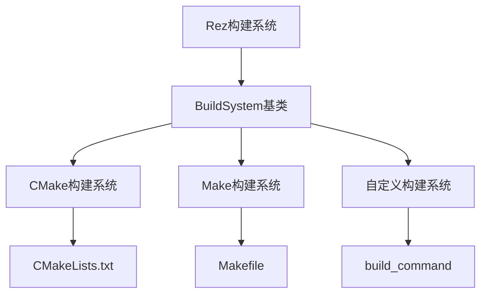
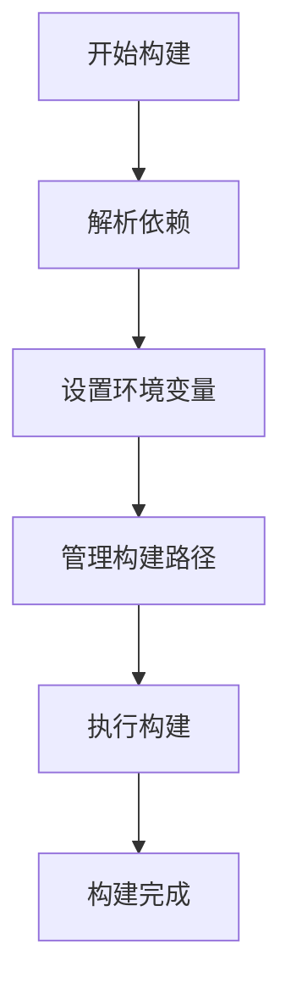
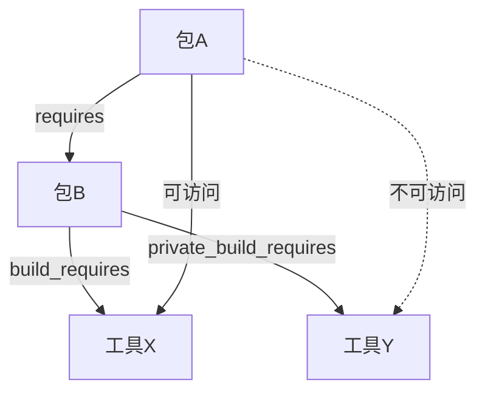
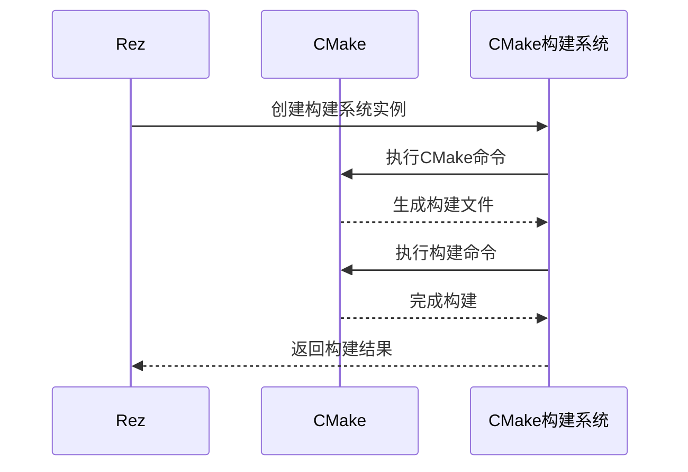
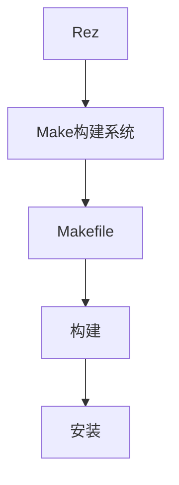
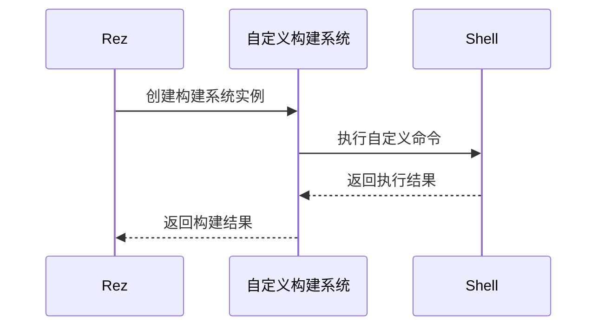
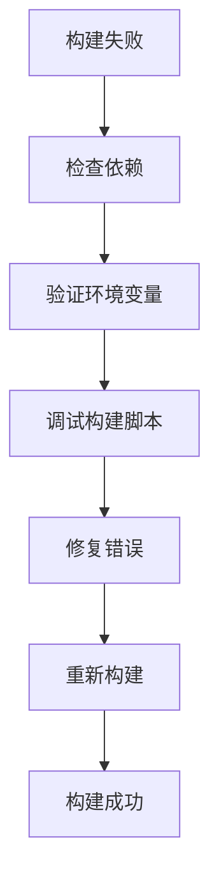
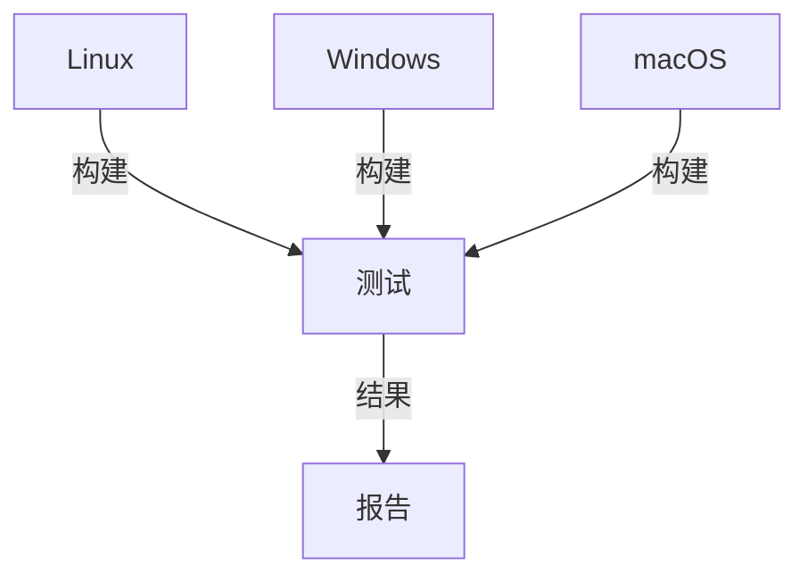

# 构建系统集成

<cite>
**本文档中引用的文件**   
- [build_system.py](file://rez-3.3.0\src\rez\build_system.py)
- [cmake.py](file://rez-3.3.0\src\rezplugins\build_system\cmake.py)
- [make.py](file://rez-3.3.0\src\rezplugins\build_system\make.py)
- [custom.py](file://rez-3.3.0\src\rezplugins\build_system\custom.py)
- [rezconfig.py](file://rez-3.3.0\src\rezplugins\build_system\rezconfig.py)
- [RezBuild.cmake](file://rez-3.3.0\src\rezplugins\build_system\cmake_files\RezBuild.cmake)
- [RezInstallCMake.cmake](file://rez-3.3.0\src\rezplugins\build_system\cmake_files\RezInstallCMake.cmake)
- [package.py](file://rez-3.3.0\example_packages\hello_world\package.py)
- [building_packages.rst](file://rez-3.3.0\docs\source\building_packages.rst)
- [package_commands.rst](file://rez-3.3.0\docs\source\package_commands.rst)
- [package_definition.rst](file://rez-3.3.0\docs\source\package_definition.rst)
</cite>

## 目录
1. [简介](#简介)
2. [构建系统集成概述](#构建系统集成概述)
3. [构建环境创建过程](#构建环境创建过程)
4. [build_requires与private_build_requires](#build_requires与private_build_requires)
5. [CMake集成配置](#cmake集成配置)
6. [Make集成配置](#make集成配置)
7. [自定义构建系统](#自定义构建系统)
8. [构建过程通信机制](#构建过程通信机制)
9. [常见构建失败原因及调试方法](#常见构建失败原因及调试方法)
10. [跨平台构建最佳实践](#跨平台构建最佳实践)

## 简介
Rez是一个强大的包管理系统，支持与多种构建系统集成，包括CMake、Make和自定义构建系统。通过build_system插件机制，Rez能够为不同的构建系统提供统一的接口和环境管理。本文档详细解释了Rez如何与这些构建系统集成，构建环境的创建过程，以及相关的配置和最佳实践。

## 构建系统集成概述
Rez通过build_system插件与不同的构建系统集成。核心的构建系统包括CMake、Make和自定义构建系统。每个构建系统通过插件实现，遵循统一的接口规范。



**Diagram sources**
- [build_system.py](file://rez-3.3.0\src\rez\build_system.py)
- [cmake.py](file://rez-3.3.0\src\rezplugins\build_system\cmake.py)
- [make.py](file://rez-3.3.0\src\rezplugins\build_system\make.py)
- [custom.py](file://rez-3.3.0\src\rezplugins\build_system\custom.py)

**Section sources**
- [build_system.py](file://rez-3.3.0\src\rez\build_system.py)

## 构建环境创建过程
构建环境的创建是Rez构建过程的核心。Rez首先解析依赖关系，然后设置环境变量，最后管理构建路径。

### 依赖解析
Rez通过解析package.py文件中的requires、build_requires和private_build_requires字段来确定依赖关系。这些依赖关系在构建环境中被解析和加载。

### 环境变量设置
Rez设置一系列标准的环境变量，供构建系统使用。这些变量包括：
- REZ_BUILD_ENV: 标识当前处于构建环境
- REZ_BUILD_PATH: 构建路径
- REZ_BUILD_INSTALL_PATH: 安装路径
- REZ_BUILD_PROJECT_NAME: 项目名称
- REZ_BUILD_PROJECT_VERSION: 项目版本

### 构建路径管理
Rez管理构建路径，确保构建过程中的临时文件和输出文件被正确放置。构建路径通常位于构建目录下，与源代码目录分离。



**Diagram sources**
- [build_system.py](file://rez-3.3.0\src\rez\build_system.py)
- [building_packages.rst](file://rez-3.3.0\docs\source\building_packages.rst)

**Section sources**
- [build_system.py](file://rez-3.3.0\src\rez\build_system.py)
- [building_packages.rst](file://rez-3.3.0\docs\source\building_packages.rst)

## build_requires与private_build_requires
build_requires和private_build_requires是Rez中用于指定构建时依赖的两个重要字段。

### build_requires
build_requires指定的依赖是传递性的，意味着这些依赖不仅在当前包的构建环境中可用，也在依赖该包的其他包的构建环境中可用。

### private_build_requires
private_build_requires指定的依赖是非传递性的，仅在当前包的构建环境中可用。

### 使用场景
- **build_requires**: 用于需要在多个包之间共享的构建工具或库，如编译器、链接器等。
- **private_build_requires**: 用于仅在当前包构建过程中需要的工具或库，如文档生成工具、测试框架等。



**Diagram sources**
- [building_packages.rst](file://rez-3.3.0\docs\source\building_packages.rst)
- [package_definition.rst](file://rez-3.3.0\docs\source\package_definition.rst)

**Section sources**
- [building_packages.rst](file://rez-3.3.0\docs\source\building_packages.rst)
- [package_definition.rst](file://rez-3.3.0\docs\source\package_definition.rst)

## CMake集成配置
Rez通过cmake.py插件与CMake集成。CMake构建系统需要CMakeLists.txt文件来定义构建过程。

### package.py配置
在package.py中，可以通过build_system字段指定使用CMake构建系统。

```python
name = "example"
version = "1.0.0"
build_system = "cmake"
build_requires = ["cmake"]
```

### CMakeLists.txt配置
CMakeLists.txt文件需要包含必要的CMake命令来配置和构建项目。

```cmake
cmake_minimum_required(VERSION 3.10)
project(example)
find_package(Rez REQUIRED)
include(RezBuild)
```

### 构建参数传递
通过parse_build_args.py文件可以定义额外的构建参数。

```python
# parse_build_args.py
parser.add_argument("--build-type", choices=["Debug", "Release"], default="Release")
```



**Diagram sources**
- [cmake.py](file://rez-3.3.0\src\rezplugins\build_system\cmake.py)
- [RezBuild.cmake](file://rez-3.3.0\src\rezplugins\build_system\cmake_files\RezBuild.cmake)
- [package.py](file://rez-3.3.0\example_packages\hello_world\package.py)

**Section sources**
- [cmake.py](file://rez-3.3.0\src\rezplugins\build_system\cmake.py)
- [RezBuild.cmake](file://rez-3.3.0\src\rezplugins\build_system\cmake_files\RezBuild.cmake)
- [package.py](file://rez-3.3.0\example_packages\hello_world\package.py)

## Make集成配置
Rez通过make.py插件与Make集成。Make构建系统需要Makefile文件来定义构建过程。

### package.py配置
在package.py中，可以通过build_system字段指定使用Make构建系统。

```python
name = "example"
version = "1.0.0"
build_system = "make"
```

### Makefile配置
Makefile文件需要包含必要的Make命令来构建项目。

```makefile
CC = gcc
CFLAGS = -Wall
example: example.c
	$(CC) $(CFLAGS) -o example example.c
```

### 构建参数传递
通过build_args参数可以传递额外的构建参数。

```python
build_args = ["-j4"]
```



**Diagram sources**
- [make.py](file://rez-3.3.0\src\rezplugins\build_system\make.py)
- [package.py](file://rez-3.3.0\example_packages\hello_world\package.py)

**Section sources**
- [make.py](file://rez-3.3.0\src\rezplugins\build_system\make.py)
- [package.py](file://rez-3.3.0\example_packages\hello_world\package.py)

## 自定义构建系统
Rez支持通过自定义构建系统来执行特定的构建命令。这通过build_command字段实现。

### package.py配置
在package.py中，可以通过build_command字段指定自定义构建命令。

```python
name = "example"
version = "1.0.0"
build_command = "bash {root}/build.sh {install}"
```

### 构建参数传递
通过parse_build_args.py文件可以定义额外的构建参数。

```python
# parse_build_args.py
parser.add_argument("--custom-flag", action="store_true")
```

### 变量扩展
Rez支持在build_command中使用变量扩展，如{root}、{install}等。



**Diagram sources**
- [custom.py](file://rez-3.3.0\src\rezplugins\build_system\custom.py)
- [package.py](file://rez-3.3.0\example_packages\hello_world\package.py)

**Section sources**
- [custom.py](file://rez-3.3.0\src\rezplugins\build_system\custom.py)
- [package.py](file://rez-3.3.0\example_packages\hello_world\package.py)

## 构建过程通信机制
Rez通过commands()函数与构建过程通信，传递头文件路径和库路径等信息。

### commands()函数
commands()函数用于定义构建过程中需要执行的命令。

```python
def commands():
    env.CPATH.append("{root}/include")
    env.LIBRARY_PATH.append("{root}/lib")
```

### 环境变量传递
Rez通过环境变量传递构建所需的信息，如头文件路径、库路径等。

```mermaid
flowchart TD
Rez[Rez] --> Commands[commands()函数]
Commands --> EnvVars[环境变量]
EnvVars --> BuildSystem[构建系统]
BuildSystem --> Build[构建]
```

**Diagram sources**
- [package_commands.rst](file://rez-3.3.0\docs\source\package_commands.rst)
- [package_definition.rst](file://rez-3.3.0\docs\source\package_definition.rst)

**Section sources**
- [package_commands.rst](file://rez-3.3.0\docs\source\package_commands.rst)
- [package_definition.rst](file://rez-3.3.0\docs\source\package_definition.rst)

## 常见构建失败原因及调试方法
构建失败可能由多种原因引起，包括依赖缺失、环境变量设置错误、构建脚本错误等。

### 常见原因
- 依赖缺失：缺少必要的构建依赖。
- 环境变量错误：环境变量设置不正确。
- 构建脚本错误：构建脚本中存在语法错误或逻辑错误。

### 调试方法
- 检查依赖：确保所有依赖都已正确安装。
- 验证环境变量：检查环境变量是否正确设置。
- 调试构建脚本：逐步执行构建脚本，定位错误。



**Diagram sources**
- [building_packages.rst](file://rez-3.3.0\docs\source\building_packages.rst)
- [package_commands.rst](file://rez-3.3.0\docs\source\package_commands.rst)

**Section sources**
- [building_packages.rst](file://rez-3.3.0\docs\source\building_packages.rst)
- [package_commands.rst](file://rez-3.3.0\docs\source\package_commands.rst)

## 跨平台构建最佳实践
跨平台构建需要考虑不同操作系统的差异，确保构建过程在所有目标平台上都能成功。

### 统一路径处理
使用Rez提供的路径处理函数，确保路径在不同操作系统上的一致性。

### 条件构建
根据操作系统类型执行不同的构建命令。

```python
def commands():
    if platform == "linux":
        env.LD_LIBRARY_PATH.append("{root}/lib")
    elif platform == "windows":
        env.PATH.append("{root}/bin")
```

### 测试覆盖
在所有目标平台上进行充分的测试，确保构建过程的稳定性。



**Diagram sources**
- [package_commands.rst](file://rez-3.3.0\docs\source\package_commands.rst)
- [building_packages.rst](file://rez-3.3.0\docs\source\building_packages.rst)

**Section sources**
- [package_commands.rst](file://rez-3.3.0\docs\source\package_commands.rst)
- [building_packages.rst](file://rez-3.3.0\docs\source\building_packages.rst)