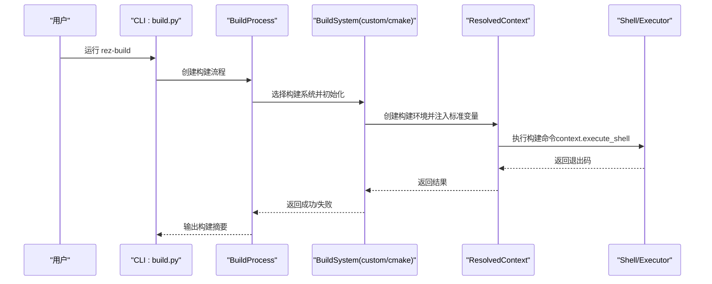
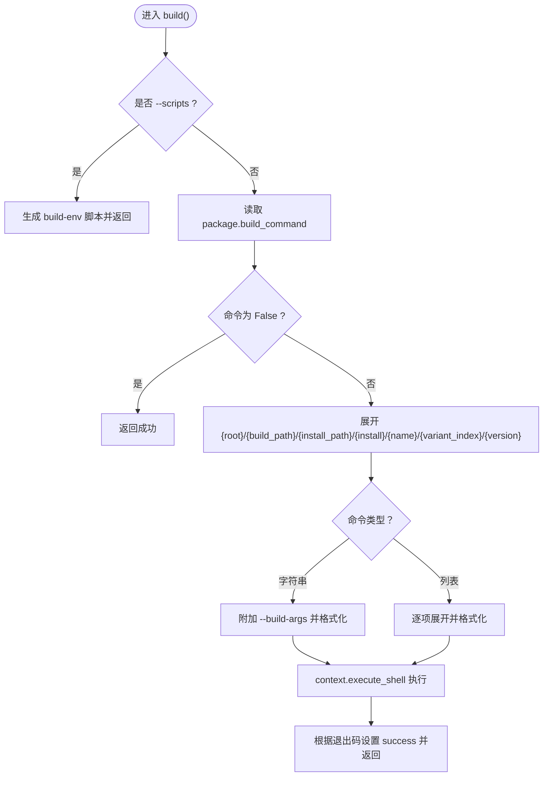
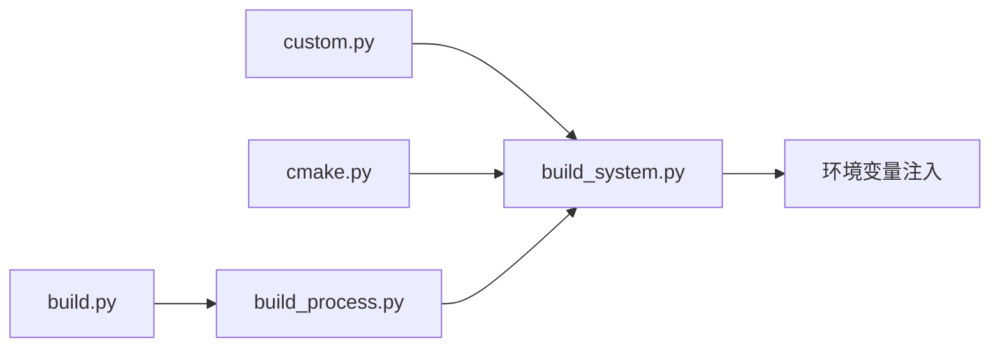

# 自定义构建系统

<cite>
**本文引用的文件**
- [custom.py](file://rez-3.3.0/src/rezplugins/build_system/custom.py)
- [cmake.py](file://rez-3.3.0/src/rezplugins/build_system/cmake.py)
- [build_system.py](file://rez-3.3.0/src/rez/build_system.py)
- [build_process.py](file://rez-3.3.0/src/rez/build_process.py)
- [build.py](file://rez-3.3.0/src/rez/cli/build.py)
- [building_packages.rst](file://rez-3.3.0/docs/source/building_packages.rst)
- [environment.rst](file://rez-3.3.0/docs/source/environment.rst)
- [package.py](file://my_packages/myapp/1.0.0/package.py)
- [package.py](file://my_packages/maya/2022/package.py)
</cite>

## 目录
1. [简介](#简介)
2. [项目结构](#项目结构)
3. [核心组件](#核心组件)
4. [架构总览](#架构总览)
5. [详细组件分析](#详细组件分析)
6. [依赖关系分析](#依赖关系分析)
7. [性能考量](#性能考量)
8. [故障排查指南](#故障排查指南)
9. [结论](#结论)
10. [附录](#附录)

## 简介
本指南面向需要在 Rez 中集成任意构建工具（如 Ninja、SCons、Bazel、Python setuptools、Node.js npm scripts 或专有构建工具）的开发者。通过 custom.py 插件提供的通用接口，你可以在 package.py 中以统一方式定义 build_command 字段，从而让 Rez 在受控的构建环境中运行任意命令，同时借助 Rez 的环境隔离能力保证构建一致性与可重复性。文档还覆盖了：
- 如何在 package.py 中定义 build_command 并利用 Rez 提供的变量进行路径与安装行为控制
- 如何通过 commands() 函数动态生成构建命令（基于包定义的上下文）
- 如何处理构建输出与状态反馈
- 错误处理与日志收集、环境快照
- 高级用例与最佳实践（可复用构建脚本模板）

## 项目结构
Rez 的构建系统由“构建流程”“构建系统插件”“CLI 参数绑定”三部分协作完成：
- 构建流程：负责遍历变体、创建构建环境、调用具体构建系统
- 构建系统插件：实现对不同工具链的适配（如 custom、cmake 等）
- CLI 绑定：为构建命令提供参数解析与扩展

```mermaid
graph TB
subgraph "构建流程"
BP["BuildProcess<br/>构建流程基类"]
LBP["local.py<br/>本地构建实现"]
end
subgraph "构建系统插件"
CBS["BuildSystem<br/>抽象基类"]
CUSTOM["custom.py<br/>自定义构建系统"]
CMAKE["cmake.py<br/>CMake 构建系统"]
end
subgraph "CLI"
CLI["build.py<br/>rez-build 命令"]
end
BP --> LBP
LBP --> CBS
CBS --> CUSTOM
CBS --> CMAKE
CLI --> BP
```

图表来源
- [build_process.py](file://rez-3.3.0/src/rez/build_process.py#L1-L200)
- [build_system.py](file://rez-3.3.0/src/rez/build_system.py#L129-L167)
- [custom.py](file://rez-3.3.0/src/rezplugins/build_system/custom.py#L1-L120)
- [cmake.py](file://rez-3.3.0/src/rezplugins/build_system/cmake.py#L1-L120)
- [build.py](file://rez-3.3.0/src/rez/cli/build.py#L44-L103)

章节来源
- [build_process.py](file://rez-3.3.0/src/rez/build_process.py#L1-L200)
- [build_system.py](file://rez-3.3.0/src/rez/build_system.py#L129-L167)
- [custom.py](file://rez-3.3.0/src/rezplugins/build_system/custom.py#L1-L120)
- [cmake.py](file://rez-3.3.0/src/rezplugins/build_system/cmake.py#L1-L120)
- [build.py](file://rez-3.3.0/src/rez/cli/build.py#L44-L103)

## 核心组件
- 自定义构建系统（custom.py）
  - 通过 package.py 的 build_command 字段运行任意命令
  - 支持字符串或列表形式的命令，自动注入路径与安装变量
  - 支持写入“构建环境脚本”，便于手动调试
  - 支持通过 parse_build_args.py 动态扩展 CLI 参数，并将其转换为环境变量传递给构建脚本
- 构建系统抽象（build_system.py）
  - 定义标准环境变量（如 REZ_BUILD_*），统一注入到构建环境中
  - 提供 add_standard_build_actions、add_pre_build_commands 等钩子
- 构建流程（build_process.py）
  - 负责迭代变体、创建构建上下文、调用构建系统并处理结果
- CLI（build.py）
  - 解析 --build-args、--child-build-args、--scripts 等参数
  - 将参数传递给构建系统插件

章节来源
- [custom.py](file://rez-3.3.0/src/rezplugins/build_system/custom.py#L1-L271)
- [build_system.py](file://rez-3.3.0/src/rez/build_system.py#L200-L312)
- [build_process.py](file://rez-3.3.0/src/rez/build_process.py#L1-L200)
- [build.py](file://rez-3.3.0/src/rez/cli/build.py#L76-L143)

## 架构总览
下图展示了从 CLI 到构建系统再到构建环境的整体调用链。



图表来源
- [build.py](file://rez-3.3.0/src/rez/cli/build.py#L124-L143)
- [build_process.py](file://rez-3.3.0/src/rez/build_process.py#L129-L200)
- [build_system.py](file://rez-3.3.0/src/rez/build_system.py#L296-L312)
- [custom.py](file://rez-3.3.0/src/rezplugins/build_system/custom.py#L100-L215)

## 详细组件分析

### 自定义构建系统（custom.py）
- 触发条件
  - 当 package.py 定义了 build_command 时，custom 构建系统被识别为可用
- 命令扩展与注入
  - 支持字符串或列表形式的命令；字符串会附加 --build-args，列表逐项扩展
  - 内置变量：{root}、{build_path}、{install_path}、{install}、{name}、{variant_index}、{version}
  - 使用 shell 的路径规范化确保跨平台一致性
- 环境变量注入
  - 通过 add_standard_build_actions 注入 REZ_BUILD_* 系列变量
  - 通过 add_pre_build_commands 执行 pre_build_commands（若存在）
- CLI 参数扩展
  - 若存在 parse_build_args.py，则动态添加参数；额外参数通过 __PARSE_ARG_ 前缀注入环境变量
- 构建脚本模式
  - 当传入 --scripts 时，生成 build-env 脚本，用户可在构建环境中直接运行构建命令



图表来源
- [custom.py](file://rez-3.3.0/src/rezplugins/build_system/custom.py#L100-L215)

章节来源
- [custom.py](file://rez-3.3.0/src/rezplugins/build_system/custom.py#L1-L271)

### CMake 构建系统（cmake.py）
- 适用场景
  - 检测到 CMakeLists.txt 即视为 CMake 项目
  - 支持多种生成器（Unix Makefiles、Ninja、NMake、MinGW、Xcode）
- 行为特征
  - 自动注入 REZ_BUILD_TYPE、REZ_BUILD_INSTALL 等变量
  - 可按平台选择默认 make/ninja 工具
  - 支持在安装模式下自动执行 install 目标

章节来源
- [cmake.py](file://rez-3.3.0/src/rezplugins/build_system/cmake.py#L1-L308)

### 构建系统抽象（build_system.py）
- 标准环境变量
  - REZ_BUILD_ENV、REZ_BUILD_PATH、REZ_BUILD_INSTALL、REZ_BUILD_PROJECT_*、REZ_BUILD_REQUIRES*
- 预构建钩子
  - add_pre_build_commands 用于执行 pre_build_commands（可访问 this、build 命名空间）
- 标准构建动作
  - add_standard_build_actions 统一注入上述变量

章节来源
- [build_system.py](file://rez-3.3.0/src/rez/build_system.py#L200-L312)

### 构建流程（build_process.py）
- 变体遍历与构建上下文
  - 对每个变体重新评估包定义，确保 building、build_variant_index 等变量生效
  - 创建构建上下文并生成 build.rxt 文件
- 结果处理
  - 根据退出码判定成功与否；支持清理、安装、变体选择等选项

章节来源
- [build_process.py](file://rez-3.3.0/src/rez/build_process.py#L197-L225)

### CLI（build.py）
- 参数绑定
  - --build-args、--child-build-args、--scripts、--install、--prefix 等
  - 自动检测可用构建系统并绑定其特定参数
- 参数解析
  - 支持在 -- 后面追加子构建参数

章节来源
- [build.py](file://rez-3.3.0/src/rez/cli/build.py#L76-L143)

## 依赖关系分析
- custom.py 依赖
  - BuildSystem 抽象基类、ResolvedContext、Shell、环境变量注入工具
  - 通过 add_standard_build_actions 与 add_pre_build_commands 与构建流程解耦
- cmake.py 依赖
  - 与 custom.py 类似，但额外封装了 CMake 生成器与 make/ninja 调用
- build_process.py 与 build_system.py
  - 构建流程依赖构建系统插件；构建系统依赖抽象基类提供的环境变量与钩子



图表来源
- [custom.py](file://rez-3.3.0/src/rezplugins/build_system/custom.py#L1-L120)
- [cmake.py](file://rez-3.3.0/src/rezplugins/build_system/cmake.py#L1-L120)
- [build_system.py](file://rez-3.3.0/src/rez/build_system.py#L200-L312)
- [build_process.py](file://rez-3.3.0/src/rez/build_process.py#L1-L200)
- [build.py](file://rez-3.3.0/src/rez/cli/build.py#L44-L103)

## 性能考量
- 并行度
  - 标准变量 REZ_BUILD_THREAD_COUNT 可用于控制并行任务数（如 make -jN）
- 构建缓存与重用
  - 通过变体重新评估与构建上下文复用，减少不必要的解析成本
- 日志与诊断
  - 生成 build.rxt 等文件便于后续诊断与回溯

[本节为通用建议，不直接分析具体文件]

## 故障排查指南
- 构建失败
  - 查看构建上下文文件（build.rxt）与构建输出目录
  - 使用 --scripts 生成 build-env 脚本，在构建环境中手动复现问题
- 环境变量缺失
  - 确认已正确注入 REZ_BUILD_* 系列变量；检查 add_standard_build_actions 是否被调用
- CLI 参数未生效
  - 确认 parse_build_args.py 是否存在且语法正确；确认额外参数是否以 __PARSE_ARG_ 前缀注入
- 安装路径问题
  - 使用 {install_path} 或 REZ_BUILD_INSTALL_PATH 获取安装目标；确保安装模式下命令包含 install 目标

章节来源
- [custom.py](file://rez-3.3.0/src/rezplugins/build_system/custom.py#L100-L215)
- [build_system.py](file://rez-3.3.0/src/rez/build_system.py#L200-L312)
- [building_packages.rst](file://rez-3.3.0/docs/source/building_packages.rst#L180-L296)

## 结论
custom.py 为 Rez 提供了统一的“任意构建工具”接口：只需在 package.py 中定义 build_command，即可在受控的构建环境中运行任意命令，并通过 Rez 的环境隔离与变量注入机制确保一致性。配合 commands() 动态生成命令、parse_build_args.py 扩展 CLI 参数、以及 --scripts 生成构建环境脚本，开发者可以轻松集成 Python setuptools、Node.js npm scripts、Ninja、SCons、Bazel 等工具链，形成可复用、可维护的构建脚本模板。

[本节为总结，不直接分析具体文件]

## 附录

### 在 package.py 中定义 build_command 的要点
- 使用 {root}、{build_path}、{install_path}、{install}、{name}、{variant_index}、{version} 等占位符
- 安装行为可通过 {install} 或 REZ_BUILD_INSTALL 判断
- 参考文档中的 Make 示例与参数传递说明

章节来源
- [building_packages.rst](file://rez-3.3.0/docs/source/building_packages.rst#L180-L296)

### 通过 commands() 动态生成构建命令
- 在 package.py 的 commands() 中，可依据当前环境动态拼接构建命令
- 注意：commands() 在包被纳入解析环境时执行，而非在构建过程中执行

章节来源
- [package.py](file://my_packages/myapp/1.0.0/package.py#L1-L33)
- [package.py](file://my_packages/maya/2022/package.py#L1-L9)

### 高级用例示例（思路）
- Python setuptools
  - 在 package.py 中定义 build_command 为 python setup.py bdist_wheel 或 python -m pip install ...
  - 使用 {install} 或 REZ_BUILD_INSTALL 控制安装阶段
- Node.js npm scripts
  - 在 package.py 中定义 build_command 为 npm run build 或 npm ci && npm run build
  - 使用 parse_build_args.py 添加 --registry、--no-optional 等参数
- 专有构建工具
  - 在 package.py 中定义 build_command 为工具二进制及其参数
  - 通过 add_standard_build_actions 注入的 REZ_BUILD_* 变量与工具交互

章节来源
- [custom.py](file://rez-3.3.0/src/rezplugins/build_system/custom.py#L100-L215)
- [build_system.py](file://rez-3.3.0/src/rez/build_system.py#L200-L312)
- [building_packages.rst](file://rez-3.3.0/docs/source/building_packages.rst#L180-L296)

### 最佳实践
- 使用 {root} 引用包根目录脚本，避免硬编码相对路径
- 将安装逻辑与构建逻辑分离，优先使用 install 目标或 {install}
- 通过 parse_build_args.py 显式暴露可配置参数，保持命令简洁
- 为复杂脚本提供 --scripts 生成的 build-env，便于调试
- 在 pre_build_commands 中做必要的前置准备（如生成中间文件）

章节来源
- [custom.py](file://rez-3.3.0/src/rezplugins/build_system/custom.py#L100-L215)
- [build_system.py](file://rez-3.3.0/src/rez/build_system.py#L260-L312)
- [building_packages.rst](file://rez-3.3.0/docs/source/building_packages.rst#L180-L296)