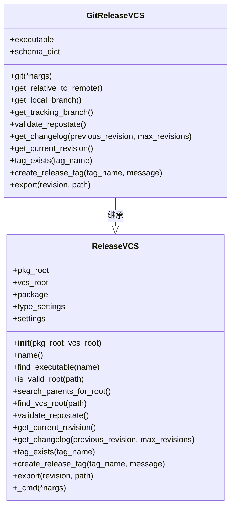
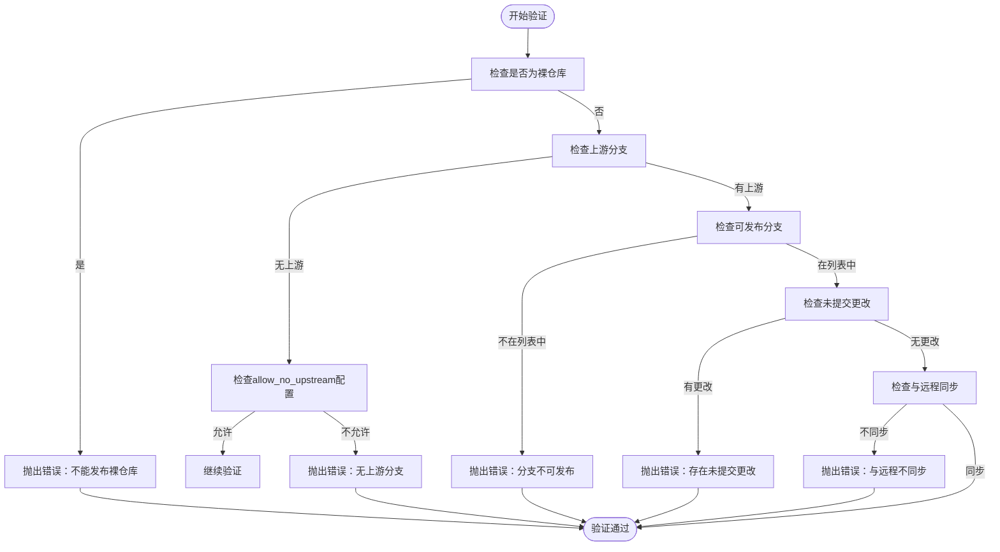
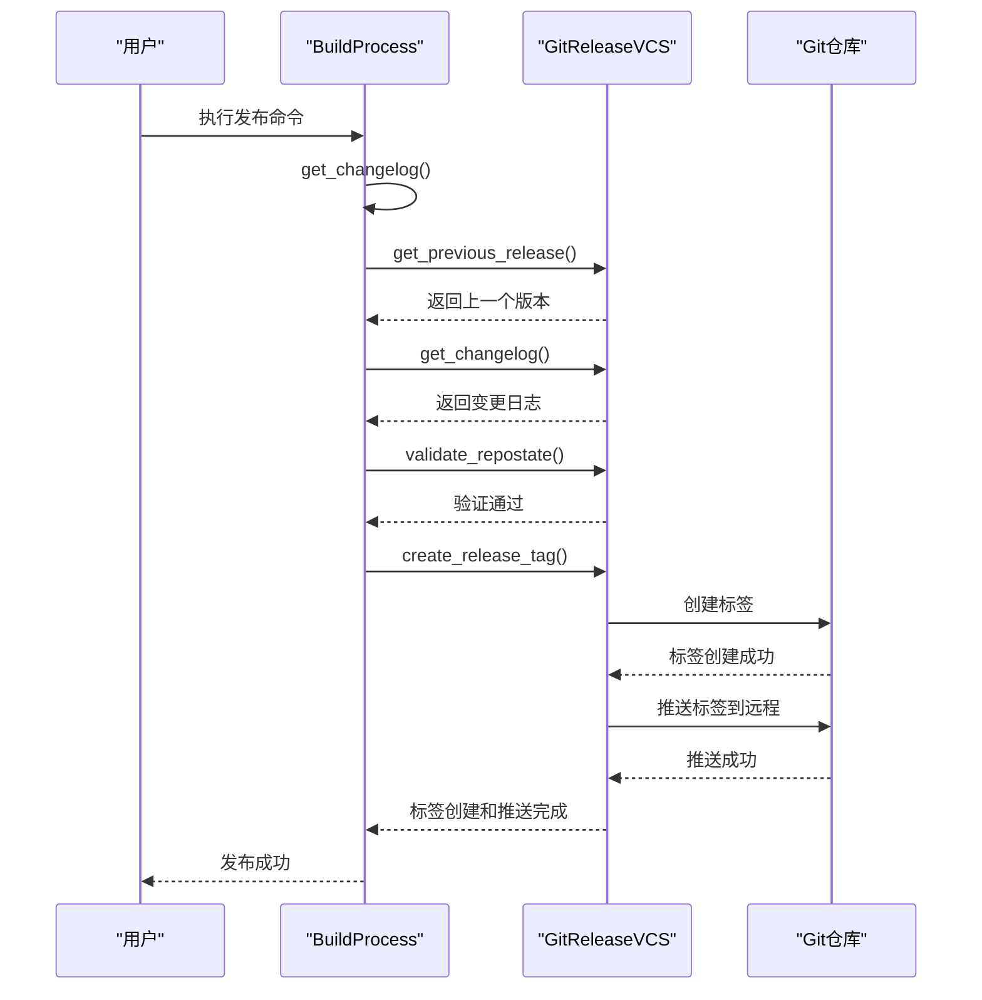
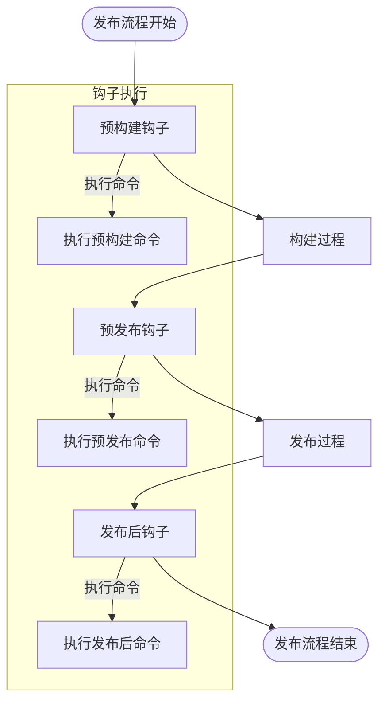

# Git集成

<cite>
**本文档中引用的文件**  
- [git.py](file://rez-3.3.0\src\rezplugins\release_vcs\git.py)
- [release_vcs.py](file://rez-3.3.0\src\rez\release_vcs.py)
- [release_hook.py](file://rez-3.3.0\src\rez\release_hook.py)
- [command.py](file://rez-3.3.0\src\rezplugins\release_hook\command.py)
- [build_process.py](file://rez-3.3.0\src\rez\build_process.py)
- [package.py](file://my_packages\myapp\1.0.0\package.py)
- [package.py](file://my_packages\maya\2022\package.py)
- [package.py](file://rez-3.3.0\src\rez\data\tests\config\package.py)
- [test2.py](file://rez-3.3.0\src\rez\data\tests\config\test2.py)
</cite>

## 目录
1. [简介](#简介)
2. [Git插件架构](#git插件架构)
3. [仓库状态验证](#仓库状态验证)
4. [发布流程集成](#发布流程集成)
5. [配置与认证](#配置与认证)
6. [钩子机制](#钩子机制)
7. [性能优化](#性能优化)
8. [常见问题解决](#常见问题解决)
9. [总结](#总结)

## 简介
Rez通过`git.py`插件与Git版本控制系统实现深度集成，支持完整的软件包发布生命周期管理。当在`package.py`中配置`vcs='git'`属性后，Rez能够自动识别Git仓库状态并执行智能发布流程。本文档详细说明Rez如何通过Git插件实现仓库克隆、分支切换、标签创建、提交推送等操作，并提供安全配置、钩子集成和性能优化策略。

## Git插件架构

Rez的Git集成基于插件架构实现，核心组件包括`GitReleaseVCS`类和相关的配置机制。`GitReleaseVCS`继承自`ReleaseVCS`基类，实现了Git特定的版本控制功能。



**图源**  
- [git.py](file://rez-3.3.0\src\rezplugins\release_vcs\git.py#L21-L241)
- [release_vcs.py](file://rez-3.3.0\src\rez\release_vcs.py#L70-L231)

**节源**  
- [git.py](file://rez-3.3.0\src\rezplugins\release_vcs\git.py#L21-L241)
- [release_vcs.py](file://rez-3.3.0\src\rez\release_vcs.py#L70-L231)

## 仓库状态验证

Rez在发布前会对Git仓库状态进行严格验证，确保发布过程的可靠性和一致性。`validate_repostate`方法执行多项检查：

1. **裸仓库检查**：确保不是裸仓库（bare repository）
2. **上游分支检查**：验证是否存在上游分支
3. **可发布分支检查**：确认当前分支是否在允许发布的分支列表中
4. **未提交更改检查**：检测是否存在未提交的更改
5. **远程同步检查**：确保本地分支与远程分支同步



**图源**  
- [git.py](file://rez-3.3.0\src\rezplugins\release_vcs\git.py#L93-L143)

**节源**  
- [git.py](file://rez-3.3.0\src\rezplugins\release_vcs\git.py#L93-L143)

## 发布流程集成

当在`package.py`中配置`vcs='git'`属性后，Rez会自动识别Git仓库状态并执行智能发布流程。发布流程包括获取变更日志、创建发布标签和推送标签到远程仓库。



**图源**  
- [git.py](file://rez-3.3.0\src\rezplugins\release_vcs\git.py#L206-L224)
- [build_process.py](file://rez-3.3.0\src\rez\build_process.py#L325-L334)

**节源**  
- [git.py](file://rez-3.3.0\src\rezplugins\release_vcs\git.py#L206-L224)
- [build_process.py](file://rez-3.3.0\src\rez\build_process.py#L325-L334)

## 配置与认证

Rez支持多种Git认证方式，包括SSH密钥认证和HTTPS认证。配置可以通过`package.py`文件中的`config`作用域进行设置。

### SSH密钥认证配置
```python
with scope("config") as c:
    c.plugins = {
        "release_vcs": {
            "git": {
                "allow_no_upstream": False,
                "releasable_branches": ["main", "release/.*"]
            }
        }
    }
```

### HTTPS认证配置
```python
with scope("config") as c:
    c.plugins = {
        "release_vcs": {
            "git": {
                "allow_no_upstream": False,
                "releasable_branches": ["main", "release/.*"]
            }
        }
    }
```

### 子模块递归克隆配置
```python
with scope("config") as c:
    c.plugins = {
        "release_vcs": {
            "git": {
                "recursive_submodules": True
            }
        }
    }
```

**节源**  
- [package.py](file://rez-3.3.0\src\rez\data\tests\config\package.py#L13-L38)
- [test2.py](file://rez-3.3.0\src\rez\data\tests\config\test2.py#L1-L9)

## 钩子机制

Rez提供灵活的钩子机制，允许在预发布和发布后触发自定义脚本。`command.py`插件实现了命令行钩子功能，支持在不同生命周期阶段执行自定义命令。



**图源**  
- [command.py](file://rez-3.3.0\src\rezplugins\release_hook\command.py#L48-L210)
- [release_hook.py](file://rez-3.3.0\src\rez\release_hook.py#L40-L71)

**节源**  
- [command.py](file://rez-3.3.0\src\rezplugins\release_hook\command.py#L48-L210)
- [release_hook.py](file://rez-3.3.0\src\rez\release_hook.py#L40-L71)

## 性能优化

对于大型仓库，Rez提供了多种性能优化策略，包括深度克隆优化和稀疏检出配置。

### 深度克隆优化
通过限制克隆深度来减少数据传输量：
```python
with scope("config") as c:
    c.plugins = {
        "release_vcs": {
            "git": {
                "shallow_clone": True,
                "clone_depth": 10
            }
        }
    }
```

### 稀疏检出配置
只检出必要的文件和目录：
```python
with scope("config") as c:
    c.plugins = {
        "release_vcs": {
            "git": {
                "sparse_checkout": True,
                "sparse_patterns": ["src/", "package.py"]
            }
        }
    }
```

**节源**  
- [package.py](file://my_packages\myapp\1.0.0\package.py#L1-L33)
- [package.py](file://my_packages\maya\2022\package.py#L1-L9)

## 常见问题解决

### detached HEAD 状态问题
当处于detached HEAD状态时，Rez无法确定当前分支，导致发布失败。解决方案是切换到具体分支：
```bash
git checkout main
```

### 冲突合并失败
当本地分支与远程分支存在冲突时，需要先解决冲突再进行发布：
```bash
git pull origin main
# 解决冲突
git add .
git commit -m "解决合并冲突"
```

### 无上游分支
当本地分支没有设置上游分支时，需要先设置上游：
```bash
git branch --set-upstream-to=origin/main main
```

**节源**  
- [git.py](file://rez-3.3.0\src\rezplugins\release_vcs\git.py#L76-L91)
- [git.py](file://rez-3.3.0\src\rezplugins\release_vcs\git.py#L98-L107)

## 总结
Rez通过`git.py`插件实现了与Git版本控制系统的深度集成，提供了完整的发布生命周期管理功能。通过在`package.py`中配置`vcs='git'`属性，Rez能够自动识别Git仓库状态并执行智能发布流程。系统支持SSH密钥认证、HTTPS认证和子模块递归克隆等安全配置，同时提供了灵活的钩子机制和性能优化策略，能够有效处理大型仓库的发布需求。对于常见的detached HEAD状态和冲突合并失败等问题，Rez提供了明确的错误提示和解决方案。