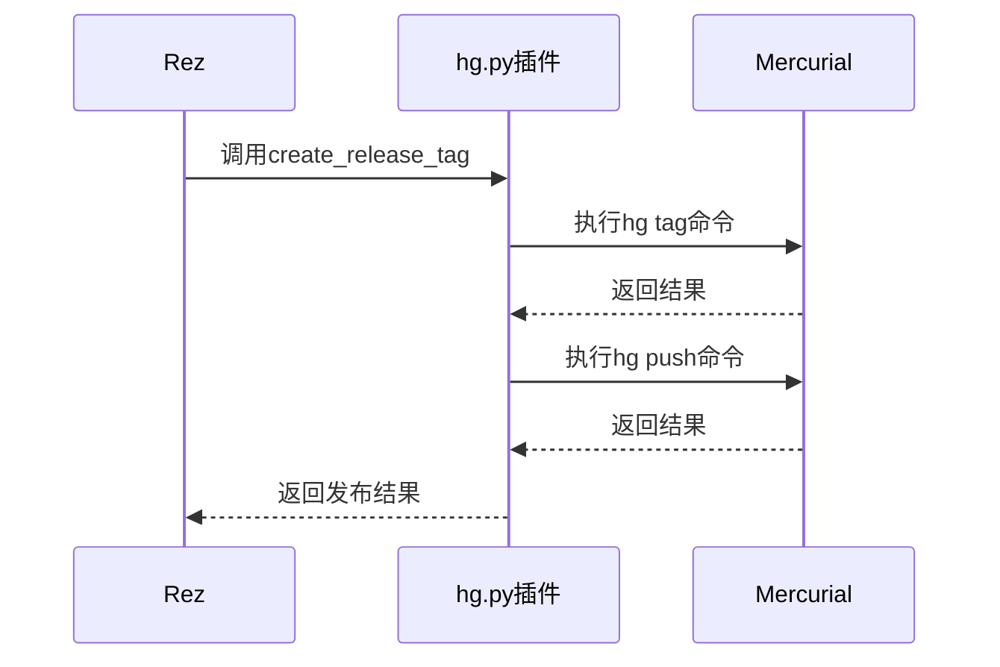
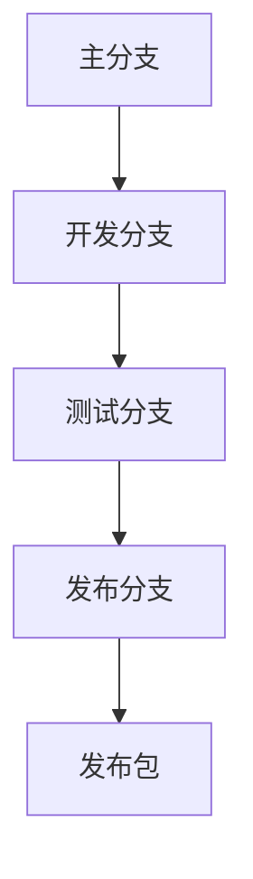
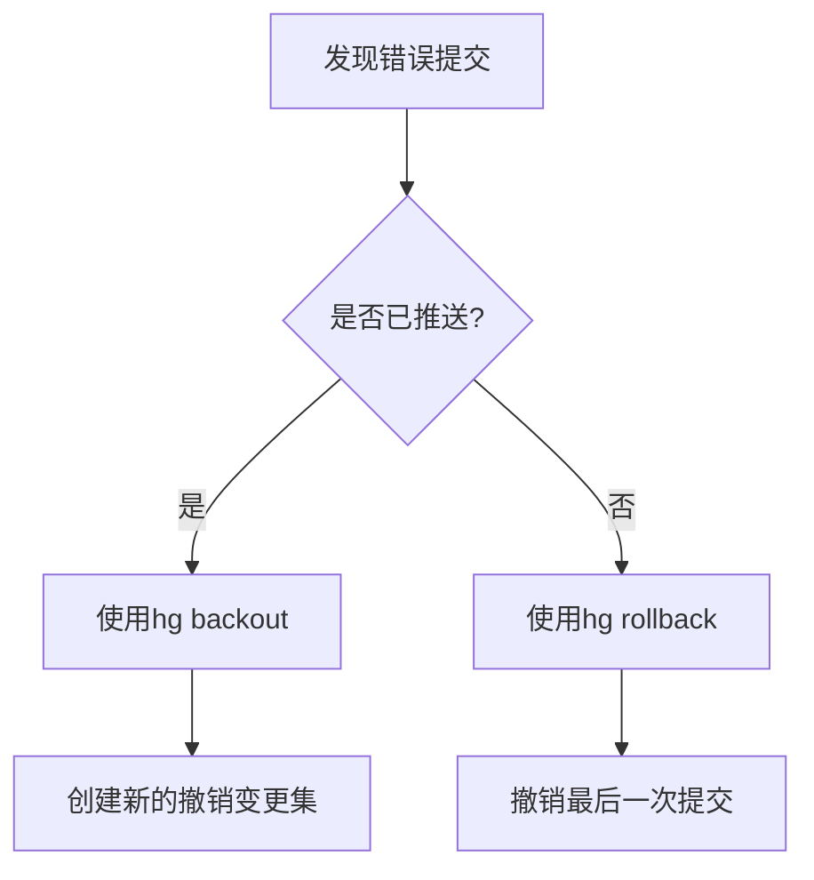

# Mercurial集成

<cite>
**本文档中引用的文件**   
- [hg.py](file://rez-3.3.0\src\rezplugins\release_vcs\hg.py)
- [rezconfig.py](file://rez-3.3.0\src\rezplugins\release_vcs\rezconfig.py)
- [release_vcs.py](file://rez-3.3.0\src\rez\release_vcs.py)
- [rezconfig.py](file://rez-3.3.0\src\rez\rezconfig.py)
- [releasing_packages.rst](file://rez-3.3.0\docs\source\releasing_packages.rst)
</cite>

## 目录
1. [简介](#简介)
2. [Rez与Mercurial协同工作原理](#rez与mercurial协同工作原理)
3. [轻量级分支与变更集模型在包发布中的应用](#轻量级分支与变更集模型在包发布中的应用)
4. [Mercurial特有配置](#mercurial特有配置)
5. [变更集哈希值与Rez包版本的映射机制](#变更集哈希值与rez包版本的映射机制)
6. [大型二进制文件存储配置建议](#大型二进制文件存储配置建议)
7. [命名空间冲突与撤销提交问题的预防与恢复](#命名空间冲突与撤销提交问题的预防与恢复)
8. [结论](#结论)

## 简介

Rez是一个强大的包管理系统，它通过插件机制与多种版本控制系统（VCS）集成，其中包括Mercurial。Mercurial是一个分布式版本控制系统，以其轻量级分支和变更集模型而闻名。本文档将详细介绍Rez如何通过`hg.py`插件与Mercurial协同工作，解析其轻量级分支和变更集模型在包发布中的应用，并提供相关的配置建议和问题解决方案。

**Section sources**
- [hg.py](file://rez-3.3.0\src\rezplugins\release_vcs\hg.py#L1-L279)
- [releasing_packages.rst](file://rez-3.3.0\docs\source\releasing_packages.rst#L1-L28)

## Rez与Mercurial协同工作原理

Rez通过`hg.py`插件与Mercurial进行集成。该插件实现了`ReleaseVCS`类，提供了与Mercurial交互的方法。当使用`rez-release`工具发布包时，Rez会自动调用`hg.py`插件执行相应的VCS操作。



**Diagram sources **
- [hg.py](file://rez-3.3.0\src\rezplugins\release_vcs\hg.py#L244-L276)

**Section sources**
- [hg.py](file://rez-3.3.0\src\rezplugins\release_vcs\hg.py#L1-L279)

## 轻量级分支与变更集模型在包发布中的应用

Mercurial的轻量级分支和变更集模型为包发布提供了灵活性和效率。在Rez中，每个包的发布都对应于Mercurial中的一个变更集。通过使用轻量级分支，可以在不影响主分支的情况下进行包的开发和测试。



**Diagram sources **
- [hg.py](file://rez-3.3.0\src\rezplugins\release_vcs\hg.py#L64-L88)

**Section sources**
- [hg.py](file://rez-3.3.0\src\rezplugins\release_vcs\hg.py#L64-L88)

## Mercurial特有配置

### .hgrc认证文件

`.hgrc`文件用于配置Mercurial的用户信息和认证信息。在Rez中，可以通过设置环境变量或在`.hgrc`文件中直接配置用户名和密码来实现认证。

```ini
[ui]
username = Your Name <your.email@example.com>

[auth]
default.prefix = https://example.com
default.username = your_username
default.password = your_password
```

### SSH包装器设置

为了通过SSH访问Mercurial仓库，需要配置SSH包装器。这可以通过在`.hgrc`文件中设置`ssh`命令来实现。

```ini
[ui]
ssh = ssh -i /path/to/private/key
```

### 命名分支与匿名分支的发布策略差异

在Mercurial中，命名分支和匿名分支有不同的发布策略。命名分支通常用于长期开发，而匿名分支用于短期任务。在Rez中，可以通过配置`releasable_branches`来限制可发布的分支。

```python
releasable_branches = ["^main$", "^release/.*"]
```

**Section sources**
- [rezconfig.py](file://rez-3.3.0\src\rezplugins\release_vcs\rezconfig.py#L14-L18)
- [hg.py](file://rez-3.3.0\src\rezplugins\release_vcs\hg.py#L23-L42)

## 变更集哈希值与Rez包版本的映射机制

在Mercurial中，每个变更集都有一个唯一的哈希值。Rez通过将变更集哈希值映射到包版本来实现版本控制。具体来说，Rez使用`get_current_revision`方法获取当前变更集的哈希值，并将其作为包版本的一部分。

```python
def get_current_revision(self):
    doc = {
        'commit': self.hg("log", "--template", "{node}", "-r", ".")[0],
        'branch': self.hg("branch")[0],
    }
    return doc
```

**Section sources**
- [hg.py](file://rez-3.3.0\src\rezplugins\release_vcs\hg.py#L193-L210)

## 大型二进制文件存储配置建议

虽然Mercurial本身不支持LFS（Large File Storage），但可以通过一些配置来优化大型二进制文件的存储。建议使用外部存储解决方案，如Amazon S3或Google Cloud Storage，并通过脚本将大型文件上传到外部存储，然后在Mercurial中存储指向这些文件的链接。

```python
# 示例：将大型文件上传到S3
import boto3

def upload_large_file_to_s3(file_path, bucket_name, object_name):
    s3_client = boto3.client('s3')
    s3_client.upload_file(file_path, bucket_name, object_name)
    return f"s3://{bucket_name}/{object_name}"
```

**Section sources**
- [hg.py](file://rez-3.3.0\src\rezplugins\release_vcs\hg.py#L181-L192)

## 命名空间冲突与撤销提交问题的预防与恢复

### 命名空间冲突

命名空间冲突通常发生在多个开发者同时修改同一文件时。为了预防命名空间冲突，建议使用轻量级分支进行开发，并在合并前进行代码审查。

### 撤销提交

如果需要撤销提交，可以使用`hg rollback`命令。但请注意，`hg rollback`只能撤销最后一次提交，且不能在已推送的变更集上使用。对于已推送的变更集，建议使用`hg backout`命令来创建一个新的变更集以撤销之前的更改。



**Diagram sources **
- [hg.py](file://rez-3.3.0\src\rezplugins\release_vcs\hg.py#L181-L192)

**Section sources**
- [hg.py](file://rez-3.3.0\src\rezplugins\release_vcs\hg.py#L181-L192)

## 结论

Rez通过`hg.py`插件与Mercurial实现了无缝集成，利用Mercurial的轻量级分支和变更集模型，为包发布提供了高效和灵活的解决方案。通过合理的配置和最佳实践，可以有效预防和解决命名空间冲突及撤销提交等问题，确保包发布的稳定性和可靠性。