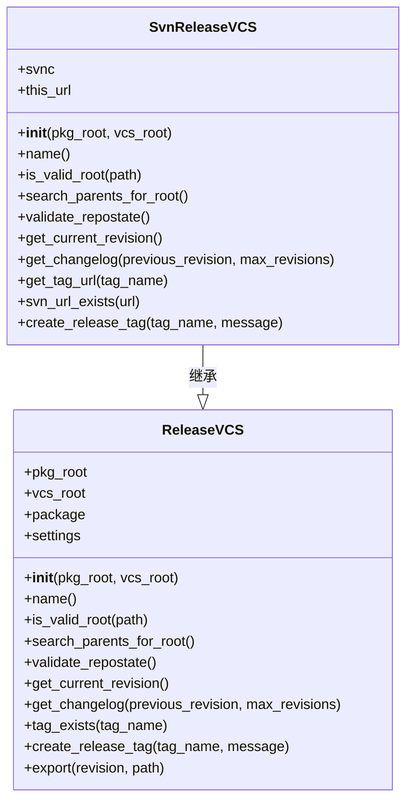
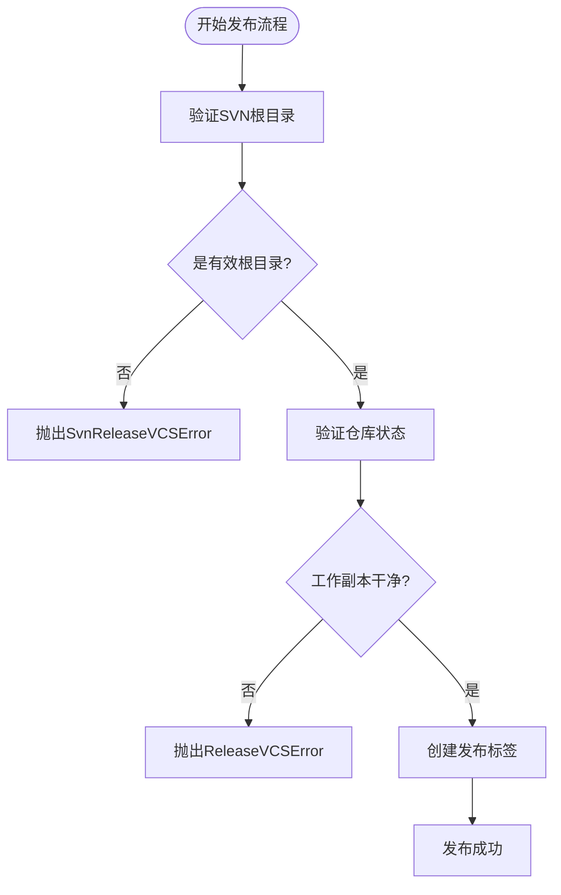
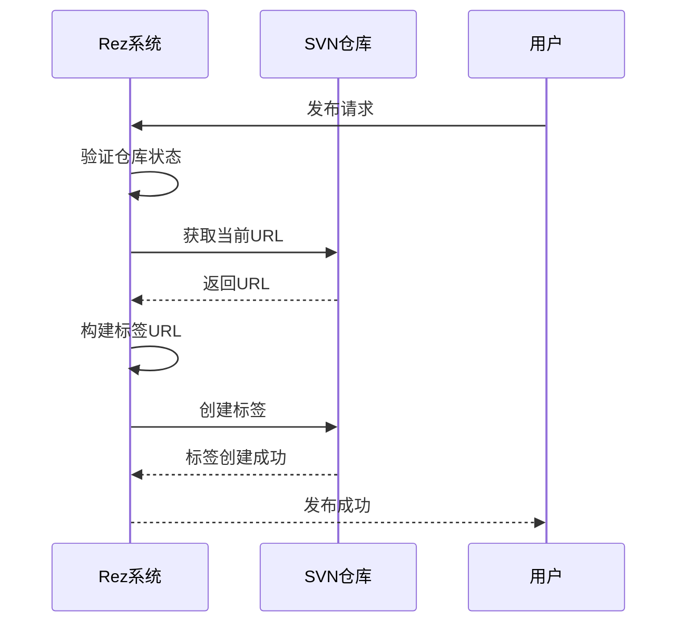
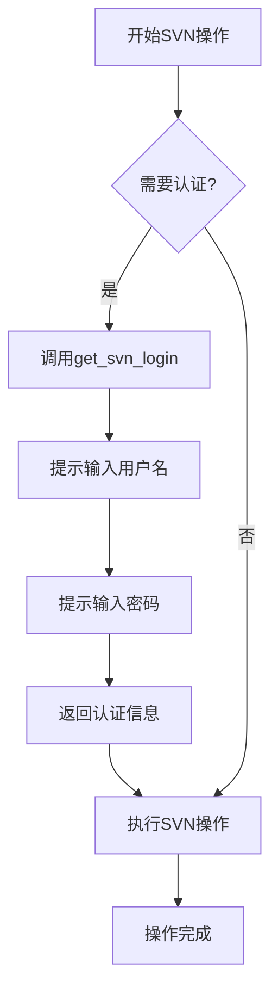
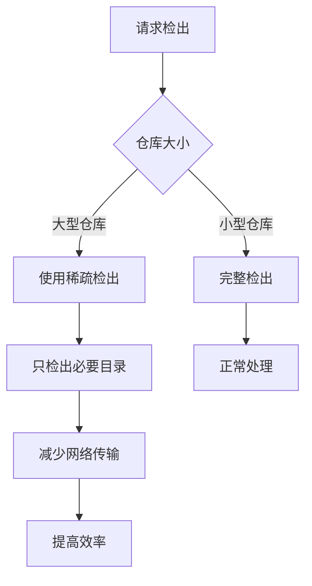
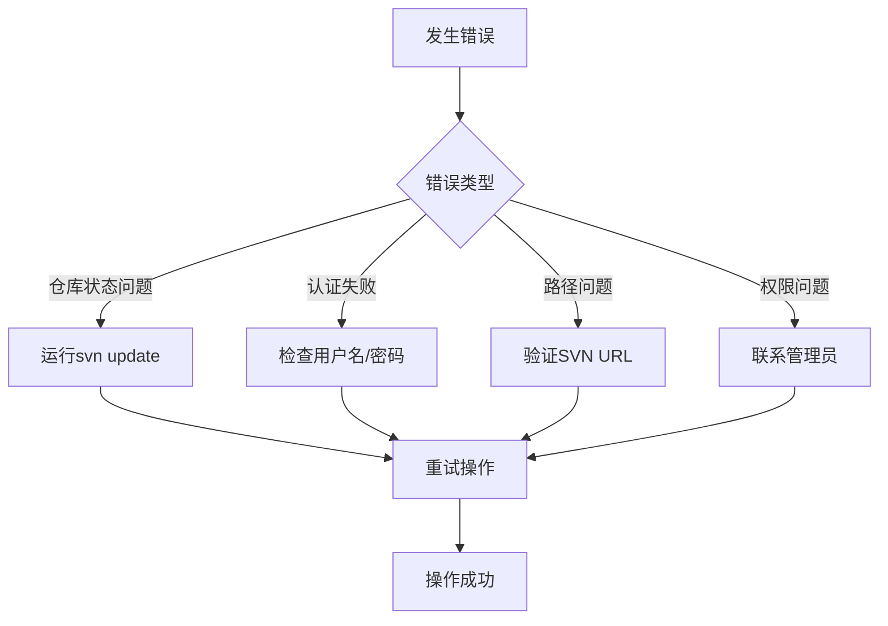

# SVN集成

<cite>
**本文档中引用的文件**   
- [svn.py](file://rez-3.3.0\src\rezplugins\release_vcs\svn.py#L1-L139)
- [release_vcs.py](file://rez-3.3.0\src\rez\release_vcs.py#L1-L231)
- [README.md](file://rez-3.3.0\README.md#L1-L230)
</cite>

## 目录
1. [SVN集成概述](#svn集成概述)
2. [核心组件分析](#核心组件分析)
3. [SVN工作模式适配](#svn工作模式适配)
4. [版本控制与同步](#版本控制与同步)
5. [认证配置方法](#认证配置方法)
6. [企业级应用场景](#企业级应用场景)
7. [故障排除指南](#故障排除指南)

## SVN集成概述

Rez通过`svn.py`插件与Subversion版本控制系统集成，实现了集中式仓库的工作模式适配。该集成允许Rez在发布流程中与SVN仓库进行交互，包括版本控制、锁定机制和分支合并跟踪等操作。

**Section sources**
- [svn.py](file://rez-3.3.0\src\rezplugins\release_vcs\svn.py#L1-L139)
- [README.md](file://rez-3.3.0\README.md#L1-L230)

## 核心组件分析

Rez的SVN集成主要通过`SvnReleaseVCS`类实现，该类继承自`ReleaseVCS`基类，提供了与SVN仓库交互的具体方法。



**Diagram sources**
- [svn.py](file://rez-3.3.0\src\rezplugins\release_vcs\svn.py#L60-L139)
- [release_vcs.py](file://rez-3.3.0\src\rez\release_vcs.py#L70-L231)

**Section sources**
- [svn.py](file://rez-3.3.0\src\rezplugins\release_vcs\svn.py#L60-L139)

## SVN工作模式适配

Rez的SVN集成适配了集中式仓库的工作模式，通过以下方式实现：

1. **仓库验证**：使用`is_valid_root`方法检查指定路径是否为有效的SVN仓库根目录，通过检测`.svn`目录的存在来确认。
2. **根目录搜索**：`search_parents_for_root`方法返回True，表示需要向上级目录搜索SVN根目录。
3. **状态验证**：`validate_repostate`方法检查工作副本状态，确保在发布前所有更改都已提交或更新。



**Diagram sources**
- [svn.py](file://rez-3.3.0\src\rezplugins\release_vcs\svn.py#L75-L95)

**Section sources**
- [svn.py](file://rez-3.3.0\src\rezplugins\release_vcs\svn.py#L75-L95)

## 版本控制与同步

Rez与SVN的版本控制同步主要通过以下机制实现：

### 版本号映射

Rez包版本与SVN全局修订号之间的同步通过`get_current_revision`方法实现，该方法返回当前工作副本的修订号。

```python
def get_current_revision(self):
    return self.svnc.info(self.pkg_root)['revision'].number
```

### 标签创建

发布时，Rez通过`create_release_tag`方法在SVN仓库中创建标签，将Rez包版本映射到SVN标签。



**Diagram sources**
- [svn.py](file://rez-3.3.0\src\rezplugins\release_vcs\svn.py#L126-L135)

**Section sources**
- [svn.py](file://rez-3.3.0\src\rezplugins\release_vcs\svn.py#L126-L135)

## 认证配置方法

Rez支持svn+ssh和http(s)协议的认证配置，通过`get_svn_login`回调函数处理认证。

### 认证机制



### 客户端配置

`svn_get_client`函数配置SVN客户端，设置交互模式和认证回调：

```python
def svn_get_client():
    client = pysvn.Client()
    client.set_interactive(True)
    client.set_auth_cache(False)
    client.set_store_passwords(False)
    client.callback_get_login = get_svn_login
    return client
```

**Diagram sources**
- [svn.py](file://rez-3.3.0\src\rezplugins\release_vcs\svn.py#L20-L27)

**Section sources**
- [svn.py](file://rez-3.3.0\src\rezplugins\release_vcs\svn.py#L20-L58)

## 企业级应用场景

### 权限管理

Rez的SVN集成通过SVN自身的权限管理机制实现访问控制。在企业环境中，建议配置SVN服务器的访问控制列表(ACL)来管理不同用户的权限。

### 二进制文件处理

对于大型二进制文件，建议使用SVN的`svn:externals`特性或外部存储解决方案，避免将大型二进制文件直接存储在SVN仓库中。

### 大型仓库分页检出

对于大型仓库，可以使用SVN的稀疏检出(sparse checkout)功能，只检出需要的目录：



**Section sources**
- [svn.py](file://rez-3.3.0\src\rezplugins\release_vcs\svn.py#L68-L73)

## 故障排除指南

### 版本冲突

当出现版本冲突时，系统会抛出`ReleaseVCSError`异常。解决方法：

1. 更新工作副本：`svn update`
2. 解决冲突：手动编辑冲突文件或使用`svn resolve`
3. 提交更改：`svn commit`

### 锁定失败

锁定失败通常由于以下原因：

- 文件已被其他用户锁定
- 网络连接问题
- 权限不足

解决方法：

1. 检查锁定状态：`svn info`
2. 确认网络连接
3. 验证用户权限

### 常见错误处理



**Diagram sources**
- [svn.py](file://rez-3.3.0\src\rezplugins\release_vcs\svn.py#L83-L94)

**Section sources**
- [svn.py](file://rez-3.3.0\src\rezplugins\release_vcs\svn.py#L83-L94)