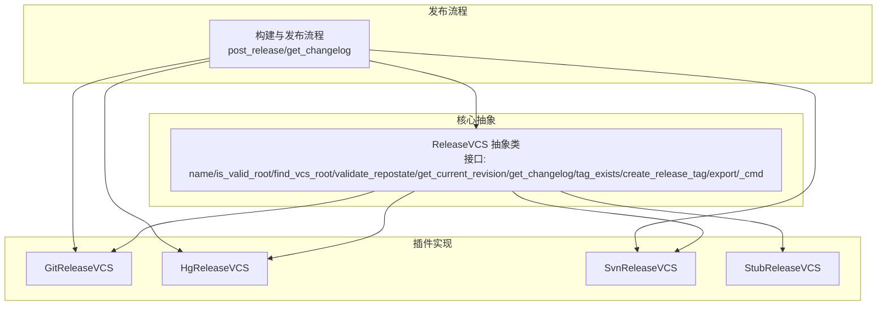
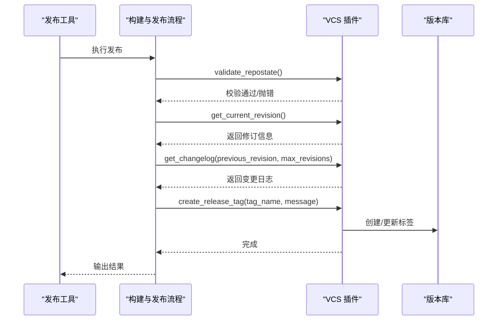
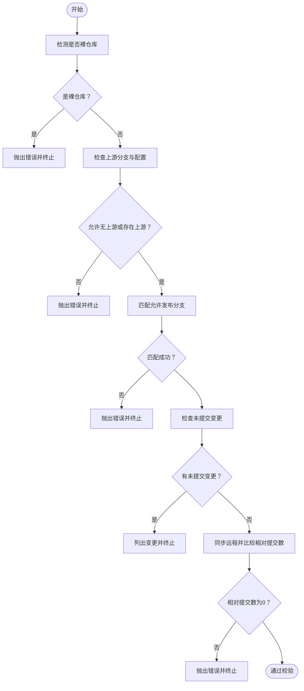
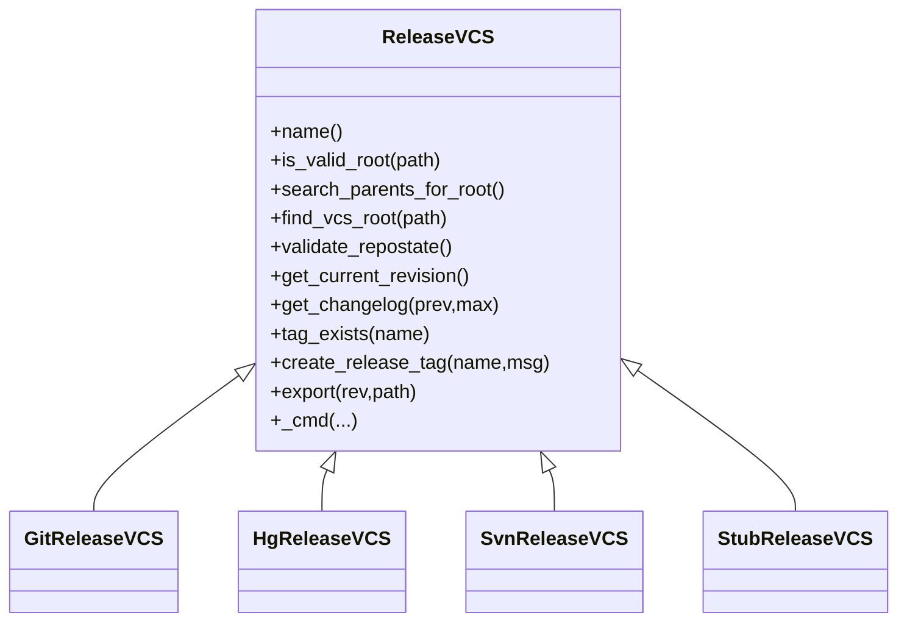

# 版本控制集成

<cite>
**本文引用的文件**
- [release_vcs.py](file://rez-3.3.0/src/rez/release_vcs.py)
- [git.py](file://rez-3.3.0/src/rezplugins/release_vcs/git.py)
- [hg.py](file://rez-3.3.0/src/rezplugins/release_vcs/hg.py)
- [svn.py](file://rez-3.3.0/src/rezplugins/release_vcs/svn.py)
- [stub.py](file://rez-3.3.0/src/rezplugins/release_vcs/stub.py)
- [rezconfig.py](file://rez-3.3.0/src/rezplugins/release_vcs/rezconfig.py)
- [build_process.py](file://rez-3.3.0/src/rez/build_process.py)
- [releasing_packages.rst](file://rez-3.3.0/docs/source/releasing_packages.rst)
- [configuring_rez.rst](file://rez-3.3.0/docs/source/configuring_rez.rst)
- [package.py](file://my_packages/myapp/1.0.0/package.py)
</cite>

## 目录
1. [简介](#简介)
2. [项目结构](#项目结构)
3. [核心组件](#核心组件)
4. [架构总览](#架构总览)
5. [组件详解](#组件详解)
6. [依赖关系分析](#依赖关系分析)
7. [性能考量](#性能考量)
8. [故障排查指南](#故障排查指南)
9. [结论](#结论)
10. [附录](#附录)

## 简介
本文件系统性阐述 Rez 的版本控制集成能力，重点围绕 release_vcs 插件体系与 Git、SVN、Hg 的对接机制。内容覆盖：
- 插件架构与职责边界
- 各 VCS 实现的仓库定位、分支校验、标签创建与推送、变更日志生成
- 配置项与在 package.py 中的 vcs 属性用法
- 认证与 SSH 密钥管理要点
- 子模块处理与多 VCS 根冲突处理
- 常见问题与性能优化建议

## 项目结构
Rez 将通用 VCS 抽象与具体实现解耦：
- 通用抽象层：位于核心模块，定义 VCS 接口、命令执行、根目录探测、标签与变更日志等约定
- 具体实现：位于插件目录，分别为 Git、Hg、SVN 提供适配器
- 发布流程：在构建后阶段调用 VCS 插件进行自动打标签与推送

图表来源
- [release_vcs.py](file://rez-3.3.0/src/rez/release_vcs.py#L70-L231)
- [git.py](file://rez-3.3.0/src/rezplugins/release_vcs/git.py#L1-L242)
- [hg.py](file://rez-3.3.0/src/rezplugins/release_vcs/hg.py#L1-L280)
- [svn.py](file://rez-3.3.0/src/rezplugins/release_vcs/svn.py#L1-L140)
- [stub.py](file://rez-3.3.0/src/rezplugins/release_vcs/stub.py#L1-L81)
- [build_process.py](file://rez-3.3.0/src/rez/build_process.py#L320-L450)

章节来源
- [release_vcs.py](file://rez-3.3.0/src/rez/release_vcs.py#L1-L231)
- [build_process.py](file://rez-3.3.0/src/rez/build_process.py#L320-L450)

## 核心组件
- ReleaseVCS 抽象基类：定义 VCS 插件必须实现的方法与生命周期，包括根目录探测、状态校验、当前修订、变更日志、标签存在性与创建、导出等
- 具体插件：
  - GitReleaseVCS：基于 git 命令行，支持上游分支校验、本地分支匹配、未提交变更检查、相对远程提交数判断、标签创建与推送、导出到指定提交
  - HgReleaseVCS：基于 hg 命令行，支持 MQ 补丁队列、书签与标签协同、默认 URL 获取、变更日志范围控制
  - SvnReleaseVCS：基于 pysvn 客户端，支持工作副本状态检查、标签复制、URL 规则解析
  - StubReleaseVCS：用于测试的占位实现
- 发布流程：在 post_release 阶段根据配置生成标签名并调用对应 VCS 插件的 create_release_tag

章节来源
- [release_vcs.py](file://rez-3.3.0/src/rez/release_vcs.py#L70-L231)
- [git.py](file://rez-3.3.0/src/rezplugins/release_vcs/git.py#L1-L242)
- [hg.py](file://rez-3.3.0/src/rezplugins/release_vcs/hg.py#L1-L280)
- [svn.py](file://rez-3.3.0/src/rezplugins/release_vcs/svn.py#L1-L140)
- [stub.py](file://rez-3.3.0/src/rezplugins/release_vcs/stub.py#L1-L81)
- [build_process.py](file://rez-3.3.0/src/rez/build_process.py#L320-L450)

## 架构总览
Rez 在发布流程中按以下顺序与 VCS 协作：
- 解析配置，确定标签命名模板与允许的发布分支
- 校验工作区状态（未提交变更、上游分支、相对远程提交数）
- 获取当前修订（包含分支、跟踪分支、URL 等元数据）
- 生成变更日志（可限制最大条目或字符数）
- 创建并推送标签（若未存在）

图表来源
- [build_process.py](file://rez-3.3.0/src/rez/build_process.py#L320-L450)
- [release_vcs.py](file://rez-3.3.0/src/rez/release_vcs.py#L140-L231)
- [git.py](file://rez-3.3.0/src/rezplugins/release_vcs/git.py#L93-L242)
- [hg.py](file://rez-3.3.0/src/rezplugins/release_vcs/hg.py#L181-L277)
- [svn.py](file://rez-3.3.0/src/rezplugins/release_vcs/svn.py#L83-L139)

## 组件详解

### 通用抽象层：ReleaseVCS
- 职责
  - 根目录探测：支持向上查找或仅当前目录
  - 命令执行：统一通过 _cmd 执行外部程序，捕获返回码与输出
  - 状态校验：由各插件实现（如 Git 的上游分支、SVN 的工作副本状态）
  - 修订与日志：返回可导出的修订对象与变更日志文本
  - 标签：查询是否存在与创建标签（部分插件会自动推送）
  - 导出：将指定修订导出到目标路径（需满足目录约束）
- 关键点
  - name()/is_valid_root()/search_parents_for_root() 为插件实现契约
  - _cmd 使用 Popen 执行命令，失败时抛出 ReleaseVCSError 并打印调试输出

章节来源
- [release_vcs.py](file://rez-3.3.0/src/rez/release_vcs.py#L70-L231)

### Git 插件：GitReleaseVCS
- 根目录与可用性
  - 通过 .git 目录判定有效根；支持向上查找
- 状态校验
  - 禁止裸仓库发布
  - 校验上游分支（可通过配置允许无上游）
  - 校验允许发布的分支正则列表
  - 检查未提交变更
  - 检查相对远程提交数（ahead/behind），不满足则拒绝发布
- 当前修订
  - 返回 commit、branch、tracking_branch、fetch_url、push_url 等
- 变更日志
  - 支持指定 previous_revision 与 max_revisions；当 previous_revision 非祖先时，遵循“最近公共祖先”策略
- 标签与推送
  - 若标签已存在则跳过
  - 创建标签并推送到跟踪分支对应的远程
- 导出
  - 使用 fetch_url 与 commit 进行克隆与检出，移除 .git 目录

图表来源
- [git.py](file://rez-3.3.0/src/rezplugins/release_vcs/git.py#L93-L143)

章节来源
- [git.py](file://rez-3.3.0/src/rezplugins/release_vcs/git.py#L1-L242)

### Hg 插件：HgReleaseVCS
- 根目录与可用性
  - 通过 .hg 目录判定有效根；支持向上查找
- 状态校验
  - 检查主仓库与补丁队列（MQ）的未提交变更
- 当前修订
  - 返回 commit、branch、默认 push_url
- 变更日志
  - 支持 previous_revision 与 max_revisions；采用反向祖先范围保证日志顺序
- 标签与推送
  - 若存在补丁队列，优先在补丁队列打标签并在主仓库打书签
  - 自动推送标签或书签至默认 URL
- 特殊逻辑
  - _create_tag_lowlevel 支持强制覆盖与同祖先快照去重

章节来源
- [hg.py](file://rez-3.3.0/src/rezplugins/release_vcs/hg.py#L1-L280)

### SVN 插件：SvnReleaseVCS
- 根目录与可用性
  - 通过 .svn 目录判定有效根；支持向上查找
- 状态校验
  - 使用 pysvn 客户端 status 检查工作副本状态，存在未知项则拒绝发布
- 当前修订
  - 返回工作副本的最新修订号
- 变更日志
  - 当前实现为占位字符串（TODO），建议在实际生产中替换为基于 URL 的历史查询
- 标签
  - 通过 copy2 将当前 URL 复制到 tags/<tag_name>，支持父级创建
- 认证
  - 通过回调 get_login 交互式获取用户名与密码

章节来源
- [svn.py](file://rez-3.3.0/src/rezplugins/release_vcs/svn.py#L1-L140)

### 发布流程与标签命名
- 标签命名
  - 从配置 plugins.release_vcs.tag_name 获取模板，支持包属性展开
  - 若为空则回退为 "unversioned"
- 发布钩子
  - 发布前后可执行 release_hooks（与 VCS 插件并行）
- 变更日志截断
  - 对超长日志进行截断，避免影响包加载性能

章节来源
- [build_process.py](file://rez-3.3.0/src/rez/build_process.py#L320-L450)
- [releasing_packages.rst](file://rez-3.3.0/docs/source/releasing_packages.rst#L1-L28)

## 依赖关系分析
- 插件注册
  - 各插件通过 register_plugin 返回类，由插件管理器加载
- 发布流程依赖
  - 构建后阶段 post_release 调用 VCS.create_release_tag
  - get_changelog 依赖 VCS.get_changelog
- 配置依赖
  - 插件读取 package.config.plugins.release_vcs 下的类型设置（如 Git 的 allow_no_upstream、releasable_branches）
  - 全局配置文件可覆盖默认行为

图表来源
- [release_vcs.py](file://rez-3.3.0/src/rez/release_vcs.py#L70-L231)
- [git.py](file://rez-3.3.0/src/rezplugins/release_vcs/git.py#L1-L242)
- [hg.py](file://rez-3.3.0/src/rezplugins/release_vcs/hg.py#L1-L280)
- [svn.py](file://rez-3.3.0/src/rezplugins/release_vcs/svn.py#L1-L140)
- [stub.py](file://rez-3.3.0/src/rezplugins/release_vcs/stub.py#L1-L81)

章节来源
- [release_vcs.py](file://rez-3.3.0/src/rez/release_vcs.py#L1-L231)
- [build_process.py](file://rez-3.3.0/src/rez/build_process.py#L320-L450)

## 性能考量
- 变更日志截断
  - 发布流程对日志长度进行截断，避免大日志导致包加载时间过长
- 批量导出
  - 导出时尽量复用同一仓库连接，减少重复握手
- 缓存与重用
  - 复用 VCS 客户端实例（如 Git/Hg 命令句柄、SVN 客户端）以降低启动开销
- 并发与串行
  - 在多变体发布场景下，合理安排标签创建与推送顺序，避免远程写入竞争

章节来源
- [build_process.py](file://rez-3.3.0/src/rez/build_process.py#L390-L424)

## 故障排查指南
- 无法找到版本库
  - 现象：提示未关联任何 VCS
  - 排查：确认 .git/.hg/.svn 是否存在；检查路径层级与 search_parents_for_root 行为
- 空间内多个 VCS 根冲突
  - 现象：在同一目录链上同时存在多个 VCS 根，无法决定使用哪一个
  - 排查：使用 --vcs 显式选择；或调整目录结构
- 网络超时/权限错误
  - Git：远程更新失败、推送被拒、SSH 密钥未配置
  - Hg：默认 URL 未配置或不可达
  - SVN：认证失败、网络不可达
  - 处理：配置 SSH/HTTPS 凭据、确保远程可达、正确设置凭据缓存策略
- 未提交变更
  - 现象：工作区存在未提交文件
  - 处理：先提交再发布，或在 CI 中自动清理
- 分支限制
  - 现象：当前分支不在允许列表
  - 处理：切换到允许分支或调整配置
- 标签已存在
  - 现象：标签已存在但内容不同
  - 处理：根据插件策略决定是否强制覆盖（注意 Git 默认跳过已存在标签）

章节来源
- [release_vcs.py](file://rez-3.3.0/src/rez/release_vcs.py#L21-L68)
- [git.py](file://rez-3.3.0/src/rezplugins/release_vcs/git.py#L93-L143)
- [hg.py](file://rez-3.3.0/src/rezplugins/release_vcs/hg.py#L181-L277)
- [svn.py](file://rez-3.3.0/src/rezplugins/release_vcs/svn.py#L83-L139)

## 结论
Rez 的 release_vcs 插件体系通过统一抽象与具体实现分离，实现了对 Git、Hg、SVN 的一致化集成。其发布流程在安全校验、标签命名、变更日志与导出方面提供了稳健的保障。结合合理的配置与认证策略，可在团队协作与自动化流水线中稳定落地。

## 附录

### 配置与使用示例
- 标签命名模板
  - 在全局配置中设置 plugins.release_vcs.tag_name，支持包属性展开
- 允许发布分支
  - 在全局配置中设置 plugins.release_vcs.releasable_branches（正则列表）
- Git 允许无上游
  - 在全局配置中设置 plugins.release_vcs.git.allow_no_upstream
- 在 package.py 中定义 vcs 属性
  - 可通过 package.config.plugins.release_vcs 覆盖全局设置（仅在该包构建/发布时生效）
- 文档参考
  - 发布流程与收益说明
  - 配置合并规则与覆盖方式

章节来源
- [rezconfig.py](file://rez-3.3.0/src/rezplugins/release_vcs/rezconfig.py#L1-L48)
- [configuring_rez.rst](file://rez-3.3.0/docs/source/configuring_rez.rst#L1-L151)
- [releasing_packages.rst](file://rez-3.3.0/docs/source/releasing_packages.rst#L1-L28)
- [package.py](file://my_packages/myapp/1.0.0/package.py#L1-L33)

### 高级主题
- 认证与 SSH 管理
  - Git：使用 SSH 或 HTTPS；确保凭据缓存与密钥可用
  - Hg：默认 URL 来源自 paths；确保可写
  - SVN：通过回调 get_login 提供用户名/密码
- 子模块处理
  - 导出时需确保子模块已初始化与更新（如 Git submodule update）
- 多 VCS 根冲突
  - 通过 --vcs 显式选择；或调整目录布局避免交叉根

章节来源
- [git.py](file://rez-3.3.0/src/rezplugins/release_vcs/git.py#L226-L239)
- [hg.py](file://rez-3.3.0/src/rezplugins/release_vcs/hg.py#L260-L277)
- [svn.py](file://rez-3.3.0/src/rezplugins/release_vcs/svn.py#L96-L139)
- [release_vcs.py](file://rez-3.3.0/src/rez/release_vcs.py#L21-L68)