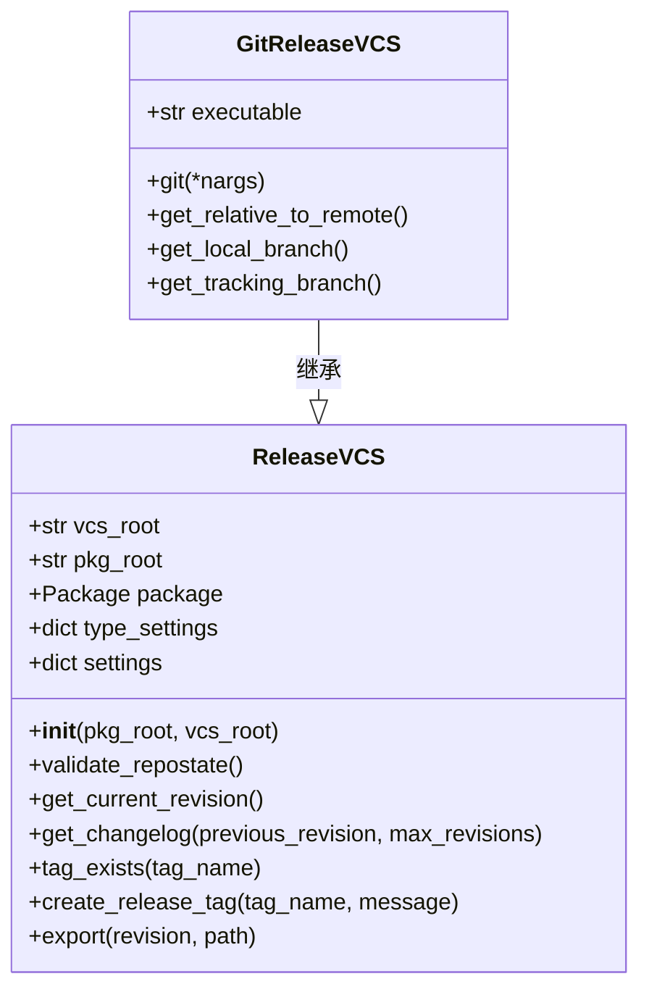
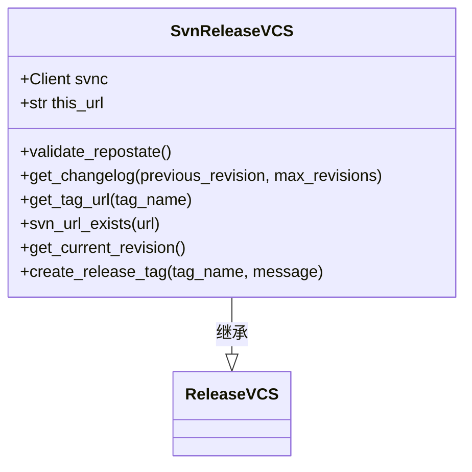
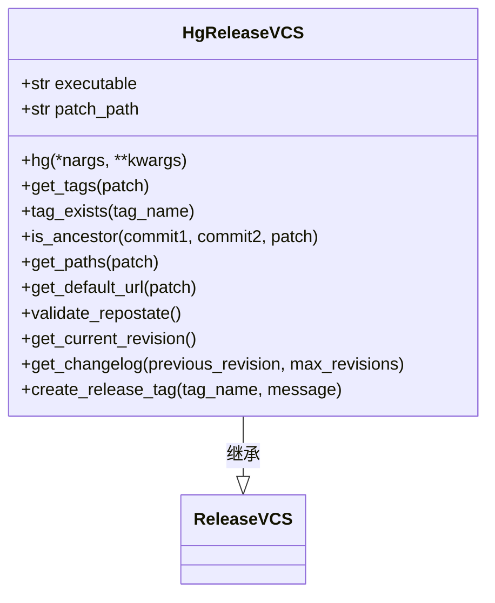
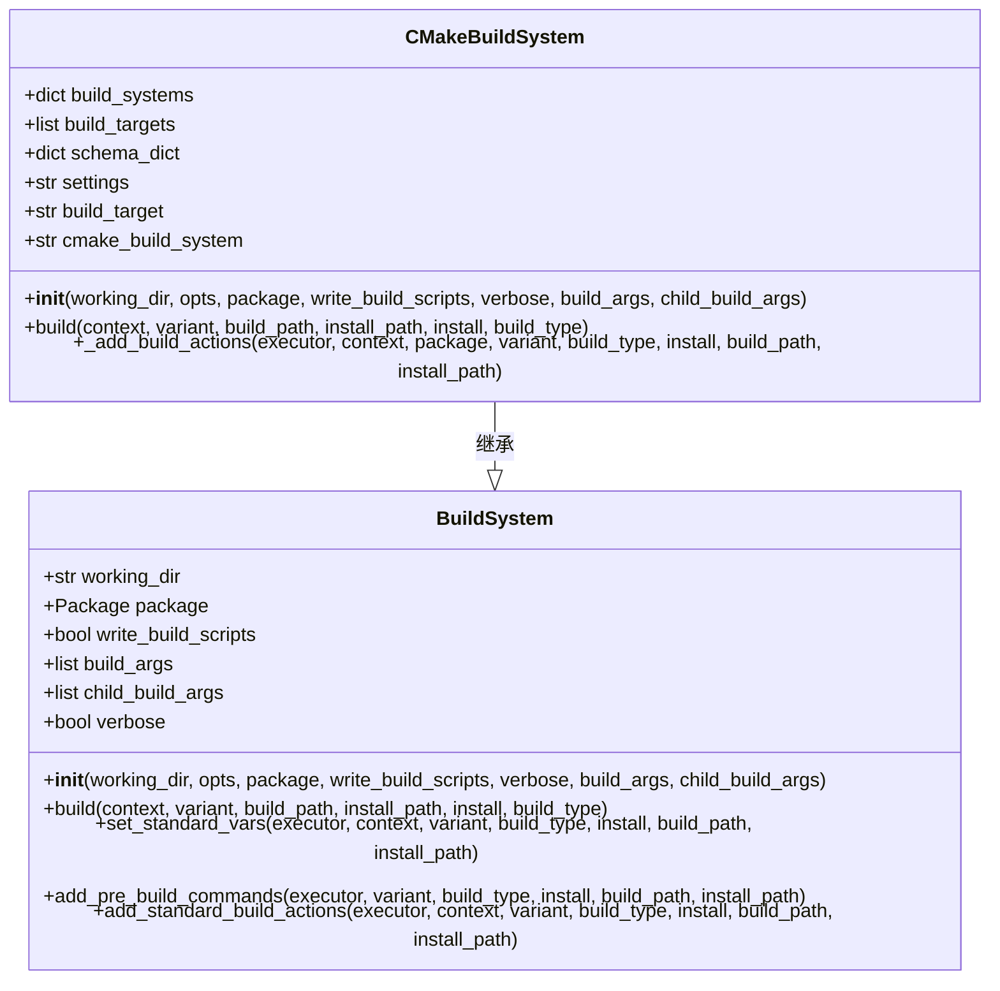
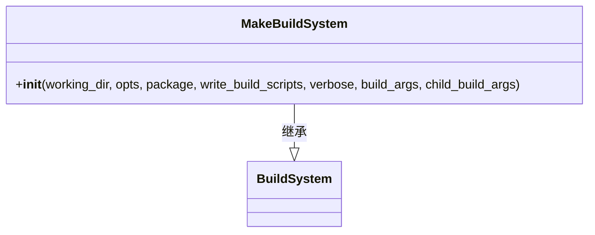
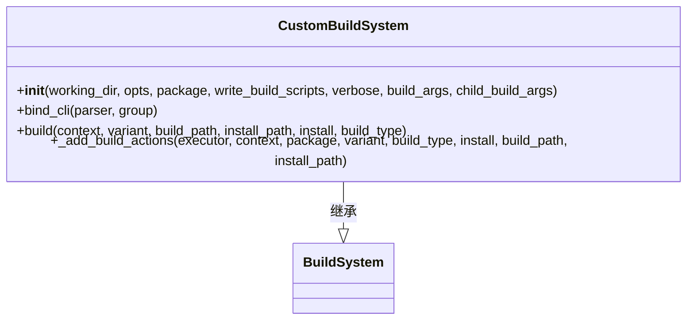
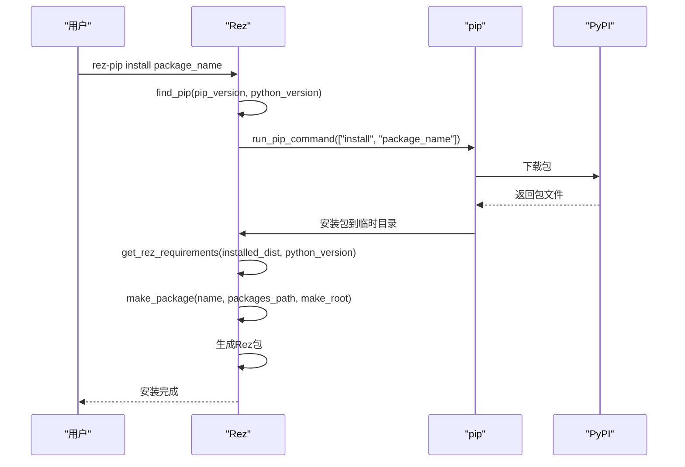

# 集成

<cite>
**本文档中引用的文件**   
- [release_vcs.py](file://rez-3.3.0\src\rez\release_vcs.py)
- [git.py](file://rez-3.3.0\src\rezplugins\release_vcs\git.py)
- [svn.py](file://rez-3.3.0\src\rezplugins\release_vcs\svn.py)
- [hg.py](file://rez-3.3.0\src\rezplugins\release_vcs\hg.py)
- [build_system.py](file://rez-3.3.0\src\rez\build_system.py)
- [cmake.py](file://rez-3.3.0\src\rezplugins\build_system\cmake.py)
- [make.py](file://rez-3.3.0\src\rezplugins\build_system\make.py)
- [custom.py](file://rez-3.3.0\src\rezplugins\build_system\custom.py)
- [pip.py](file://rez-3.3.0\src\rez\pip.py)
- [pip.rst](file://rez-3.3.0\docs\source\pip.rst)
- [package.py](file://my_packages\myapp\1.0.0\package.py)
</cite>

## 目录
1. [简介](#简介)
2. [版本控制系统集成](#版本控制系统集成)
3. [构建系统集成](#构建系统集成)
4. [Python包管理集成](#python包管理集成)
5. [最佳实践与性能考虑](#最佳实践与性能考虑)
6. [常见问题](#常见问题)
7. [结论](#结论)

## 简介
Rez是一个强大的包管理系统，支持与多种开发工具和系统的集成。本文档详细介绍了Rez如何与版本控制系统（如Git、SVN、Hg）、构建系统（如CMake、Make）以及Python包管理器pip进行集成。通过这些集成，开发者可以更高效地管理软件包的发布、构建和依赖关系。

**Section sources**
- [release_vcs.py](file://rez-3.3.0\src\rez\release_vcs.py)
- [build_system.py](file://rez-3.3.0\src\rez\build_system.py)
- [pip.py](file://rez-3.3.0\src\rez\pip.py)

## 版本控制系统集成
Rez通过`release_vcs`插件实现了与多种版本控制系统的集成，包括Git、SVN和Mercurial（Hg）。这些插件允许Rez在发布软件包时自动与版本控制系统交互，确保代码版本的一致性和可追溯性。

### Git集成
Rez的Git集成通过`git.py`插件实现。该插件提供了以下功能：
- **验证仓库状态**：确保工作目录是干净的，没有未提交的更改。
- **创建发布标签**：在发布时自动创建Git标签。
- **获取变更日志**：从上次发布以来的提交记录生成变更日志。
- **导出代码**：根据指定的修订版本导出代码。



**Diagram sources**
- [release_vcs.py](file://rez-3.3.0\src\rez\release_vcs.py)
- [git.py](file://rez-3.3.0\src\rezplugins\release_vcs\git.py)

### SVN集成
Rez的SVN集成通过`svn.py`插件实现。该插件提供了以下功能：
- **验证工作副本**：确保工作副本是最新的，没有未提交的更改。
- **创建发布标签**：在发布时自动创建SVN标签。
- **获取变更日志**：从上次发布以来的提交记录生成变更日志。
- **导出代码**：根据指定的修订版本导出代码。



**Diagram sources**
- [release_vcs.py](file://rez-3.3.0\src\rez\release_vcs.py)
- [svn.py](file://rez-3.3.0\src\rezplugins\release_vcs\svn.py)

### Mercurial (Hg)集成
Rez的Mercurial集成通过`hg.py`插件实现。该插件提供了以下功能：
- **验证工作副本**：确保工作副本是最新的，没有未提交的更改。
- **创建发布标签**：在发布时自动创建Hg标签。
- **获取变更日志**：从上次发布以来的提交记录生成变更日志。
- **导出代码**：根据指定的修订版本导出代码。



**Diagram sources**
- [release_vcs.py](file://rez-3.3.0\src\rez\release_vcs.py)
- [hg.py](file://rez-3.3.0\src\rezplugins\release_vcs\hg.py)

**Section sources**
- [release_vcs.py](file://rez-3.3.0\src\rez\release_vcs.py)
- [git.py](file://rez-3.3.0\src\rezplugins\release_vcs\git.py)
- [svn.py](file://rez-3.3.0\src\rezplugins\release_vcs\svn.py)
- [hg.py](file://rez-3.3.0\src\rezplugins\release_vcs\hg.py)

## 构建系统集成
Rez通过`build_system`插件实现了与多种构建系统的集成，包括CMake、Make和自定义构建命令。这些插件允许Rez在构建软件包时自动调用相应的构建工具，确保构建过程的一致性和自动化。

### CMake集成
Rez的CMake集成通过`cmake.py`插件实现。该插件提供了以下功能：
- **检测CMakeLists.txt文件**：自动检测项目根目录下的CMakeLists.txt文件。
- **配置构建环境**：设置CMake所需的环境变量，如`CMAKE_MODULE_PATH`。
- **执行构建命令**：调用CMake生成构建文件，并执行构建命令。
- **安装构建结果**：将构建结果安装到指定的目录。



**Diagram sources**
- [build_system.py](file://rez-3.3.0\src\rez\build_system.py)
- [cmake.py](file://rez-3.3.0\src\rezplugins\build_system\cmake.py)

### Make集成
Rez的Make集成通过`make.py`插件实现。该插件提供了以下功能：
- **检测Makefile文件**：自动检测项目根目录下的Makefile文件。
- **执行构建命令**：调用Make执行构建命令。
- **安装构建结果**：将构建结果安装到指定的目录。



**Diagram sources**
- [build_system.py](file://rez-3.3.0\src\rez\build_system.py)
- [make.py](file://rez-3.3.0\src\rezplugins\build_system\make.py)

### 自定义构建命令集成
Rez的自定义构建命令集成通过`custom.py`插件实现。该插件允许用户在`package.py`文件中定义自定义的构建命令。该插件提供了以下功能：
- **解析构建命令**：从`package.py`文件中读取`build_command`字段。
- **执行构建命令**：在构建环境中执行自定义的构建命令。
- **处理构建参数**：支持通过命令行参数传递额外的构建参数。



**Diagram sources**
- [build_system.py](file://rez-3.3.0\src\rez\build_system.py)
- [custom.py](file://rez-3.3.0\src\rezplugins\build_system\custom.py)

**Section sources**
- [build_system.py](file://rez-3.3.0\src\rez\build_system.py)
- [cmake.py](file://rez-3.3.0\src\rezplugins\build_system\cmake.py)
- [make.py](file://rez-3.3.0\src\rezplugins\build_system\make.py)
- [custom.py](file://rez-3.3.0\src\rezplugins\build_system\custom.py)

## Python包管理集成
Rez通过`pip`模块实现了与Python包管理器pip的集成。该模块允许Rez从PyPI或其他源安装Python包，并将其转换为Rez包。这种集成使得Rez可以管理Python包的依赖关系，确保项目中使用的Python包版本一致。

### pip集成概述
Rez的pip集成通过`pip.py`模块实现。该模块提供了以下功能：
- **查找pip**：在Rez环境中查找合适的pip版本。
- **安装Python包**：使用pip安装Python包，并将其转换为Rez包。
- **管理依赖关系**：解析Python包的依赖关系，并将其转换为Rez包的依赖关系。
- **生成包元数据**：为转换后的Rez包生成必要的元数据，如描述、作者、主页等。



**Diagram sources**
- [pip.py](file://rez-3.3.0\src\rez\pip.py)
- [package.py](file://my_packages\myapp\1.0.0\package.py)

### 实际示例
以下是一个使用Rez和pip集成的实际示例。假设我们有一个名为`myapp`的项目，需要安装`requests`库。

1. **创建`package.py`文件**：
   ```python
   name = "myapp"
   version = "1.0.0"
   requires = ["python-3.9"]
   build_system = "custom"
   build_command = "python setup.py install"
   ```

2. **安装`requests`库**：
   ```bash
   rez-pip install requests
   ```

3. **验证安装**：
   ```bash
   rez-env myapp -- python -c "import requests; print(requests.__version__)"
   ```

**Section sources**
- [pip.py](file://rez-3.3.0\src\rez\pip.py)
- [pip.rst](file://rez-3.3.0\docs\source\pip.rst)
- [package.py](file://my_packages\myapp\1.0.0\package.py)

## 最佳实践与性能考虑
### 版本控制系统集成的最佳实践
- **保持工作目录干净**：在发布前确保工作目录没有未提交的更改。
- **使用有意义的标签**：为每次发布创建有意义的标签，便于追踪和回滚。
- **定期同步远程仓库**：确保本地仓库与远程仓库保持同步，避免冲突。

### 构建系统集成的最佳实践
- **使用CMakeLists.txt文件**：对于复杂的项目，推荐使用CMakeLists.txt文件来管理构建过程。
- **避免硬编码路径**：在构建命令中避免硬编码路径，使用相对路径或环境变量。
- **优化构建参数**：根据项目需求调整构建参数，如并行构建线程数。

### Python包管理集成的最佳实践
- **使用虚拟环境**：在开发环境中使用虚拟环境，避免全局安装Python包。
- **定期更新依赖**：定期检查和更新项目依赖，确保使用最新的安全补丁和功能。
- **使用私有仓库**：对于内部使用的Python包，推荐使用私有仓库，提高安全性。

### 性能考虑
- **缓存构建结果**：对于频繁构建的项目，可以使用缓存机制，减少重复构建的时间。
- **并行构建**：利用多核处理器的优势，启用并行构建，加快构建速度。
- **优化依赖解析**：减少不必要的依赖，优化依赖解析过程，提高启动速度。

**Section sources**
- [release_vcs.py](file://rez-3.3.0\src\rez\release_vcs.py)
- [build_system.py](file://rez-3.3.0\src\rez\build_system.py)
- [pip.py](file://rez-3.3.0\src\rez\pip.py)

## 常见问题
### 版本控制系统集成常见问题
- **无法找到版本控制系统**：确保项目根目录下存在相应的版本控制文件（如`.git`、`.svn`、`.hg`）。
- **标签创建失败**：检查是否有权限创建标签，确保远程仓库可用。
- **变更日志为空**：确认从上次发布以来有新的提交记录。

### 构建系统集成常见问题
- **构建命令失败**：检查构建命令是否正确，确保所有依赖项已安装。
- **环境变量未设置**：确保构建环境中设置了必要的环境变量，如`CMAKE_MODULE_PATH`。
- **构建结果未安装**：检查安装路径是否正确，确保有写权限。

### Python包管理集成常见问题
- **pip版本不兼容**：确保使用的pip版本符合Rez的要求（>=19）。
- **依赖解析失败**：检查依赖关系是否正确，确保所有依赖项都可用。
- **包安装失败**：检查网络连接，确保可以从PyPI下载包。

**Section sources**
- [release_vcs.py](file://rez-3.3.0\src\rez\release_vcs.py)
- [build_system.py](file://rez-3.3.0\src\rez\build_system.py)
- [pip.py](file://rez-3.3.0\src\rez\pip.py)

## 结论
Rez通过丰富的插件系统，实现了与多种版本控制系统、构建系统和Python包管理器的无缝集成。这些集成不仅提高了开发效率，还确保了软件包管理的一致性和可靠性。通过遵循最佳实践和注意性能考虑，开发者可以充分利用Rez的强大功能，构建更加稳定和高效的软件项目。