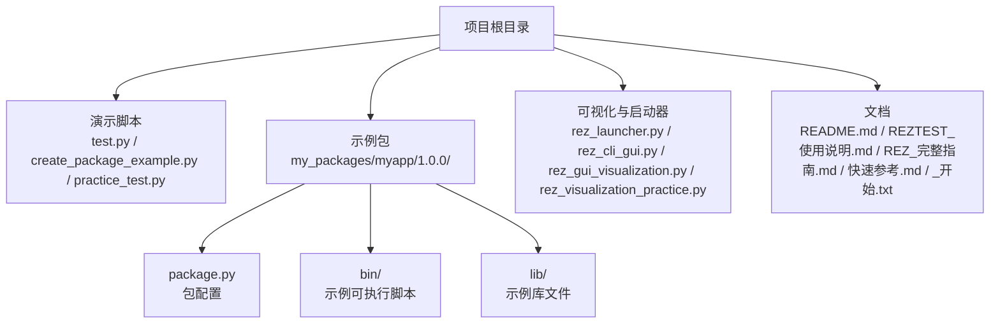
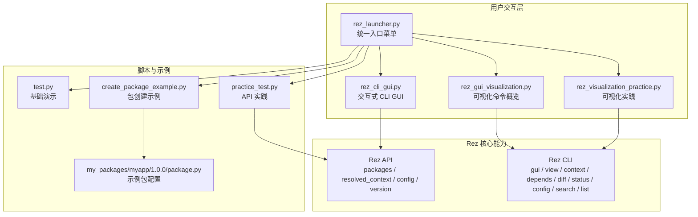
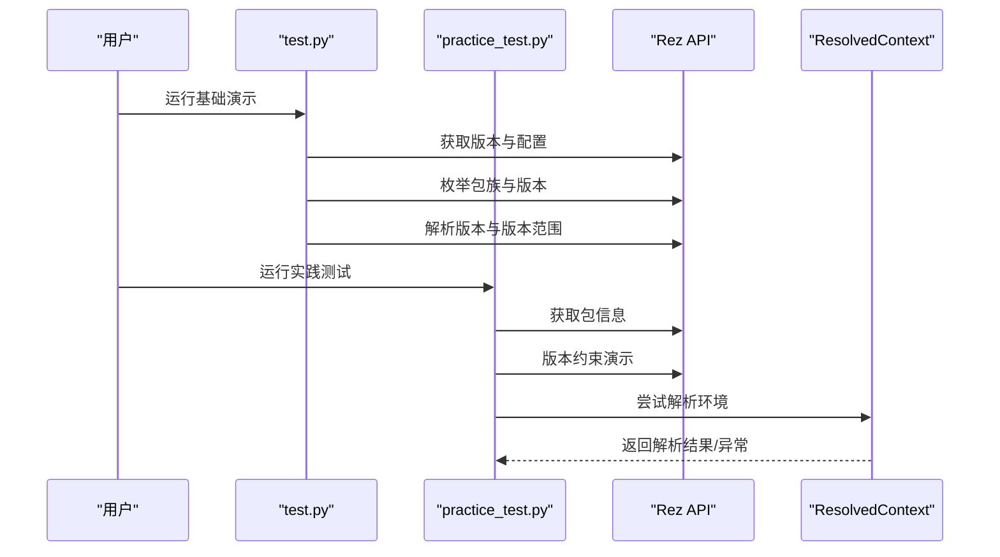
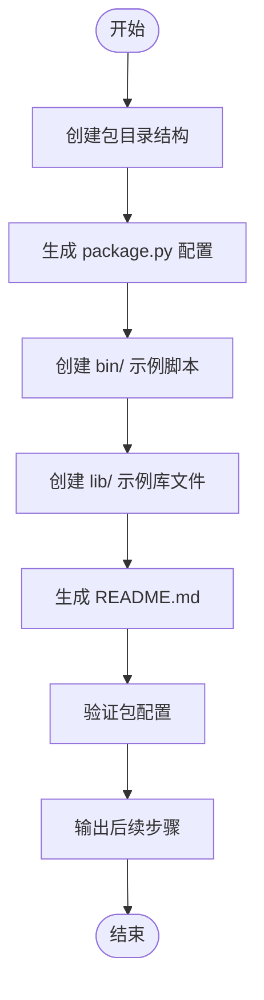
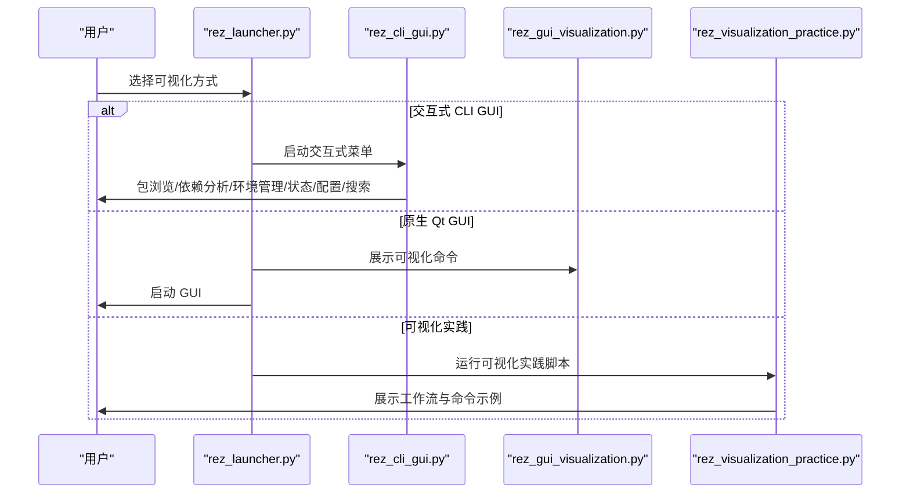
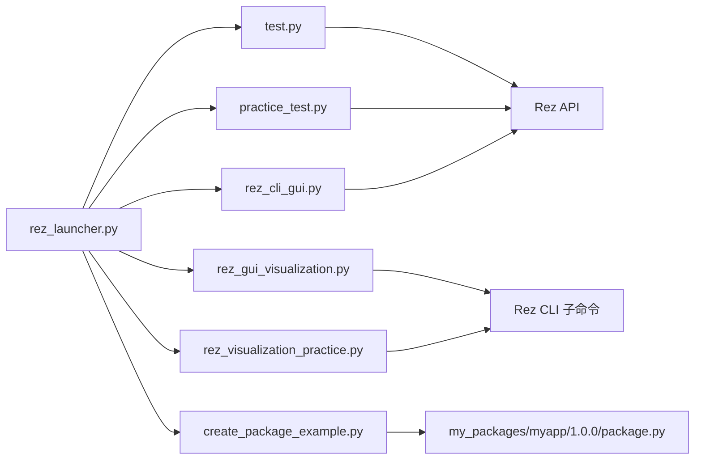

# 项目概述

<cite>
**本文引用的文件**
- [README.md](file://README.md)
- [REZTEST_使用说明.md](file://REZTEST_使用说明.md)
- [REZ_完整指南.md](file://REZ_完整指南.md)
- [快速参考.md](file://快速参考.md)
- [_开始.txt](file://_开始.txt)
- [test.py](file://test.py)
- [create_package_example.py](file://create_package_example.py)
- [practice_test.py](file://practice_test.py)
- [rez_launcher.py](file://rez_launcher.py)
- [rez_cli_gui.py](file://rez_cli_gui.py)
- [rez_gui_visualization.py](file://rez_gui_visualization.py)
- [rez_visualization_practice.py](file://rez_visualization_practice.py)
- [my_packages/myapp/1.0.0/package.py](file://my_packages/myapp/1.0.0/package.py)
</cite>

## 目录
1. [引言](#引言)
2. [项目结构](#项目结构)
3. [核心组件](#核心组件)
4. [架构总览](#架构总览)
5. [详细组件分析](#详细组件分析)
6. [依赖分析](#依赖分析)
7. [性能考虑](#性能考虑)
8. [故障排查指南](#故障排查指南)
9. [结论](#结论)
10. [附录](#附录)

## 引言
RezTest 是一个面向学习与演示的 Rez 包管理系统实践项目。它的目标是帮助初学者快速理解 Rez 的核心概念与使用方式，并通过一系列可运行脚本、示例包与文档，逐步引导用户掌握包定义、版本约束、环境解析与可视化工具的使用。项目特别强调“动态环境配置”的能力，即通过 package.py 与 ResolvedContext 等机制，在运行时按需组合包与环境变量，从而实现轻量、快速、可复现的包管理体验。

在 VFX、游戏开发等复杂项目中，RezTest 的价值体现在：
- 通过清晰的包结构与依赖声明，降低跨版本、跨工具链的协作成本
- 通过可视化工具与命令行工具，提升包与环境的可观测性与可维护性
- 通过示例包与脚本，加速团队内部包管理流程的标准化与自动化

## 项目结构
RezTest 的结构围绕“演示脚本 + 示例包 + 文档”展开，便于循序渐进地学习与实践。

图表来源
- [README.md](file://README.md#L37-L58)
- [create_package_example.py](file://create_package_example.py#L16-L33)
- [my_packages/myapp/1.0.0/package.py](file://my_packages/myapp/1.0.0/package.py#L1-L33)

章节来源
- [README.md](file://README.md#L37-L58)

## 核心组件
- 演示脚本层
  - test.py：展示 Rez 版本、包搜索路径、包族枚举、版本约束与解析的基本用法
  - create_package_example.py：演示如何创建一个最小可用的 Rez 包目录结构与 package.py
  - practice_test.py：基于 API 的实践测试，包含包信息查询、版本约束、环境解析与命令速查
- 可视化与交互层
  - rez_launcher.py：统一入口菜单，支持快速命令行查看、交互式 CLI GUI、原生 Qt GUI 启动、演示脚本运行
  - rez_cli_gui.py：纯命令行交互式 GUI，提供包浏览、依赖分析、环境管理、状态与配置查看、包搜索等功能
  - rez_gui_visualization.py：展示 Rez 的 GUI 工具与可视化命令（gui、view、context、depends、diff、status、config 等）
  - rez_visualization_practice.py：可视化操作实践，配合 GUI 展示包浏览、包信息、版本树、依赖关系、环境配置、命令列表与工作流
- 示例包层
  - my_packages/myapp/1.0.0/package.py：示例包的配置文件，包含 name、version、requires、variants、commands 等字段

章节来源
- [test.py](file://test.py#L1-L87)
- [create_package_example.py](file://create_package_example.py#L1-L179)
- [practice_test.py](file://practice_test.py#L1-L146)
- [rez_launcher.py](file://rez_launcher.py#L1-L188)
- [rez_cli_gui.py](file://rez_cli_gui.py#L1-L401)
- [rez_gui_visualization.py](file://rez_gui_visualization.py#L1-L255)
- [rez_visualization_practice.py](file://rez_visualization_practice.py#L1-L305)
- [my_packages/myapp/1.0.0/package.py](file://my_packages/myapp/1.0.0/package.py#L1-L33)

## 架构总览
RezTest 的整体架构由“脚本驱动 + 可视化工具 + 示例包 + 文档”构成，形成“从命令行到 GUI、从 API 到可视化”的完整学习闭环。

图表来源
- [rez_launcher.py](file://rez_launcher.py#L1-L188)
- [rez_cli_gui.py](file://rez_cli_gui.py#L1-L401)
- [rez_gui_visualization.py](file://rez_gui_visualization.py#L1-L255)
- [rez_visualization_practice.py](file://rez_visualization_practice.py#L1-L305)
- [test.py](file://test.py#L1-L87)
- [create_package_example.py](file://create_package_example.py#L1-L179)
- [practice_test.py](file://practice_test.py#L1-L146)
- [my_packages/myapp/1.0.0/package.py](file://my_packages/myapp/1.0.0/package.py#L1-L33)

## 详细组件分析

### 组件A：基础演示与 API 实践（test.py / practice_test.py）
- 目标：展示 Rez 的基本能力，包括版本信息、包搜索路径、包族枚举、版本约束解析与环境解析
- 关键流程：
  - 获取 Rez 版本与配置信息
  - 枚举包族与版本
  - 解析版本与版本范围
  - 尝试解析环境（ResolvedContext）

图表来源
- [test.py](file://test.py#L1-L87)
- [practice_test.py](file://practice_test.py#L1-L146)

章节来源
- [test.py](file://test.py#L1-L87)
- [practice_test.py](file://practice_test.py#L1-L146)

### 组件B：包创建与示例（create_package_example.py / my_packages/myapp/1.0.0/package.py）
- 目标：演示如何创建一个最小可用的 Rez 包，包括目录结构、package.py 配置、bin 与 lib 示例
- 关键流程：
  - 创建包目录与文件
  - 生成 package.py（name、version、requires、variants、commands）
  - 生成示例脚本与库文件
  - 输出包结构与后续步骤

图表来源
- [create_package_example.py](file://create_package_example.py#L1-L179)
- [my_packages/myapp/1.0.0/package.py](file://my_packages/myapp/1.0.0/package.py#L1-L33)

章节来源
- [create_package_example.py](file://create_package_example.py#L1-L179)
- [my_packages/myapp/1.0.0/package.py](file://my_packages/myapp/1.0.0/package.py#L1-L33)

### 组件C：可视化与交互（rez_launcher.py / rez_cli_gui.py / rez_gui_visualization.py / rez_visualization_practice.py）
- 目标：提供多种可视化与交互方式，覆盖 GUI、命令行可视化、依赖分析、环境对比与工作流
- 关键流程：
  - 启动器菜单选择可视化方式
  - 交互式 CLI GUI：包浏览、依赖分析、环境管理、状态与配置查看、包搜索
  - 可视化命令概览：gui、view、context、depends、diff、status、config、search、list
  - 可视化实践：包浏览、包信息、版本树、依赖关系、环境配置、命令列表与工作流

图表来源
- [rez_launcher.py](file://rez_launcher.py#L1-L188)
- [rez_cli_gui.py](file://rez_cli_gui.py#L1-L401)
- [rez_gui_visualization.py](file://rez_gui_visualization.py#L1-L255)
- [rez_visualization_practice.py](file://rez_visualization_practice.py#L1-L305)

章节来源
- [rez_launcher.py](file://rez_launcher.py#L1-L188)
- [rez_cli_gui.py](file://rez_cli_gui.py#L1-L401)
- [rez_gui_visualization.py](file://rez_gui_visualization.py#L1-L255)
- [rez_visualization_practice.py](file://rez_visualization_practice.py#L1-L305)

### 组件D：文档与导航（README.md / REZTEST_使用说明.md / REZ_完整指南.md / 快速参考.md / _开始.txt）
- 目标：提供从入门到深入的完整学习路径与参考资料
- 关键内容：
  - 项目概述与快速开始
  - 学习路径（初级/中级/高级）
  - 常用命令与 API 速查
  - package.py 字段说明与示例
  - 常见问题与调试步骤

章节来源
- [README.md](file://README.md#L1-L155)
- [REZTEST_使用说明.md](file://REZTEST_使用说明.md#L1-L316)
- [REZ_完整指南.md](file://REZ_完整指南.md#L1-L380)
- [快速参考.md](file://快速参考.md#L1-L417)
- [_开始.txt](file://_开始.txt)

## 依赖分析
- 组件耦合关系
  - 脚本层（test.py / create_package_example.py / practice_test.py）直接依赖 Rez API（packages、resolved_context、config、version）
  - 可视化层（rez_cli_gui.py / rez_gui_visualization.py / rez_visualization_practice.py）依赖 Rez CLI 子命令与 GUI 工具
  - 启动器（rez_launcher.py）聚合上述组件，提供统一入口
  - 示例包（my_packages/myapp/1.0.0/package.py）为脚本与 GUI 的输入数据源

图表来源
- [test.py](file://test.py#L1-L87)
- [practice_test.py](file://practice_test.py#L1-L146)
- [create_package_example.py](file://create_package_example.py#L1-L179)
- [my_packages/myapp/1.0.0/package.py](file://my_packages/myapp/1.0.0/package.py#L1-L33)
- [rez_cli_gui.py](file://rez_cli_gui.py#L1-L401)
- [rez_gui_visualization.py](file://rez_gui_visualization.py#L1-L255)
- [rez_visualization_practice.py](file://rez_visualization_practice.py#L1-L305)
- [rez_launcher.py](file://rez_launcher.py#L1-L188)

章节来源
- [test.py](file://test.py#L1-L87)
- [practice_test.py](file://practice_test.py#L1-L146)
- [create_package_example.py](file://create_package_example.py#L1-L179)
- [my_packages/myapp/1.0.0/package.py](file://my_packages/myapp/1.0.0/package.py#L1-L33)
- [rez_cli_gui.py](file://rez_cli_gui.py#L1-L401)
- [rez_gui_visualization.py](file://rez_gui_visualization.py#L1-L255)
- [rez_visualization_practice.py](file://rez_visualization_practice.py#L1-L305)
- [rez_launcher.py](file://rez_launcher.py#L1-L188)

## 性能考虑
- 包搜索路径与缓存
  - 通过合理设置 REZ_PACKAGES_PATH，减少不必要的搜索范围，提高包发现效率
  - 使用 Rez 的缓存与序列化能力，避免重复解析环境
- 环境解析优化
  - 在 package.py 中明确 requires 与 variants，有助于减少解析冲突与回溯
  - 使用版本范围而非过多具体版本，提升解析成功率
- 可视化工具的交互成本
  - GUI 适合交互式探索；批量任务建议使用命令行与脚本，减少人工干预

## 故障排查指南
- 常见问题与建议
  - 包未被识别：检查 REZ_PACKAGES_PATH 是否包含 my_packages 目录
  - 版本冲突：使用 Rez CLI 的 context 与 depends 命令查看冲突与依赖树
  - 环境变量异常：使用 context --print 或 view 命令查看环境详情
  - GUI 启动失败：确认 PyQt5/PySide2 是否安装，或改用命令行可视化工具
- 调试步骤
  - 运行 test.py 验证 Rez 安装与基本功能
  - 运行 practice_test.py 验证本地包可识别与环境解析
  - 查阅 REZ_完整指南.md 的常见问题部分与官方文档

章节来源
- [REZTEST_使用说明.md](file://REZTEST_使用说明.md#L232-L316)
- [REZ_完整指南.md](file://REZ_完整指南.md#L314-L373)

## 结论
RezTest 通过“脚本演示 + 可视化工具 + 示例包 + 文档”的组合，构建了一个从入门到深入的完整学习体系。其核心价值在于：
- 以动态环境配置为核心，实现轻量、快速、可复现的包管理
- 提供从命令行到 GUI 的多维度可视化能力，降低复杂度与学习门槛
- 通过示例包与脚本，帮助团队快速建立标准化的包管理流程

对于初学者，建议从 README.md 与 _开始.txt 出发，按“快速开始 → 演示脚本 → 快速参考 → 完整指南”的路径推进；对于有经验的开发者，则可直接从可视化工具与 API 实践入手，结合示例包进行定制化扩展。

## 附录
- 学习路径建议
  - 初级（约 15 分钟）：阅读 _开始.txt，运行 test.py，阅读快速参考.md 前两部分
  - 中级（约 45 分钟）：运行 create_package_example.py 与 practice_test.py，阅读快速参考.md 全部，修改示例包配置
  - 高级（约 2 小时）：阅读 REZ_完整指南.md，深入研究 package.py 字段与高级特性，访问官方文档

章节来源
- [README.md](file://README.md#L61-L117)
- [REZTEST_使用说明.md](file://REZTEST_使用说明.md#L131-L182)
- [REZ_完整指南.md](file://REZ_完整指南.md#L1-L380)